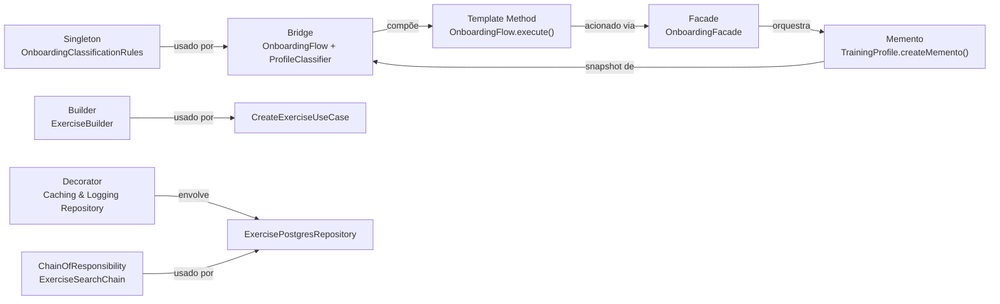

# Rastreabilidade dos Padrões GoF

## Objetivo

Mapear cada padrão GoF implementado ao seu artefato de código, camada de arquitetura, problema de negócio resolvido e documentação detalhada. Esta página serve como índice de rastreabilidade — para a análise completa de cada padrão, acesse o documento vinculado.

## Matriz de rastreabilidade

| Categoria          | Padrão          | Módulo     | Camada                  | Artefato principal                                                      | Problema resolvido                                                                                                  | Documento                                                                     | Endpoint(s)                   |
|--------------------|-----------------|------------|-------------------------|-------------------------------------------------------------------------|---------------------------------------------------------------------------------------------------------------------|-------------------------------------------------------------------------------|-------------------------------|
| **Criacional**     | Singleton       | Onboarding | Domain                  | `OnboardingClassificationRules`                                         | Garantir fonte única de regras de pontuação para `MaleProfileClassifier` e `FemaleProfileClassifier`                | [3.1 GoFs Criacionais](../padroes-de-projeto/3-1-gofs-criacionais.md)         | `POST /v1/onboarding`         |
| **Estrutural**     | Bridge          | Onboarding | Domain                  | `OnboardingFlow` (abstração) + `ProfileClassifier` (impl.)              | Separar a hierarquia de fluxos de treino da hierarquia de classificadores por sexo, evitando explosão de subclasses | [3.2 GoFs Estruturais](../padroes-de-projeto/3-2-gofs-estruturais.md)         | `POST /v1/onboarding`         |
| **Estrutural**     | Facade          | Onboarding | Presentation            | `OnboardingFacade`                                                      | Oferecer ponto único de acesso do controller aos três use cases de onboarding, isolando a camada de apresentação    | [3.2 GoFs Estruturais](../padroes-de-projeto/3-2-gofs-estruturais.md)         | `GET/POST/PUT /v1/onboarding` |
| **Comportamental** | Memento         | Onboarding | Domain + Infrastructure | `TrainingProfile.createMemento()` + `OnboardingMementoVO`               | Preservar o estado completo do perfil antes de um redo sem violar o encapsulamento da entidade                      | [3.3 GoFs Comportamentais](../padroes-de-projeto/3-3-gofs-comportamentais.md) | `PUT /v1/onboarding`          |
| **Comportamental** | Template Method | Onboarding | Domain                  | `OnboardingFlow.execute()` com hooks `beforeClassify` / `afterClassify` | Garantir sequência imutável do algoritmo de classificação (pre → classificar → pos), extensível via hooks           | [3.3 GoFs Comportamentais](../padroes-de-projeto/3-3-gofs-comportamentais.md) | `POST /v1/onboarding`         |
| **Criacional**     | Builder         | Exercises  | Domain                  | `ExerciseBuilder`                                       | Centralizar regras de montagem e validações obrigacionas vs opcionais do agregado `Exercise` | [3.1 GoFs Criacionais](../padroes-de-projeto/3-1-gofs-criacionais.md)             | `POST /v1/exercises`            |
| **Estrutural**     | Decorator       | Exercises  | Domain + Infrastructure | `LoggingExerciseRepository` + `CachingExerciseRepository` | OCP para cacheamento e logging de respostas das rotas de leitura   | [3.2 GoFs Estruturais](../padroes-de-projeto/3-2-gofs-estruturais.md)             | `GET/POST/PUT /v1/exercises` |
| **Comportamental** | Chain of Resp.  | Exercises  | Infrastructure          | `ExerciseSearchChain`                                   | Encadeamento de restrições de busca `where` (ativos, name, muscleGroup) | [3.3 GoFs Comportamentais](../padroes-de-projeto/3-3-gofs-comportamentais.md)       | `GET /v1/exercises`             |

## Elos entre padrões

Os cinco padrões não são independentes — formam uma rede de responsabilidades complementares:



| Relação                  | Descrição                                                                                                        |
|--------------------------|------------------------------------------------------------------------------------------------------------------|
| Singleton → Bridge       | `MaleProfileClassifier` e `FemaleProfileClassifier` consomem `getInstance()` para obter as regras                |
| Bridge ↔ Template Method | O Template Method vive dentro da abstração do Bridge (`OnboardingFlow`) — os padrões co-habitam o mesmo artefato |
| Facade → Template Method | O Facade aciona `SubmitOnboardingUseCase`, que instancia o flow e chama `execute()` (template method)            |
| Facade → Memento         | O Facade aciona `RedoOnboardingUseCase`, que chama `createMemento()` antes de sobrescrever o perfil              |
| Memento ← Bridge         | O snapshot capturado pelo Memento é o `ClassificationResult` produzido pelo classificador (Bridge)               |
| Builder → Use Case       | O `CreateExerciseUseCase` aciona o Builder para compilar todas as validações obrigatórias antes da persistência |
| Decorator → Infra        | O módulo do NestJS interliga e resolve a inversão de dependências injetando os decorators no wrapper do REPOSITORY |
| C.O.R → Infra            | O método de busca (`search`) constrói a base query e delega as filtragens dinâmicas à Chain of Responsibility |

## Cobertura de testes por padrão

| Padrão          | Arquivo de teste                                                                     | Casos cobertos |
|-----------------|--------------------------------------------------------------------------------------|----------------|
| Singleton       | `domain/onboarding/rules/onboarding-classification-rules.singleton.spec.ts`          | 5              |
| Bridge          | `domain/onboarding/bridge/classifiers.spec.ts`                                       | 6              |
| Facade          | `presentation/controllers/onboarding.controller.spec.ts` (integração via controller) | 7              |
| Memento         | `domain/onboarding/entities/training-profile.spec.ts`                                | 5              |
| Template Method | coberto pelos testes de Bridge (`classifiers.spec.ts`)                               | 6              |
| Builder         | `domain/exercises/builders/exercise.builder.spec.ts` (ou testes e2e de exercise)        | 3 |
| Decorator       | `infrastructure/database/exercise.repository.spec.ts` (ou validação manual via stdout)   | 0 |
| Chain of Resp.  | `infrastructure/database/exercise-search.chain.spec.ts`                                  | 2 |

Execute todos os testes do módulo de onboarding no container:

```bash
sudo docker compose exec api npx jest onboarding --verbose
```

## Observações

- Todos os padrões desta entrega pertencem ao módulo de **Onboarding** e foram implementados na branch `feat/modulo-on-boarding`.
- Os padrões de **outros módulos** serão adicionados à matriz conforme cada membro da equipe documentar sua contribuição nas seções correspondentes dos documentos 3.1, 3.2 e 3.3.
- A coluna **Endpoint(s)** lista os endpoints HTTP que exercitam o padrão em produção — útil para validação manual via Postman ou similar.

## Histórico de versões

| Versão | Data       | Descrição                                                                                | Autor         |
|--------|------------|------------------------------------------------------------------------------------------|---------------|
| 1.0    | 19/05/2026 | Matriz de rastreabilidade com os 5 padrões GoF do módulo de onboarding e elos entre eles | Lucas Antunes |
| 1.1    | 20/05/2026 | Matriz de rastreabilidade expandida com os 3 padrões GoF do módulo de Exercises | Daniel Teles|
