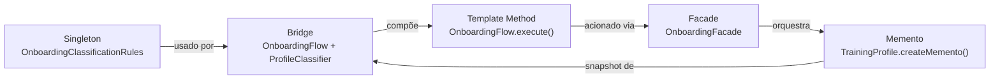
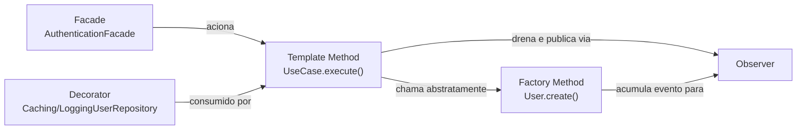

# Rastreabilidade dos Padrões GoF

## Objetivo

Mapear cada padrão GoF implementado ao seu artefato de código, camada de arquitetura, problema de negócio resolvido e documentação detalhada. Esta página serve como índice de rastreabilidade — para a análise completa de cada padrão, acesse o documento vinculado.

## Matriz de rastreabilidade

| Categoria          | Padrão          | Módulo       | Camada                  | Artefato principal                                                | Problema resolvido                                                                                                    | Documento                | Endpoint(s)                                |
| ------------------ | --------------- | ------------ | ----------------------- | ----------------------------------------------------------------- | --------------------------------------------------------------------------------------------------------------------- | ------------------------ | ------------------------------------------ |
| **Criacional**     | Singleton       | Onboarding   | Domain                  | OnboardingClassificationRules                                     | Garantir fonte única de regras de pontuação para MaleProfileClassifier e FemaleProfileClassifier                      | 3.1 GoFs Criacionais     | POST /v1/onboarding                        |
| **Criacional**     | Factory Method  | Autenticação | Domain                  | User.create() / RefreshToken.create()                             | Isolar lógicas de criação genuína (com eventos e UUIDs) das lógicas de reconstituição (hidratação via DB)             | 3.1 GoFs Criacionais     | POST /v1/auth/signup e POST /v1/auth/login |
| **Estrutural**     | Bridge          | Onboarding   | Domain                  | OnboardingFlow (abstração) + ProfileClassifier (impl.)            | Separar a hierarquia de fluxos de treino da hierarquia de classificadores por sexo, evitando explosão de subclasses   | 3.2 GoFs Estruturais     | POST /v1/onboarding                        |
| **Estrutural**     | Facade          | Onboarding   | Presentation            | OnboardingFacade                                                  | Oferecer ponto único de acesso do controller aos três use cases de onboarding, isolando a camada de apresentação      | 3.2 GoFs Estruturais     | GET/POST/PUT /v1/onboarding                |
| **Estrutural**     | Decorator       | Autenticação | Infrastructure          | CachingUserRepository e LoggingUserRepository                     | Empilhar transversalmente recursos de Log e Cache em memória ao acesso a banco, sem sujar as lógicas do Repositório   | 3.2 GoFs Estruturais     | Múltiplos (via infra)                      |
| **Estrutural**     | Facade          | Autenticação | Presentation            | AuthenticationFacade                                              | Isolar a lógica de roteamento e decisão do AuthController perante os múltiplos Casos de Uso de login e sessão         | 3.2 GoFs Estruturais     | POST /v1/auth/login e POST /v1/auth/logout |
| **Comportamental** | Memento         | Onboarding   | Domain + Infrastructure | TrainingProfile.createMemento() + OnboardingMementoVO             | Preservar o estado completo do perfil antes de um redo sem violar o encapsulamento da entidade                        | 3.3 GoFs Comportamentais | PUT /v1/onboarding                         |
| **Comportamental** | Template Method | Onboarding   | Domain                  | OnboardingFlow.execute() com hooks beforeClassify / afterClassify | Garantir sequência imutável do algoritmo de classificação (pre → classificar → pos), extensível via hooks             | 3.3 GoFs Comportamentais | POST /v1/onboarding                        |
| **Comportamental** | Template Method | Autenticação | Application             | UseCase<TInput, TOutput>.execute()                                | Centralizar o ciclo de vida (execução e publicação automática de eventos) sem duplicação de lógica entre casos de uso | 3.3 GoFs Comportamentais | Múltiplos                                  |
| **Comportamental** | Observer        | Autenticação | Domain + Application    | DomainEventBus + AggregateRoot.pullDomainEvents()                 | Permitir que o sistema distribua eventos de domínio lateralmente sem acoplar os casos de uso a N handlers de resposta | 3.3 GoFs Comportamentais | Múltiplos                                  |

## Elos entre padrões

Os padrões formam uma rede de responsabilidades complementares. Abaixo estão representados os fluxos de colaboração em cada módulo:

### Grafo de Relacionamentos — Módulo de Onboarding



| Relação                  | Descrição                                                                                                      |
| ------------------------ | -------------------------------------------------------------------------------------------------------------- |
| Singleton → Bridge       | MaleProfileClassifier e FemaleProfileClassifier consomem getInstance() para obter as regras                    |
| Bridge ↔ Template Method | O Template Method vive dentro da abstração do Bridge (OnboardingFlow) — os padrões co-habitam o mesmo artefato |
| Facade → Template Method | O Facade aciona SubmitOnboardingUseCase, que instancia o flow e chama execute() (template method)              |
| Facade → Memento         | O Facade aciona RedoOnboardingUseCase, que chama createMemento() antes de sobrescrever o perfil                |
| Memento ← Bridge         | O snapshot capturado pelo Memento é o ClassificationResult produzido pelo classificador (Bridge)               |

### Grafo de Relacionamentos — Módulo de Autenticação



| Relação                     | Descrição                                                                                                              |
| --------------------------- | ---------------------------------------------------------------------------------------------------------------------- |
| Facade → Template Method    | O AuthenticationFacade invoca o execute() engessado da classe base UseCase para disparar os fluxos de negócio          |
| Template Method → Factory   | Dentro da etapa mutável (handle), os Casos de Uso invocam os *Factories* (ex: User.create()) gerando as Entidades      |
| Factory → Observer          | As *Factories* de criação genuína encadeiam internamente um pushEvent() na entidade, alimentando a infra de Observers  |
| Template Method → Observer  | O passo invariante final do UseCase.execute() extrai os eventos (pullDomainEvents) e os despacha no DomainEventBus     |
| Decorator → Template Method | As dependências repassadas para o Caso de Uso são, por via do contêiner, os repositórios envoltórios (Cache e Logging) |

## Cobertura de testes por padrão

A bateria de testes unitários automatizados foi desenvolvida para assegurar o funcionamento dos padrões independentemente do framework externo.

| Módulo       | Padrão          | Arquivo de teste                                                                     | Casos cobertos |
| ------------ | --------------- | ------------------------------------------------------------------------------------ | -------------- |
| Onboarding   | Singleton       | domain/onboarding/rules/onboarding-classification-rules.singleton.spec.ts            | 5              |
| Onboarding   | Bridge          | domain/onboarding/bridge/classifiers.spec.ts                                         | 6              |
| Onboarding   | Facade          | presentation/controllers/onboarding.controller.spec.ts (integração via controller)   | 7              |
| Onboarding   | Memento         | domain/onboarding/entities/training-profile.spec.ts                                  | 5              |
| Onboarding   | Template Method | Coberto pelos testes de Bridge (classifiers.spec.ts)                                 | 6              |
| Autenticação | Factory Method  | domain/entities/user.entity.spec.ts e domain/entities/refresh-token.entity.spec.ts   | 7              |
| Autenticação | Decorator       | caching-user.repository.spec.ts e logging-user.repository.spec.ts                    | 5              |
| Autenticação | Facade          | presentation/facades/authentication.facade.spec.ts                                   | 3              |
| Autenticação | Template Method | application/use-cases/base.use-case.spec.ts                                          | 4              |
| Autenticação | Observer        | application/events/domain-event-bus.spec.ts e domain/entities/aggregate-root.spec.ts | 5              |

Para executar localmente ambas as suítes (Onboarding e Auth) diretamente pelo container:

```bash
sudo docker compose exec api npx jest onboarding auth user.entity refresh-token base.use-case domain-event-bus caching logging --verbose
```

## Observações

 - Todos os padrões mapeados nesta entrega pertencem aos módulos de **Onboarding** (feat/modulo-on-boarding) e **Autenticação** (feat/modulo-autenticacao).
 - A coluna **Endpoint(s)** lista os endpoints HTTP que exercitam o padrão em produção, facilitando a depuração e verificação do funcionamento das peças (úteis para Postman ou E2E).

## Histórico de versões

| Versão | Data       | Descrição                                                                                               | Autor                   |
| ------ | ---------- | ------------------------------------------------------------------------------------------------------- | ----------------------- |
| 1.0    | 19/05/2026 | Matriz de rastreabilidade com os 5 padrões GoF do módulo de onboarding e elos entre eles                | Lucas Antunes           |
| 1.1    | 20/05/2026 | Inclusão de 5 padrões GoF do Módulo de Autenticação e adição do grafo de relacionamentos correspondente | Samuel Nogueira Caetano |
