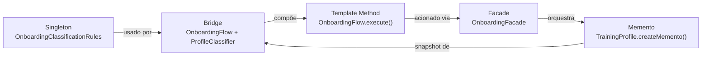
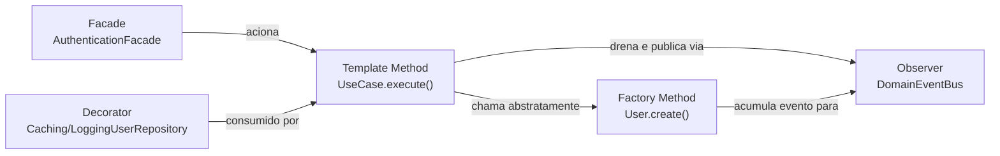
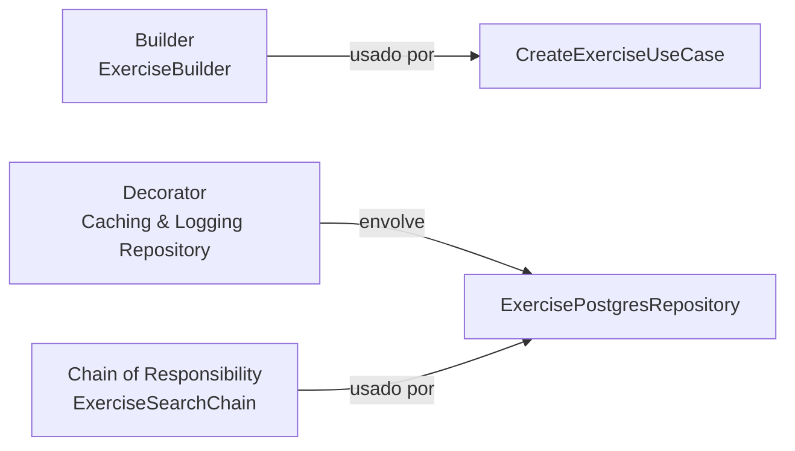
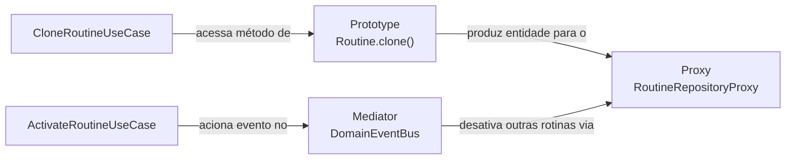

# Rastreabilidade dos Padrões GoF

## Objetivo

Mapear cada padrão GoF implementado ao seu artefato de código, camada de arquitetura, problema resolvido, documentação detalhada e endpoint relacionado.

Esta página serve como índice de rastreabilidade. Para a análise completa de cada padrão, acesse o documento vinculado.

## Matriz de rastreabilidade

| Categoria | Padrão | Módulo | Camada | Artefato principal | Problema resolvido | Documento | Endpoint(s) |
|---|---|---|---|---|---|---|---|
| **Criacional** | Singleton | Onboarding | Domain | `OnboardingClassificationRules` | Garantir fonte única de regras de pontuação para `MaleProfileClassifier` e `FemaleProfileClassifier`. | [3.1 GoFs Criacionais](../padroes-de-projeto/3-1-gofs-criacionais.md) | `POST /v1/onboarding` |
| **Criacional** | Factory Method | Autenticação | Domain | `User.create()` / `RefreshToken.create()` | Isolar lógicas de criação genuína, com eventos e UUIDs, das lógicas de reconstituição via banco de dados. | [3.1 GoFs Criacionais](../padroes-de-projeto/3-1-gofs-criacionais.md) | `POST /v1/auth/signup`, `POST /v1/auth/login` |
| **Criacional** | Builder | Exercises | Domain | `ExerciseBuilder` | Centralizar regras de montagem e validações obrigatórias e opcionais do agregado `Exercise`. | [3.1 GoFs Criacionais](../padroes-de-projeto/3-1-gofs-criacionais.md) | `POST /v1/exercises` |
| **Criacional** | Multiton | Histórico | Domain | `HistoryManager.getInstance(userId)` | Manter um pool de gerenciadores por usuário, evitando recriação de sessões a cada requisição. | [3.1 GoFs Criacionais](../padroes-de-projeto/3-1-gofs-criacionais.md) | `GET /v1/history/sessions` |
| **Criacional** | Builder | Usuário | Presentation | `PasswordResetRequestBuilder`, `AccountDeletionRequestBuilder` | Construção validada de comandos com campos obrigatórios antes da execução da cadeia. | [3.1 GoFs Criacionais](../padroes-de-projeto/3-1-gofs-criacionais.md) | `POST /v1/auth/password-reset/request`, `DELETE /v1/users/me` |
| **Criacional** | Builder | Sessão de Treino | Domain | `TrainingSessionBuilder` | Montagem incremental e segura da árvore do composite de exercícios e séries. | [3.1 GoFs Criacionais](../padroes-de-projeto/3-1-gofs-criacionais.md) | `POST /v1/sessions` |
| **Criacional** | Prototype | Rotinas | Domain | `Routine.clone()` | Duplicar rotinas profundamente sem expor lógicas de cópia e renovação de IDs aos casos de uso. | [3.1 GoFs Criacionais](../padroes-de-projeto/3-1-gofs-criacionais.md) | `POST /v1/routines/:id/clone` |
| **Estrutural** | Bridge | Onboarding | Domain | `OnboardingFlow` + `ProfileClassifier` | Separar a hierarquia de fluxos de treino da hierarquia de classificadores por sexo. | [3.2 GoFs Estruturais](../padroes-de-projeto/3-2-gofs-estruturais.md) | `POST /v1/onboarding` |
| **Estrutural** | Facade | Onboarding | Presentation | `OnboardingFacade` | Oferecer ponto único de acesso do controller aos casos de uso de onboarding. | [3.2 GoFs Estruturais](../padroes-de-projeto/3-2-gofs-estruturais.md) | `GET/POST/PUT /v1/onboarding` |
| **Estrutural** | Facade | Autenticação | Presentation | `AuthenticationFacade` | Isolar a lógica de roteamento do `AuthController` perante os casos de uso de login e sessão. | [3.2 GoFs Estruturais](../padroes-de-projeto/3-2-gofs-estruturais.md) | `POST /v1/auth/login`, `POST /v1/auth/logout` |
| **Estrutural** | Decorator | Autenticação | Infrastructure | `CachingUserRepository` + `LoggingUserRepository` | Empilhar recursos de cache e logging no banco, sem poluir a lógica do repositório. | [3.2 GoFs Estruturais](../padroes-de-projeto/3-2-gofs-estruturais.md) | Múltiplos |
| **Estrutural** | Decorator | Exercises | Domain + Infrastructure | `LoggingExerciseRepository` + `CachingExerciseRepository` | Aplicar OCP para cacheamento e logging das respostas das rotas de leitura. | [3.2 GoFs Estruturais](../padroes-de-projeto/3-2-gofs-estruturais.md) | `GET/POST/PUT /v1/exercises` |
| **Estrutural** | Proxy | Histórico | Infrastructure | `HistoryServiceProxy` → `HistoryService` | Controlar acesso, validar período e registrar logs antes de delegar ao serviço real. | [3.2 GoFs Estruturais](../padroes-de-projeto/3-2-gofs-estruturais.md) | `GET /v1/history/sessions` |
| **Estrutural** | Facade | Usuário | Presentation | `PasswordResetFacade`, `AccountDeletionFacade` | Interface única para orquestrar cadeia, repositórios, e-mail e eventos. | [3.2 GoFs Estruturais](../padroes-de-projeto/3-2-gofs-estruturais.md) | `POST /v1/auth/password-reset/*`, `DELETE /v1/users/me` |
| **Estrutural** | Composite | Sessão de Treino | Domain | `ExerciseNode`, `TrainingSet` | Representar a estrutura do treino em árvore para cálculos recursivos de volume. | [3.2 GoFs Estruturais](../padroes-de-projeto/3-2-gofs-estruturais.md) | `POST /v1/sessions` |
| **Estrutural** | Proxy | Rotinas | Infrastructure | `RoutineRepositoryProxy` | Interceptar operações de repositório para adicionar proteções de integridade cruzada de dados. | [3.2 GoFs Estruturais](../padroes-de-projeto/3-2-gofs-estruturais.md) | Múltiplos |
| **Comportamental** | Memento | Onboarding | Domain + Infra | `TrainingProfile.createMemento()` | Preservar o estado completo do perfil antes de refazer o questionário. | [3.3 GoFs Comportamentais](../padroes-de-projeto/3-3-gofs-comportamentais.md) | `PUT /v1/onboarding` |
| **Comportamental** | Template Method | Onboarding | Domain | `OnboardingFlow.execute()` | Garantir sequência imutável do algoritmo de classificação com extensão via hooks. | [3.3 GoFs Comportamentais](../padroes-de-projeto/3-3-gofs-comportamentais.md) | `POST /v1/onboarding` |
| **Comportamental** | Template Method | Autenticação | Application | `UseCase<TInput, TOutput>.execute()` | Centralizar o ciclo de vida de execução e publicação automática de eventos. | [3.3 GoFs Comportamentais](../padroes-de-projeto/3-3-gofs-comportamentais.md) | Múltiplos |
| **Comportamental** | Observer | Autenticação | Domain + App | `DomainEventBus` | Distribuir eventos de domínio sem acoplar os casos de uso a múltiplos handlers. | [3.3 GoFs Comportamentais](../padroes-de-projeto/3-3-gofs-comportamentais.md) | Múltiplos |
| **Comportamental** | Observer | Histórico | Domain + App | `WorkoutSessionSubject.notify()` | Atualizar o histórico automaticamente após uma sessão de treino. | [3.3 GoFs Comportamentais](../padroes-de-projeto/3-3-gofs-comportamentais.md) | `POST /v1/sessions` |
| **Comportamental** | Chain of Resp. | Exercises | Infrastructure | `ExerciseSearchChain` | Encadear restrições de busca, como ativos, nome e grupo muscular. | [3.3 GoFs Comportamentais](../padroes-de-projeto/3-3-gofs-comportamentais.md) | `GET /v1/exercises` |
| **Comportamental** | Chain of Resp. | Usuário | Application | `password-reset.chain.ts` | Etapas sequenciais de validação e execução com aborto silencioso por segurança. | [3.3 GoFs Comportamentais](../padroes-de-projeto/3-3-gofs-comportamentais.md) | `POST /v1/auth/password-reset/*` |
| **Comportamental** | Iterator | Sessão de Treino | Domain | `TrainingSetIterator` | Percorrer sequencialmente e planificar a estrutura recursiva de exercícios. | [3.3 GoFs Comportamentais](../padroes-de-projeto/3-3-gofs-comportamentais.md) | `POST /v1/sessions` |
| **Comportamental** | Mediator | Rotinas | Application | `DomainEventBus` + Handler | Desacoplar a desativação de rotinas antigas do fluxo de ativação principal. | [3.3 GoFs Comportamentais](../padroes-de-projeto/3-3-gofs-comportamentais.md) | `PATCH /v1/routines/:id/activate` |

## Elos entre padrões

Os padrões formam uma rede de responsabilidades complementares entre os módulos do sistema.

### Grafo de relacionamentos — Módulo de Onboarding



| Relação | Descrição |
|---|---|
| Singleton → Bridge | `MaleProfileClassifier` e `FemaleProfileClassifier` consomem `getInstance()` para obter as regras. |
| Bridge ↔ Template Method | O Template Method vive dentro da abstração do Bridge (`OnboardingFlow`), fazendo com que os padrões coabitem o mesmo artefato. |
| Facade → Template Method | O Facade aciona `SubmitOnboardingUseCase`, que instancia o fluxo e chama `execute()`. |
| Facade → Memento | O Facade aciona `RedoOnboardingUseCase`, que chama `createMemento()` antes de sobrescrever o perfil. |
| Memento ← Bridge | O snapshot capturado pelo Memento é o `ClassificationResult` produzido pelo classificador. |

### Grafo de relacionamentos — Módulo de Histórico


| Relação | Descrição |
|---|---|
| POST sessions → Observer | `RegisterSessionUseCase` chama `notify()` após `save()`. |
| Observer → Multiton | `HistoryObserver.update()` chama `HistoryManager.getInstance(userId).addSession()`. |
| Multiton → Proxy | `HistoryService` usa o Multiton; os casos de uso acessam via `HistoryServiceProxy`. |
| Proxy → GET history | `HistoryServiceProxy` controla o acesso à consulta de histórico em `GET /v1/history/sessions`. |

### Grafo de relacionamentos — Módulo de Autenticação



| Relação | Descrição |
|---|---|
| Facade → Template Method | O `AuthenticationFacade` invoca o `execute()` da classe base `UseCase` para disparar os fluxos de negócio. |
| Template Method → Factory | Dentro da etapa mutável (`handle`), os casos de uso invocam as factories, como `User.create()`. |
| Factory → Observer | As factories de criação genuína encadeiam internamente um `pushEvent()` na entidade. |
| Template Method → Observer | O passo invariante final do `UseCase.execute()` extrai os eventos com `pullDomainEvents` e os despacha no `DomainEventBus`. |
| Decorator → Template Method | As dependências repassadas para o caso de uso são os repositórios envoltórios de cache e logging. |

### Grafo de relacionamentos — Módulo de Exercises



| Relação | Descrição |
|---|---|
| Builder → Use Case | O `CreateExerciseUseCase` aciona o Builder para compilar todas as validações obrigatórias antes da persistência. |
| Decorator → Infra | O módulo do NestJS resolve a inversão de dependências injetando os decorators no wrapper do repositório. |
| Chain of Responsibility → Infra | O método de busca (`search`) constrói a base query e delega as filtragens dinâmicas à Chain of Responsibility. |

### Grafo de relacionamentos — Módulo de Rotina


| Relação | Descrição |
|---|---|
| Prototype → Proxy | Após a entidade clonar a si própria, a nova instância passa pelas regras de interceptação do Proxy ao ser salva. |
| Mediator → Proxy | O handler ativado pelo Mediator realiza a inativação das rotinas através da interface protegida pelo Proxy, garantindo log e regras de acesso de forma transparente. |

## Cobertura de testes por padrão

A bateria de testes unitários automatizados foi desenvolvida para assegurar o funcionamento dos padrões independentemente do framework externo.

| Módulo       | Padrão                  | Arquivo de teste                                                                         | Casos cobertos |
| ------------ | ----------------------- | ---------------------------------------------------------------------------------------- | -------------- |
| Onboarding   | Singleton               | `domain/onboarding/rules/onboarding-classification-rules.singleton.spec.ts`              | 5              |
| Onboarding   | Bridge                  | `domain/onboarding/bridge/classifiers.spec.ts`                                           | 6              |
| Onboarding   | Facade                  | `presentation/controllers/onboarding.controller.spec.ts` (integração via controller)     | 7              |
| Onboarding   | Memento                 | `domain/onboarding/entities/training-profile.spec.ts`                                    | 5              |
| Onboarding   | Template Method         | Coberto pelos testes de Bridge (`classifiers.spec.ts`)                                   | 6              |
| Autenticação | Factory Method          | `domain/entities/user.entity.spec.ts` e `domain/entities/refresh-token.entity.spec.ts`   | 7              |
| Autenticação | Decorator               | `caching-user.repository.spec.ts` e `logging-user.repository.spec.ts`                    | 5              |
| Autenticação | Facade                  | `presentation/facades/authentication.facade.spec.ts`                                     | 3              |
| Autenticação | Template Method         | `application/use-cases/base.use-case.spec.ts`                                            | 4              |
| Autenticação | Observer                | `application/events/domain-event-bus.spec.ts` e `domain/entities/aggregate-root.spec.ts` | 5              |
| Exercises    | Builder                 | `domain/exercises/builders/exercise.builder.spec.ts`                                     | 3              |
| Exercises    | Decorator               | `infrastructure/database/exercise.repository.spec.ts`                                    | 0              |
| Exercises    | Chain of Responsibility | `infrastructure/database/exercise-search.chain.spec.ts`                                  | 2              |
| Histórico    | Multiton                | Evidência manual — fluxo POST session + GET history (Swagger / REST Client)              | —              |
| Histórico    | Proxy                   | Evidência manual — logs `[HistoryProxy]` e validação de intervalo de datas               | —              |
| Histórico    | Observer                | Evidência manual — sessão aparece em GET history imediatamente após POST                 | —              |
Rotinas | Prototype, Proxy, Mediator | Evidência manual — Logs e Interface (Clonagem e Ativação)
Para executar localmente as suítes automatizadas diretamente pelo container:

```bash
sudo docker compose exec api npx jest onboarding auth user.entity refresh-token base.use-case domain-event-bus caching logging --verbose
```

Validação manual do módulo de histórico com a API em execução:

```bash
# 1. Login e registrar sessão (ver Swagger tag sessions)
# 2. Listar histórico
curl -H "Authorization: Bearer <token>" http://localhost:3000/v1/history/sessions
```

## Observações

* Todos os padrões mapeados nesta entrega pertencem aos módulos de **Onboarding** (`feat/modulo-on-boarding`), **Autenticação** (`feat/modulo-autenticacao`), **Exercises** (`feat/modulo-exercises`) e **Histórico** (`feat/modulo-historico`).
* A coluna **Endpoint(s)** lista os endpoints HTTP que exercitam o padrão em produção, facilitando a depuração e a verificação do funcionamento das peças em ferramentas como Postman, REST Client ou testes E2E.

## Histórico de versões

| Versão | Data       | Descrição                                                                                | Autor         |
|--------|------------|------------------------------------------------------------------------------------------|---------------|
| 1.0    | 19/05/2026 | Matriz de rastreabilidade com os 5 padrões GoF do módulo de onboarding e elos entre eles | Lucas Antunes              |
| 1.1    | 20/05/2026 | Inclusão de 5 padrões GoF do módulo de Autenticação e adição do grafo de relacionamentos correspondente. | Samuel Nogueira Caetano    |
| 1.2    | 20/05/2026 | Matriz expandida com os 3 padrões GoF do módulo de Exercises. Inclusão de 3 padrões GoF do módulo de Exercises e adição do grafo de relacionamentos correspondente.                              | Daniel Teles               |
| 1.3    | 20/05/2026 | Inclusão de Multiton, Proxy e Observer do módulo de histórico (RF26/RF27)               | Giovanni Dornelas Ferreira |
| 1.4    | 21/05/2026 | Adição dos padrões do Módulo de Usuário na matriz de rastreabilidade                    | André Ricardo Meyer de Melo |
| 1.5    | 21/05/2026 | Resolução de conflitos de merge e inclusão de Prototype, Proxy e Mediator do módulo de Rotinas.          | José Victor Gabriel Menezes da Costa |