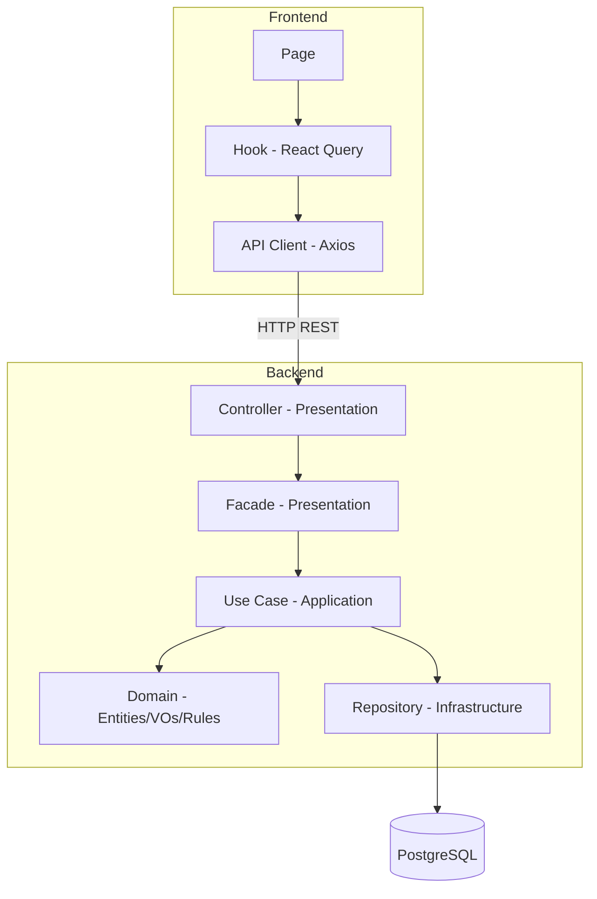

# Visão Geral da Arquitetura

## Objetivo desta seção

Apresentar a arquitetura do MonitoreSeuTreino de forma resumida, contextualizando as camadas e módulos onde os padrões GoF foram aplicados. Para detalhes de cada padrão, consulte as seções [3.1](../padroes-de-projeto/3-1-gofs-criacionais.md), [3.2](../padroes-de-projeto/3-2-gofs-estruturais.md) e [3.3](../padroes-de-projeto/3-3-gofs-comportamentais.md).

## Organização geral

O sistema é composto por quatro serviços orquestrados via Docker Compose:

| Serviço | Tecnologia       | Porta | Responsabilidade                   |
|---------|------------------|-------|------------------------------------|
| `db`    | PostgreSQL 16    | 5433  | Persistência relacional            |
| `api`   | NestJS + TypeORM | 3000  | Lógica de negócio e endpoints REST |
| `web`   | React + Vite     | 5173  | Interface do usuário               |
| `docs`  | MkDocs Material  | 8000  | Documentação do projeto            |

### Backend — Clean Architecture por módulo

O backend segue **Clean Architecture** com separação estrita entre camadas. Nenhuma camada importa de uma camada externa.

```
Domain → Application → Presentation → Infrastructure
```

| Camada             | Responsabilidade                                                       | Exemplos no módulo de Onboarding                            |
|--------------------|------------------------------------------------------------------------|-------------------------------------------------------------|
| **Domain**         | Entidades, value objects, interfaces de repositório, regras de negócio | `TrainingProfile`, `OnboardingAnswers`, `ProfileClassifier` |
| **Application**    | Use cases, orquestração, DTOs de entrada/saída                         | `SubmitOnboardingUseCase`, `RedoOnboardingUseCase`          |
| **Presentation**   | Controllers, facades, view models, guards, filtros                     | `OnboardingController`, `OnboardingFacade`                  |
| **Infrastructure** | ORM entities, repositórios concretos, módulos NestJS                   | `TrainingProfileOrmEntity`, `OnboardingModule`              |

### Frontend — Feature-based Architecture

O frontend organiza o código por funcionalidade, não por tipo de arquivo:

```
app/ (router, providers, layouts)
features/
  auth/     (login, cadastro, guards)
  onboarding/ (formulário, resultado)
  dashboard/  (tela principal)
shared/     (components, hooks, lib, utils)
```

O fluxo de dados segue: `Page → Component → Hook (React Query) → Service → API Client (Axios) → Backend`.

## Diagrama de camadas



## Módulos implementados

| Módulo       | Backend                                          | Frontend                                       | Status       |
|--------------|--------------------------------------------------|------------------------------------------------|--------------|
| Autenticação | `auth/` (JWT, refresh token, guards)             | `features/auth/` (login, cadastro)             | Implementado |
| Onboarding   | `onboarding/` (perfil, histórico, classificação) | `features/onboarding/` (formulário, resultado) | Implementado |
| Dashboard    | —                                                | `features/dashboard/` (tela inicial)           | Parcial      |
| Treinos      | —                                                | —                                              | Planejado    |

## Relação com os padrões GoF

Os padrões foram aplicados exclusivamente dentro do módulo de **Onboarding** nesta entrega. A tabela abaixo localiza cada padrão na arquitetura:

| Padrão          | Camada                  | Localização                                               | Problema resolvido                                                    |
|-----------------|-------------------------|-----------------------------------------------------------|-----------------------------------------------------------------------|
| Singleton       | Domain                  | `domain/onboarding/rules/`                                | Fonte única de regras de classificação para múltiplos classificadores |
| Bridge          | Domain                  | `domain/onboarding/bridge/`                               | Separar hierarquia de fluxos da hierarquia de classificadores         |
| Facade          | Presentation            | `presentation/facades/`                                   | Isolar o controller do subsistema interno de use cases                |
| Memento         | Domain + Infrastructure | `domain/onboarding/entities/`, `infrastructure/database/` | Preservar estado anterior do perfil antes de um redo                  |
| Template Method | Domain                  | `domain/onboarding/bridge/` (OnboardingFlow)              | Garantir sequência imutável do algoritmo de classificação             |

## Histórico de versões

| Versão | Data       | Descrição                                                                          | Autor         |
|--------|------------|------------------------------------------------------------------------------------|---------------|
| 1.0    | 19/05/2026 | Visão geral da arquitetura com localização dos padrões GoF do módulo de onboarding | Lucas Antunes |
