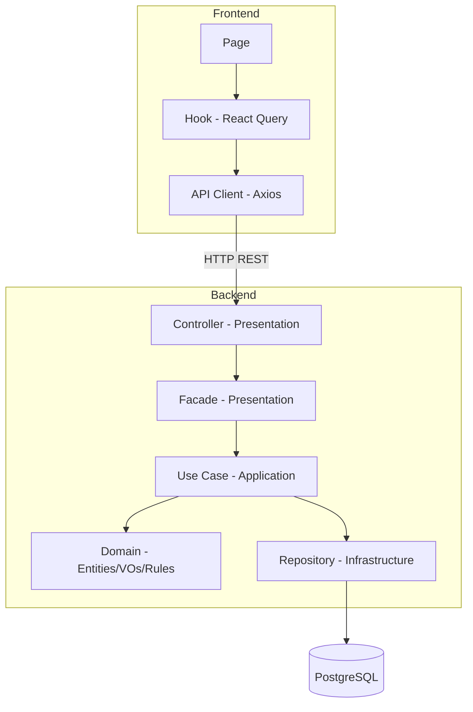

# Visão Geral da Arquitetura

## Objetivo desta seção

Apresentar a arquitetura do MonitoreSeuTreino de forma resumida, contextualizando as camadas e módulos onde os padrões GoF foram aplicados. Para detalhes de cada padrão, consulte as seções [3.1](https://www.google.com/search?q=../padroes-de-projeto/3-1-gofs-criacionais.md), [3.2](https://www.google.com/search?q=../padroes-de-projeto/3-2-gofs-estruturais.md) e [3.3](https://www.google.com/search?q=../padroes-de-projeto/3-3-gofs-comportamentais.md).

## Organização geral

O sistema é composto por quatro serviços orquestrados via Docker Compose:

| **Serviço** | **Tecnologia**   | **Porta** | **Responsabilidade**               |
| ----------- | ---------------- | --------- | ---------------------------------- |
| `db`        | PostgreSQL 16    | 5433      | Persistência relacional            |
| `api`       | NestJS + TypeORM | 3000      | Lógica de negócio e endpoints REST |
| `web`       | React + Vite     | 5173      | Interface do usuário               |
| `docs`      | MkDocs Material  | 8000      | Documentação do projeto            |

### Backend — Clean Architecture por módulo

O backend segue **Clean Architecture** com separação estrita entre camadas. Nenhuma camada importa de uma camada externa.

```
Domain → Application → Presentation → Infrastructure
```

| **Camada**         | **Responsabilidade**                                                   | **Exemplos (Onboarding e Autenticação)**                                                     |
| ------------------ | ---------------------------------------------------------------------- | -------------------------------------------------------------------------------------------- |
| **Domain**         | Entidades, value objects, interfaces de repositório, regras de negócio | `TrainingProfile`, `User`, `RefreshToken`, `OnboardingClassificationRules`                   |
| **Application**    | Use cases, orquestração, DTOs de entrada/saída, barramento de eventos  | `SubmitOnboardingUseCase`, `AuthenticateUserUseCase`, `DomainEventBus`, `UseCase` (Template) |
| **Presentation**   | Controllers, facades, view models, guards, filtros                     | `OnboardingController`, `AuthController`, `AuthenticationFacade`                             |
| **Infrastructure** | ORM entities, repositórios concretos, módulos NestJS, Decorators       | `TrainingProfileOrmEntity`, `CachingUserRepository`, `AuthModule`                            |

### Frontend — Feature-based Architecture

O frontend organiza o código por funcionalidade, não por tipo de arquivo:

```
app/          (router, providers, layouts)
features/
  auth/       (login, cadastro, guards)
  onboarding/ (formulário, resultado)
  exercises/  (listagem, modais)
  dashboard/  (tela principal)
shared/       (components, hooks, lib, utils)
```

O fluxo de dados segue: `Page → Component → Hook (React Query) → Service → API Client (Axios) → Backend`.

## Diagrama de camadas



## Módulos implementados

| **Módulo**   | **Backend**                                              | **Frontend**                                       | **Status**   |
| ------------ | -------------------------------------------------------- | -------------------------------------------------- | ------------ |
| Autenticação | `auth/` (JWT, refresh token, eventos, decorators, guards)| `features/auth/` (login, cadastro)                 | Implementado |
| Onboarding   | `onboarding/` (perfil, histórico, classificação)         | `features/onboarding/` (formulário, resultado)     | Implementado |
| Exercícios   | `exercises/` (criação, edição, listagem)                 | `features/exercises/` (listagem, modais)           | Implementado |
| Dashboard    | —                                                        | `features/dashboard/` (tela inicial)               | Parcial      |
| Treinos      | —                                                        | —                                                  | Planejado    |

## Relação com os padrões GoF

Os padrões foram aplicados dentro dos módulos de **Onboarding**, **Autenticação** e **Exercícios** nesta entrega. A tabela abaixo localiza cada padrão na arquitetura:

| **Padrão**      | **Módulo**   | **Camada**              | **Localização**                                           | **Problema resolvido**                                                                                  |
| --------------- | ------------ | ----------------------- | --------------------------------------------------------- | ------------------------------------------------------------------------------------------------------- |
| Singleton       | Onboarding   | Domain                  | `domain/onboarding/rules/`                                | Fonte única de regras de classificação para múltiplos classificadores                                   |
| Factory Method  | Autenticação | Domain                  | `domain/entities/` (User / RefreshToken)                  | Separação semântica da criação genuína com disparo de eventos da reconstituição a partir da base        |
| Bridge          | Onboarding   | Domain                  | `domain/onboarding/bridge/`                               | Separar hierarquia de fluxos da hierarquia de classificadores                                           |
| Facade          | Onboarding   | Presentation            | `presentation/facades/onboarding.facade.ts`               | Isolar o controller do subsistema interno de use cases                                                  |
| Facade          | Autenticação | Presentation            | `presentation/facades/authentication.facade.ts`           | Roteamento simplificado dos fluxos de Auth (Login/Logout parcial ou total) blindando o Controller       |
| Decorator       | Autenticação | Infrastructure          | `infrastructure/database/`                                | Empilhar políticas de cache em memória e log (`CachingUserRepository`) sem alterar a classe base        |
| Memento         | Onboarding   | Domain + Infrastructure | `domain/onboarding/entities/`, `infrastructure/database/` | Preservar estado anterior do perfil antes de um redo sem quebrar encapsulamento                         |
| Template Method | Onboarding   | Domain                  | `domain/onboarding/bridge/` (OnboardingFlow)              | Garantir sequência imutável do algoritmo de classificação com steps predefinidos                        |
| Template Method | Autenticação | Application             | `application/use-cases/base.use-case.ts`                  | Centralizar e garantir execução da rotina de limpeza, ação principal e extração/publicação de eventos   |
| Observer        | Autenticação | Domain + Application    | `application/events/`, `domain/entities/`                 | Desacoplar publicação de eventos (`DomainEventBus`) dos Handlers que devem reagir de forma independente |
| Builder         | Exercícios   | Domain                  | `domain/exercises/builders/`                              | Centralizar validações e montagem de parâmetros obrigatórios e opcionais do agregado `Exercise`         |
| Decorator       | Exercícios   | Domain + Infrastructure | `infrastructure/modules/` e `infrastructure/database/`    | Inclusão transparente de logs e cache sobre o repositório base                                          |
| Chain of Resp.  | Exercícios   | Infrastructure          | `infrastructure/database/` (ExerciseSearchChain)          | Construção dinâmica das restrições encadeadas da pipeline de busca                                      |

## Histórico de versões

| **Versão** | **Data**   | **Descrição**                                                                      | **Autor**               |
| ---------- | ---------- | ---------------------------------------------------------------------------------- | ----------------------- |
| 1.0        | 19/05/2026 | Visão geral da arquitetura com localização dos padrões GoF do módulo de Onboarding | Lucas Antunes           |
| 1.1        | 20/05/2026 | Atualização da arquitetura incorporando os 5 padrões GoF do Módulo de Autenticação | Samuel Nogueira Caetano |
| 1.2        | 21/05/2026 | Adição do módulo de Exercícios à lista de módulos e padrões GoF correspondentes    | Daniel Teles            |