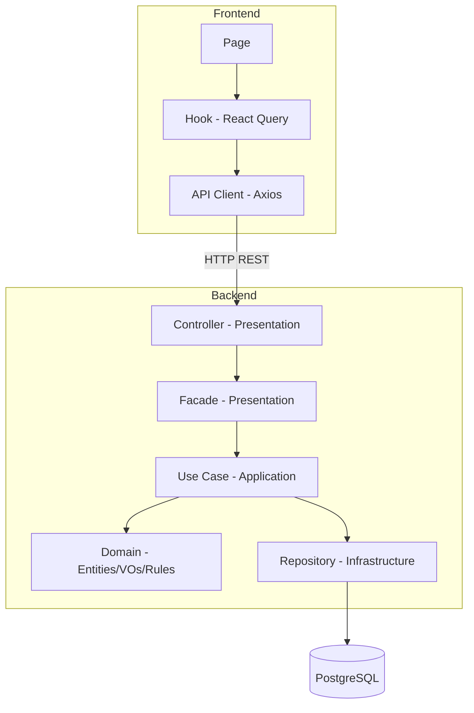

# Visão Geral da Arquitetura

## Objetivo desta seção

Apresentar a arquitetura do MonitoreSeuTreino de forma resumida, contextualizando as camadas e módulos onde os padrões GoF foram aplicados. Para detalhes de cada padrão, consulte as seções [3.1 GoFs Criacionais](../padroes-de-projeto/3-1-gofs-criacionais.md), [3.2 GoFs Estruturais](../padroes-de-projeto/3-2-gofs-estruturais.md) e [3.3 GoFs Comportamentais](../padroes-de-projeto/3-3-gofs-comportamentais.md).

## Organização geral

O sistema é composto por quatro serviços orquestrados via Docker Compose:

| **Serviço** | **Tecnologia**   | **Porta** | **Responsabilidade**               |
| ----------- | ---------------- | --------- | ---------------------------------- |
| `db`        | PostgreSQL 16    | 5433      | Persistência relacional            |
| `api`       | NestJS + TypeORM | 3000      | Lógica de negócio e endpoints REST |
| `web`       | React + Vite     | 5173      | Interface do usuário               |
| `docs`      | Docsify          | 8000      | Documentação do projeto            |

### Backend — Clean Architecture por módulo

O backend segue **Clean Architecture** com separação estrita entre camadas. Nenhuma camada importa de uma camada externa.

```
Domain → Application → Presentation → Infrastructure
```

| **Camada**         | **Responsabilidade**                                                   | **Exemplos (Onboarding e Autenticação)**                                                     |
| ------------------ | ---------------------------------------------------------------------- | -------------------------------------------------------------------------------------------- |
| **Domain**         | Entidades, value objects, interfaces de repositório, regras de negócio | `TrainingProfile`, `User`, `RefreshToken`, `OnboardingClassificationRules`                   |
| **Application**    | Use cases, orquestração, DTOs de entrada/saída, barramento de eventos  | `SubmitOnboardingUseCase`, `AuthenticateUserUseCase`, `DomainEventBus`, `UseCase` (Template) |
| **Presentation**   | Controllers, facades, view models, guards, filtros                     | `OnboardingController`, `AuthController`, `AuthenticationFacade`                             |
| **Infrastructure** | ORM entities, repositórios concretos, módulos NestJS, Decorators       | `TrainingProfileOrmEntity`, `CachingUserRepository`, `AuthModule`                            |

### Frontend — Feature-based Architecture

O frontend organiza o código por funcionalidade, não por tipo de arquivo:

```
app/          (router, providers, layouts)
features/
  auth/       (login, cadastro, guards)
  onboarding/ (formulário, resultado)
  exercises/  (listagem, modais)
  dashboard/  (tela principal)
shared/       (components, hooks, lib, utils)
```

O fluxo de dados segue: `Page → Component → Hook (React Query) → Service → API Client (Axios) → Backend`.

## Diagrama de camadas


## Módulos implementados

| Módulo | Backend | Frontend | Status |
|---|---|---|---|
| Autenticação | `auth/` (JWT, refresh token, eventos, decorators, guards) | `features/auth/` (login, cadastro) | Implementado |
| Onboarding | `onboarding/` (perfil, histórico, classificação) | `features/onboarding/` (formulário, resultado) | Implementado |
| Sessão de Treino | `session/` (registro de treino, composite, iterator) | — | Implementado (API) |
| Histórico | `history/` (RF26, RF27, Multiton, Proxy, Observer) | — | Implementado (API) |
| Exercícios | `exercises/` (criação, edição, listagem) | `features/exercises/` (listagem, modais) | Implementado |
| Usuário | `user/` (redefinição de senha, exclusão de conta, chain, builder) | — | Implementado (API) |
| Rotinas | `routines/` (clone, ativação, Prototype, Proxy, Mediator) | — | Implementado (API) |
| Dashboard | — | `features/dashboard/` (tela inicial) | Parcial |

## Relação com os padrões GoF

Os padrões foram aplicados dentro dos módulos de **Onboarding**, **Autenticação**, **Exercícios** e **Histórico** nesta entrega. A tabela abaixo localiza cada padrão na arquitetura.

| Padrão | Módulo | Camada | Localização | Problema resolvido |
|---|---|---|---|---|
| Singleton | Onboarding | Domain | `domain/onboarding/rules/` | Fonte única de regras de classificação para múltiplos classificadores. |
| Factory Method | Autenticação | Domain | `domain/entities/` (`User` / `RefreshToken`) | Separação semântica da criação genuína com disparo de eventos da reconstituição a partir da base. |
| Builder | Exercícios | Domain | `domain/exercises/builders/` | Centralizar validações e montagem de parâmetros obrigatórios e opcionais do agregado `Exercise`. |
| Multiton | Histórico | Domain | `domain/history/history-manager.ts` | Uma instância de gerenciador de histórico por usuário autenticado. |
| Bridge | Onboarding | Domain | `domain/onboarding/bridge/` | Separar hierarquia de fluxos da hierarquia de classificadores. |
| Facade | Onboarding | Presentation | `presentation/facades/onboarding.facade.ts` | Isolar o controller do subsistema interno de use cases. |
| Facade | Autenticação | Presentation | `presentation/facades/authentication.facade.ts` | Roteamento simplificado dos fluxos de autenticação, blindando o controller. |
| Decorator | Autenticação | Infrastructure | `infrastructure/database/` | Empilhar políticas de cache em memória e log sem alterar a classe base. |
| Decorator | Exercícios | Domain + Infrastructure | `infrastructure/modules/` e `infrastructure/database/` | Inclusão transparente de logs e cache sobre o repositório base. |
| Proxy | Histórico | Infrastructure | `infrastructure/services/history-service.proxy.ts` | Validar acesso, auditar e delegar ao serviço real de histórico. |
| Memento | Onboarding | Domain + Infrastructure | `domain/onboarding/entities/`, `infrastructure/database/` | Preservar estado anterior do perfil antes de refazer o questionário sem quebrar encapsulamento. |
| Template Method | Onboarding | Domain | `domain/onboarding/bridge/` (`OnboardingFlow`) | Garantir sequência imutável do algoritmo de classificação com steps predefinidos. |
| Template Method | Autenticação | Application | `application/use-cases/base.use-case.ts` | Centralizar e garantir execução da rotina de limpeza, ação principal e extração/publicação de eventos. |
| Observer | Autenticação | Domain + Application | `application/events/`, `domain/entities/` | Desacoplar publicação de eventos (`DomainEventBus`) dos handlers que devem reagir de forma independente. |
| Observer | Histórico | Domain + Application | `domain/history/observers/`, `register-session.use-case` | Atualizar histórico automaticamente ao concluir sessão de treino. |
| Chain of Responsibility | Exercícios | Infrastructure | `infrastructure/database/` (`ExerciseSearchChain`) | Construção dinâmica das restrições encadeadas da pipeline de busca. |
| Builder | Usuário | Presentation | `presentation/` (`PasswordResetRequestBuilder`, `AccountDeletionRequestBuilder`) | Construção validada de comandos com campos obrigatórios antes da execução da cadeia. |
| Builder | Sessão de Treino | Domain | `domain/session/builders/` (`TrainingSessionBuilder`) | Montagem incremental e segura da árvore do composite de exercícios e séries. |
| Facade | Usuário | Presentation | `presentation/facades/` (`PasswordResetFacade`, `AccountDeletionFacade`) | Interface única para orquestrar cadeia, repositórios, e-mail e eventos do usuário. |
| Chain of Responsibility | Usuário | Application | `application/` (`password-reset.chain.ts`) | Etapas sequenciais de validação e execução com aborto silencioso por segurança. |
| Composite | Sessão de Treino | Domain | `domain/session/` (`ExerciseNode`, `TrainingSet`) | Representar a estrutura do treino em árvore para cálculos recursivos de volume. |
| Iterator | Sessão de Treino | Domain | `domain/session/` (`TrainingSetIterator`) | Percorrer sequencialmente e planificar a estrutura recursiva de exercícios. |
| Prototype | Rotinas | Domain | `domain/routines/` (`Routine.clone()`) | Duplicar rotinas profundamente sem expor lógicas de cópia e renovação de IDs aos casos de uso. |
| Proxy | Rotinas | Infrastructure | `infrastructure/database/` (`RoutineRepositoryProxy`) | Interceptar operações de repositório para adicionar proteções de integridade cruzada de dados. |
| Mediator | Rotinas | Application | `application/events/` (`DomainEventBus` + Handler) | Desacoplar a desativação de rotinas antigas do fluxo de ativação principal. |

## Histórico de versões

| Versão | Data | Descrição | Autor |
|---|---|---|---|
| 1.0 | 19/05/2026 | Visão geral da arquitetura com localização dos padrões GoF do módulo de Onboarding. | Lucas Antunes |
| 1.1 | 20/05/2026 | Atualização da arquitetura incorporando os 5 padrões GoF do módulo de Autenticação. | Samuel Nogueira Caetano |
| 1.2 | 20/05/2026 | Inclusão do módulo de Histórico com padrões Multiton, Proxy e Observer. | Giovanni Dornelas Ferreira |
| 1.3 | 21/05/2026 | Adição do módulo de Exercícios à lista de módulos e padrões GoF correspondentes. | Daniel Teles |
| 1.4 | 21/05/2026 | Inclusão dos módulos de Usuário e Sessão de Treino com padrões GoF correspondentes. | André Ricardo Meyer de Melo |
| 1.5 | 22/05/2026 | Inclusão do módulo de Rotinas, correção dos links e atualização do serviço de docs para Docsify. | Lucas Antunes |