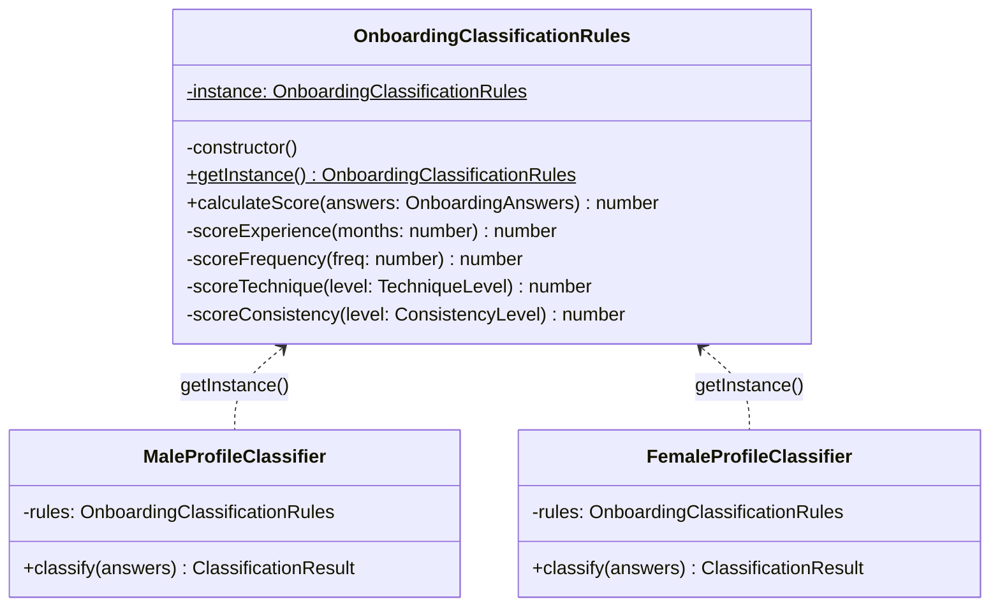
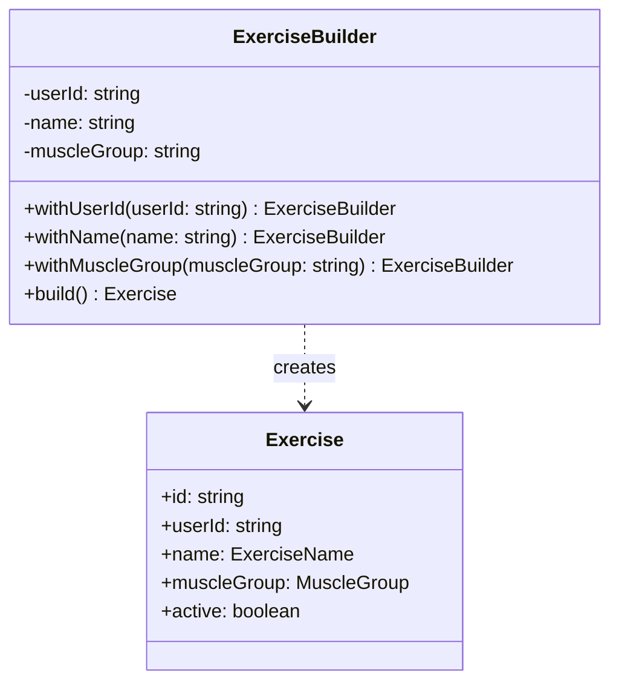
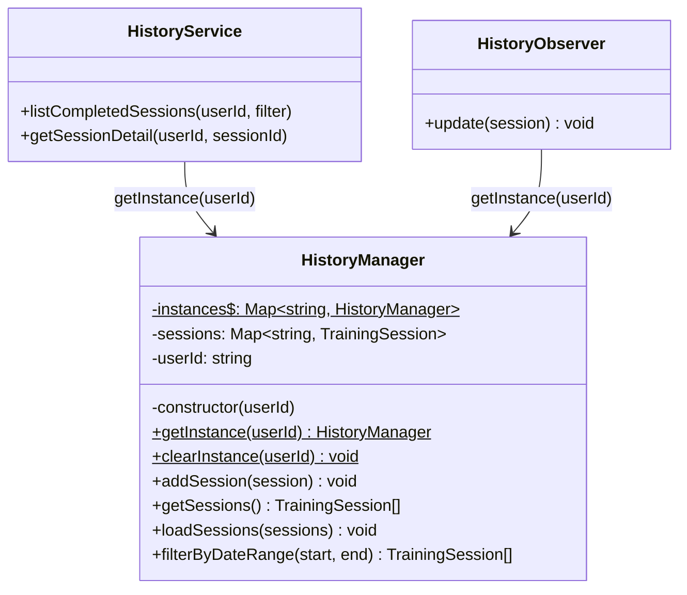
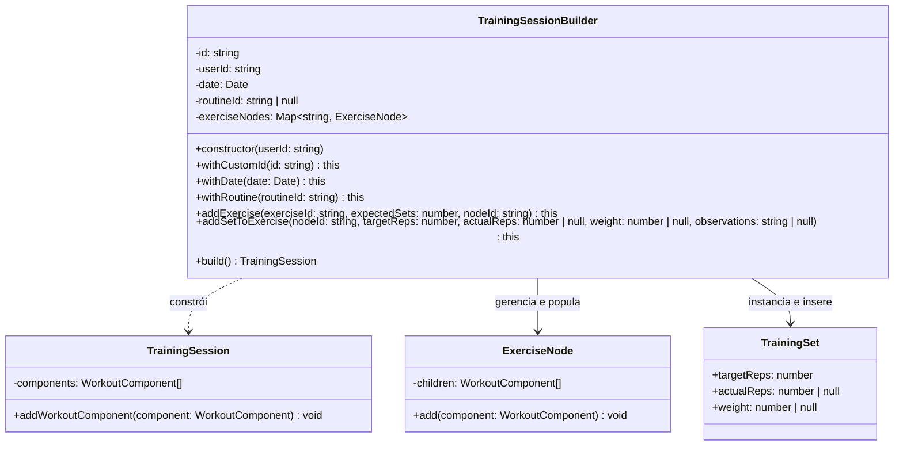
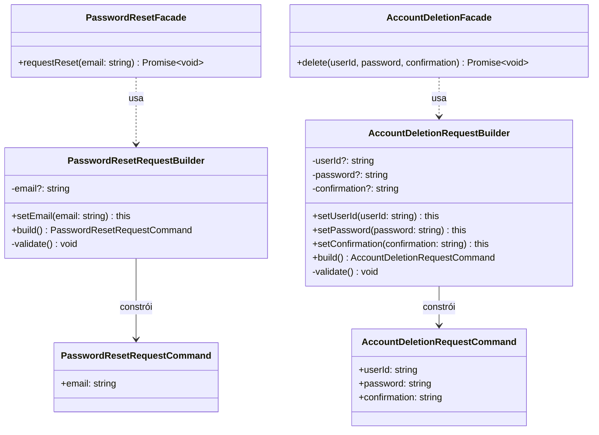
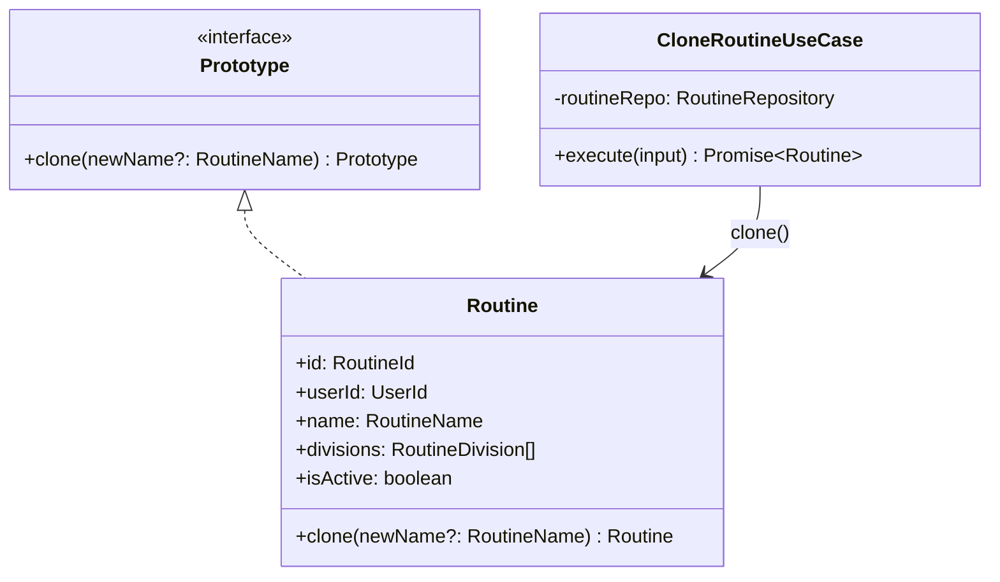

# 3.1. GoFs Criacionais

## Introdução

Os padrões criacionais tratam do processo de criação de objetos, abstraindo a lógica de instanciação e permitindo que o sistema seja independente de como seus objetos são criados, compostos e representados.

Este documento reúne as contribuições de **todos os módulos do projeto**. Cada seção identifica o módulo, o integrante responsável e o padrão GoF aplicado. As seções sinalizadas como **“a preencher”** aguardam a contribuição dos demais membros — siga a estrutura das seções já preenchidas como referência.

---

## Módulo de Onboarding

> **Responsável:** Lucas Antunes | **Branch:** `feat/modulo-on-boarding`
>
> Contexto: o desafio criacional era garantir que as **regras de classificação de perfil** tivessem uma única fonte de verdade em toda a aplicação, sem que diferentes partes do código pudessem criar instâncias divergentes com comportamentos distintos.

### Padrões analisados

| Padrão | Possível aplicação | Status | Justificativa |
|---|---|---|---|
| **Singleton** | Instância única das regras de classificação | Selecionado | Regras de negócio imutáveis, acesso global necessário em múltiplos classificadores. |
| Factory Method | Criação de classificadores por sexo | Avaliado | Substituído pelo Bridge, que resolve também o problema de variação de comportamento. |
| Abstract Factory | Família de objetos de classificação | Não selecionado | Complexidade desnecessária; o Bridge cobre a variação sem multiplicar famílias de factories. |
| Builder | Construção de `OnboardingAnswers` | Avaliado | Value Object com validação inline é suficiente; Builder adicionaria indireção sem ganho. |
| Prototype | Clonagem de perfis ao refazer onboarding | Não selecionado | O Memento cobre a necessidade de preservar estado anterior de forma mais semântica. |

### Padrão implementado — Singleton · `OnboardingClassificationRules`

### Problema arquitetural

O módulo de classificação de perfil possui dois classificadores independentes: `MaleProfileClassifier` e `FemaleProfileClassifier`. Ambos precisam executar **exatamente o mesmo algoritmo de pontuação** — a lógica de atribuição de pontos por experiência, frequência, técnica, consistência etc. é idêntica; o que difere é apenas o fluxo de execução.

Se cada classificador instanciasse seu próprio objeto de regras, haveria dois problemas concretos:

1. **Inconsistência silenciosa**: qualquer alteração nas regras de pontuação precisaria ser replicada em múltiplos lugares. Uma divergência geraria classificações diferentes para homens e mulheres com respostas idênticas — um bug difícil de rastrear.
2. **Overhead de memória desnecessário**: as regras são stateless e imutáveis após criação. Criar múltiplas instâncias seria desperdício sem nenhum ganho.

### Justificativa da escolha

O Singleton garante que exista **uma única instância** de `OnboardingClassificationRules` em toda a execução da aplicação. Isso resolve os dois problemas:

- **Fonte única de verdade**: qualquer mudança nas regras de pontuação impacta todos os classificadores automaticamente.
- **Acesso controlado**: a instância é obtida via `getInstance()`, tornando explícito no código que se trata de um recurso compartilhado.
- **Imutabilidade garantida**: a instância não expõe estado mutável; `calculateScore()` é uma função pura que recebe `OnboardingAnswers` e retorna um número.

A alternativa de injeção de dependência via NestJS foi avaliada, mas as regras de classificação pertencem à **camada de domínio** e não devem depender do container IoC da infraestrutura. O Singleton de domínio mantém essa independência.

### Modelagem



### Implementação

| Elemento | Caminho |
|---|---|
| Singleton — regras | `backend/src/domain/onboarding/rules/onboarding-classification-rules.singleton.ts` |
| Consumidor — classificador masculino | `backend/src/domain/onboarding/bridge/male-profile-classifier.ts` |
| Consumidor — classificador feminino | `backend/src/domain/onboarding/bridge/female-profile-classifier.ts` |
| Testes unitários | `backend/src/domain/onboarding/rules/onboarding-classification-rules.singleton.spec.ts` |

#### Trecho central

```typescript
// onboarding-classification-rules.singleton.ts
export class OnboardingClassificationRules {
  private static instance: OnboardingClassificationRules;

  private constructor() {}

  static getInstance(): OnboardingClassificationRules {
    if (!OnboardingClassificationRules.instance) {
      OnboardingClassificationRules.instance =
        new OnboardingClassificationRules();
    }

    return OnboardingClassificationRules.instance;
  }

  calculateScore(answers: OnboardingAnswers): number {
    return (
      this.scoreExperience(answers.experienceMonths) +
      this.scoreFrequency(answers.weeklyFrequency) +
      (answers.followedStructuredPlan ? 1 : 0) +
      this.scoreTechnique(answers.techniqueLevel) +
      (answers.usesProgressiveLoad ? 1 : 0) +
      this.scoreConsistency(answers.recentConsistency)
    );
  }

  // ...
}

// male-profile-classifier.ts — consumo do Singleton
export class MaleProfileClassifier implements ProfileClassifier {
  private readonly rules = OnboardingClassificationRules.getInstance();

  classify(answers: OnboardingAnswers): ClassificationResult {
    const score = this.rules.calculateScore(answers);
    return ClassificationResult.create(score);
  }
}
```

### Evidência de execução

Os testes unitários verificam a propriedade fundamental do Singleton:

```text
✓ getInstance() retorna sempre a mesma instância
✓ score mínimo (todas as respostas mais baixas) = 0
✓ score máximo (todas as respostas mais altas) = 10
✓ experiência < 6 meses contribui com 0 pontos
✓ experiência 6–18 meses contribui com 1 ponto
✓ perfil intermediário produz score = 6
```

Execute no container:

```bash
sudo docker compose exec api npx jest onboarding-classification-rules --verbose
```

### Rastreabilidade

| Artefato | Relação |
|---|---|
| Requisito | Classificar usuário em BEGINNER / INTERMEDIATE / ADVANCED. |
| Módulo | `domain/onboarding/rules` |
| Camada | Domínio |
| Padrão estrutural relacionado | Bridge — classificadores consomem o Singleton. |
| Padrão comportamental relacionado | Memento — usa `ClassificationResult` produzido pelas regras. |
| Arquivo de testes | `rules/onboarding-classification-rules.singleton.spec.ts` |

### Senso crítico

#### Benefícios

- **Consistência garantida em tempo de compilação**: ambos os classificadores chamam `getInstance()`, reduzindo o risco de instâncias divergentes.
- **Domínio puro**: a classe não tem dependência de framework, o que a torna testável de forma isolada com Jest sem mocks de infraestrutura.
- **Algoritmo centralizado**: quando as regras de negócio mudarem, há um único lugar para alterar.

#### Limitações

- **Testabilidade do Singleton em si**: como a instância persiste entre testes no mesmo processo Jest, é necessário garantir que os testes não dependam de estado mutável — o que é satisfeito aqui pela natureza stateless da classe.
- **Sem injeção de dependência formal**: em cenários onde as regras precisassem variar por configuração de ambiente, o Singleton seria inflexível. Para o escopo atual, isso não se aplica.

#### Alternativas consideradas

- **Service NestJS com `@Injectable({ scope: Scope.DEFAULT })`**: o comportamento seria similar, mas acoplaria o domínio ao framework. Rejeitado.
- **Objeto literal / módulo ES**: funciona, mas perde a semântica de classe e dificulta extensão futura. Rejeitado.

### Referências

- GAMMA, E. et al. _Design Patterns: Elements of Reusable Object-Oriented Software_. Addison-Wesley, 1994. Cap. 3 — Creational Patterns, Singleton, p. 127–136.
- MARTIN, R. C. _Clean Architecture_. Prentice Hall, 2017. Cap. 22 — The Clean Architecture.

---

## Módulo de Autenticação

> **Responsável:** Samuel Nogueira Caetano | **Branch:** `main (integrada a partir da feat/modulo-autenticacao)`
>
> Contexto: o desafio criacional era separar a **lógica de construção** das entidades de domínio (`User` e `RefreshToken`) da lógica de uso, garantindo que eventos de domínio só fossem emitidos em criações legítimas — e nunca durante reconstituições a partir do banco de dados — sem expor construtores públicos que permitissem contornar essa distinção.

### Padrões analisados

| Padrão | Possível aplicação | Status | Justificativa |
|---|---|---|---|
| **Factory Method** | Criação e reconstituição de `User` e `RefreshToken` | Selecionado | Separa semanticamente a criação, com efeitos colaterais e emissão de eventos, da reconstituição sem efeitos, mantendo o construtor privado e as invariantes encapsuladas. |
| Abstract Factory | Família de objetos de autenticação | Não selecionado | Os objetos não são criados juntos de forma coordenada; cada caso de uso instancia individualmente apenas o que precisa. |
| Builder | Construção incremental de `User` com campos opcionais | Avaliado | O conjunto de campos estruturais é fixo e as validações ocorrem nos Value Objects; o Builder adicionaria indireção sem ganho real de clareza. |
| Prototype | Clonagem de entidades para mutações imutáveis | Não selecionado | As mutações imutáveis já geram e retornam novas instâncias de forma atômica internamente, tornando a clonagem genérica redundante. |
| Singleton | Instância única de serviços de domínio | Não selecionado | Os serviços de suporte são gerenciados pelo contêiner IoC do NestJS; o domínio não necessita de Singletons próprios. |

### Padrão implementado — Factory Method · `User.create()` / `User.reconstitute()` · `RefreshToken.create()` / `RefreshToken.reconstitute()`

### Problema arquitetural

As entidades `User` e `RefreshToken` precisam ser instanciadas em dois contextos fundamentalmente distintos dentro do ciclo de vida da aplicação:

1. **Criação genuína**: ocorre quando um novo usuário se registra ou um novo token de acesso/sessão é emitido pela primeira vez. Neste cenário, a entidade deve gerar um novo identificador único estável, registrar os timestamps correntes e publicar os eventos de domínio correspondentes.
2. **Reconstituição a partir da persistência**: ocorre quando o repositório lê os registros armazenados no banco de dados PostgreSQL e precisa reconstruir o objeto correspondente em memória. Neste cenário, nenhum evento de domínio deve ser gerado, o UUID e os timestamps originais devem ser preservados e nenhuma validação de integridade de primeiro ciclo deve ser disparada novamente.

Se o construtor das classes fosse público e único, qualquer chamador poderia instanciar uma entidade contornando essas restrições, gerando riscos de bugs silenciosos — como repositórios disparando eventos de criação duplicados ao realizar leituras comuns do banco, ou casos de uso esquecendo de inicializar eventos obrigatórios.

### Justificativa da escolha

O padrão Factory Method resolve o problema arquitetural ao encapsular o construtor sob visibilidade privada e expor dois métodos estáticos com semânticas explicitamente distintas:

- `create(...)` — para criação de novas entidades, contendo a geração automática de identidades, data de criação e o push do evento no array interno.
- `reconstitute(...)` — para hidratação segura a partir do repositório, recebendo o estado primitivo exato do banco de dados e suspendendo qualquer efeito colateral.

A imposição do construtor privado torna essa distinção obrigatória pelo compilador e pelo runtime, impedindo falhas por esquecimento técnico. A alternativa de utilizar um construtor público parametrizado por uma flag booleana (`isNew: boolean`) foi rejeitada por configurar o anti-padrão _flag argument_, que reduz a legibilidade da API e transfere uma responsabilidade crítica de controle de estado para o chamador externo.

### Modelagem


### Implementação

| Elemento | Papel no Factory Method | Caminho |
|---|---|---|
| `User.create()` | Factory de criação genuína — centraliza a geração de IDs, timestamps iniciais e o acúmulo de `UserRegisteredEvent`. | `src/domain/entities/user.entity.ts` |
| `User.reconstitute()` | Factory de reconstituição — restaura o estado persistido sem gerar novos IDs ou disparar eventos de negócio. | `src/domain/entities/user.entity.ts` |
| `RefreshToken.create()` | Factory de criação de sessão — realiza a checagem formal do formato do `userId` e inicializa o ciclo do token. | `src/domain/entities/refresh-token.entity.ts` |
| `RefreshToken.reconstitute()` | Factory de reconstituição de sessão — recria instâncias em memória preservando datas passadas e estados de revogação. | `src/domain/entities/refresh-token.entity.ts` |
| `UserPostgresRepository.toDomain()` | Consumidor exclusivo de reconstituição para mapeamento da camada de dados para o domínio. | `src/infrastructure/database/user.postgres-repository.ts` |
| `RefreshTokenPostgresRepository.toDomain()` | Consumidor de reconstituição para hidratação de tokens a partir da tabela física `refresh_tokens`. | `src/infrastructure/database/refresh-token.postgres-repository.ts` |
| `RegisterUserUseCase` | Cliente da factory de criação legítima durante o fluxo de inscrição de novos usuários. | `src/application/use-cases/auth/register-user.use-case.ts` |
| `AuthenticateUserUseCase` | Cliente da factory de criação legítima no momento de geração de novos tokens criptográficos em logins com sucesso. | `src/application/use-cases/auth/authenticate-user.use-case.ts` |

#### Trechos centrais

```typescript
// user.entity.ts
export class User extends AggregateRoot {
  private constructor(
    public readonly id: string,
    public readonly name: PersonName,
    public readonly email: Email,
    public readonly hashedPassword: HashedPassword,
    public readonly createdAt: Timestamp,
    public readonly updatedAt: Timestamp,
    public readonly deletedAt: Timestamp | null = null,
  ) {
    super();
  }

  static create(
    name: PersonName,
    email: Email,
    hashedPassword: HashedPassword,
  ): User {
    const now = Timestamp.now();
    const user = new User(
      UserId.create().toString(),
      name,
      email,
      hashedPassword,
      now,
      now,
    );

    user.pushEvent(
      new UserRegisteredEvent(user.id, email.toString(), now.toDate()),
    );

    return user;
  }

  static reconstitute(
    id: string,
    name: PersonName,
    email: Email,
    hashedPassword: HashedPassword,
    createdAt: Timestamp,
    updatedAt: Timestamp,
    deletedAt: Timestamp | null,
  ): User {
    return new User(
      id,
      name,
      email,
      hashedPassword,
      createdAt,
      updatedAt,
      deletedAt,
    );
  }
}

// refresh-token.entity.ts
export class RefreshToken extends AggregateRoot {
  private constructor(
    public readonly id: string,
    public readonly userId: string,
    public readonly tokenHash: TokenHash,
    public readonly expiresAt: ExpiresAt,
    public readonly createdAt: Timestamp,
    public readonly revokedAt: Timestamp | null = null,
  ) {
    super();
  }

  static create(
    userId: string,
    tokenHash: TokenHash,
    expiresAt: ExpiresAt,
  ): RefreshToken {
    UserId.reconstitute(userId);

    return new RefreshToken(
      RefreshTokenId.create().toString(),
      userId,
      tokenHash,
      expiresAt,
      Timestamp.now(),
    );
  }

  static reconstitute(
    id: string,
    userId: string,
    tokenHash: TokenHash,
    expiresAt: ExpiresAt,
    createdAt: Timestamp,
    revokedAt: Timestamp | null,
  ): RefreshToken {
    return new RefreshToken(
      id,
      userId,
      tokenHash,
      expiresAt,
      createdAt,
      revokedAt,
    );
  }
}

// register-user.use-case.ts
const user = User.create(name, email, hashedPassword);
await this.userRepository.save(user);

// authenticate-user.use-case.ts
const refreshToken = RefreshToken.create(user.id, tokenHash, expiresAt);
await this.refreshTokenRepository.insert(refreshToken);

// user.postgres-repository.ts
private toDomain(orm: UserOrmEntity): User {
  return User.reconstitute(
    orm.id,
    PersonName.reconstitute(orm.name),
    Email.reconstitute(orm.email),
    HashedPassword.fromHash(orm.passwordHash),
    Timestamp.from(orm.createdAt),
    Timestamp.from(orm.updatedAt),
    orm.deletedAt ? Timestamp.from(orm.deletedAt) : null,
  );
}

// refresh-token.postgres-repository.ts
private toDomain(orm: RefreshTokenOrmEntity): RefreshToken {
  return RefreshToken.reconstitute(
    orm.id,
    orm.userId,
    TokenHash.from(orm.tokenHash),
    ExpiresAt.reconstitute(orm.expiresAt),
    Timestamp.from(orm.createdAt),
    orm.revokedAt ? Timestamp.from(orm.revokedAt) : null,
  );
}
```

### Evidência de execução

A separação lógica dos dois caminhos de instanciação é validada diretamente pela asserção do comportamento dos eventos internos nas baterias de testes unitários automatizados da aplicação:

```text
✓ User.create() gera id UUID válido automaticamente
✓ User.create() acumula e expõe exatamente um UserRegisteredEvent
✓ User.reconstitute() não acumula nenhum evento de domínio em sua inicialização
✓ User.reconstitute() preserva fielmente o ID recebido sem substituições indesejadas
✓ RefreshToken.create() valida a integridade matemática do formato do campo userId
✓ RefreshToken.create() gera tokens identificadores UUID distintos a cada nova chamada
✓ RefreshToken.reconstitute() preserva o campo data de revogação nulo ou preenchido conforme persistência
```

Para reprodução local e validação completa dos comportamentos contratuais descritos:

```bash
sudo docker compose exec api npx jest user.entity refresh-token.entity --verbose
```

### Rastreabilidade

| Artefato | Relação |
|---|---|
| Requisito | Registrar usuários com identidade única; emitir eventos de domínio apenas em criações reais; emitir e invalidar sessões baseadas em tokens ativos. |
| Módulo | `domain/entities` |
| Camada | Domínio |
| Padrão comportamental relacionado | Observer — o evento `UserRegisteredEvent` alimentado por `create()` é distribuído pelo barramento central `DomainEventBus`. |
| Padrão comportamental relacionado | Template Method — a rotina base `UseCase.execute()` gerencia o ciclo coordenado que drena os eventos produzidos pelas factories. |
| Padrão estrutural relacionado | Decorator — a estrutura composta de `CachingUserRepository` e `LoggingUserRepository` envolve o acesso base que invoca o método de reconstituição. |
| Endpoints afetados | `POST /v1/auth/signup` aciona `User.create()`; `POST /v1/auth/login` aciona `RefreshToken.create()`. |
| Arquivos de teste de cobertura | `domain/entities/user.entity.spec.ts` · `domain/entities/refresh-token.entity.spec.ts` |

### Senso crítico

#### Benefícios

- **Blindagem em nível de compilação**: o bloqueio físico do construtor reduz a possibilidade de programadores instanciarem entidades de maneira inconsistente fora dos padrões estabelecidos.
- **Transparência e expressividade no código**: métodos como `User.create()` e `RefreshToken.reconstitute()` removem ambiguidades de leitura, expondo claramente a intenção de negócio aplicada.
- **Value Objects integrados como barreiras de proteção**: a execução de construtores de hidratação interna assegura que o domínio falhe imediatamente caso dados malformados tentem violar os limites operacionais da camada.

#### Limitações

- **Ausência de validação nativa de mutabilidade no TypeScript**: o modificador `private` nos construtores opera estritamente em tempo de compilação. Chamadores em JavaScript puro ou testes injetando dados via brechas de tipagem ainda poderiam contornar os caminhos se não houver checagem forte de tipos.
- **Silenciamento total de dados inconsistentes**: o método `reconstitute()` assume por design que os dados extraídos da base de persistência são válidos e confiáveis. Caso haja dados históricos corrompidos, o método não aplicará novas regras de validação dinâmicas, delegando essa consistência à gestão de migrações no banco.

#### Alternativas consideradas

- **Construtor único parametrizado por flag (`isNew`)**: avaliado e descartado por ferir a legibilidade do código e transferir indevidamente a responsabilidade de gerenciar o fluxo interno para os chamadores.
- **Segregação em duas classes (`NewUser` e `ExistingUser`)**: cogitada para garantir tipos separados no compilador. Descartada no escopo atual devido à duplicação excessiva de código e complexidade nas assinaturas de retorno de repositórios e barramentos.

### Referências

- GAMMA, E. et al. _Design Patterns: Elements of Reusable Object-Oriented Software_. Addison-Wesley, 1994. Cap. 3 — Creational Patterns, Factory Method, p. 107–116.
- EVANS, E. _Domain-Driven Design: Tackling Complexity in the Heart of Software_. Addison-Wesley, 2003. Cap. 5 — A Model Expressed in Software.
- VERNON, V. _Implementing Domain-Driven Design_. Addison-Wesley, 2013. Cap. 7 — Aggregates.

---

## Módulo de Exercícios

> **Responsável:** Daniel Teles | **Branch:** `feature/exercise_module`
>
> Contexto: criar exercícios vinculados a um usuário de forma segura e validada, sem expor lógica de construção do agregado, incluindo validação de nome e grupo muscular opcional. O objetivo foi centralizar a construção do agregado e manter os use cases enxutos.

### Padrões analisados

| Padrão | Possível aplicação | Status | Justificativa |
|---|---|---|---|
| **Builder** | Construção de `Exercise` com validações e campos opcionais | Selecionado | Simplifica a criação no use case e garante VOs válidos antes de persistir. |
| Factory Method | Criar a entidade via factory estática | Avaliado | Menor benefício quando VOs exigem validação complexa; Builder oferece clareza fluente por etapas. |

### Padrão implementado — Builder · `ExerciseBuilder`

### Problema arquitetural

O `CreateExerciseUseCase` precisava construir um `Exercise` garantindo `userId` obrigatório, `name` válido e `muscleGroup` opcional validado como Value Object. Colocar essa validação inline no use case poluiria a camada de aplicação e duplicaria lógica em outros pontos consumidores.

### Justificativa da escolha

O `Builder` concentra a lógica de construção por meio dos métodos `withUserId`, `withName`, `withMuscleGroup` e `build`, permitindo que o use case crie uma instância pronta para persistência com uma chamada fluente.

Além disso, o Builder facilita a inclusão futura de presets e validações sem alterar o contrato do use case.

### Modelagem



### Implementação

| Elemento | Caminho |
|---|---|
| Builder | `backend/src/domain/exercises/builders/exercise.builder.ts` |
| Entidade | `backend/src/domain/exercises/entities/exercise.entity.ts` |
| Value Objects | `backend/src/domain/exercises/value-objects/exercise-name.vo.ts` · `muscle-group.vo.ts` |
| Use Case | `backend/src/application/use-cases/exercises/create-exercise.use-case.ts` |

#### Trecho central

```typescript
// uso no use case
const exercise = new ExerciseBuilder()
  .withUserId(cmd.userId)
  .withName(cmd.name)
  .withMuscleGroup(cmd.muscleGroup)
  .build();

await this.exerciseRepository.save(exercise);
```

### Evidência de execução

Os testes do builder e a criação via E2E verificam que os exercícios são sempre instanciados em estado válido, não sendo possível persistir atributos inválidos devido às regras encapsuladas no builder.

```bash
docker compose exec api npx jest create-exercise --verbose
```

### Rastreabilidade

| Artefato | Relação |
|---|---|
| Requisito | RF13 — cadastrar exercício com nome obrigatório e grupo muscular opcional. |
| Use Case | `CreateExerciseUseCase` |
| Módulo | `domain/exercises` |
| Camada | Domínio |
| Padrão estrutural relacionado | Decorator — `CachingExerciseRepository` e `LoggingExerciseRepository` envolvem o repositório base que persiste o agregado produzido pelo Builder. |
| Arquivo de testes | `domain/exercises/builders/exercise.builder.spec.ts` |

### Senso crítico

#### Benefícios

- **Imutabilidade e segurança**: garante que o agregado `Exercise` sempre nasça em um estado válido.
- **Leitura fluente**: melhora a leitura dos casos de uso, onde a criação passo a passo fica evidente.
- **Desacoplamento**: remove a responsabilidade do construtor da entidade de lidar com valores default espalhados ou dependências adicionais, delegando ao Builder.

#### Limitações

- **Verbosidade**: para objetos com poucos atributos, criar um Builder pode parecer boilerplate desnecessário.
- **Crescimento do Builder**: caso a entidade cresça muito, o Builder pode acumular muitos métodos.

#### Alternativas consideradas

- **Static Factory Method (`Exercise.create({...})`)**: descartado porque a criação se tornaria uma única assinatura maior, perdendo a modularidade da validação passo a passo, especialmente para campos opcionais como `muscleGroup`.

### Referências

- GAMMA, E. et al. _Design Patterns: Elements of Reusable Object-Oriented Software_. Addison-Wesley, 1994. Cap. 3 — Creational Patterns, Builder.

---

## Módulo de Histórico de Sessões

> **Responsável:** Giovanni Dornelas Ferreira | **Branch:** `feat/modulo-historico`
>
> Contexto: o desafio criacional do histórico (RF26/RF27) é manter **estado de cache por usuário autenticado** sem recriar gerenciadores a cada requisição HTTP, permitindo que o Observer atualize o mesmo objeto após cada sessão concluída.

> Observação: o padrão Multiton é tratado neste documento como uma variação criacional derivada do Singleton, embora não faça parte do catálogo original dos 23 padrões GoF.

### Padrões analisados

| Padrão | Possível aplicação | Status | Justificativa |
|---|---|---|---|
| **Multiton** | Uma instância de `HistoryManager` por `userId` | Selecionado | Pool controlado por usuário; evita Singleton global que misturaria dados entre usuários. |
| Singleton | Instância única global de histórico | Não selecionado | Violaria isolamento multiusuário — histórico de um usuário poderia vazar para outro. |
| Factory Method | Criar `HistoryManager` via factory | Avaliado | Multiton com `getInstance(userId)` é mais direto para o caso “uma instância por chave”. |
| Builder | Montar resposta de listagem | Não selecionado | View model e mapeamento no serviço são suficientes. |
| Prototype | Clonar sessões em cache | Não selecionado | Sessões são imutáveis após conclusão; `Map` por `sessionId` resolve armazenamento. |

### Padrão implementado — Multiton · `HistoryManager.getInstance(userId)`

### Problema arquitetural

O módulo de histórico precisa:

1. **Listar sessões concluídas** (RF26) com ordenação por data decrescente.
2. **Filtrar por período** (RF27) quando o cliente envia `startDate` e `endDate`.
3. **Atualizar o cache** automaticamente quando uma nova sessão é registrada (`POST /v1/sessions`).

Se cada requisição criasse um novo objeto de gerenciador de histórico, haveria:

- **Recriação desnecessária** de estruturas (`Map` de sessões) a cada `GET /v1/history/sessions`.
- **Perda de sincronia** com o Observer: o `HistoryObserver` adicionaria sessão em uma instância, mas a listagem poderia ler outra instância vazia na requisição subsequente.

O Multiton resolve isso mantendo `Map<userId, HistoryManager>` — uma instância reutilizada por usuário, diferente do Singleton, que teria uma instância para toda a aplicação.

### Justificativa da escolha

- **`HistoryManager.getInstance(userId)`** expressa explicitamente o escopo: estado pertence ao usuário autenticado.
- **Reutilização**: `HistoryService` e `HistoryObserver` obtêm a mesma instância para o mesmo `userId`.
- **Domínio puro**: a classe não depende de NestJS; vive em `domain/history/`.
- **Complemento ao Observer**: quando `WorkoutSessionSubject.notify()` dispara, `HistoryObserver.update()` chama `getInstance(session.userId).addSession(session)` na instância já existente ou recém-criada para aquele usuário.

### Modelagem



### Implementação

| Elemento | Caminho |
|---|---|
| Multiton | `backend/src/domain/history/history-manager.ts` |
| Consumidor — serviço | `backend/src/application/services/history.service.ts` |
| Consumidor — observer | `backend/src/domain/history/observers/history-observer.ts` |
| Repositório — fonte | `backend/src/infrastructure/database/training-session.repository.impl.ts` |
| Endpoints | `GET /v1/history/sessions`, `GET /v1/history/sessions/:sessionId` |

#### Trecho central

```typescript
// history-manager.ts — Multiton
export class HistoryManager {
  private static readonly instances = new Map<string, HistoryManager>();
  private readonly sessions = new Map<string, TrainingSession>();

  private constructor(public readonly userId: string) {}

  static getInstance(userId: string): HistoryManager {
    let instance = HistoryManager.instances.get(userId);

    if (!instance) {
      instance = new HistoryManager(userId);
      HistoryManager.instances.set(userId, instance);
    }

    return instance;
  }

  addSession(session: TrainingSession): void {
    this.sessions.set(session.id, session);
  }
}

// history-observer.ts — atualização via Observer
update(session: TrainingSession): void {
  if (!session.isCompleted()) return;

  HistoryManager.getInstance(session.userId).addSession(session);
}
```

### Evidência de execução

Fluxo manual recomendado via Swagger (`http://localhost:3000/api/docs`) ou REST Client:

1. `POST /v1/auth/login` → obter `accessToken`.
2. `POST /v1/sessions` → registrar sessão com exercícios.
3. `GET /v1/history/sessions` → listar histórico.
4. `GET /v1/history/sessions?startDate=...&endDate=...` → filtrar período (RF27).

Exemplo de resposta da listagem:

```json
{
  "sessions": [
    {
      "sessionId": "uuid",
      "date": "2026-05-20T10:00:00.000Z",
      "routineId": "uuid-da-rotina",
      "exerciseCount": 2
    }
  ]
}
```

### Rastreabilidade

| Artefato | Relação |
|---|---|
| Requisitos | RF26 — listar histórico; RF27 — filtrar por período. |
| Módulo | `domain/history/` |
| Camada | Domínio |
| Padrão estrutural relacionado | Proxy — `HistoryServiceProxy` delega ao serviço que usa Multiton. |
| Padrão comportamental relacionado | Observer — `HistoryObserver` alimenta o Multiton após `notify`. |
| Endpoint de escrita | `POST /v1/sessions` — dispara Observer. |
| Endpoint de leitura | `GET /v1/history/sessions` |

### Senso crítico

#### Benefícios

- **Isolamento por usuário**: evita misturar sessões de usuários diferentes na mesma instância.
- **Performance em leituras repetidas**: após warm-up, listagens sem filtro de data podem usar cache em memória.
- **Integração natural com Observer**: a mesma instância recebe sessões novas sem acoplamento ao use case de registro.

#### Limitações

- **Estado em memória**: reinício do processo Node limpa o pool; primeira listagem recarrega do PostgreSQL via repositório.
- **Não distribuído**: em múltiplas réplicas da API, cada instância teria seu próprio Multiton. Isso é aceitável no escopo atual, considerando o cache como otimização e o banco como fonte de verdade.

#### Alternativas consideradas

- **Singleton global**: rejeitado por não separar usuários.
- **Cache Redis**: mais robusto em cluster, mas adiciona infraestrutura além do escopo da entrega.
- **Apenas consulta ao banco**: funcional, mas perderia atualização imediata pós-registro sem o Observer + Multiton.

### Referências

- GAMMA, E. et al. _Design Patterns: Elements of Reusable Object-Oriented Software_. Addison-Wesley, 1994. Cap. 3 — Creational Patterns.
- NOBLE, J.; WEIR, C. _Small Memory Software_. Prentice Hall, 2000. Cap. 4 — Object Reuse.

## Módulo de Sessão de Treino — Builder

> **Responsável:** Eduardo Waski | **Branch:** `feat/modulo-sessao-treino`
>
> Contexto: o desafio criacional consistia em construir o agregado complexo `TrainingSession` (que possui uma estrutura hierárquica contendo nós de exercício e folhas de séries via padrão Composite) de forma flexível e incremental na camada de aplicação, garantindo que o objeto final seja válido e consistente antes de ser persistido.

### Padrões analisados

| Padrão | Possível aplicação | Status | Justificativa |
|---|---|---|---|
| **Builder** | Construção incremental e segura do agregado `TrainingSession` | Selecionado | Permite encapsular a montagem hierárquica passo a passo, fornecendo uma API fluida e centralizando a validação de consistência no método `build()`. |
| Factory Method | Instanciação direta do agregado | Avaliado | Apropriado para objetos simples, mas insuficiente para a montagem de árvores complexas com múltiplos exercícios e séries dinâmicas. |
| Prototype | Clonagem de uma sessão existente | Não selecionado | A criação a partir de uma rotina pré-preenchida copia parâmetros planejados do banco para novos objetos em memória, não necessitando de clonagem profunda direta. |

### Padrão implementado — Builder · `TrainingSessionBuilder`

### Problema arquitetural

A entidade de domínio `TrainingSession` é o agregado raiz do módulo de sessões. Ela não possui apenas atributos planos, mas sim uma hierarquia de componentes (`WorkoutComponent`) formada por `ExerciseNode` e `TrainingSet` (aplicação do padrão estrutural Composite).

Se tentássemos instanciar a entidade diretamente por meio de um construtor único clássico, seríamos forçados a passar uma árvore complexa e aninhada de objetos em uma única chamada. Isso acarretaria os seguintes problemas:
1. **Acoplamento excessivo**: o caso de uso (`RegisterSessionUseCase`) precisaria conhecer intimamente as estruturas internas de nós e folhas para montá-las manualmente antes de chamar o construtor da sessão.
2. **Construtores poluídos e frágeis**: assinaturas contendo múltiplos parâmetros posicionais ou objetos de configuração extensos, fáceis de confundir em tempo de desenvolvimento.
3. **Validação dispersa**: a garantia de que a sessão é válida (por exemplo, contendo ao menos um exercício cadastrado) ficaria sob responsabilidade da camada de aplicação ou exigiria validações complexas espalhadas pelo construtor de domínio.

### Justificativa da escolha

O `TrainingSessionBuilder` resolve essa complexidade ao separar a representação interna de `TrainingSession` de seu processo de construção passo a passo.

- **Interface Fluida**: O Builder expõe métodos autoexplicativos como `withDate()`, `withRoutine()`, `addExercise()` e `addSetToExercise()`, permitindo encadeamento.
- **Isolamento de Estruturas**: A montagem da árvore hierárquica (criação dos nós `ExerciseNode` e folhas `TrainingSet`) ocorre de forma interna ao Builder. O caso de uso apenas informa os identificadores e dados brutos recebidos da DTO.
- **Validação de Invariantes Centralizada**: O método `build()` valida as invariantes de negócio antes de instanciar a classe final (ex.: garantir que exista no mínimo um exercício na sessão), impedindo a existência de um agregado em estado inconsistente na memória.

### Modelagem



### Implementação

| Elemento | Papel no Builder | Caminho |
|---|---|---|
| `TrainingSessionBuilder` | Concrete Builder | `backend/src/domain/builders/training-session.builder.ts` |
| `TrainingSession` | Product | `backend/src/domain/entities/training-session.ts` |
| `RegisterSessionUseCase` | Client (Director) | `backend/src/application/use-cases/session/register-session.use-case.ts` |

#### Trecho central

```typescript
// training-session.builder.ts
export class TrainingSessionBuilder {
  private id: string;
  private userId: string;
  private date: Date;
  private routineId: string | null = null;
  private exerciseNodes: Map<string, ExerciseNode> = new Map();

  constructor(userId: string) {
    this.id = randomUUID();
    this.userId = userId;
    this.date = new Date();
  }

  public withDate(date: Date): this {
    this.date = date;
    return this;
  }

  public withRoutine(routineId: string): this {
    this.routineId = routineId;
    return this;
  }

  public addExercise(exerciseId: string, expectedSets: number, nodeId: string = randomUUID()): this {
    const exerciseNode = new ExerciseNode(nodeId, exerciseId, expectedSets);
    this.exerciseNodes.set(nodeId, exerciseNode);
    return this;
  }

  public addSetToExercise(
    nodeId: string,
    targetReps: number,
    actualReps: number | null,
    weight: number | null,
    observations: string | null = null
  ): this {
    const exerciseNode = this.exerciseNodes.get(nodeId);
    if (!exerciseNode) {
      throw new Error(`Exercicio com ID ${nodeId} não encontrado no buider.`);
    }

    const setId = randomUUID();
    const trainingSet = new TrainingSet(setId, targetReps, actualReps, weight, observations);
    exerciseNode.add(trainingSet);
    return this;
  }

  public build(): TrainingSession {
    if (this.exerciseNodes.size === 0) {
      throw new Error('Uma sessão de treino deve ter pelo menos um exercício.');
    }

    const session = new TrainingSession(this.id, this.userId, this.date, SessionState.COMPLETED, this.routineId);

    for (const exerciseNode of this.exerciseNodes.values()) {
      session.addWorkoutComponent(exerciseNode);
    }

    return session;
  }
}
```

### Evidência de execução

Os testes unitários do módulo cobrem o comportamento esperado do Builder em diferentes cenários de entrada:

```text
PASS  src/domain/entities/training-session.spec.ts
  Workout Session Domain Modules (Builder, Composite, Iterator)
    Builder Pattern - TrainingSessionBuilder
      ✓ should build a valid TrainingSession with correct details (3 ms)
      ✓ should throw an error if no exercises are added (1 ms)
      ✓ should throw an error if adding a set to a non-existent exercise nodeId (1 ms)
```

Para rodar a suíte de testes de domínio de sessões de treino, utilize o comando abaixo:

```bash
docker compose exec api npx jest training-session --verbose
```

### Rastreabilidade

| Artefato | Relação |
|---|---|
| Requisito | RF22 — Registrar sessão (criação estruturada do treino executado). |
| Módulo | `domain/builders/` |
| Camada | Domínio (lógica de montagem expressa em entidade rica). |
| Padrão estrutural relacionado | Composite — Builder monta a árvore de `ExerciseNode` e `TrainingSet`. |
| Padrão comportamental relacionado | Iterator — `TrainingSession` fornece um Iterator para percorrer as folhas montadas pelo Builder. |
| Endpoint consumidor | `POST /v1/sessions` |
| Arquivo de testes | `src/domain/entities/training-session.spec.ts` |

### Senso crítico

#### Benefícios

- **Montagem fluida e expressiva**: Legibilidade aprimorada na camada de aplicação ao encadear chamadas de construção.
- **Validação precoce e encapsulada**: Garante consistência do agregado raiz `TrainingSession` sem vazar lógica para os use cases.
- **Ocultação da complexidade estrutural**: O chamador não lida diretamente com os relacionamentos pai-filho da árvore do composite.

#### Limitações

- **Acoplamento a IDs temporários**: O builder exige que o chamador forneça ou gerencie IDs temporários dos nós de exercício (`nodeId`) ao associar conjuntos de treino, o que expõe ligeiramente a estratégia de mapeamento ao cliente.
- **Sobrecarga de Classes**: Para sessões extremamente simples, adiciona um nível de indireção que consome recursos cognitivos e linhas de código a mais do que um construtor convencional.

#### Alternativas consideradas

- **Direct Instantiation**: Criar a sessão e as subestruturas de forma aninhada via construtor. Descartado pelo excesso de aninhamento e fragilidade no tratamento de múltiplos parâmetros opcionais e dinâmicos.

### Referências

- GAMMA, E. et al. _Design Patterns: Elements of Reusable Object-Oriented Software_. Addison-Wesley, 1994. Cap. 3 — Creational Patterns, Builder, p. 97–106.
- EVANS, E. _Domain-Driven Design: Tackling Complexity in the Heart of Software_. Addison-Wesley, 2003. Cap. 6 — Life Cycle of a Domain Object.

---

## Módulo de Usuário — Builder

**Autor:** André Ricardo Meyer de Melo
**Funcionalidades:** RF04 (Recuperar Senha) e RF07 (Excluir Conta)

### Problema

Os fluxos de recuperação de senha e exclusão de conta precisam construir objetos de comando com campos obrigatórios distintos antes de acionar a cadeia de responsabilidade. Sem um padrão de construção explícito, a validação ficaria espalhada entre o controller e a facade, dificultando a rastreabilidade e criando construtores com múltiplos parâmetros posicionais frágeis.

### Solução

Dois builders concretos — `PasswordResetRequestBuilder` e `AccountDeletionRequestBuilder` — constroem seus respectivos comandos passo a passo via interface fluente. O método `build()` centraliza a validação: se qualquer campo obrigatório estiver ausente, lança `ValidationException` antes que a cadeia seja montada.

```typescript
// RF04 — uso na PasswordResetFacade
const command = new PasswordResetRequestBuilder()
  .setEmail(email)
  .build(); // lança ValidationException se email estiver vazio

// RF07 — uso na AccountDeletionFacade
const command = new AccountDeletionRequestBuilder()
  .setUserId(userId)
  .setPassword(password)
  .setConfirmation(confirmation)
  .build(); // lança ValidationException se qualquer campo estiver ausente
```

### Diagrama



### Artefatos

| Papel GoF | Classe | Arquivo |
|---|---|---|
| ConcreteBuilder | `PasswordResetRequestBuilder` | `presentation/facades/password-reset.facade.ts` |
| ConcreteBuilder | `AccountDeletionRequestBuilder` | `presentation/facades/account-deletion.facade.ts` |
| Product | `PasswordResetRequestCommand` | `presentation/facades/password-reset.facade.ts` |
| Product | `AccountDeletionRequestCommand` | `presentation/facades/account-deletion.facade.ts` |

### Senso Crítico

**Benefícios:**
- Validação centralizada em `build()` — falha antes de qualquer efeito colateral
- Interface fluente torna o código de uso autoexplicativo
- Encapsula a criação do comando, isolando a facade de mudanças na assinatura

**Limitações:**
- Para comandos simples (1–2 campos), o Builder adiciona indireção que poderia ser substituída por validação direta no método da facade
- Os builders são classes privadas nos arquivos de facade — adequado para o escopo atual, mas dificultaria reuso em outros contextos

---

## Módulo de Rotinas

**Responsável:** José Victor Gabriel Menezes da Costa <br>
**Branch:** `feat/modulo-rotinas`

### Padrão implementado — Prototype `Routine.clone()`

### Problema arquitetural

A funcionalidade de "Duplicar Ficha" exige copiar o agregado raiz `Routine`, juntamente com as suas `RoutineDivision` e arrays de exercícios. Fazer isso na camada de aplicação (dentro de `CloneRoutineUseCase`) exigiria que o caso de uso conhecesse a estrutura interna íntima da entidade, quebrando o encapsulamento e espalhando lógicas de construção pelo sistema.

### Padrões analisados

| Padrão | Possível aplicação | Status | Justificativa |
|---|---|---|---|
| **Prototype** | Clonagem profunda de rotinas | Selecionado | Permite que a própria entidade saiba como se duplicar, preservando encapsulamento e gerando novos IDs internos. |
| Factory Method | Reconstruir rotina no Use Case | Avaliado | Obrigaria o Use Case a iterar sobre as divisões manualmente, quebrando o encapsulamento do domínio. |


### Justificativa da escolha

O padrão Prototype resolve isso ao delegar a responsabilidade da cópia para o próprio objeto a ser clonado. O método `clone()` dentro da entidade `Routine` realiza um *deep copy* (cópia profunda) de maneira segura: ele mantém as regras de negócio de treinos intactas, gera um novo identificador único (`RoutineId`), atualiza os *timestamps* para o momento da clonagem e emite o evento de domínio `RoutineClonedEvent`.

### Modelagem




### Implementação (caminhos)

| Elemento | Caminho |
|---|---|
| Entidade da Rotina | `backend/src/domain/entities/routine.entity.ts` |
| Caso de uso | `backend/src/application/use-cases/routines/clone-routine.use-case.ts` |
| Evento emitido | `backend/src/domain/events/routine-events.ts` |


### Trecho Central

Localizado no arquivo `backend/src/domain/entities/routine.entity.ts`.

```typescript
clone(newName?: RoutineName): Routine {
  const now = Timestamp.now();
  const clonedId = RoutineId.create();

  const clonedDivisions = this.divisions.map((division) => ({
    name: division.name,
    exercises: division.exercises.map((ex) => ({ ...ex })),
  }));

  const clonedRoutine = new Routine(
    clonedId,
    this.userId,
    newName ?? RoutineName.create(`${this.name.toString()} (Cópia)`),
    clonedDivisions,
    false,
    now,
    now,
  );

  clonedRoutine.pushEvent(
    new RoutineClonedEvent(
      this.id.toString(),
      clonedId.toString(),
      this.userId.toString(),
      now.toDate(),
    ),
  );

  return clonedRoutine;
}
```

### Evidência de execução

No GIF abaixo, podemos ver a clonagem funcionando na prática, e podemos ver onde os arquivos foram implementados:


### Rastreabilidade

| Artefato | Relação |
|---|---|
| Requisito | Duplicação de Fichas de Treino **- requisito criado no meio da codificação para abarcar o Prototype** |
| Módulo | `domain/entities/` |
| Camada | Domínio |
| Endpoint | `POST /v1/routines/:id/clone` |


### Vantagens e Desvantagens

#### Vantagens

- **Encapsulamento preservado**: o caso de uso fica enxuto e não precisa iterar sobre matrizes ou mapear propriedades.
- **Segurança de Identidade**: impede a persistência acidental da mesma rotina com o mesmo ID, já que a entidade garante a criação de um RoutineId fresco na cópia.

#### Desvantagens

- **Manutenção manual** : caso a entidade Routine ganhe novos campos no futuro, o método clone() precisa ser atualizado manualmente, sob risco de referências nulas ou vazadas.

#### Alternativas consideradas

- **Uso de structuredClone() nativo**: funciona para objetos literais, mas destrói os métodos e o protótipo de classes ricas, resultando em objetos anêmicos sem métodos de domínio. O Prototype nativo foi necessário.

## Histórico de versões

| Versão | Data | Descrição | Autor |
|---|---|---|---|
| 1.0 | 19/05/2026 | Documentação do padrão Singleton do módulo de Onboarding, referente às regras de classificação. | Lucas Antunes |
| 1.1 | 20/05/2026 | Documentação do padrão Factory Method do módulo de Autenticação, aplicado a `User` e `RefreshToken`. | Samuel Nogueira Caetano |
| 1.2 | 20/05/2026 | Documentação do padrão Builder do módulo de Exercícios, aplicado à criação de `Exercise`. | Daniel Teles |
| 1.3 | 20/05/2026 | Documentação do padrão Multiton do módulo de Histórico de Sessões, referente aos requisitos RF26/RF27. | Giovanni Dornelas Ferreira |
| 1.4    | 21/05/2026 | Documentação do padrão Builder do módulo de Usuário, referente aos RF04 e RF07.                    | André Ricardo Meyer de Melo |
| 1.5 | 21/05/2026 | Documentação do padrão Builder do módulo de Sessão de Treino. | Eduardo Waski |
| 1.6 | 21/05/2026 | Documentação do padrão Prototype no módulo de Rotina | José Victor Gabriel Menezes da Costa |