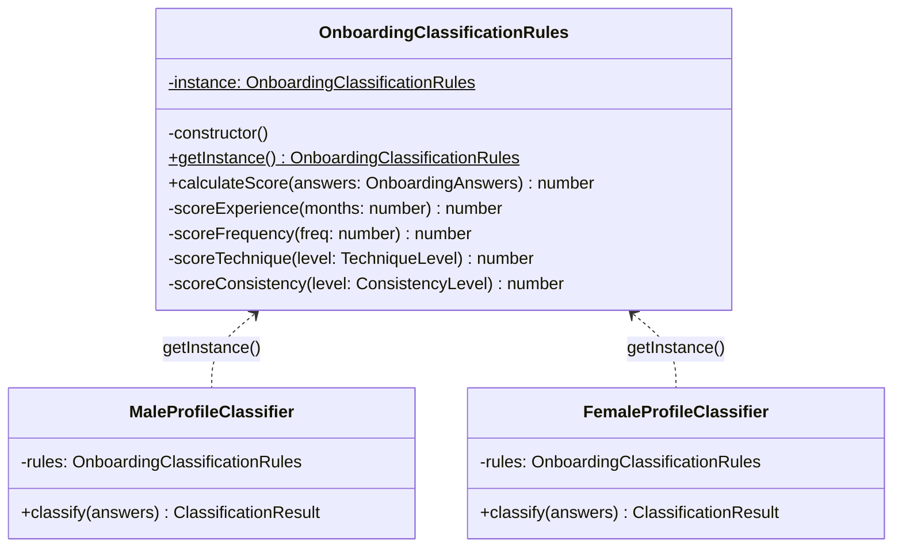

# 3.1. GoFs Criacionais

## Introdução

Os padrões criacionais tratam do processo de criação de objetos, abstraindo a lógica de instanciação e permitindo que o sistema seja independente de como seus objetos são criados, compostos e representados.

Este documento reúne as contribuições de **todos os módulos do projeto**. Cada seção identifica o módulo, o integrante responsável e o padrão GoF aplicado. As seções sinalizadas como **"a preencher"** aguardam a contribuição dos demais membros — siga a estrutura da seção de Onboarding como referência.

---

## Módulo de Onboarding

> **Responsável:** Lucas Antunes | **Branch:** `feat/modulo-on-boarding`
>
> Contexto: o desafio criacional era garantir que as **regras de classificação de perfil** tivessem uma única fonte de verdade em toda a aplicação, sem que diferentes partes do código pudessem criar instâncias divergentes com comportamentos distintos.

### Padrões analisados

| Padrão           | Possível aplicação                          | Status          | Justificativa                                                                               |
|------------------|---------------------------------------------|-----------------|---------------------------------------------------------------------------------------------|
| **Singleton**    | Instância única das regras de classificação | Selecionado     | Regras de negócio imutáveis, acesso global necessário em múltiplos classificadores          |
| Factory Method   | Criação de classificadores por sexo         | Avaliado        | Substituído pelo Bridge, que resolve também o problema de variação de comportamento         |
| Abstract Factory | Família de objetos de classificação         | Não selecionado | Complexidade desnecessária; o Bridge cobre a variação sem multiplicar famílias de factories |
| Builder          | Construção de `OnboardingAnswers`           | Avaliado        | Value Object com validação inline é suficiente; Builder adicionaria indireção sem ganho     |
| Prototype        | Clonagem de perfis ao refazer onboarding    | Não selecionado | O Memento cobre a necessidade de preservar estado anterior de forma mais semântica          |

### Padrão implementado — Singleton · `OnboardingClassificationRules`

## Problema arquitetural

O módulo de classificação de perfil possui dois classificadores independentes: `MaleProfileClassifier` e `FemaleProfileClassifier`. Ambos precisam executar **exatamente o mesmo algoritmo de pontuação** — a lógica de atribuição de pontos por experiência, frequência, técnica, consistência etc. é idêntica; o que difere é apenas o fluxo de execução (Bridge).

Se cada classificador instanciasse seu próprio objeto de regras, haveria dois problemas concretos:

1. **Inconsistência silenciosa**: qualquer alteração nas regras de pontuação precisaria ser replicada em múltiplos lugares. Uma divergência geraria classificações diferentes para homens e mulheres com respostas idênticas — um bug difícil de rastrear.
2. **Overhead de memória desnecessário**: as regras são stateless e imutáveis após criação. Criar múltiplas instâncias seria desperdício sem nenhum ganho.

## Justificativa da escolha

O Singleton garante que exista **uma única instância** de `OnboardingClassificationRules` em toda a execução da aplicação. Isso resolve os dois problemas:

- **Fonte única de verdade**: qualquer mudança nas regras de pontuação impacta todos os classificadores automaticamente.
- **Acesso controlado**: a instância é obtida via `getInstance()`, tornando explícito no código que se trata de um recurso compartilhado.
- **Imutabilidade garantida**: a instância não expõe estado mutável; `calculateScore()` é uma função pura que recebe `OnboardingAnswers` e retorna um número.

A alternativa de injeção de dependência via NestJS foi avaliada, mas as regras de classificação pertencem à **camada de domínio** e não devem depender do container IoC da infraestrutura. O Singleton de domínio mantém essa independência.

## Modelagem



## Implementação

| Elemento                             | Caminho                                                                                 |
|--------------------------------------|-----------------------------------------------------------------------------------------|
| Singleton (regras)                   | `backend/src/domain/onboarding/rules/onboarding-classification-rules.singleton.ts`      |
| Consumidor — classificador masculino | `backend/src/domain/onboarding/bridge/male-profile-classifier.ts`                       |
| Consumidor — classificador feminino  | `backend/src/domain/onboarding/bridge/female-profile-classifier.ts`                     |
| Testes unitários                     | `backend/src/domain/onboarding/rules/onboarding-classification-rules.singleton.spec.ts` |

### Trecho central

```typescript
// onboarding-classification-rules.singleton.ts
export class OnboardingClassificationRules {
  private static instance: OnboardingClassificationRules;

  private constructor() {}

  static getInstance(): OnboardingClassificationRules {
    if (!OnboardingClassificationRules.instance) {
      OnboardingClassificationRules.instance = new OnboardingClassificationRules();
    }
    return OnboardingClassificationRules.instance;
  }

  calculateScore(answers: OnboardingAnswers): number {
    return (
      this.scoreExperience(answers.experienceMonths) +
      this.scoreFrequency(answers.weeklyFrequency) +
      (answers.followedStructuredPlan ? 1 : 0) +
      this.scoreTechnique(answers.techniqueLevel) +
      (answers.usesProgressiveLoad ? 1 : 0) +
      this.scoreConsistency(answers.recentConsistency)
    );
  }
  // ...
}

// male-profile-classifier.ts — consumo do Singleton
export class MaleProfileClassifier implements ProfileClassifier {
  private readonly rules = OnboardingClassificationRules.getInstance();

  classify(answers: OnboardingAnswers): ClassificationResult {
    const score = this.rules.calculateScore(answers);
    return ClassificationResult.create(score);
  }
}
```

## Evidência de execução

Os testes unitários verificam a propriedade fundamental do Singleton:

```
✓ getInstance() retorna sempre a mesma instância
✓ score mínimo (todas as respostas mais baixas) = 0
✓ score máximo (todas as respostas mais altas) = 10
✓ experiência < 6 meses contribui com 0 pontos
✓ experiência 6–18 meses contribui com 1 ponto
✓ perfil intermediário produz score = 6
```

Execute no container:

```bash
sudo docker compose exec api npx jest onboarding-classification-rules --verbose
```

## Rastreabilidade

| Artefato                          | Relação                                                     |
|-----------------------------------|-------------------------------------------------------------|
| Requisito                         | Classificar usuário em BEGINNER / INTERMEDIATE / ADVANCED   |
| Módulo                            | `domain/onboarding/rules`                                   |
| Camada                            | Domínio                                                     |
| Padrão estrutural relacionado     | Bridge (classificadores consomem o Singleton)               |
| Padrão comportamental relacionado | Memento (usa `ClassificationResult` produzido pelas regras) |
| Arquivo de testes                 | `rules/onboarding-classification-rules.singleton.spec.ts`   |

## Senso crítico

### Benefícios

- **Consistência garantida em tempo de compilação**: ambos os classificadores chamam `getInstance()` — é impossível apontar para instâncias diferentes por acidente.
- **Domínio puro**: a classe não tem dependência de framework (zero imports de NestJS ou TypeORM), o que a torna testável de forma isolada com `jest` sem nenhum mock de infraestrutura.
- **Algoritmo centralizado**: quando as regras de negócio mudarem (ex.: reponderar a frequência), há um único lugar para alterar.

### Limitações

- **Testabilidade do Singleton em si**: como a instância persiste entre testes no mesmo processo Jest, é necessário garantir que os testes não dependam de estado mutável — o que é satisfeito aqui pela natureza stateless da classe.
- **Sem injeção de dependência formal**: em cenários onde as regras precisassem variar por configuração de ambiente (ex.: regras A/B), o Singleton seria inflexível. Para o escopo atual, isso não se aplica.

### Alternativas consideradas

- **Service NestJS com `@Injectable({ scope: Scope.DEFAULT })`**: o comportamento seria similar (instância única no container), mas acoplaria o domínio ao framework. Rejeitado.
- **Objeto literal / módulo ES**: funciona, mas perde a semântica de classe e dificulta extensão futura. Rejeitado.

## Referências

- GAMMA, E. et al. *Design Patterns: Elements of Reusable Object-Oriented Software*. Addison-Wesley, 1994. Cap. 3 — Creational Patterns, Singleton, p. 127–136.
- MARTIN, R. C. *Clean Architecture*. Prentice Hall, 2017. Cap. 22 — The Clean Architecture.

---

## [Módulo: ____________] — A preencher

> **Responsável:** [Nome do membro] | **Branch:** [nome da branch]

!!! warning "Seção pendente"
    Esta seção aguarda a contribuição do responsável pelo módulo.
    Siga a estrutura da seção **Módulo de Onboarding** acima como referência:

    1. **Padrões analisados** — tabela com os padrões GoF avaliados e justificativa da escolha
    2. **Padrão implementado** — nome e identificador central (ex.: classe ou interface principal)
    3. **Problema arquitetural** — o problema concreto que motivou o uso do padrão
    4. **Justificativa da escolha** — por que este padrão e não as alternativas avaliadas
    5. **Modelagem** — diagrama Mermaid (`classDiagram` ou `sequenceDiagram`)
    6. **Implementação** — tabela de arquivos + trechos de código comentados
    7. **Evidência de execução** — resultados de testes ou saída de comandos no container
    8. **Rastreabilidade** — elos com requisitos, camadas e outros padrões GoF do projeto
    9. **Senso crítico** — benefícios, limitações e alternativas consideradas
    10. **Referências** — bibliográficas (ABNT ou formato GoF)

## Histórico de versões

| Versão | Data       | Descrição                                                                          | Autor         |
|--------|------------|------------------------------------------------------------------------------------|---------------|
| 1.0    | 19/05/2026 | Documentação do padrão Singleton do módulo de onboarding (regras de classificação) | Lucas Antunes |
