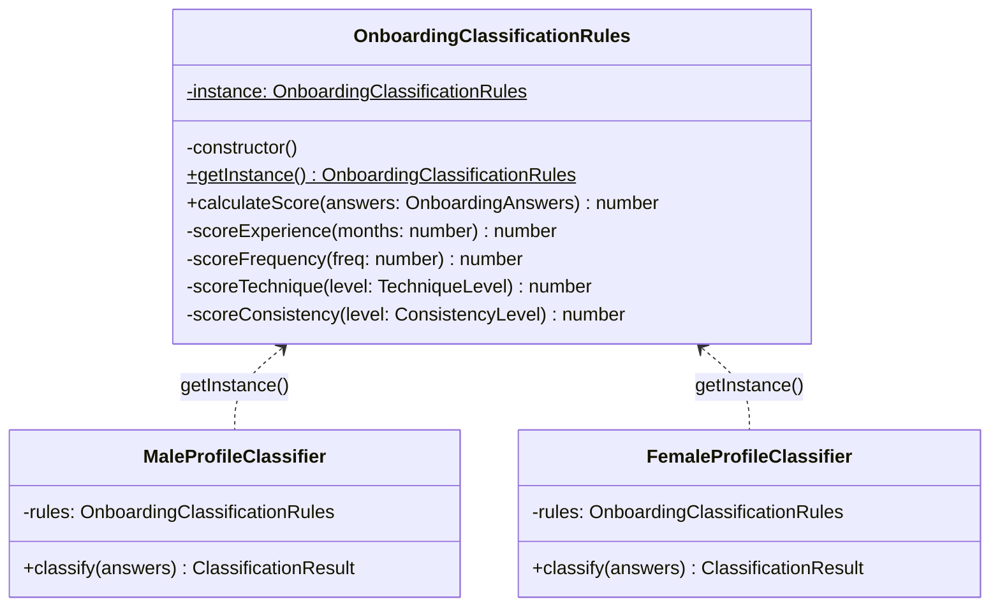
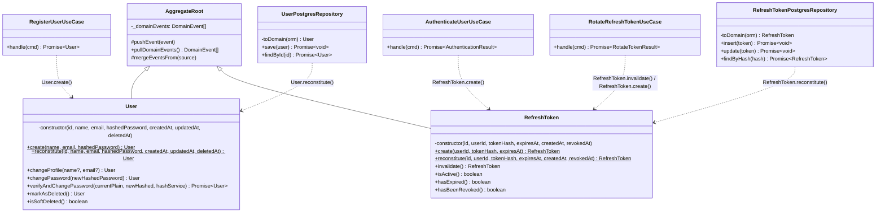
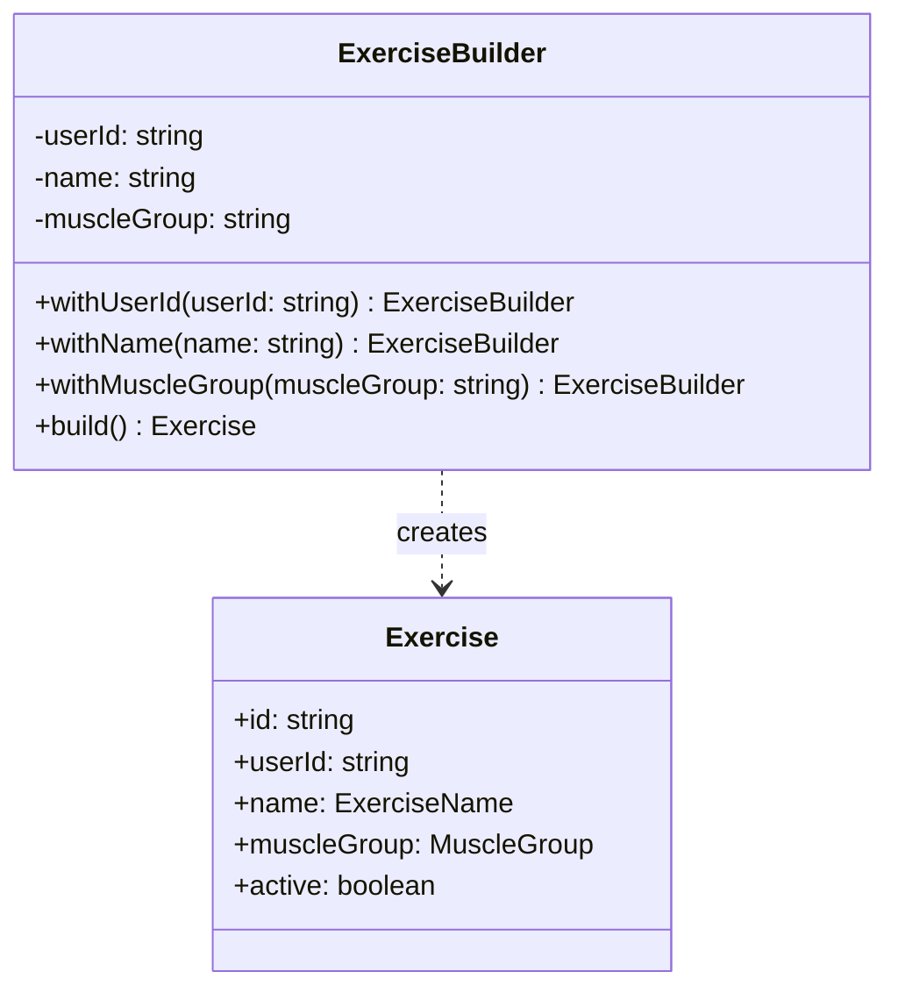

# 3.1. GoFs Criacionais

## Introdução

Os padrões criacionais tratam do processo de criação de objetos, abstraindo a lógica de instanciação e permitindo que o sistema seja independente de como seus objetos são criados, compostos e representados.

Este documento reúne as contribuições de **todos os módulos do projeto**. Cada seção identifica o módulo, o integrante responsável e o padrão GoF aplicado. As seções sinalizadas como **“a preencher”** aguardam a contribuição dos demais membros — siga a estrutura da seção de Onboarding como referência.

---

## Módulo de Onboarding

> **Responsável:** Lucas Antunes | **Branch:** `feat/modulo-on-boarding`
>
> Contexto: o desafio criacional era garantir que as **regras de classificação de perfil** tivessem uma única fonte de verdade em toda a aplicação, sem que diferentes partes do código pudessem criar instâncias divergentes com comportamentos distintos.

### Padrões analisados

| Padrão           | Possível aplicação                          | Status          | Justificativa                                                                               |
| ---------------- | ------------------------------------------- | --------------- | ------------------------------------------------------------------------------------------- |
| **Singleton**    | Instância única das regras de classificação | Selecionado     | Regras de negócio imutáveis, acesso global necessário em múltiplos classificadores          |
| Factory Method   | Criação de classificadores por sexo         | Avaliado        | Substituído pelo Bridge, que resolve também o problema de variação de comportamento         |
| Abstract Factory | Família de objetos de classificação         | Não selecionado | Complexidade desnecessária; o Bridge cobre a variação sem multiplicar famílias de factories |
| Builder          | Construção de `OnboardingAnswers`           | Avaliado        | Value Object com validação inline é suficiente; Builder adicionaria indireção sem ganho     |
| Prototype        | Clonagem de perfis ao refazer onboarding    | Não selecionado | O Memento cobre a necessidade de preservar estado anterior de forma mais semântica          |

### Padrão implementado — Singleton - `OnboardingClassificationRules`

### Problema arquitetural

O módulo de classificação de perfil possui dois classificadores independentes: `MaleProfileClassifier` e `FemaleProfileClassifier`. Ambos precisam executar **exatamente o mesmo algoritmo de pontuação** — a lógica de atribuição de pontos por experiência, frequência, técnica, consistência etc. é idêntica; o que difere é apenas o fluxo de execução (Bridge).

Se cada classificador instanciasse seu próprio objeto de regras, haveria dois problemas concretos:

1. **Inconsistência silenciosa**: qualquer alteração nas regras de pontuação precisaria ser replicada em múltiplos lugares. Uma divergência geraria classificações diferentes para homens e mulheres com respostas idênticas — um bug difícil de rastrear.
2. **Overhead de memória desnecessário**: as regras são stateless e imutáveis após criação. Criar múltiplas instâncias seria desperdício sem nenhum ganho.

### Justificativa da escolha

O Singleton garante que exista **uma única instância** de `OnboardingClassificationRules` em toda a execução da aplicação. Isso resolve os dois problemas:

- **Fonte única de verdade**: qualquer mudança nas regras de pontuação impacta todos os classificadores automaticamente.
- **Acesso controlado**: a instância é obtida via `getInstance()`, tornando explícito no código que se trata de um recurso compartilhado.
- **Imutabilidade garantida**: a instância não expõe estado mutável; `calculateScore()` é uma função pura que recebe `OnboardingAnswers` e retorna um número.

A alternativa de injeção de dependência via NestJS foi avaliada, mas as regras de classificação pertencem à **camada de domínio** e não devem depender do container IoC da infraestrutura. O Singleton de domínio mantém essa independência.

### Modelagem



### Implementação

| Elemento                             | Caminho                                                                                 |
| ------------------------------------ | --------------------------------------------------------------------------------------- |
| Singleton (regras)                   | `backend/src/domain/onboarding/rules/onboarding-classification-rules.singleton.ts`      |
| Consumidor — classificador masculino | `backend/src/domain/onboarding/bridge/male-profile-classifier.ts`                       |
| Consumidor — classificador feminino  | `backend/src/domain/onboarding/bridge/female-profile-classifier.ts`                     |
| Testes unitários                     | `backend/src/domain/onboarding/rules/onboarding-classification-rules.singleton.spec.ts` |

#### Trecho central

```typescript
// onboarding-classification-rules.singleton.ts
export class OnboardingClassificationRules {
  private static instance: OnboardingClassificationRules;

  private constructor() {}

  static getInstance(): OnboardingClassificationRules {
    if (!OnboardingClassificationRules.instance) {
      OnboardingClassificationRules.instance =
        new OnboardingClassificationRules();
    }
    return OnboardingClassificationRules.instance;
  }

  calculateScore(answers: OnboardingAnswers): number {
    return (
      this.scoreExperience(answers.experienceMonths) +
      this.scoreFrequency(answers.weeklyFrequency) +
      (answers.followedStructuredPlan ? 1 : 0) +
      this.scoreTechnique(answers.techniqueLevel) +
      (answers.usesProgressiveLoad ? 1 : 0) +
      this.scoreConsistency(answers.recentConsistency)
    );
  }
  // ...
}

// male-profile-classifier.ts — consumo do Singleton
export class MaleProfileClassifier implements ProfileClassifier {
  private readonly rules = OnboardingClassificationRules.getInstance();

  classify(answers: OnboardingAnswers): ClassificationResult {
    const score = this.rules.calculateScore(answers);
    return ClassificationResult.create(score);
  }
}
```

### Evidência de execução

Os testes unitários verificam a propriedade fundamental do Singleton:

```
✓ getInstance() retorna sempre a mesma instância
✓ score mínimo (todas as respostas mais baixas) = 0
✓ score máximo (todas as respostas mais altas) = 10
✓ experiência < 6 meses contribui com 0 pontos
✓ experiência 6–18 meses contribui com 1 ponto
✓ perfil intermediário produz score = 6
```

Execute no container:

```bash
sudo docker compose exec api npx jest onboarding-classification-rules --verbose
```

### Rastreabilidade

| Artefato                          | Relação                                                     |
| --------------------------------- | ----------------------------------------------------------- |
| Requisito                         | Classificar usuário em BEGINNER / INTERMEDIATE / ADVANCED   |
| Módulo                            | `domain/onboarding/rules`                                   |
| Camada                            | Domínio                                                     |
| Padrão estrutural relacionado     | Bridge (classificadores consomem o Singleton)               |
| Padrão comportamental relacionado | Memento (usa `ClassificationResult` produzido pelas regras) |
| Arquivo de testes                 | `rules/onboarding-classification-rules.singleton.spec.ts`   |

### Senso crítico

#### Benefícios

- **Consistência garantida em tempo de compilação**: ambos os classificadores chamam `getInstance()` — é impossível apontar para instâncias diferentes por acidente.
- **Domínio puro**: a classe não tem dependência de framework (zero imports de NestJS ou TypeORM), o que a torna testável de forma isolada com `jest` sem nenhum mock de infraestrutura.
- **Algoritmo centralizado**: quando as regras de negócio mudarem (ex.: reponderar a frequência), há um único lugar para alterar.

#### Limitações

- **Testabilidade do Singleton em si**: como a instância persiste entre testes no mesmo processo Jest, é necessário garantir que os testes não dependam de estado mutável — o que é satisfeito aqui pela natureza stateless da classe.
- **Sem injeção de dependência formal**: em cenários onde as regras precisassem variar por configuração de ambiente (ex.: regras A/B), o Singleton seria inflexível. Para o escopo atual, isso não se aplica.

#### Alternativas consideradas

- **Service NestJS com `@Injectable({ scope: Scope.DEFAULT })`**: o comportamento seria similar (instância única no container), mas acoplaria o domínio ao framework. Rejeitado.
- **Objeto literal / módulo ES**: funciona, mas perde a semântica de classe e dificulta extensão futura. Rejeitado.

### Referências

- GAMMA, E. et al. _Design Patterns: Elements of Reusable Object-Oriented Software_. Addison-Wesley, 1994. Cap. 3 — Creational Patterns, Singleton, p. 127–136.
- MARTIN, R. C. _Clean Architecture_. Prentice Hall, 2017. Cap. 22 — The Clean Architecture.

---

## Módulo de Autenticação

**Responsável:** Samuel Nogueira Caetano | **Branch:** `main (integrada a partir da feat/modulo-autenticacao)`

**Contexto:** o desafio criacional era separar a **lógica de construção** das entidades de domínio (`User` e `RefreshToken`) da lógica de uso, garantindo que eventos de domínio só fossem emitidos em criações legítimas — e nunca durante reconstituições a partir do banco de dados — sem expor construtores públicos que permitissem contornar essa distinção.

### Padrões analisados

| Padrão               | Possível aplicação                                    | Status          | Justificativa                                                                                                                                                                              |
| -------------------- | ----------------------------------------------------- | --------------- | ------------------------------------------------------------------------------------------------------------------------------------------------------------------------------------------ |
| **Factory Method**   | Criação e reconstituição de `User` e `RefreshToken`   | Selecionado     | Separa semanticamente a criação (com efeitos colaterais e emissão de eventos) da reconstituição (sem efeitos), mantendo o construtor privado e as invariantes encapsuladas.                |
| **Abstract Factory** | Família de objetos de autenticação                    | Não selecionado | Os objetos não são criados juntos de forma coordenada; cada caso de uso instancia individualmente apenas o que precisa, eliminando a necessidade de uma factory abstrata.                  |
| **Builder**          | Construção incremental de `User` com campos opcionais | Avaliado        | O conjunto de campos estruturais é fixo e as validações ocorrem de forma inline nos Value Objects; o Builder adicionaria indireção sem ganho real de clareza.                              |
| **Prototype**        | Clonagem de entidades para mutações imutáveis         | Não selecionado | As mutações imutáveis (`changeProfile()`, `changePassword()`, `invalidate()`) já geram e retornam novas instâncias de forma atômica internamente, tornando a clonagem genérica redundante. |
| **Singleton**        | Instância única de serviços de domínio                | Não selecionado | Os serviços de suporte (`HashService`, `TokenService`) são gerenciados diretamente pelo contêiner IoC do NestJS; o domínio não necessita de Singletons próprios.                           |

### Padrão implementado — Factory Method - `User.create()` / `User.reconstitute()` - `RefreshToken.create()` / `RefreshToken.reconstitute()`

### Problema arquitetural

As entidades `User` e `RefreshToken` precisam ser instanciadas em dois contextos fundamentalmente distintos dentro do ciclo de vida da aplicação:

1. **Criação genuína**: ocorre quando um novo usuário se registra ou um novo token de acesso/sessão é emitido pela primeira vez. Neste cenário, a entidade deve gerar um novo identificador único estável (UUID), registrar os timestamps correntes e publicar os eventos de domínio correspondentes (`UserRegisteredEvent`) para que outras camadas ou sub-sistemas reajam.
2. **Reconstituição a partir da persistência**: ocorre quando o repositório lê os registros armazenados no banco de dados PostgreSQL e precisa reconstruir o objeto correspondente em memória. Neste cenário, **nenhum evento de domínio deve ser gerado**, o UUID e os timestamps originais devem ser preservados e nenhuma validação de integridade de primeiro ciclo deve ser disparada novamente.

Se o construtor das classes fosse público e único, qualquer chamador poderia instanciar uma entidade contornando essas restrições, gerando riscos severos de bugs silenciosos — como repositórios disparando eventos de criação duplicados ao realizar leituras comuns do banco, ou casos de uso esquecendo de inicializar eventos obrigatórios.

### Justificativa da escolha

O padrão Factory Method resolve o problema arquitetural ao encapsular o construtor sob visibilidade privada e expor **dois métodos estáticos com semânticas explicitamente distintas**:

- `create(...)` — para criação de novas entidades, contendo a geração automática de identidades, data de criação e o push do evento no array interno.
- `reconstitute(...)` — para hidratação segura a partir do repositório, recebendo o estado primitivo exato do banco de dados e suspendendo qualquer efeito colateral.

A imposição do construtor privado torna essa distinção obrigatória pelo compilador e pelo runtime, impedindo falhas por esquecimento técnico. A alternativa de utilizar um construtor público parametrizado por uma flag booleana (`isNew: boolean`) foi rejeitada por configurar o anti-padrão _flag argument_, o qual reduz a legibilidade da API e transfere uma responsabilidade crítica de controle de estado para o chamador externo.

### Modelagem



### Implementação

| Elemento                                    | Papel no Factory Method                                                                                               | Caminho                                                            |
| ------------------------------------------- | --------------------------------------------------------------------------------------------------------------------- | ------------------------------------------------------------------ |
| `User.create()`                             | Factory de criação genuína — centraliza a geração de IDs, timestamps iniciais e o acúmulo de `UserRegisteredEvent`.   | `src/domain/entities/user.entity.ts`                               |
| `User.reconstitute()`                       | Factory de reconstituição — restaura o estado persistido sem gerar novos IDs ou disparar eventos de negócio.          | `src/domain/entities/user.entity.ts`                               |
| `RefreshToken.create()`                     | Factory de criação de sessão — realiza a checagem formal do formato do `userId` e inicializa o ciclo do token.        | `src/domain/entities/refresh-token.entity.ts`                      |
| `RefreshToken.reconstitute()`               | Factory de reconstituição de sessão — recria instâncias em memória preservando datas passadas e estados de revogação. | `src/domain/entities/refresh-token.entity.ts`                      |
| `UserPostgresRepository.toDomain()`         | Consumidor exclusivo de reconstituição para mapeamento da camada de dados (`UserOrmEntity`) para o domínio.           | `src/infrastructure/database/user.postgres-repository.ts`          |
| `RefreshTokenPostgresRepository.toDomain()` | Consumidor de reconstituição para hidratação de tokens a partir da tabela física `refresh_tokens`.                    | `src/infrastructure/database/refresh-token.postgres-repository.ts` |
| `RegisterUserUseCase`                       | Cliente da factory de criação legítima durante o fluxo de inscrição de novos usuários na aplicação.                   | `src/application/use-cases/auth/register-user.use-case.ts`         |
| `AuthenticateUserUseCase`                   | Cliente da factory de criação legítima no momento de geração de novos tokens criptográficos em logins com sucesso.    | `src/application/use-cases/auth/authenticate-user.use-case.ts`     |

#### Trechos centrais

```typescript
// ==========================================
// ENTIDADES DE DOMÍNIO (CONSTRUTORES PRIVADOS)
// ==========================================

// user.entity.ts
export class User extends AggregateRoot {
  private constructor(
    public readonly id: string,
    public readonly name: PersonName,
    public readonly email: Email,
    public readonly hashedPassword: HashedPassword,
    public readonly createdAt: Timestamp,
    public readonly updatedAt: Timestamp,
    public readonly deletedAt: Timestamp | null = null,
  ) { super(); }

  static create(name: PersonName, email: Email, hashedPassword: HashedPassword): User {
    const now  = Timestamp.now();
    const user = new User(UserId.create().toString(), name, email, hashedPassword, now, now);
    user.pushEvent(new UserRegisteredEvent(user.id, email.toString(), now.toDate()));
    return user;
  }

  static reconstitute(
    id: string, name: PersonName, email: Email, hashedPassword: HashedPassword,
    createdAt: Timestamp, updatedAt: Timestamp, deletedAt: Timestamp | null,
  ): User {
    return new User(id, name, email, hashedPassword, createdAt, updatedAt, deletedAt);
  }
}

// refresh-token.entity.ts
export class RefreshToken extends AggregateRoot {
  private constructor(
    public readonly id: string,
    public readonly userId: string,
    public readonly tokenHash: TokenHash,
    public readonly expiresAt: ExpiresAt,
    public readonly createdAt: Timestamp,
    public readonly revokedAt: Timestamp | null = null,
  ) { super(); }

  static create(userId: string, tokenHash: TokenHash, expiresAt: ExpiresAt): RefreshToken {
    UserId.reconstitute(userId); // Validação de barreira do formato do ID
    return new RefreshToken(RefreshTokenId.create().toString(), userId, tokenHash, expiresAt, Timestamp.now());
  }

  static reconstitute(
    id: string, userId: string, tokenHash: TokenHash, expiresAt: ExpiresAt,
    createdAt: Timestamp, revokedAt: Timestamp | null,
  ): RefreshToken {
    return new RefreshToken(id, userId, tokenHash, expiresAt, createdAt, revokedAt);
  }
}

// ==========================================
// CASOS DE USO (CONSUMIDORES DE CREATE)
// ==========================================

// register-user.use-case.ts
const user = User.create(name, email, hashedPassword); // Dispara UserRegisteredEvent
await this.userRepository.save(user);

// authenticate-user.use-case.ts
const refreshToken = RefreshToken.create(user.id, tokenHash, expiresAt);
await this.refreshTokenRepository.insert(refreshToken);

// ==========================================
// REPOSITÓRIOS (CONSUMIDORES DE RECONSTITUTE)
// ==========================================

// user.postgres-repository.ts
private toDomain(orm: UserOrmEntity): User {
  return User.reconstitute(
    orm.id,
    PersonName.reconstitute(orm.name),
    Email.reconstitute(orm.email),
    HashedPassword.fromHash(orm.passwordHash),
    Timestamp.from(orm.createdAt),
    Timestamp.from(orm.updatedAt),
    orm.deletedAt ? Timestamp.from(orm.deletedAt) : null,
  );
}

// refresh-token.postgres-repository.ts
private toDomain(orm: RefreshTokenOrmEntity): RefreshToken {
  return RefreshToken.reconstitute(
    orm.id,
    orm.userId,
    TokenHash.from(orm.tokenHash),
    ExpiresAt.reconstitute(orm.expiresAt),
    Timestamp.from(orm.createdAt),
    orm.revokedAt ? Timestamp.from(orm.revokedAt) : null,
  );
}
```

### Evidência de execução

A separação lógica dos dois caminhos de instanciação é validada diretamente pela asserção do comportamento dos eventos internos nas baterias de testes unitários automatizados da aplicação:

```
✓ User.create() gera id UUID válido automaticamente
✓ User.create() acumula e expõe exatamente um UserRegisteredEvent
✓ User.reconstitute() não acumula nenhum evento de domínio em sua inicialização
✓ User.reconstitute() preserva fielmente o ID recebido sem substituições indesejadas
✓ RefreshToken.create() valida a integridade matemática do formato do campo userId
✓ RefreshToken.create() gera tokens identificadores UUID distintos a cada nova chamada
✓ RefreshToken.reconstitute() preserva o campo data de revogação nulo ou preenchido conforme persistência
```

Para reprodução local e validação completa dos comportamentos contratuais descritos:

```bash
sudo docker compose exec api npx jest user.entity refresh-token.entity --verbose
```

### Rastreabilidade

| Artefato                          | Relação                                                                                                                                            |
| --------------------------------- | -------------------------------------------------------------------------------------------------------------------------------------------------- |
| Requisito                         | Registrar usuários com identidade única; emitir eventos de domínio apenas em criações reais; emitir e invalidar sessões baseadas em tokens ativos. |
| Módulo                            | `domain/entities`                                                                                                                                  |
| Camada                            | Domínio (pureza arquitetural isolada de frameworks externos)                                                                                       |
| Padrão comportamental relacionado | Observer — o evento `UserRegisteredEvent` alimentado por `create()` é distribuído pelo barramento central `DomainEventBus`.                        |
| Padrão comportamental relacionado | Template Method — a rotina base `UseCase.execute()` gerencia o ciclo coordenado que drena os eventos produzidos pelas factories.                   |
| Padrão estrutural relacionado     | Decorator — a estrutura composta de `CachingUserRepository` e `LoggingUserRepository` envolve o acesso base que invoca o método de reconstituição. |
| Endpoints afetados                | `POST /v1/auth/signup` (aciona `User.create()`) e `POST /v1/auth/login` (aciona `RefreshToken.create()`).                                          |
| Arquivos de teste de cobertura    | `domain/entities/user.entity.spec.ts` · `domain/entities/refresh-token.entity.spec.ts`                                                             |

### Senso crítico

#### Benefícios

- **Blindagem em nível de compilação**: o bloqueio físico do construtor remove em definitivo a possibilidade de programadores instanciarem entidades de maneira inconsistente fora dos padrões estabelecidos da equipe.
- **Transparência e expressividade no código**: métodos como `User.create()` e `RefreshToken.reconstitute()` removem ambiguidades de leitura, expondo claramente a intenção de negócio aplicada.
- **Value Objects integrados como barreiras de proteção**: a execução de construtores de hidratação interna (como `UserId.reconstitute(userId)` em `RefreshToken.create()`) assegura que o domínio falhe imediatamente caso dados malformados tentem violar os limites operacionais da camada.

#### Limitações

- **Ausência de validação nativa de mutabilidade no TypeScript**: o modificador `private` nos construtores opera estritamente em tempo de compilação. Chamadores em JavaScript puro ou testes injetando dados via brechas de tipagem ainda poderiam contornar os caminhos se não houvesse o uso correto de checagem forte de tipos.
- **Silenciamento total de dados inconsistentes**: o método `reconstitute()` assume por design que os dados extraídos da base de persistência são válidos e confiáveis. Caso haja dados históricos corrompidos, o método não aplicará novas regras de validação dinâmicas, delegando essa consistência à gestão rigorosa de migrações no banco.

#### Alternativas consideradas

- **Construtor único parametrizado por Flag (`isNew`)**: avaliado e descartado por ferir a legibilidade do código (parâmetros booleanos obscuros) e transferir indevidamente a responsabilidade de gerenciar o fluxo interno para os chamadores.
- **Segregação em duas classes (`NewUser` e `ExistingUser`)**: cogitado para garantir tipos separados no compilador. Descartado no escopo atual devido à duplicação excessiva de código e complexidade nas assinaturas de retorno de repositórios e barramentos.

### Referências

- GAMMA, E. et al. _Design Patterns: Elements of Reusable Object-Oriented Software_. Addison-Wesley, 1994. Cap. 3 — Creational Patterns, Factory Method, p. 107–116.
- EVANS, E. _Domain-Driven Design: Tackling Complexity in the Heart of Software_. Addison-Wesley, 2003. Cap. 5 — A Model Expressed in Software (Entities, Factories).
- VERNON, V. _Implementing Domain-Driven Design_. Addison-Wesley, 2013. Cap. 7 — Aggregates.

---

## Módulo de Exercícios

> **Responsável:** Daniel Teles | **Branch:** `feature/exercise_module`
>
> Contexto: criar exercícios vinculados a um usuário de forma segura e validada, sem expor lógica de construção do agregado (validação de nome, grupo muscular opcional). O objetivo foi centralizar a construção do agregado e manter os use cases enxutos.

### Padrões analisados

| Padrão         | Possível aplicação                                         | Status      | Justificativa                                                                                    |
| -------------- | ---------------------------------------------------------- | ----------- | ------------------------------------------------------------------------------------------------ |
| **Builder**    | Construção de `Exercise` com validações e campos opcionais | Selecionado | Simplifica a criação no use case e garante VOs válidos antes de persistir                        |
| Factory Method | Criar a entidade via factory estática                      | Avaliado    | Menor benefício quando VOs exigem validação complexa; Builder oferece clareza fluente por etapas |

### Padrão implementado — Builder · `ExerciseBuilder`

### Problema arquitetural

O `CreateExerciseUseCase` precisava construir um `Exercise` garantindo: `userId` obrigatório, `name` válido e `muscleGroup` opcional validado como VO. Colocar essa validação inline no use case poluiria a camada de aplicação e duplicaria lógica em outros pontos consumidores.

### Justificativa da escolha

O `Builder` concentra a lógica de construção (`withUserId`, `withName`, `withMuscleGroup`, `build`) permitindo que o use case crie uma instância pronta para persistir com uma chamada fluente. Além disso, o Builder facilita a inclusão futura de presets e validações sem alterar o contrato do use case.

### Modelagem



### Implementação

| Elemento      | Caminho                                                                                 |
| ------------- | --------------------------------------------------------------------------------------- |
| Builder       | `backend/src/domain/exercises/builders/exercise.builder.ts`                             |
| Entidade      | `backend/src/domain/exercises/entities/exercise.entity.ts`                              |
| Value Objects | `backend/src/domain/exercises/value-objects/exercise-name.vo.ts` · `muscle-group.vo.ts` |
| Use Case      | `backend/src/application/use-cases/exercises/create-exercise.use-case.ts`               |

#### Trecho central

```typescript
// uso no use case
const exercise = new ExerciseBuilder()
  .withUserId(cmd.userId)
  .withName(cmd.name)
  .withMuscleGroup(cmd.muscleGroup)
  .build();

await this.exerciseRepository.save(exercise);
```

### Evidência de execução

Os testes do builder e a criação via e2e verificam que os exercícios são sempre instanciados em estado válido, não sendo possível persistir atributos inválidos devido às regras encapsuladas no builder.

```bash
docker compose exec api npx jest create-exercise --verbose
```

### Rastreabilidade

| Artefato                      | Relação                                                                                                                                          |
| ----------------------------- | ------------------------------------------------------------------------------------------------------------------------------------------------ |
| Requisito                     | RF13 — cadastrar exercício com nome obrigatório e grupo muscular opcional                                                                        |
| Use Case                      | `CreateExerciseUseCase`                                                                                                                          |
| Módulo                        | `domain/exercises` (Builder + VOs)                                                                                                               |
| Camada                        | Domínio                                                                                                                                          |
| Padrão estrutural relacionado | Decorator — `CachingExerciseRepository` e `LoggingExerciseRepository` envolvem o repositório base que persiste o agregado produzido pelo Builder |
| Arquivo de testes             | `domain/exercises/builders/exercise.builder.spec.ts`                                                                                             |

### Senso crítico

#### Benefícios

- **Imutabilidade e segurança**: garante que o agregado `Exercise` sempre nasça em um estado válido.
- **Leitura fluente**: melhora a leitura dos casos de uso, onde a criação passo a passo fica evidente (`withName`, `withMuscleGroup` etc.).
- **Desacoplamento**: remove a responsabilidade do construtor da entidade de lidar com valores default espalhados ou dependências adicionais, delegando ao Builder.

#### Limitações

- **Verbosidade**: para objetos com poucos atributos, criar um Builder pode parecer boilerplate desnecessário.
- **Crescimento do Builder**: caso a entidade cresça muito, o Builder acumulará muitos métodos.

#### Alternativas consideradas

- **Static Factory Method (`Exercise.create({... })`)**: descartado porque a criação se tornaria uma única assinatura muito grande, perdendo a modularidade da validação passo a passo (especialmente para campos opcionais como `muscleGroup`).

### Referências

- GAMMA, E. et al. _Design Patterns: Elements of Reusable Object-Oriented Software_. Addison-Wesley, 1994. Cap. 3 — Creational Patterns, Builder.

---

## [Módulo: ____________] — A preencher

> **Responsável:** [Nome do membro] | **Branch:** [nome da branch]

!!! warning “Seção pendente”

Esta seção aguarda a contribuição do responsável pelo módulo.

Siga a estrutura da seção **Módulo de Onboarding** acima como referência:

    1. **Padrões analisados** — tabela com os padrões GoF avaliados e justificativa da escolha
    2. **Padrão implementado** — nome e identificador central (ex.: classe ou interface principal)
    3. **Problema arquitetural** — o problema concreto que motivou o uso do padrão
    4. **Justificativa da escolha** — por que este padrão e não as alternativas avaliadas
    5. **Modelagem** — diagrama Mermaid (`classDiagram` ou `sequenceDiagram`)
    6. **Implementação** — tabela de arquivos + trechos de código comentados
    7. **Evidência de execução** — resultados de testes ou saída de comandos no container
    8. **Rastreabilidade** — elos com requisitos, camadas e outros padrões GoF do projeto
    9. **Senso crítico** — benefícios, limitações e alternativas consideradas
    10. **Referências** — bibliográficas (ABNT ou formato GoF)

---

# Histórico de versões

| Versão | Data       | Descrição                                                                                 | Autor                   |
| ------ | ---------- | ----------------------------------------------------------------------------------------- | ----------------------- |
| 1.0    | 19/05/2026 | Documentação do padrão Singleton do módulo de Onboarding (regras de classificação)        | Lucas Antunes           |
| 1.1    | 20/05/2026 | Documentação do padrão Factory Method do módulo de Autenticação (`User` e `RefreshToken`) | Samuel Nogueira Caetano |
| 1.2    | 20/05/2026 | Documentação do padrão Builder para o módulo de Exercises (criação de `Exercise`)         | Daniel Teles            |
