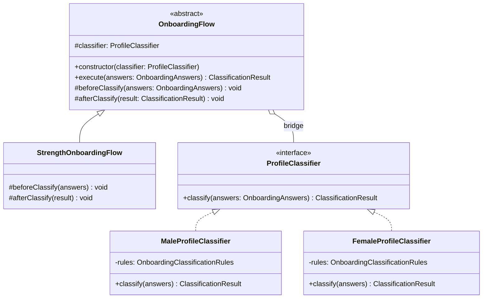
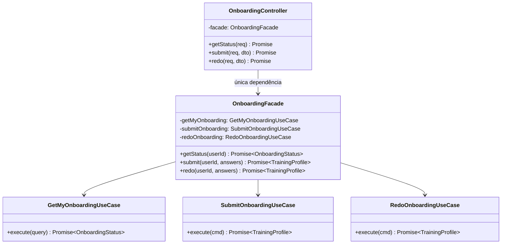
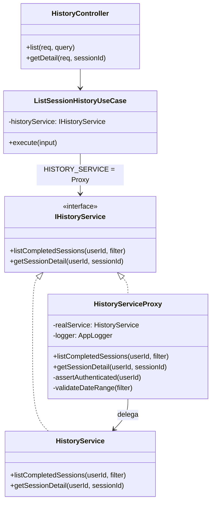
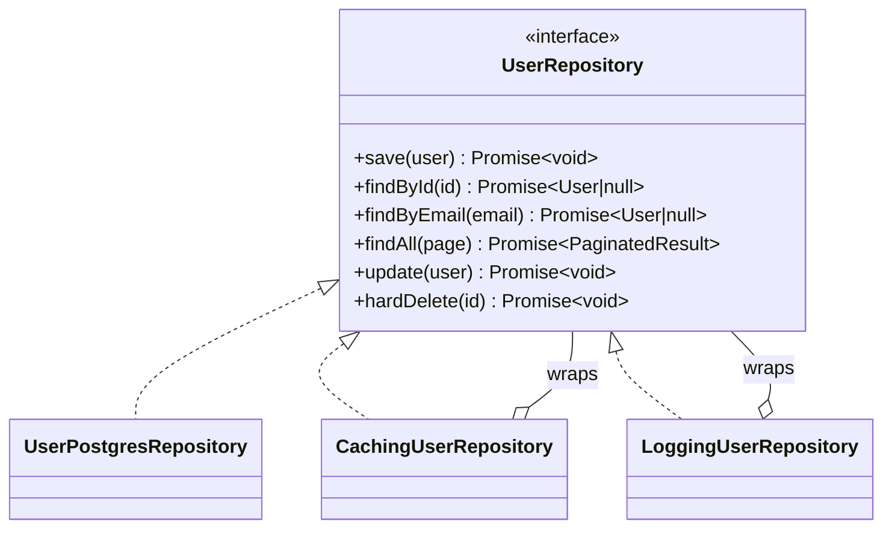
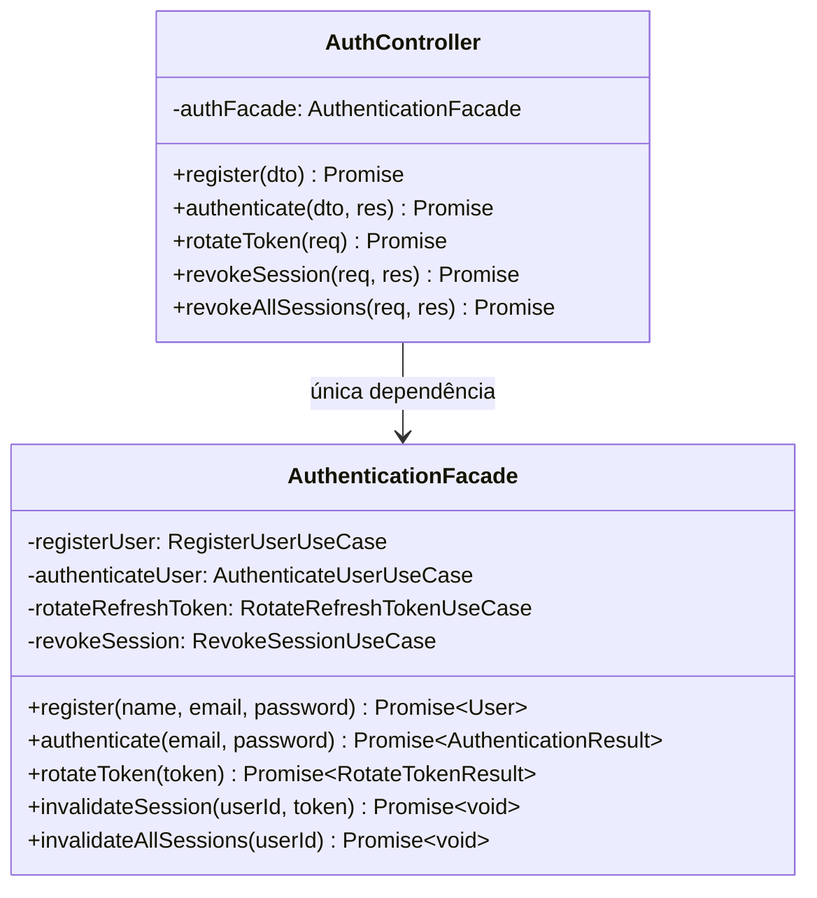
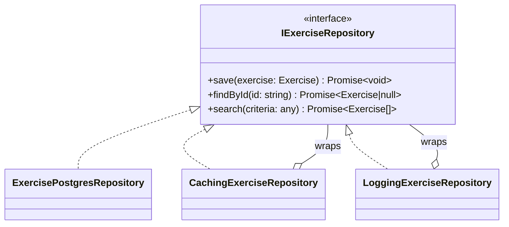

# 3.2. GoFs Estruturais

## Introdução

Os padrões estruturais tratam de como classes e objetos são compostos para formar estruturas maiores, mantendo flexibilidade e eficiência.

Este documento reúne as contribuições de **todos os módulos do projeto**. Cada seção identifica o módulo, o integrante responsável e o padrão GoF aplicado. As seções sinalizadas como **“a preencher”** aguardam a contribuição dos demais membros — siga a estrutura das seções já preenchidas como referência.

---

## Módulo de Onboarding

> **Responsável:** Lucas Antunes | **Branch:** `feat/modulo-on-boarding`
>
> Contexto: o desafio estrutural central era que **o fluxo de classificação de perfil precisa variar de acordo com o sexo biológico do usuário**, mas a lógica de orquestração do fluxo deve permanecer estável independentemente de qual classificador está em uso.

### Padrões analisados

| Padrão | Possível aplicação | Status | Justificativa |
|---|---|---|---|
| **Bridge** | Separar fluxo de classificação do classificador concreto | Selecionado | Permite variar hierarquia de fluxos e hierarquia de classificadores independentemente. |
| Decorator | Adicionar etapas ao fluxo de classificação | Avaliado | Útil para comportamentos opcionais em cadeia, mas o fluxo aqui tem estrutura fixa com hooks — Template Method via Bridge é mais claro. |
| Adapter | Adaptar classificadores externos | Não selecionado | Não há sistema legado a adaptar. |
| **Facade** | Simplificar acesso ao subsistema de onboarding | Implementado — ver seção abaixo | Único ponto de entrada da apresentação para os use cases; isola o controller do subsistema interno. |
| Composite | Compor múltiplas regras | Não selecionado | As regras são acumulativas; o Singleton de regras já as centraliza. |

### Padrão implementado — Bridge · `OnboardingFlow` + `ProfileClassifier`

#### Problema arquitetural

O requisito de negócio estabelece que **homens e mulheres passam por classificadores distintos**. Sem o Bridge, as alternativas seriam:

1. **Herança direta**: `MaleOnboardingFlow extends OnboardingFlow` e `FemaleOnboardingFlow extends OnboardingFlow`, cada um com o classificador embutido.
2. **Condicional em tempo de execução**: `if (sex === 'MALE') {... }` dentro do fluxo.

O Bridge resolve isso separando as duas hierarquias:

- **Abstração** (`OnboardingFlow`): orquestra o fluxo — `beforeClassify()`, `classify()`, `afterClassify()`.
- **Implementação** (`ProfileClassifier`): executa a classificação concreta de acordo com o perfil do usuário.

As duas hierarquias evoluem de forma independente: novos fluxos não exigem novos classificadores, e novos classificadores não exigem novos fluxos.

#### Justificativa da escolha

O Bridge foi escolhido porque o problema tem **duas dimensões de variação ortogonais**:

| Dimensão | Variações atuais | Variações futuras |
|---|---|---|
| **Fluxo** | `StrengthOnboardingFlow` | `EnduranceFlow`, `HypertrophyFlow` |
| **Classificador** | `MaleProfileClassifier`, `FemaleProfileClassifier` | Classificadores por faixa etária, por objetivo |

Qualquer combinação de fluxo × classificador funciona sem código adicional. O `SubmitOnboardingUseCase` seleciona o classificador com base no sexo e injeta no fluxo.

```typescript
const classifier =
  answers.sex === Sex.MALE
    ? new MaleProfileClassifier()
    : new FemaleProfileClassifier();

const flow = new StrengthOnboardingFlow(classifier);
return flow.execute(answers);
```

#### Modelagem



#### Implementação

| Elemento | Papel no Bridge | Caminho |
|---|---|---|
| `OnboardingFlow` | Abstração | `backend/src/domain/onboarding/bridge/onboarding-flow.abstract.ts` |
| `StrengthOnboardingFlow` | Abstração refinada | `backend/src/domain/onboarding/bridge/strength-onboarding-flow.ts` |
| `ProfileClassifier` | Interface da implementação | `backend/src/domain/onboarding/bridge/profile-classifier.interface.ts` |
| `MaleProfileClassifier` | Implementação concreta | `backend/src/domain/onboarding/bridge/male-profile-classifier.ts` |
| `FemaleProfileClassifier` | Implementação concreta | `backend/src/domain/onboarding/bridge/female-profile-classifier.ts` |
| `SubmitOnboardingUseCase` | Cliente que monta a ponte | `backend/src/application/onboarding/use-cases/submit-onboarding.use-case.ts` |
| Testes | Verificação da composição | `backend/src/domain/onboarding/bridge/classifiers.spec.ts` |

##### Trechos centrais

```typescript
// onboarding-flow.abstract.ts
export abstract class OnboardingFlow {
  constructor(protected readonly classifier: ProfileClassifier) {}

  execute(answers: OnboardingAnswers): ClassificationResult {
    this.beforeClassify(answers);
    const result = this.classifier.classify(answers);
    this.afterClassify(result);
    return result;
  }

  protected beforeClassify(_answers: OnboardingAnswers): void {}
  protected afterClassify(_result: ClassificationResult): void {}
}

// strength-onboarding-flow.ts
export class StrengthOnboardingFlow extends OnboardingFlow {
  protected override beforeClassify(answers: OnboardingAnswers): void {
    // validações específicas do fluxo de força, se houver
  }
}

// profile-classifier.interface.ts
export interface ProfileClassifier {
  classify(answers: OnboardingAnswers): ClassificationResult;
}

// male-profile-classifier.ts
export class MaleProfileClassifier implements ProfileClassifier {
  private readonly rules = OnboardingClassificationRules.getInstance();

  classify(answers: OnboardingAnswers): ClassificationResult {
    const score = this.rules.calculateScore(answers);
    return ClassificationResult.create(score);
  }
}
```

#### Evidência de execução

```text
✓ MaleProfileClassifier — score máximo (10) → ADVANCED
✓ MaleProfileClassifier — score mínimo (0) → BEGINNER
✓ FemaleProfileClassifier — score máximo (10) → ADVANCED
✓ FemaleProfileClassifier — score intermediário (6) → INTERMEDIATE
✓ StrengthOnboardingFlow com MaleProfileClassifier — execute() delega ao classificador
✓ StrengthOnboardingFlow com FemaleProfileClassifier — execute() delega ao classificador
```

Execute no container:

```bash
sudo docker compose exec api npx jest classifiers --verbose
```

#### Rastreabilidade

| Artefato | Relação |
|---|---|
| Requisito | Diferenciar homem e mulher no fluxo de classificação. |
| Módulo | `domain/onboarding/bridge` |
| Camada | Domínio |
| Padrão criacional relacionado | Singleton — classificadores usam `getInstance()`. |
| Padrão comportamental relacionado | Memento — fluxo produz `ClassificationResult` que é salvo antes do redo. |
| Use case consumidor | `application/onboarding/use-cases/submit-onboarding.use-case.ts` |

#### Senso crítico

##### Benefícios

- **Explosão de subclasses evitada**: novos fluxos e classificadores podem ser combinados sem multiplicar subclasses.
- **Testabilidade independente**: cada classificador é testável sem instanciar um fluxo; cada fluxo é testável com um mock de `ProfileClassifier`.
- **Open/Closed**: novos classificadores ou fluxos podem ser adicionados sem modificar código existente.

##### Limitações

- **Indireção extra**: para um caso com apenas dois classificadores, o Bridge pode parecer over-engineering.
- **Configuração do cliente**: quem instancia precisa conhecer as duas hierarquias para montar a combinação correta.

##### Alternativas consideradas

- **Strategy puro**: resolveria a variação de classificador, mas não encapsularia o protocolo de execução (`beforeClassify`/`afterClassify`).
- **Factory Method dentro do fluxo**: acoplaria as duas hierarquias, anulando o benefício principal do Bridge.

#### Referências

- GAMMA, E. et al. _Design Patterns: Elements of Reusable Object-Oriented Software_. Addison-Wesley, 1994. Cap. 4 — Structural Patterns, Bridge, p. 151–161.
- SHALLOWAY, A.; TROTT, J. _Design Patterns Explained_. Addison-Wesley, 2004. Cap. 11 — The Bridge Pattern.

---

### Padrão complementar — Facade · `OnboardingFacade`

#### Introdução

Além do Bridge, o módulo de onboarding implementa o padrão **Facade** na camada de apresentação. O Facade oferece uma interface simplificada para um conjunto de interfaces de um subsistema, tornando o subsistema mais fácil de usar.

Aqui ele atua como a única porta de entrada da camada de apresentação para toda a lógica de onboarding — o controller nunca chama use cases diretamente.

#### Problema arquitetural

O `OnboardingController` precisaria conhecer e instanciar três use cases distintos (`GetMyOnboardingUseCase`, `SubmitOnboardingUseCase`, `RedoOnboardingUseCase`) além de coordenar suas dependências.

Isso criaria dois problemas:

1. **Acoplamento da apresentação à aplicação**: o controller passaria a depender dos contratos internos de cada use case.
2. **Responsabilidade de orquestração no lugar errado**: a camada de apresentação não deve saber como o subsistema de onboarding é organizado internamente.

#### Justificativa da escolha

O `OnboardingFacade` concentra as três operações de onboarding em uma interface coesa de três métodos (`getStatus`, `submit`, `redo`). O controller depende exclusivamente dessa fachada — uma única dependência no lugar de três.

#### Modelagem



#### Implementação

| Elemento | Papel no Facade | Caminho |
|---|---|---|
| `OnboardingFacade` | Interface simplificada | `backend/src/presentation/facades/onboarding.facade.ts` |
| `GetMyOnboardingUseCase` | Consulta status | `backend/src/application/use-cases/onboarding/get-my-onboarding.use-case.ts` |
| `SubmitOnboardingUseCase` | Submete onboarding | `backend/src/application/use-cases/onboarding/submit-onboarding.use-case.ts` |
| `RedoOnboardingUseCase` | Refaz onboarding | `backend/src/application/use-cases/onboarding/redo-onboarding.use-case.ts` |
| `OnboardingController` | Cliente do Facade | `backend/src/presentation/controllers/onboarding.controller.ts` |

##### Trechos centrais

```typescript
// onboarding.facade.ts
export class OnboardingFacade {
  constructor(
    private readonly getMyOnboarding: GetMyOnboardingUseCase,
    private readonly submitOnboarding: SubmitOnboardingUseCase,
    private readonly redoOnboarding: RedoOnboardingUseCase,
  ) {}

  getStatus(userId: string): Promise<OnboardingStatus> {
    return this.getMyOnboarding.execute({ userId });
  }

  submit(
    userId: string,
    answers: OnboardingAnswersProps,
  ): Promise<TrainingProfile> {
    return this.submitOnboarding.execute({ userId, answers });
  }

  redo(
    userId: string,
    answers: OnboardingAnswersProps,
  ): Promise<TrainingProfile> {
    return this.redoOnboarding.execute({ userId, answers });
  }
}
```

#### Rastreabilidade

| Artefato | Relação |
|---|---|
| Módulo | `presentation/facades/` |
| Camada | Apresentação → Aplicação |
| Cliente | `presentation/controllers/onboarding.controller.ts` |
| Padrão estrutural relacionado | Bridge — acionado pelo `SubmitOnboardingUseCase` via Facade. |
| Padrão comportamental relacionado | Memento — acionado pelo `RedoOnboardingUseCase` via Facade. |

#### Senso crítico

##### Benefícios

- **Controller enxuto**: o controller possui uma única dependência injetada.
- **Isolamento de camadas**: a camada de apresentação não precisa conhecer a organização interna do subsistema.
- **Ponto único de refatoração**: se os use cases forem reorganizados, apenas o Facade é ajustado.

##### Limitações

- **Facade não valida**: a lógica de negócio permanece nos use cases.
- **Granularidade**: para subsistemas muito grandes, um único Facade pode crescer demais.

##### Alternativas consideradas

- **Injetar use cases diretamente no controller**: aumenta acoplamento.
- **Application Service**: semanticamente equivalente; a nomenclatura Facade foi mantida para alinhar com a disciplina.

#### Referências

- GAMMA, E. et al. _Design Patterns: Elements of Reusable Object-Oriented Software_. Addison-Wesley, 1994. Cap. 4 — Structural Patterns, Facade, p. 185–193.
- EVANS, E. _Domain-Driven Design_. Addison-Wesley, 2003. Cap. 4 — Isolating the Domain.

---

## Módulo de Histórico de Sessões

> **Responsável:** Giovanni Dornelas Ferreira | **Branch:** `feat/modulo-historico`
>
> Contexto: o histórico expõe operações sensíveis relacionadas aos dados de treino do usuário. O Proxy intercepta chamadas ao serviço real para **validar acesso, auditar logs e validar filtros** sem poluir a lógica de negócio.

### Padrões analisados

| Padrão | Possível aplicação | Status | Justificativa |
|---|---|---|---|
| **Proxy** | Intermediar `IHistoryService` | Selecionado | Controle transversal de acesso, logs e validação de datas transparente aos use cases. |
| Facade | Unificar listagem e detalhe | Avaliado | Controller já delega a use cases específicos; Proxy cobre o subsistema de serviço. |
| Decorator | Empilhar comportamentos no serviço | Avaliado | Proxy é mais adequado quando a interface é idêntica ao real e o objetivo é controlar acesso. |
| Adapter | Adaptar repositório legado | Não selecionado | Repositório TypeORM já segue contrato de domínio. |
| Bridge | Separar listagem de persistência | Não selecionado | Responsabilidades já estão separadas em serviço e repositório. |

### Padrão implementado — Proxy · `HistoryServiceProxy` → `HistoryService`

#### Problema arquitetural

Os use cases `ListSessionHistoryUseCase` e `GetSessionHistoryDetailUseCase` precisam de um serviço de histórico, mas **não devem** misturar:

1. **Regras de negócio**: consultar sessões concluídas, mapear DTOs e usar Multiton.
2. **Preocupações transversais**: garantir `userId` autenticado, validar intervalo de datas e registrar auditoria em log.

Sem Proxy, essas responsabilidades ficariam no `HistoryService` ou duplicadas em cada use case, violando Single Responsibility.

#### Justificativa da escolha

O Proxy implementa a mesma interface `IHistoryService` que o serviço real:

| Componente | Papel |
|---|---|
| `IHistoryService` | Contrato compartilhado |
| `HistoryService` | Serviço real — repositório, Multiton e mapeamento |
| `HistoryServiceProxy` | Intercepta chamadas, valida, registra log e delega ao real |

No NestJS, o token `HISTORY_SERVICE` resolve para o Proxy; use cases nunca injetam o serviço real diretamente.

#### Modelagem



#### Implementação

| Elemento | Papel no Proxy | Caminho |
|---|---|---|
| `IHistoryService` | Interface | `backend/src/domain/history/services/i-history.service.ts` |
| `HistoryService` | Real subject | `backend/src/application/services/history.service.ts` |
| `HistoryServiceProxy` | Proxy | `backend/src/infrastructure/services/history-service.proxy.ts` |
| Provider NestJS | Wiring | `backend/src/infrastructure/modules/history.module.ts` |
| Use cases | Clientes | `backend/src/application/use-cases/history/` |
| Controller | HTTP | `backend/src/presentation/controllers/history.controller.ts` |

##### Trechos centrais

```typescript
// history.module.ts
{
  provide: HISTORY_SERVICE,
  useFactory: (real: HistoryService, logger: AppLogger) =>
    new HistoryServiceProxy(real, logger),
  inject: [HistoryService, APP_LOGGER],
}

// history-service.proxy.ts
export class HistoryServiceProxy implements IHistoryService {
  constructor(
    private readonly realService: HistoryService,
    @Inject(APP_LOGGER) private readonly logger: AppLogger,
  ) {}

  async listCompletedSessions(
    authenticatedUserId: string,
    filter?: DateRangeFilter,
  ) {
    this.assertAuthenticated(authenticatedUserId);
    this.validateDateRange(filter);
    this.logger.log(`[HistoryProxy] Listagem — userId=${authenticatedUserId}`);
    return this.realService.listCompletedSessions(authenticatedUserId, filter);
  }
}
```

#### Evidência de execução

1. Registrar sessão e listar histórico com token válido → logs contêm `[HistoryProxy] Listagem`.
2. Chamar listagem com `startDate` posterior a `endDate` → resposta `400` com mensagem de intervalo inválido.
3. Swagger: tag **history** — `GET /v1/history/sessions` e `GET /v1/history/sessions/{sessionId}`.

```bash
curl -s -H "Authorization: Bearer TOKEN" \
  "http://localhost:3000/v1/history/sessions?startDate=2026-01-01T00:00:00.000Z&endDate=2026-12-31T23:59:59.999Z"
```

#### Rastreabilidade

| Artefato | Relação |
|---|---|
| Requisitos | RF26, RF27 |
| Módulo | `infrastructure/services/`, `application/services/` |
| Camada | Infraestrutura + Aplicação |
| Padrão criacional relacionado | Multiton — serviço real usa `HistoryManager.getInstance`. |
| Padrão comportamental relacionado | Observer — atualiza cache antes da leitura via Proxy. |
| Guard de apresentação | `BearerTokenGuard` — autenticação HTTP; Proxy valida `userId`. |

#### Senso crítico

##### Benefícios

- **Separação clara**: regras de listagem e detalhe permanecem no `HistoryService`; auditoria e validação ficam no Proxy.
- **Substituível**: pode-se adicionar cache ou rate limit no Proxy sem alterar use cases.
- **Testável**: o serviço real pode ser testado sem mocks de logger; o Proxy pode ser testado com mock do serviço real.

##### Limitações

- **Autenticação HTTP já existe**: o `BearerTokenGuard` já garante usuário logado; o Proxy reforça `userId` não vazio como defesa em profundidade.
- **Não é Proxy remoto**: trata-se de Proxy de proteção local.

##### Alternativas consideradas

- **Middleware NestJS global**: validaria HTTP, mas não encapsularia o contrato `IHistoryService`.
- **Decorator sobre `HistoryService`**: semanticamente próximo; Proxy foi escolhido por alinhar melhor ao controle de acesso ao serviço real.

#### Referências

- GAMMA, E. et al. _Design Patterns: Elements of Reusable Object-Oriented Software_. Addison-Wesley, 1994. Cap. 4 — Structural Patterns, Proxy, p. 207–213.
- FOWLER, M. _Patterns of Enterprise Application Architecture_. Addison-Wesley, 2002.

---

## Módulo de Autenticação

> **Responsável:** Samuel Nogueira Caetano | **Branch:** `main (integrada a partir da feat/modulo-autenticacao)`
>
> Contexto: o desafio estrutural central era que **o repositório de usuários precisa acumular comportamentos transversais, como cache e log, sem alterar a implementação de persistência**, e que **o controller de autenticação não deve conhecer a estrutura interna dos use cases** que compõem o fluxo de autenticação.

### Padrões analisados

| Padrão | Possível aplicação | Status | Justificativa |
|---|---|---|---|
| **Decorator** | Adicionar cache e log ao repositório de usuários sem alterar a implementação | Selecionado | Permite empilhar comportamentos transversais sobre `UserPostgresRepository` de forma independente e combinável. |
| **Facade** | Simplificar acesso ao subsistema de autenticação a partir do controller | Implementado — ver seção abaixo | Único ponto de entrada da apresentação para os use cases de auth. |
| Adapter | Adaptar a API do TypeORM à interface de domínio | Não selecionado | Os repositórios já traduzem ORM ↔ domínio internamente. |
| Proxy | Controlar acesso ou adiar carregamento do repositório | Não selecionado | O controle de acesso é feito por guards na camada de apresentação; o Decorator cobre os comportamentos transversais restantes. |
| Composite | Compor múltiplas regras de validação de token | Não selecionado | As validações são sequenciais e exclusivas. |

### Padrão implementado — Decorator · `CachingUserRepository` + `LoggingUserRepository`

#### Problema arquitetural

O `UserPostgresRepository` realiza I/O real com o banco em cada chamada. A aplicação precisava de dois comportamentos adicionais:

1. **Cache em memória** — evitar consultas repetidas ao banco para o mesmo `id` ou `email`.
2. **Log estruturado** — registrar início, conclusão e falha de cada operação, com `correlationId`, sem poluir a lógica de persistência.

Sem o Decorator, a lógica de cache e log ficaria embutida no repositório ou exigiria herança acoplada à implementação concreta de Postgres.

#### Justificativa da escolha

O Decorator foi escolhido porque os comportamentos a adicionar são **ortogonais à persistência** e **precisam ser combináveis independentemente**:

| Camada | Classe | Responsabilidade |
|---|---|---|
| Base | `UserPostgresRepository` | Persistência real com TypeORM |
| 1ª decoração | `CachingUserRepository` | Cache em memória |
| 2ª decoração | `LoggingUserRepository` | Log estruturado com correlationId |

```typescript
const base = new UserPostgresRepository(ormRepo);
const cached = new CachingUserRepository(base);
return new LoggingUserRepository(cached, logger);
```

#### Modelagem



#### Implementação

| Elemento | Papel no Decorator | Caminho |
|---|---|---|
| `UserRepository` | Interface do componente | `backend/src/domain/repositories/user.repository.ts` |
| `UserPostgresRepository` | Componente concreto | `backend/src/infrastructure/database/user.postgres-repository.ts` |
| `CachingUserRepository` | Decorator de cache | `backend/src/infrastructure/database/caching-user.repository.ts` |
| `LoggingUserRepository` | Decorator de log | `backend/src/infrastructure/database/logging-user.repository.ts` |
| `AuthModule` | Cliente que compõe a pilha | `backend/src/infrastructure/modules/auth.module.ts` |

#### Rastreabilidade

| Artefato | Relação |
|---|---|
| Requisito | Evitar consultas redundantes ao banco; manter log estruturado por operação. |
| Módulo | `infrastructure/database/` |
| Camada | Infraestrutura |
| Padrão comportamental relacionado | Observer — `DomainEventBus` consome eventos publicados após operações que passam por este repositório. |
| Padrão criacional relacionado | Factory Method — `User.reconstitute()` é chamado dentro de `toDomain()` no componente base. |
| Ponto de composição | `infrastructure/modules/auth.module.ts` |

#### Senso crítico

##### Benefícios

- **Responsabilidade única preservada**: cada classe tem um único motivo para mudar.
- **Combinação livre**: remover o cache em testes de integração exige trocar apenas a composição no módulo.
- **Transparência para os use cases**: os use cases recebem `UserRepository` e não conhecem as camadas decoradoras.

##### Limitações

- **Cache sem TTL**: o cache em memória não possui expiração.
- **Escopo por instância**: adequado para o projeto, mas exige mecanismo externo em deploy com múltiplas instâncias.

##### Alternativas consideradas

- **Herança com mixin**: criaria uma classe monolítica.
- **Proxy dinâmico com ES6 `Proxy`**: dificultaria a rastreabilidade estática em TypeScript.

#### Referências

- GAMMA, E. et al. _Design Patterns: Elements of Reusable Object-Oriented Software_. Addison-Wesley, 1994. Cap. 4 — Structural Patterns, Decorator, p. 175–184.
- MARTIN, R. C. _Agile Software Development: Principles, Patterns, and Practices_. Prentice Hall, 2002. Cap. 14 — The Open/Closed Principle.

---

### Padrão complementar — Facade · `AuthenticationFacade`

#### Introdução

Além do Decorator, o módulo de autenticação implementa o padrão **Facade** na camada de apresentação. Aqui ele atua como a única porta de entrada do `AuthController` para os use cases de autenticação — o controller nunca instancia nem referencia use cases diretamente.

#### Problema arquitetural

O `AuthController` precisaria depender de quatro use cases distintos (`RegisterUserUseCase`, `AuthenticateUserUseCase`, `RotateRefreshTokenUseCase`, `RevokeSessionUseCase`) e conhecer os tipos de entrada e saída de cada um, criando acoplamento da apresentação à aplicação.

#### Justificativa da escolha

O `AuthenticationFacade` expõe operações nomeadas de forma orientada ao negócio (`register`, `authenticate`, `rotateToken`, `invalidateSession`, `invalidateAllSessions`), traduzindo as chamadas em comandos específicos de cada use case.

#### Modelagem



#### Rastreabilidade

| Artefato | Relação |
|---|---|
| Módulo | `presentation/facades/` |
| Camada | Apresentação → Aplicação |
| Cliente | `presentation/controllers/auth.controller.ts` |
| Padrão estrutural relacionado | Decorator — o repositório consumido pelos use cases acionados pelo Facade é uma pilha de decoradores. |
| Padrão comportamental relacionado | Template Method — todos os use cases acionados pelo Facade estendem `UseCase<TInput, TOutput>`. |

#### Referências

- GAMMA, E. et al. _Design Patterns: Elements of Reusable Object-Oriented Software_. Addison-Wesley, 1994. Cap. 4 — Structural Patterns, Facade, p. 185–193.
- EVANS, E. _Domain-Driven Design_. Addison-Wesley, 2003. Cap. 4 — Isolating the Domain.

---

## Módulo de Exercícios

> **Responsável:** Daniel Teles | **Branch:** `feature/exercise_module`
>
> Contexto: melhorar observabilidade e desempenho do repositório de `Exercise` sem alterar o repositório base. O objetivo era registrar falhas e operações, além de adicionar cache em memória para leituras frequentes.

### Padrões analisados

| Padrão | Possível aplicação | Status | Justificativa |
|---|---|---|---|
| **Decorator** | Envolver `ExerciseRepository` com logging e caching | Selecionado | Permite adicionar comportamento sem modificar a implementação base. |
| Proxy | Controle de acesso ou lazy loading | Avaliado | Proxy cobre autenticação/controle; logging e cache são melhor tratados por decorators separados. |

### Padrão implementado — Decorator · `LoggingExerciseRepository` + `CachingExerciseRepository`

#### Problema arquitetural

Operações de leitura sobre `exercises` são frequentes e precisam ser auditáveis e rápidas. Modificar `ExercisePostgresRepository` diretamente para inserir logs e cache acoplaria a persistência a preocupações transversais.

#### Justificativa da escolha

O padrão Decorator permite empilhar comportamentos em camadas: a implementação base (`ExercisePostgresRepository`) permanece focada em persistência; `CachingExerciseRepository` adiciona cache; `LoggingExerciseRepository` adiciona logs e tratamento de erros com contexto.

#### Modelagem



#### Implementação

| Elemento | Papel no Decorator | Caminho |
|---|---|---|
| `IExerciseRepository` | Interface do componente | `backend/src/domain/repositories/exercise.repository.ts` |
| `ExercisePostgresRepository` | Componente concreto | `backend/src/infrastructure/database/exercise.postgres-repository.ts` |
| `CachingExerciseRepository` | Decorator de cache | `backend/src/infrastructure/database/caching-exercise.repository.ts` |
| `LoggingExerciseRepository` | Decorator de log | `backend/src/infrastructure/database/logging-exercise.repository.ts` |
| `ExerciseModule` | Cliente que compõe a pilha | `backend/src/infrastructure/modules/exercise.module.ts` |

##### Trecho central

```typescript
const base = new ExercisePostgresRepository(ormRepo);
const cached = new CachingExerciseRepository(base);
const logging = new LoggingExerciseRepository(cached, logger);
// exportado como EXERCISE_REPOSITORY → logging
```

#### Evidência de execução

Os logs aparecem no console do container indicando tempo de execução e sucesso das chamadas. O cache invalida ou usa dados em memória conforme necessário.

```bash
docker compose logs api
```

#### Rastreabilidade

| Artefato | Relação |
|---|---|
| Requisito | RF13, RF14 — performance e observabilidade em operações de exercício. |
| Módulo | `infrastructure/database/` · `infrastructure/modules/exercise.module.ts` |
| Camada | Infraestrutura |
| Padrão criacional relacionado | Builder — o agregado `Exercise` produzido pelo `ExerciseBuilder` é persistido via este repositório. |
| Ponto de composição | `infrastructure/modules/exercise.module.ts` |

#### Senso crítico

##### Benefícios

- **Responsabilidade única**: logs, cache e persistência ficam em classes separadas.
- **Open/Closed**: novos decorators podem ser adicionados sem tocar no repositório base.
- **Transparência**: use cases e controllers enxergam apenas a interface `IExerciseRepository`.

##### Limitações

- **Cadeia de chamadas empilhada**: múltiplas camadas geram indireção.
- **Complexidade de depuração**: um decorator que altere erros indevidamente pode dificultar rastreamento.

##### Alternativas consideradas

- **Interceptors NestJS / AOP**: descartados porque amarrariam cache e logging ao framework.

#### Referências

- GAMMA, E. et al. _Design Patterns: Elements of Reusable Object-Oriented Software_. Addison-Wesley, 1994. Cap. 4 — Structural Patterns, Decorator.

---

## [Módulo: ____________] — A preencher

> **Responsável:** [Nome do membro] | **Branch:** [nome da branch]

!!! warning "Seção pendente"
    Esta seção aguarda a contribuição do responsável pelo módulo.

    Siga a estrutura das seções acima como referência:

    1. **Padrões analisados** — tabela com os padrões GoF avaliados e justificativa da escolha.
    2. **Padrão implementado** — nome e identificador central.
    3. **Problema arquitetural** — problema concreto que motivou o uso do padrão.
    4. **Justificativa da escolha** — por que este padrão e não as alternativas avaliadas.
    5. **Modelagem** — diagrama Mermaid.
    6. **Implementação** — tabela de arquivos e trechos de código.
    7. **Rastreabilidade** — elos com requisitos, camadas e outros padrões GoF.
    8. **Senso crítico** — benefícios, limitações e alternativas consideradas.
    9. **Referências** — bibliográficas.

---

## Histórico de versões

| Versão | Data | Descrição | Autor |
|---|---|---|---|
| 1.0 | 19/05/2026 | Documentação dos padrões Bridge e Facade do módulo de Onboarding. | Lucas Antunes |
| 1.1 | 20/05/2026 | Documentação dos padrões Decorator e Facade do módulo de Autenticação. | Samuel Nogueira Caetano |
| 1.2 | 20/05/2026 | Documentação do padrão Proxy do módulo de Histórico de Sessões. | Giovanni Dornelas Ferreira |
| 1.3 | 21/05/2026 | Documentação do padrão Decorator para o repositório de Exercícios. | Daniel Teles |