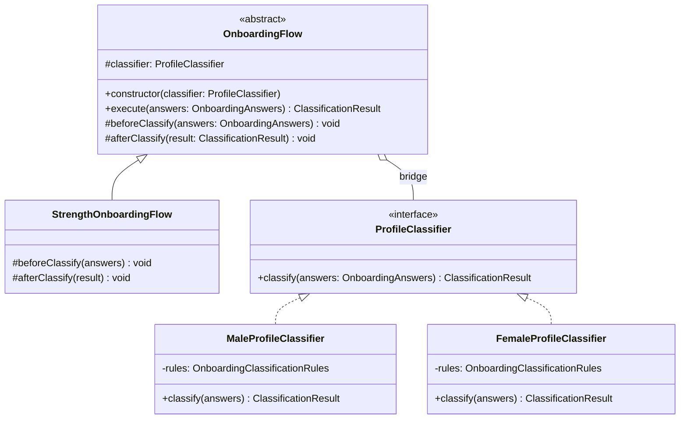
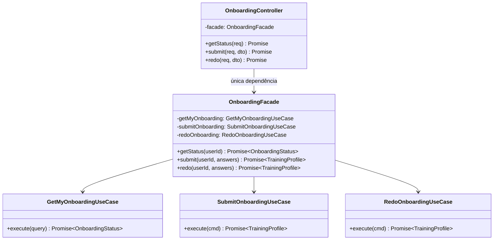
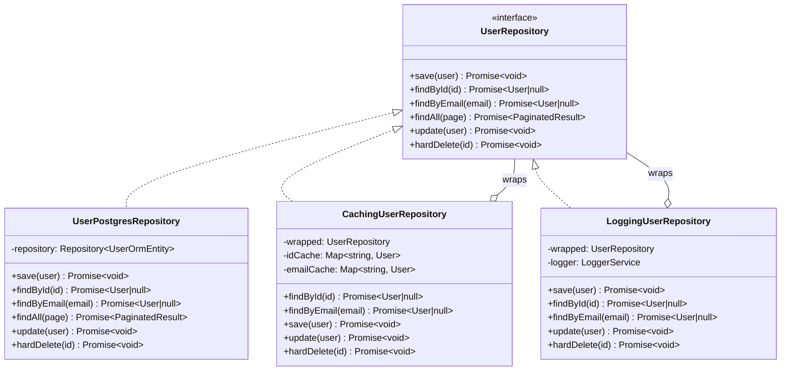
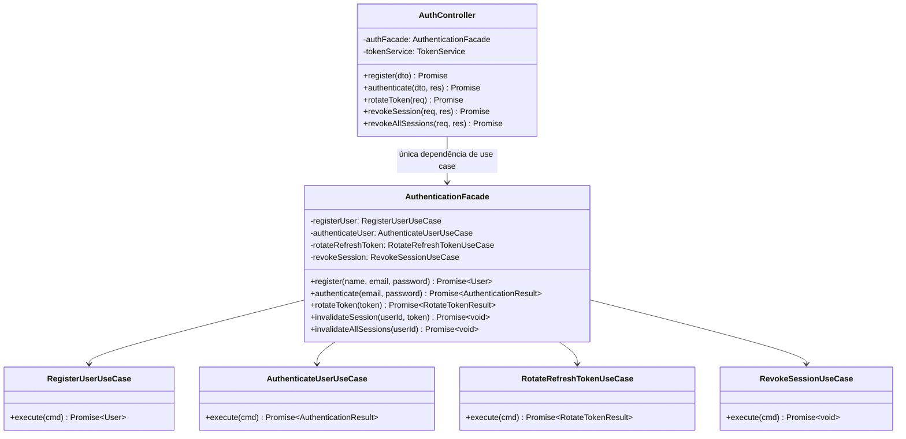

# 3.2. GoFs Estruturais

## Introdução

Os padrões estruturais tratam de como classes e objetos são compostos para formar estruturas maiores, mantendo flexibilidade e eficiência.

Este documento reúne as contribuições de **todos os módulos do projeto**. Cada seção identifica o módulo, o integrante responsável e o padrão GoF aplicado. As seções sinalizadas como **“a preencher”** aguardam a contribuição dos demais membros — siga a estrutura da seção de Onboarding como referência.

---

### Módulo de Onboarding

> **Responsável:** Lucas Antunes | **Branch:** `feat/modulo-on-boarding`
>
> Contexto: o desafio estrutural central era que **o fluxo de classificação de perfil precisa variar de acordo com o sexo biológico do usuário**, mas a lógica de orquestração do fluxo deve permanecer estável independentemente de qual classificador está em uso.

#### Padrões analisados

| Padrão     | Possível aplicação                                       | Status                          | Justificativa                                                                                                                           |
| ---------- | -------------------------------------------------------- | ------------------------------- | --------------------------------------------------------------------------------------------------------------------------------------- |
| **Bridge** | Separar fluxo de classificação do classificador concreto | Selecionado                     | Permite variar hierarquia de fluxos e hierarquia de classificadores independentemente                                                   |
| Decorator  | Adicionar etapas ao fluxo de classificação               | Avaliado                        | Útil para comportamentos opcionais em cadeia, mas o fluxo aqui tem estrutura fixa com hooks — Template Method (via Bridge) é mais claro |
| Adapter    | Adaptar classificadores externos                         | Não selecionado                 | Não há sistema legado a adaptar                                                                                                         |
| **Facade** | Simplificar acesso ao subsistema de onboarding           | Implementado — ver seção abaixo | Único ponto de entrada da apresentação para os use cases; isola o controller do subsistema interno                                      |
| Composite  | Compor múltiplas regras                                  | Não selecionado                 | As regras são acumulativas (soma de pontos), o Singleton de regras já as centraliza                                                     |

#### Padrão implementado — Bridge - `OnboardingFlow` + `ProfileClassifier`

##### Problema arquitetural

O requisito de negócio estabelece que **homens e mulheres passam por classificadores distintos**. Sem o Bridge, as alternativas seriam:

1. **Herança direta**: `MaleOnboardingFlow extends OnboardingFlow` e `FemaleOnboardingFlow extends OnboardingFlow`, cada um com o classificador embutido. Problema: se o fluxo ganhar variações (ex.: `StrengthFlow`, `EnduranceFlow`), o número de subclasses explode — N fluxos × M sexos = N×M classes.
2. **Condicional em tempo de execução**: `if (sex === 'MALE') {... }` dentro do fluxo. Problema: viola o Open/Closed Principle; qualquer novo critério de variação exige modificar o fluxo.

O Bridge resolve isso separando as duas hierarquias:

- **Abstração** (`OnboardingFlow`): orquestra o fluxo — `beforeClassify()`, `classify()`, `afterClassify()`.
- **Implementação** (`ProfileClassifier`): executa a classificação concreta de acordo com o perfil do usuário.

As duas hierarquias evoluem de forma independente: novos fluxos não exigem novos classificadores, e novos classificadores não exigem novos fluxos.

##### Justificativa da escolha

O Bridge foi escolhido porque o problema tem **duas dimensões de variação ortogonais**:

| Dimensão                          | Variações atuais                                   | Variações futuras                              |
| --------------------------------- | -------------------------------------------------- | ---------------------------------------------- |
| **Fluxo** (abstração)             | `StrengthOnboardingFlow`                           | `EnduranceFlow`, `HypertrophyFlow`             |
| **Classificador** (implementação) | `MaleProfileClassifier`, `FemaleProfileClassifier` | Classificadores por faixa etária, por objetivo |

Qualquer combinação de fluxo × classificador funciona sem código adicional. O `SubmitOnboardingUseCase` seleciona o classificador com base no sexo e injeta no fluxo:

```typescript
const classifier =
  answers.sex === Sex.MALE
    ? new MaleProfileClassifier()
    : new FemaleProfileClassifier();

const flow = new StrengthOnboardingFlow(classifier);
return flow.execute(answers);
```

##### Modelagem



##### Implementação

| Elemento                  | Papel no Bridge            | Caminho                                                                      |
| ------------------------- | -------------------------- | ---------------------------------------------------------------------------- |
| `OnboardingFlow`          | Abstração (abstract class) | `backend/src/domain/onboarding/bridge/onboarding-flow.abstract.ts`           |
| `StrengthOnboardingFlow`  | Abstração refinada         | `backend/src/domain/onboarding/bridge/strength-onboarding-flow.ts`           |
| `ProfileClassifier`       | Interface da implementação | `backend/src/domain/onboarding/bridge/profile-classifier.interface.ts`       |
| `MaleProfileClassifier`   | Implementação concreta     | `backend/src/domain/onboarding/bridge/male-profile-classifier.ts`            |
| `FemaleProfileClassifier` | Implementação concreta     | `backend/src/domain/onboarding/bridge/female-profile-classifier.ts`          |
| `SubmitOnboardingUseCase` | Cliente que monta a ponte  | `backend/src/application/onboarding/use-cases/submit-onboarding.use-case.ts` |
| Testes                    | Verificação da composição  | `backend/src/domain/onboarding/bridge/classifiers.spec.ts`                   |

###### Trechos centrais

```typescript
// onboarding-flow.abstract.ts — Abstração
export abstract class OnboardingFlow {
  constructor(protected readonly classifier: ProfileClassifier) {}

  execute(answers: OnboardingAnswers): ClassificationResult {
    this.beforeClassify(answers);
    const result = this.classifier.classify(answers);
    this.afterClassify(result);
    return result;
  }

  protected beforeClassify(_answers: OnboardingAnswers): void {}
  protected afterClassify(_result: ClassificationResult): void {}
}

// strength-onboarding-flow.ts — Abstração refinada
export class StrengthOnboardingFlow extends OnboardingFlow {
  protected override beforeClassify(answers: OnboardingAnswers): void {
    // validações específicas do fluxo de força, se houver
  }
}

// profile-classifier.interface.ts — Interface da implementação
export interface ProfileClassifier {
  classify(answers: OnboardingAnswers): ClassificationResult;
}

// male-profile-classifier.ts — Implementação concreta
export class MaleProfileClassifier implements ProfileClassifier {
  private readonly rules = OnboardingClassificationRules.getInstance();

  classify(answers: OnboardingAnswers): ClassificationResult {
    const score = this.rules.calculateScore(answers);
    return ClassificationResult.create(score);
  }
}
```

##### Evidência de execução

Os testes verificam as duas dimensões do Bridge independentemente:

```
✓ MaleProfileClassifier — score máximo (10) → ADVANCED
✓ MaleProfileClassifier — score mínimo (0) → BEGINNER
✓ FemaleProfileClassifier — score máximo (10) → ADVANCED
✓ FemaleProfileClassifier — score intermediário (6) → INTERMEDIATE
✓ StrengthOnboardingFlow com MaleProfileClassifier — execute() delega ao classificador
✓ StrengthOnboardingFlow com FemaleProfileClassifier — execute() delega ao classificador
```

Execute no container:

```bash
sudo docker compose exec api npx jest classifiers --verbose
```

##### Rastreabilidade

| Artefato                          | Relação                                                                 |
| --------------------------------- | ----------------------------------------------------------------------- |
| Requisito                         | Diferenciar homem e mulher no fluxo de classificação                    |
| Módulo                            | `domain/onboarding/bridge`                                              |
| Camada                            | Domínio                                                                 |
| Padrão criacional relacionado     | Singleton (classificadores usam `getInstance()`)                        |
| Padrão comportamental relacionado | Memento (fluxo produz `ClassificationResult` que é salvo antes do redo) |
| Use case consumidor               | `application/onboarding/use-cases/submit-onboarding.use-case.ts`        |

##### Senso crítico

###### Benefícios

- **Explosão de subclasses evitada**: sem Bridge, 2 fluxos × 2 sexos = 4 classes; com Bridge, 2 + 2 = 4 classes com composição livre. Com 5 fluxos × 5 critérios, a diferença seria 25 vs. 10.
- **Testabilidade independente**: cada classificador é testável sem instanciar um fluxo; cada fluxo é testável com um mock de `ProfileClassifier`.
- **Open/Closed**: adicionar `FemaleStrengthOnboardingFlow` ou `AgeBasedClassifier` não modifica nenhum código existente.

###### Limitações

- **Indireção extra**: para um caso com apenas dois classificadores, o Bridge pode parecer over-engineering. A justificativa reside na expansibilidade declarada no escopo do projeto.
- **Configuração do cliente**: quem instancia precisa conhecer as duas hierarquias para montar a combinação correta. No projeto, isso é responsabilidade do `SubmitOnboardingUseCase`.

###### Alternativas consideradas

- **Strategy puro** (sem a abstração de fluxo): resolveria a variação de classificador, mas não encapsularia o protocolo de execução (`beforeClassify`/`afterClassify`). Rejeitado.
- **Factory Method** dentro do fluxo: o fluxo criaria o classificador internamente. Acoplaria as duas hierarquias, anulando o benefício principal do Bridge. Rejeitado.

##### Referências (Bridge)

- GAMMA, E. et al. _Design Patterns: Elements of Reusable Object-Oriented Software_. Addison-Wesley, 1994. Cap. 4 — Structural Patterns, Bridge, p. 151–161.
- SHALLOWAY, A.; TROTT, J. _Design Patterns Explained_. Addison-Wesley, 2004. Cap. 11 — The Bridge Pattern.

---

#### Padrão complementar — Facade - `OnboardingFacade`

##### Introdução

Além do Bridge, o módulo de onboarding implementa o padrão **Facade** na camada de aplicação. O Facade oferece uma interface simplificada para um conjunto de interfaces de um subsistema, tornando o subsistema mais fácil de usar. Aqui ele atua como a única porta de entrada da camada de apresentação para toda a lógica de onboarding — o controller nunca chama use cases diretamente.

##### Problema arquitetural

O `OnboardingController` precisaria conhecer e instanciar três use cases distintos (`GetMyOnboardingUseCase`, `SubmitOnboardingUseCase`, `RedoOnboardingUseCase`) além de coordenar suas dependências. Isso criaria dois problemas:

1. **Acoplamento da apresentação à aplicação**: o controller passaria a depender dos contratos internos de cada use case — qualquer refatoração (renomear, dividir ou fundir use cases) quebraria o controller diretamente.
2. **Responsabilidade de orquestração no lugar errado**: a camada de apresentação não deve saber _como_ o subsistema de onboarding é organizado internamente; ela deve apenas saber _o que_ pedir.

##### Justificativa da escolha

O `OnboardingFacade` concentra as três operações de onboarding em uma interface coesa de três métodos (`getStatus`, `submit`, `redo`). O controller depende exclusivamente dessa fachada — uma única dependência no lugar de três.

Isso está alinhado ao princípio de arquitetura em camadas do projeto: a camada de apresentação nunca importa diretamente da camada de domínio; sempre passa pela aplicação via facade.

##### Modelagem



##### Implementação

| Elemento                  | Papel no Facade                 | Caminho                                                                      |
| ------------------------- | ------------------------------- | ---------------------------------------------------------------------------- |
| `OnboardingFacade`        | Facade — interface simplificada | `backend/src/presentation/facades/onboarding.facade.ts`                      |
| `GetMyOnboardingUseCase`  | Subsistema — consulta status    | `backend/src/application/use-cases/onboarding/get-my-onboarding.use-case.ts` |
| `SubmitOnboardingUseCase` | Subsistema — submete onboarding | `backend/src/application/use-cases/onboarding/submit-onboarding.use-case.ts` |
| `RedoOnboardingUseCase`   | Subsistema — refaz onboarding   | `backend/src/application/use-cases/onboarding/redo-onboarding.use-case.ts`   |
| `OnboardingController`    | Cliente do Facade               | `backend/src/presentation/controllers/onboarding.controller.ts`              |

###### Trechos centrais

```typescript
// onboarding.facade.ts
export class OnboardingFacade {
  constructor(
    private readonly getMyOnboarding: GetMyOnboardingUseCase,
    private readonly submitOnboarding: SubmitOnboardingUseCase,
    private readonly redoOnboarding: RedoOnboardingUseCase,
  ) {}

  getStatus(userId: string): Promise<OnboardingStatus> {
    return this.getMyOnboarding.execute({ userId });
  }

  submit(
    userId: string,
    answers: OnboardingAnswersProps,
  ): Promise<TrainingProfile> {
    return this.submitOnboarding.execute({ userId, answers });
  }

  redo(
    userId: string,
    answers: OnboardingAnswersProps,
  ): Promise<TrainingProfile> {
    return this.redoOnboarding.execute({ userId, answers });
  }
}

// onboarding.controller.ts — cliente do Facade
@Controller("v1/onboarding")
export class OnboardingController {
  constructor(private readonly onboardingFacade: OnboardingFacade) {}

  @Get("me")
  async getStatus(@Req() req: Request) {
    const status = await this.onboardingFacade.getStatus(req.user!.userId);
    return OnboardingViewModel.toStatusResponse(status);
  }

  @Post()
  async submit(@Req() req: Request, @Body() dto: SubmitOnboardingRequest) {
    const profile = await this.onboardingFacade.submit(req.user!.userId, dto);
    return OnboardingViewModel.toResponse(profile);
  }

  @Put()
  @HttpCode(200)
  async redo(@Req() req: Request, @Body() dto: SubmitOnboardingRequest) {
    const profile = await this.onboardingFacade.redo(req.user!.userId, dto);
    return OnboardingViewModel.toResponse(profile);
  }
}
```

##### Rastreabilidade

| Artefato                          | Relação                                                     |
| --------------------------------- | ----------------------------------------------------------- |
| Módulo                            | `presentation/facades/`                                     |
| Camada                            | Aplicação (Facade) → Domínio (use cases)                    |
| Cliente                           | `presentation/controllers/onboarding.controller.ts`         |
| Padrão estrutural relacionado     | Bridge (acionado pelo `SubmitOnboardingUseCase` via Facade) |
| Padrão comportamental relacionado | Memento (acionado pelo `RedoOnboardingUseCase` via Facade)  |

##### Senso crítico

###### Benefícios

- **Controller enxuto**: o controller possui uma única dependência injetada. Cada método tem menos de 5 linhas de lógica — apenas extrai o `userId` do request, delega ao facade e formata a resposta.
- **Isolamento de camadas**: a camada de apresentação não tem nenhum import direto de domain ou de use cases — a fronteira arquitetural é respeitada.
- **Ponto único de refatoração**: se os use cases forem reorganizados (ex.: dividir `RedoOnboardingUseCase` em dois), apenas o Facade é ajustado; o controller não muda.

###### Limitações

- **Facade não valida**: toda a lógica de negócio está nos use cases; o Facade é puro roteamento. Se por acidente um método não chamar o use case correto, o teste de integração é que detecta — o Facade em si não tem invariantes.
- **Granularidade**: para subsistemas muito grandes, um único Facade pode crescer demais. Nesse caso, a solução é múltiplos facades por contexto — o que já está sendo feito (existe um facade separado para autenticação).

###### Alternativas consideradas

- **Injetar use cases diretamente no controller**: funciona, mas viola a separação de camadas e aumenta o acoplamento. Qualquer mudança nos use cases impacta o controller. Rejeitado.
- **Application Service** (variação sem o nome Facade): semanticamente equivalente — o padrão Facade de GoF e o Application Service de DDD cumprem o mesmo papel aqui. A nomenclatura “Facade” foi mantida para alinhar com a terminologia da disciplina.

##### Referências (Facade)

- GAMMA, E. et al. _Design Patterns: Elements of Reusable Object-Oriented Software_. Addison-Wesley, 1994. Cap. 4 — Structural Patterns, Facade, p. 185–193.
- EVANS, E. _Domain-Driven Design_. Addison-Wesley, 2003. Cap. 4 — Isolating the Domain (Application Layer).

### Módulo de Autenticação

> **Responsável:** Samuel Nogueira Caetano | **Branch:** `main (integrada a partir da feat/modulo-autenticacao)`
>
> Contexto: o desafio estrutural central era que **o repositório de usuários precisa acumular comportamentos transversais (cache e log) sem alterar a implementação de persistência**, e que **o controller de autenticação não deve conhecer a estrutura interna dos use cases** que compõem o fluxo de autenticação.

#### Padrões analisados

| Padrão        | Possível aplicação                                                           | Status                          | Justificativa                                                                                                                                                  |
| ------------- | ---------------------------------------------------------------------------- | ------------------------------- | -------------------------------------------------------------------------------------------------------------------------------------------------------------- |
| **Decorator** | Adicionar cache e log ao repositório de usuários sem alterar a implementação | Selecionado                     | Permite empilhar comportamentos transversais sobre `UserPostgresRepository` de forma independente e combinável, respeitando a interface existente              |
| **Facade**    | Simplificar acesso ao subsistema de autenticação a partir do controller      | Implementado — ver seção abaixo | Único ponto de entrada da apresentação para os use cases de auth; isola o controller do subsistema interno                                                     |
| Adapter       | Adaptar a API do TypeORM à interface de domínio                              | Não selecionado                 | Os repositórios já traduzem ORM ↔ domínio internamente; não há contrato externo incompatível a adaptar                                                         |
| Proxy         | Controlar acesso ou adiar carregamento do repositório                        | Não selecionado                 | O controle de acesso é feito por guards na camada de apresentação; o Decorator cobre os comportamentos transversais restantes com menor acoplamento estrutural |
| Composite     | Compor múltiplas regras de validação de token                                | Não selecionado                 | As validações são sequenciais e exclusivas — uma única estratégia por vez é suficiente                                                                         |

---

#### Padrão implementado — Decorator - `CachingUserRepository` + `LoggingUserRepository`

##### Problema arquitetural

O `UserPostgresRepository` realiza I/O real com o banco em cada chamada. A aplicação precisava de dois comportamentos adicionais:

1. **Cache em memória** — evitar consultas repetidas ao banco para o mesmo `id` ou `email` dentro do ciclo de vida da requisição.
2. **Log estruturado** — registrar início, conclusão e falha de cada operação, com `correlationId`, sem poluir a lógica de persistência.

Sem o Decorator, as alternativas seriam:

1. **Herança**: `CachingUserPostgresRepository extends UserPostgresRepository`. Problema: acopla o cache à implementação concreta de Postgres; trocar o banco exige reescrever o cache. Além disso, combinar cache _e_ log por herança exigiria uma terceira classe que herda de ambos — impossível em TypeScript (sem mixins).
2. **Lógica embutida no repositório**: colocar `if (cache.has(id)) return cache.get(id)` e `logger.log(...)` diretamente em `UserPostgresRepository`. Problema: viola o Single Responsibility Principle; a classe passa a acumular três responsabilidades distintas.

O Decorator resolve isso mantendo as três classes com responsabilidades isoladas e compondo-as em camadas, todas honrando a mesma interface `UserRepository`.

##### Justificativa da escolha

O Decorator foi escolhido porque os comportamentos a adicionar são **ortogonais à persistência** e **precisam ser combináveis independentemente**:

| Camada       | Classe                   | Responsabilidade                  |
| ------------ | ------------------------ | --------------------------------- |
| Base         | `UserPostgresRepository` | Persistência real com TypeORM     |
| 1ª decoração | `CachingUserRepository`  | Cache em memória (id e email)     |
| 2ª decoração | `LoggingUserRepository`  | Log estruturado com correlationId |

A ordem de empilhamento é deliberada: o log envolve o cache — assim, uma consulta satisfeita pelo cache ainda aparece registrada no log, e o tempo de resposta medido reflete o tempo real da operação (cache hit ou miss) observado pelo caller.

A composição é feita no módulo NestJS, em um único lugar:

```typescript
// auth.module.ts
const base = new UserPostgresRepository(ormRepo);
const cached = new CachingUserRepository(base);
return new LoggingUserRepository(cached, logger);
```

##### Modelagem



##### Implementação

| Elemento                 | Papel no Decorator         | Caminho                                                           |
| ------------------------ | -------------------------- | ----------------------------------------------------------------- |
| `UserRepository`         | Interface do componente    | `backend/src/domain/repositories/user.repository.ts`              |
| `UserPostgresRepository` | Componente concreto (base) | `backend/src/infrastructure/database/user.postgres-repository.ts` |
| `CachingUserRepository`  | Decorator concreto — cache | `backend/src/infrastructure/database/caching-user.repository.ts`  |
| `LoggingUserRepository`  | Decorator concreto — log   | `backend/src/infrastructure/database/logging-user.repository.ts`  |
| `AuthModule`             | Cliente que compõe a pilha | `backend/src/infrastructure/modules/auth.module.ts`               |

###### Trechos centrais

```typescript
// user.repository.ts — Interface do componente
// Todos os decoradores e o componente base implementam esta mesma interface.
// Isso garante que o caller (use case) não sabe com quantas camadas está falando.
export interface UserRepository {
  save(user: User): Promise<void>;
  findById(id: string): Promise<User | null>;
  findByEmail(email: string): Promise<User | null>;
  findAll(page: Page): Promise<PaginatedResult<User>>;
  update(user: User): Promise<void>;
  hardDelete(id: string): Promise<void>;
}

// caching-user.repository.ts — 1º Decorator
// Recebe qualquer UserRepository em `wrapped`; não sabe se é Postgres, outro cache, etc.
export class CachingUserRepository implements UserRepository {
  private readonly idCache    = new Map<string, User>();
  private readonly emailCache = new Map<string, User>();

  constructor(private readonly wrapped: UserRepository) {}

  async findById(id: string): Promise<User | null> {
    const cached = this.idCache.get(id);
    if (cached) return cached;            // cache hit — não delega

    const user = await this.wrapped.findById(id);  // cache miss — delega
    if (user) this.put(user);
    return user;
  }

  async update(user: User): Promise<void> {
    // Invalida a entrada antiga antes de atualizar,
    // evitando que o cache sirva dados desatualizados.
    const old = this.idCache.get(user.id);
    if (old) this.emailCache.delete(old.email.toString());

    await this.wrapped.update(user);
    this.put(user);
  }

  private put(user: User): void {
    this.idCache.set(user.id, user);
    this.emailCache.set(user.email.toString(), user);
  }
  // demais métodos delegam diretamente para `this.wrapped`
}

// logging-user.repository.ts — 2º Decorator
// Envolve qualquer UserRepository; aqui envolve o CachingUserRepository.
export class LoggingUserRepository implements UserRepository {
  constructor(
    private readonly wrapped: UserRepository,
    private readonly logger: LoggerService,
  ) {}

  async findById(id: string): Promise<User | null> {
    this.logger.log('findById', this.meta({ userId: id }));
    try {
      return await this.wrapped.findById(id);
    } catch (err) {
      this.logError('findById', err, { userId: id });
      throw err;
    }
  }

  private meta(extra: Record<string, unknown> = {}): Record<string, unknown> {
    return { context: 'UserRepository', correlationId: getCorrelationId(), ...extra };
  }
  // demais métodos seguem o mesmo padrão: log → delega → log/error
}

// auth.module.ts — composição da pilha
{
  provide: USER_REPOSITORY,
  useFactory: (ormRepo: Repository<UserOrmEntity>, logger: LoggerService) => {
    const base   = new UserPostgresRepository(ormRepo);  // componente base
    const cached = new CachingUserRepository(base);       // 1ª camada
    return         new LoggingUserRepository(cached, logger); // 2ª camada
  },
  inject: [getRepositoryToken(UserOrmEntity), WINSTON_MODULE_NEST_PROVIDER],
}
```

##### Rastreabilidade

| Artefato                          | Relação                                                                                               |
| --------------------------------- | ----------------------------------------------------------------------------------------------------- |
| Requisito                         | Evitar consultas redundantes ao banco; manter log estruturado por operação                            |
| Módulo                            | `infrastructure/database/`                                                                            |
| Camada                            | Infraestrutura                                                                                        |
| Padrão comportamental relacionado | Observer — `DomainEventBus` consome eventos publicados após operações que passam por este repositório |
| Padrão criacional relacionado     | Factory Method — `User.reconstitute()` é chamado dentro de `toDomain()` no componente base            |
| Ponto de composição               | `infrastructure/modules/auth.module.ts`                                                               |

##### Senso crítico

###### Benefícios

- **Responsabilidade única preservada**: `UserPostgresRepository` só conhece TypeORM; `CachingUserRepository` só conhece a política de cache; `LoggingUserRepository` só conhece a política de log. Cada classe tem um único motivo para mudar.
- **Combinação livre**: a pilha pode ser alterada sem tocar nas classes — remover o cache em testes de integração é trocar uma linha no módulo, não modificar nenhuma classe.
- **Transparência para os use cases**: os use cases recebem `UserRepository` pelo token de injeção e não têm nenhum conhecimento das camadas decoradoras. Adicionar uma nova decoração (ex.: `MetricsUserRepository`) não afeta nenhum use case.

###### Limitações

- **Cache sem TTL**: o `CachingUserRepository` usa `Map` em memória sem expiração. Em cenários de alta concorrência ou requisições de longa duração, uma entrada cacheada pode ficar obsoleta se outra requisição paralela atualizar o mesmo usuário no banco. A invalidação atual (`update` e `hardDelete`) cobre o fluxo normal, mas não cobre atualizações feitas por instâncias paralelas do servidor.
- **Escopo de cache por instância**: o cache existe por instância de `CachingUserRepository`, que é criada uma vez no módulo NestJS (escopo singleton). Isso é adequado para o projeto, mas tornaria o cache incorreto em deploy com múltiplas instâncias sem um mecanismo externo (ex.: Redis).

###### Alternativas consideradas

- **Herança com mixin**: `class LoggingCachingUserPostgresRepository extends UserPostgresRepository`. Resolveria o problema imediato, mas criaria uma classe monolítica e impossibilitaria compor apenas cache _ou_ apenas log de forma independente. Rejeitado.
- **Middleware de repositório via Proxy dinâmico** (ES6 `Proxy`): permitiria interceptar chamadas sem declarar cada método. Rejeitado por tornar o código implícito e dificultar a rastreabilidade estática em TypeScript — não há garantia de tipo em tempo de compilação para os métodos interceptados.

##### Referências (Decorator)

- GAMMA, E. et al. _Design Patterns: Elements of Reusable Object-Oriented Software_. Addison-Wesley, 1994. Cap. 4 — Structural Patterns, Decorator, p. 175–184.
- MARTIN, R. C. _Agile Software Development: Principles, Patterns, and Practices_. Prentice Hall, 2002. Cap. 14 — The Open/Closed Principle.

---

#### Padrão complementar — Facade - `AuthenticationFacade`

##### Introdução

Além do Decorator, o módulo de autenticação implementa o padrão **Facade** na camada de apresentação. O Facade oferece uma interface simplificada para um conjunto de interfaces de um subsistema. Aqui ele atua como a única porta de entrada do `AuthController` para os use cases de autenticação — o controller nunca instancia nem referencia use cases diretamente.

##### Problema arquitetural

O `AuthController` precisaria depender de quatro use cases distintos (`RegisterUserUseCase`, `AuthenticateUserUseCase`, `RotateRefreshTokenUseCase`, `RevokeSessionUseCase`) e conhecer os tipos de entrada e saída de cada um. Isso criaria dois problemas:

1. **Acoplamento da apresentação à aplicação**: qualquer renomeação ou divisão de use case quebraria o controller diretamente.
2. **Contrato verboso no controller**: o controller passaria a lidar com `AuthenticateUserCommand`, `RotateTokenCommand`, `RevokeSessionCommand` — tipos que pertencem à camada de aplicação, não à de apresentação.

##### Justificativa da escolha

O `AuthenticationFacade` expõe cinco operações nomeadas de forma orientada ao negócio (`register`, `authenticate`, `rotateToken`, `invalidateSession`, `invalidateAllSessions`), traduzindo as chamadas em comandos específicos de cada use case. O controller mantém uma única dependência injetada no lugar de quatro.

##### Modelagem



##### Implementação

| Elemento                    | Papel no Facade                  | Caminho                                                                   |
| --------------------------- | -------------------------------- | ------------------------------------------------------------------------- |
| `AuthenticationFacade`      | Facade — interface simplificada  | `backend/src/presentation/facades/authentication.facade.ts`               |
| `RegisterUserUseCase`       | Subsistema — cadastro            | `backend/src/application/use-cases/auth/register-user.use-case.ts`        |
| `AuthenticateUserUseCase`   | Subsistema — login               | `backend/src/application/use-cases/auth/authenticate-user.use-case.ts`    |
| `RotateRefreshTokenUseCase` | Subsistema — rotação de token    | `backend/src/application/use-cases/auth/rotate-refresh-token.use-case.ts` |
| `RevokeSessionUseCase`      | Subsistema — revogação de sessão | `backend/src/application/use-cases/auth/revoke-session.use-case.ts`       |
| `AuthController`            | Cliente do Facade                | `backend/src/presentation/controllers/auth.controller.ts`                 |

###### Trechos centrais

```typescript
// authentication.facade.ts
// O Facade traduz chamadas orientadas ao negócio em comandos específicos de cada use case.
// O controller não importa nenhum tipo de comando da camada de aplicação.
export class AuthenticationFacade {
  constructor(
    private readonly registerUser: RegisterUserUseCase,
    private readonly authenticateUser: AuthenticateUserUseCase,
    private readonly rotateRefreshToken: RotateRefreshTokenUseCase,
    private readonly revokeSession: RevokeSessionUseCase,
  ) {}

  register(name: string, email: string, password: string): Promise<User> {
    return this.registerUser.execute({ name, email, password });
  }

  authenticate(email: string, password: string): Promise<AuthenticationResult> {
    return this.authenticateUser.execute({ email, password });
  }

  rotateToken(token: string): Promise<RotateTokenResult> {
    return this.rotateRefreshToken.execute({ token });
  }

  // O mesmo use case cobre ambos os cenários — o Facade decide qual comando montar
  invalidateSession(userId: string, currentToken: string): Promise<void> {
    return this.revokeSession.execute({ userId, currentToken });
  }

  invalidateAllSessions(userId: string): Promise<void> {
    return this.revokeSession.execute({ userId });
  }
}

// auth.controller.ts — cliente do Facade
// O controller extrai dados do request, delega ao facade e formata a resposta.
// Nenhum import de use case ou de comando de aplicação aparece aqui.
@Controller("v1/auth")
export class AuthController {
  constructor(
    private readonly authFacade: AuthenticationFacade,
    @Inject(TOKEN_SERVICE)
    private readonly tokenService: TokenService,
  ) {}

  @Post("login")
  async authenticate(
    @Body() dto: AuthenticateUserRequest,
    @Res({ passthrough: true }) res: Response,
  ) {
    const result = await this.authFacade.authenticate(dto.email, dto.password);
    const ttlMs = this.tokenService.getRefreshTokenTtl().toMs();
    res.cookie("refresh_token", result.refreshToken.toString(), {
      httpOnly: true /* ... */,
    });
    return AuthViewModel.toResponse(result.accessToken, result.user);
  }

  @Post("logout")
  async revokeSession(
    @Req() req: Request,
    @Res({ passthrough: true }) res: Response,
  ) {
    const userId = req.user?.userId;
    const refreshToken = req.cookies?.refresh_token as string | undefined;

    if (typeof userId === "string") {
      // O Facade decide internamente qual variante do use case acionar
      refreshToken
        ? await this.authFacade.invalidateSession(userId, refreshToken)
        : await this.authFacade.invalidateAllSessions(userId);
    }
    res.clearCookie("refresh_token", { path: "/v1/auth/refresh" });
  }
}
```

##### Rastreabilidade

| Artefato                          | Relação                                                                                              |
| --------------------------------- | ---------------------------------------------------------------------------------------------------- |
| Módulo                            | `presentation/facades/`                                                                              |
| Camada                            | Apresentação (Facade) → Aplicação (use cases)                                                        |
| Cliente                           | `presentation/controllers/auth.controller.ts`                                                        |
| Padrão estrutural relacionado     | Decorator — o repositório consumido pelos use cases acionados pelo Facade é uma pilha de decoradores |
| Padrão comportamental relacionado | Template Method — todos os use cases acionados pelo Facade estendem `UseCase<TInput, TOutput>`       |

##### Senso crítico

###### Benefícios

- **Controller com responsabilidade única**: cada método do controller tem menos de 10 linhas — extrai dados do request HTTP, delega ao facade, formata a resposta com o ViewModel. Nenhuma lógica de negócio reside na camada de apresentação.
- **Decisão de roteamento centralizada**: o método `invalidateSession` vs. `invalidateAllSessions` dentro do `revokeSession` do use case é uma decisão de negócio. O Facade mantém essa decisão fora do controller — o controller apenas passa o que tem (`currentToken` presente ou não), e o Facade monta o comando correto.
- **Fronteira arquitetural respeitada**: nenhum import de `@application` ou `@domain` aparece no controller, exceto `TokenService` (necessário para calcular `maxAge` do cookie — responsabilidade de apresentação legítima).

###### Limitações

- **Facade não é transacional**: se `invalidateSession` e uma eventual notificação pós-revogação precisassem ser atômicas, o Facade não seria o lugar correto para essa coordenação — isso pertence ao use case ou a um saga. O Facade é puro roteamento, sem invariantes próprias.
- **Crescimento acoplado ao módulo**: o `AuthModule` hoje centraliza autenticação e gestão de usuários (`UpdateUserUseCase`, `DeactivateUserUseCase`). Caso o módulo cresça, pode ser necessário um segundo facade (ex.: `UserManagementFacade`) para manter a coesão — o que já é a prática adotada no módulo de onboarding.

###### Alternativas consideradas

- **Injetar use cases diretamente no controller**: funciona tecnicamente, mas viola a separação de camadas e expõe os tipos de comando da aplicação ao controller. Qualquer refatoração de use case impactaria o controller. Rejeitado.
- **Mediator (ex.: CQRS com MediatR)**: desacoplaria completamente o controller dos use cases via despacho por mensagem. Adicionaria flexibilidade para projetos maiores, mas introduziria indireção e infraestrutura adicionais desproporcionais ao escopo atual. Rejeitado.

##### Referências (Facade)

- GAMMA, E. et al. _Design Patterns: Elements of Reusable Object-Oriented Software_. Addison-Wesley, 1994. Cap. 4 — Structural Patterns, Facade, p. 185–193.
- EVANS, E. _Domain-Driven Design_. Addison-Wesley, 2003. Cap. 4 — Isolating the Domain (Application Layer).

---

## [Módulo: ____________] — A preencher

> **Responsável:** [Nome do membro] | **Branch:** [nome da branch]

!!! warning “Seção pendente”

Esta seção aguarda a contribuição do responsável pelo módulo.

Siga a estrutura da seção **Módulo de Onboarding** acima como referência:

    1. **Padrões analisados** — tabela com os padrões GoF avaliados e justificativa da escolha
    2. **Padrão implementado** — nome e identificador central (ex.: classe ou interface principal)
    3. **Problema arquitetural** — o problema concreto que motivou o uso do padrão
    4. **Justificativa da escolha** — por que este padrão e não as alternativas avaliadas
    5. **Modelagem** — diagrama Mermaid (`classDiagram` ou `sequenceDiagram`)
    6. **Implementação** — tabela de arquivos + trechos de código comentados
    7. **Rastreabilidade** — elos com requisitos, camadas e outros padrões GoF do projeto
    8. **Senso crítico** — benefícios, limitações e alternativas consideradas
    9. **Referências** — bibliográficas (ABNT ou formato GoF)

## Histórico de versões

| Versão | Data       | Descrição                                                             | Autor                   |
| ------ | ---------- | --------------------------------------------------------------------- | ----------------------- |
| 1.0    | 19/05/2026 | Documentação dos padrões Bridge e Facade do módulo de onboarding      | Lucas Antunes           |
| 1.1    | 20/05/2026 | Documentação dos padrões Decorator e Facade do módulo de autenticação | Samuel Nogueira Caetano |
