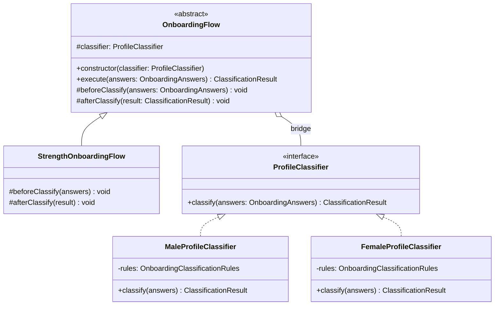
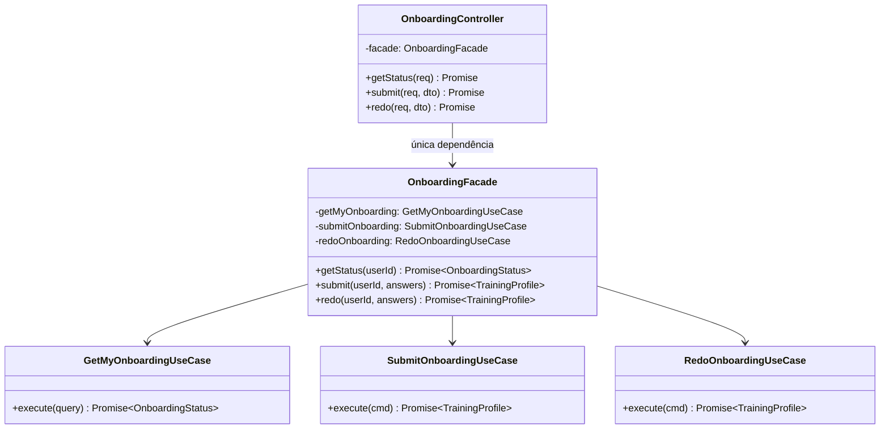
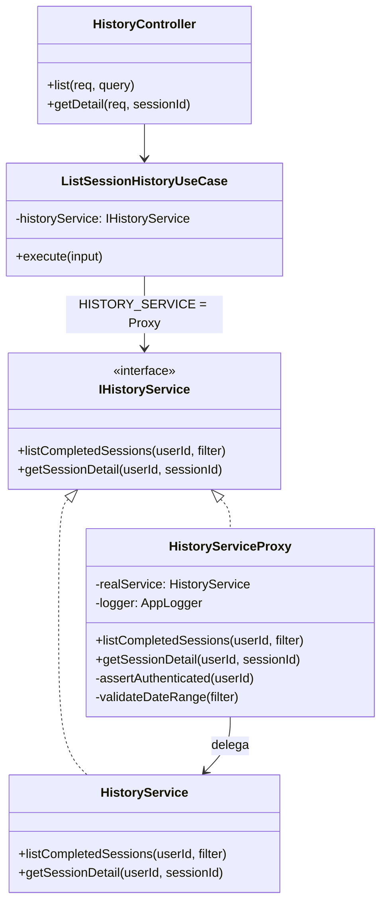
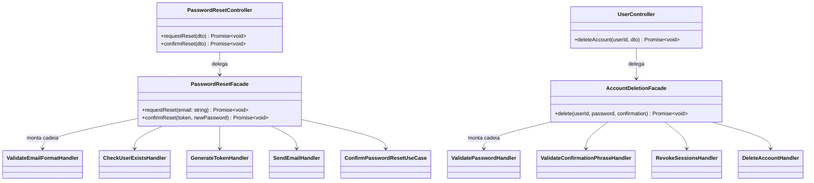

# 3.2. GoFs Estruturais

## Introdução

Os padrões estruturais tratam de como classes e objetos são compostos para formar estruturas maiores, mantendo flexibilidade e eficiência.

Este documento reúne as contribuições de **todos os módulos do projeto**. Cada seção identifica o módulo, o integrante responsável e o padrão GoF aplicado. Ao final do arquivo, a seção **"[Módulo: ____________] — A preencher"** permanece disponível para novas contribuições — siga a estrutura das seções de Onboarding ou Histórico de Sessões como referência.

---

## Módulo de Onboarding

> **Responsável:** Lucas Antunes | **Branch:** `feat/modulo-on-boarding`
>
> Contexto: o desafio estrutural central era que **o fluxo de classificação de perfil precisa variar de acordo com o sexo biológico do usuário**, mas a lógica de orquestração do fluxo deve permanecer estável independentemente de qual classificador está em uso.

### Padrões analisados

| Padrão     | Possível aplicação                                       | Status                        | Justificativa                                                                                                                           |
|------------|----------------------------------------------------------|-------------------------------|-----------------------------------------------------------------------------------------------------------------------------------------|
| **Bridge** | Separar fluxo de classificação do classificador concreto | Selecionado                   | Permite variar hierarquia de fluxos e hierarquia de classificadores independentemente                                                   |
| Decorator  | Adicionar etapas ao fluxo de classificação               | Avaliado                      | Útil para comportamentos opcionais em cadeia, mas o fluxo aqui tem estrutura fixa com hooks — Template Method (via Bridge) é mais claro |
| Adapter    | Adaptar classificadores externos                         | Não selecionado               | Não há sistema legado a adaptar                                                                                                         |
| **Facade** | Simplificar acesso ao subsistema de onboarding           | Implementado — ver seção abaixo | Único ponto de entrada da apresentação para os use cases; isola o controller do subsistema interno                                    |
| Composite  | Compor múltiplas regras                                  | Não selecionado               | As regras são acumulativas (soma de pontos), o Singleton de regras já as centraliza                                                     |

### Padrão implementado — Bridge · `OnboardingFlow` + `ProfileClassifier`

## Problema arquitetural

O requisito de negócio estabelece que **homens e mulheres passam por classificadores distintos**. Sem o Bridge, as alternativas seriam:

1. **Herança direta**: `MaleOnboardingFlow extends OnboardingFlow` e `FemaleOnboardingFlow extends OnboardingFlow`, cada um com o classificador embutido. Problema: se o fluxo ganhar variações (ex.: `StrengthFlow`, `EnduranceFlow`), o número de subclasses explode — N fluxos × M sexos = N×M classes.
2. **Condicional em tempo de execução**: `if (sex === 'MALE') { ... }` dentro do fluxo. Problema: viola o Open/Closed Principle; qualquer novo critério de variação exige modificar o fluxo.

O Bridge resolve isso separando as duas hierarquias:

- **Abstração** (`OnboardingFlow`): orquestra o fluxo — `beforeClassify()`, `classify()`, `afterClassify()`.
- **Implementação** (`ProfileClassifier`): executa a classificação concreta de acordo com o perfil do usuário.

As duas hierarquias evoluem de forma independente: novos fluxos não exigem novos classificadores, e novos classificadores não exigem novos fluxos.

## Justificativa da escolha

O Bridge foi escolhido porque o problema tem **duas dimensões de variação ortogonais**:

| Dimensão                          | Variações atuais                                   | Variações futuras                              |
|-----------------------------------|----------------------------------------------------|------------------------------------------------|
| **Fluxo** (abstração)             | `StrengthOnboardingFlow`                           | `EnduranceFlow`, `HypertrophyFlow`             |
| **Classificador** (implementação) | `MaleProfileClassifier`, `FemaleProfileClassifier` | Classificadores por faixa etária, por objetivo |

Qualquer combinação de fluxo × classificador funciona sem código adicional. O `SubmitOnboardingUseCase` seleciona o classificador com base no sexo e injeta no fluxo:

```typescript
const classifier = answers.sex === Sex.MALE
  ? new MaleProfileClassifier()
  : new FemaleProfileClassifier();

const flow = new StrengthOnboardingFlow(classifier);
return flow.execute(answers);
```

## Modelagem



## Implementação

| Elemento                  | Papel no Bridge            | Caminho                                                                      |
|---------------------------|----------------------------|------------------------------------------------------------------------------|
| `OnboardingFlow`          | Abstração (abstract class) | `backend/src/domain/onboarding/bridge/onboarding-flow.abstract.ts`           |
| `StrengthOnboardingFlow`  | Abstração refinada         | `backend/src/domain/onboarding/bridge/strength-onboarding-flow.ts`           |
| `ProfileClassifier`       | Interface da implementação | `backend/src/domain/onboarding/bridge/profile-classifier.interface.ts`       |
| `MaleProfileClassifier`   | Implementação concreta     | `backend/src/domain/onboarding/bridge/male-profile-classifier.ts`            |
| `FemaleProfileClassifier` | Implementação concreta     | `backend/src/domain/onboarding/bridge/female-profile-classifier.ts`          |
| `SubmitOnboardingUseCase` | Cliente que monta a ponte  | `backend/src/application/onboarding/use-cases/submit-onboarding.use-case.ts` |
| Testes                    | Verificação da composição  | `backend/src/domain/onboarding/bridge/classifiers.spec.ts`                   |

### Trechos centrais

```typescript
// onboarding-flow.abstract.ts — Abstração
export abstract class OnboardingFlow {
  constructor(protected readonly classifier: ProfileClassifier) {}

  execute(answers: OnboardingAnswers): ClassificationResult {
    this.beforeClassify(answers);
    const result = this.classifier.classify(answers);
    this.afterClassify(result);
    return result;
  }

  protected beforeClassify(_answers: OnboardingAnswers): void {}
  protected afterClassify(_result: ClassificationResult): void {}
}

// strength-onboarding-flow.ts — Abstração refinada
export class StrengthOnboardingFlow extends OnboardingFlow {
  protected override beforeClassify(answers: OnboardingAnswers): void {
    // validações específicas do fluxo de força, se houver
  }
}

// profile-classifier.interface.ts — Interface da implementação
export interface ProfileClassifier {
  classify(answers: OnboardingAnswers): ClassificationResult;
}

// male-profile-classifier.ts — Implementação concreta
export class MaleProfileClassifier implements ProfileClassifier {
  private readonly rules = OnboardingClassificationRules.getInstance();

  classify(answers: OnboardingAnswers): ClassificationResult {
    const score = this.rules.calculateScore(answers);
    return ClassificationResult.create(score);
  }
}
```

## Evidência de execução

Os testes verificam as duas dimensões do Bridge independentemente:

```
✓ MaleProfileClassifier — score máximo (10) → ADVANCED
✓ MaleProfileClassifier — score mínimo (0) → BEGINNER
✓ FemaleProfileClassifier — score máximo (10) → ADVANCED
✓ FemaleProfileClassifier — score intermediário (6) → INTERMEDIATE
✓ StrengthOnboardingFlow com MaleProfileClassifier — execute() delega ao classificador
✓ StrengthOnboardingFlow com FemaleProfileClassifier — execute() delega ao classificador
```

Execute no container:

```bash
sudo docker compose exec api npx jest classifiers --verbose
```

## Rastreabilidade

| Artefato                          | Relação                                                                 |
|-----------------------------------|-------------------------------------------------------------------------|
| Requisito                         | Diferenciar homem e mulher no fluxo de classificação                    |
| Módulo                            | `domain/onboarding/bridge`                                              |
| Camada                            | Domínio                                                                 |
| Padrão criacional relacionado     | Singleton (classificadores usam `getInstance()`)                        |
| Padrão comportamental relacionado | Memento (fluxo produz `ClassificationResult` que é salvo antes do redo) |
| Use case consumidor               | `application/onboarding/use-cases/submit-onboarding.use-case.ts`        |

## Senso crítico

### Benefícios

- **Explosão de subclasses evitada**: sem Bridge, 2 fluxos × 2 sexos = 4 classes; com Bridge, 2 + 2 = 4 classes com composição livre. Com 5 fluxos × 5 critérios, a diferença seria 25 vs. 10.
- **Testabilidade independente**: cada classificador é testável sem instanciar um fluxo; cada fluxo é testável com um mock de `ProfileClassifier`.
- **Open/Closed**: adicionar `FemaleStrengthOnboardingFlow` ou `AgeBasedClassifier` não modifica nenhum código existente.

### Limitações

- **Indireção extra**: para um caso com apenas dois classificadores, o Bridge pode parecer over-engineering. A justificativa reside na expansibilidade declarada no escopo do projeto.
- **Configuração do cliente**: quem instancia precisa conhecer as duas hierarquias para montar a combinação correta. No projeto, isso é responsabilidade do `SubmitOnboardingUseCase`.

### Alternativas consideradas

- **Strategy puro** (sem a abstração de fluxo): resolveria a variação de classificador, mas não encapsularia o protocolo de execução (`beforeClassify`/`afterClassify`). Rejeitado.
- **Factory Method** dentro do fluxo: o fluxo criaria o classificador internamente. Acoplaria as duas hierarquias, anulando o benefício principal do Bridge. Rejeitado.

### Referências (Bridge)

- GAMMA, E. et al. *Design Patterns: Elements of Reusable Object-Oriented Software*. Addison-Wesley, 1994. Cap. 4 — Structural Patterns, Bridge, p. 151–161.
- SHALLOWAY, A.; TROTT, J. *Design Patterns Explained*. Addison-Wesley, 2004. Cap. 11 — The Bridge Pattern.

---

### Padrão complementar — Facade · `OnboardingFacade`

#### Introdução

Além do Bridge, o módulo de onboarding implementa o padrão **Facade** na camada de aplicação. O Facade oferece uma interface simplificada para um conjunto de interfaces de um subsistema, tornando o subsistema mais fácil de usar. Aqui ele atua como a única porta de entrada da camada de apresentação para toda a lógica de onboarding — o controller nunca chama use cases diretamente.

#### Problema arquitetural

O `OnboardingController` precisaria conhecer e instanciar três use cases distintos (`GetMyOnboardingUseCase`, `SubmitOnboardingUseCase`, `RedoOnboardingUseCase`) além de coordenar suas dependências. Isso criaria dois problemas:

1. **Acoplamento da apresentação à aplicação**: o controller passaria a depender dos contratos internos de cada use case — qualquer refatoração (renomear, dividir ou fundir use cases) quebraria o controller diretamente.
2. **Responsabilidade de orquestração no lugar errado**: a camada de apresentação não deve saber *como* o subsistema de onboarding é organizado internamente; ela deve apenas saber *o que* pedir.

#### Justificativa da escolha

O `OnboardingFacade` concentra as três operações de onboarding em uma interface coesa de três métodos (`getStatus`, `submit`, `redo`). O controller depende exclusivamente dessa fachada — uma única dependência no lugar de três.

Isso está alinhado ao princípio de arquitetura em camadas do projeto: a camada de apresentação nunca importa diretamente da camada de domínio; sempre passa pela aplicação via facade.

#### Modelagem



#### Implementação

| Elemento | Papel no Facade | Caminho |
|---|---|---|
| `OnboardingFacade` | Facade — interface simplificada | `backend/src/presentation/facades/onboarding.facade.ts` |
| `GetMyOnboardingUseCase` | Subsistema — consulta status | `backend/src/application/use-cases/onboarding/get-my-onboarding.use-case.ts` |
| `SubmitOnboardingUseCase` | Subsistema — submete onboarding | `backend/src/application/use-cases/onboarding/submit-onboarding.use-case.ts` |
| `RedoOnboardingUseCase` | Subsistema — refaz onboarding | `backend/src/application/use-cases/onboarding/redo-onboarding.use-case.ts` |
| `OnboardingController` | Cliente do Facade | `backend/src/presentation/controllers/onboarding.controller.ts` |

##### Trechos centrais

```typescript
// onboarding.facade.ts
export class OnboardingFacade {
  constructor(
    private readonly getMyOnboarding: GetMyOnboardingUseCase,
    private readonly submitOnboarding: SubmitOnboardingUseCase,
    private readonly redoOnboarding: RedoOnboardingUseCase,
  ) {}

  getStatus(userId: string): Promise<OnboardingStatus> {
    return this.getMyOnboarding.execute({ userId });
  }

  submit(userId: string, answers: OnboardingAnswersProps): Promise<TrainingProfile> {
    return this.submitOnboarding.execute({ userId, answers });
  }

  redo(userId: string, answers: OnboardingAnswersProps): Promise<TrainingProfile> {
    return this.redoOnboarding.execute({ userId, answers });
  }
}

// onboarding.controller.ts — cliente do Facade
@Controller('v1/onboarding')
export class OnboardingController {
  constructor(private readonly onboardingFacade: OnboardingFacade) {}

  @Get('me')
  async getStatus(@Req() req: Request) {
    const status = await this.onboardingFacade.getStatus(req.user!.userId);
    return OnboardingViewModel.toStatusResponse(status);
  }

  @Post()
  async submit(@Req() req: Request, @Body() dto: SubmitOnboardingRequest) {
    const profile = await this.onboardingFacade.submit(req.user!.userId, dto);
    return OnboardingViewModel.toResponse(profile);
  }

  @Put()
  @HttpCode(200)
  async redo(@Req() req: Request, @Body() dto: SubmitOnboardingRequest) {
    const profile = await this.onboardingFacade.redo(req.user!.userId, dto);
    return OnboardingViewModel.toResponse(profile);
  }
}
```

#### Rastreabilidade

| Artefato | Relação |
|---|---|
| Módulo | `presentation/facades/` |
| Camada | Aplicação (Facade) → Domínio (use cases) |
| Cliente | `presentation/controllers/onboarding.controller.ts` |
| Padrão estrutural relacionado | Bridge (acionado pelo `SubmitOnboardingUseCase` via Facade) |
| Padrão comportamental relacionado | Memento (acionado pelo `RedoOnboardingUseCase` via Facade) |

#### Senso crítico

##### Benefícios

- **Controller enxuto**: o controller possui uma única dependência injetada. Cada método tem menos de 5 linhas de lógica — apenas extrai o `userId` do request, delega ao facade e formata a resposta.
- **Isolamento de camadas**: a camada de apresentação não tem nenhum import direto de domain ou de use cases — a fronteira arquitetural é respeitada.
- **Ponto único de refatoração**: se os use cases forem reorganizados (ex.: dividir `RedoOnboardingUseCase` em dois), apenas o Facade é ajustado; o controller não muda.

##### Limitações

- **Facade não valida**: toda a lógica de negócio está nos use cases; o Facade é puro roteamento. Se por acidente um método não chamar o use case correto, o teste de integração é que detecta — o Facade em si não tem invariantes.
- **Granularidade**: para subsistemas muito grandes, um único Facade pode crescer demais. Nesse caso, a solução é múltiplos facades por contexto — o que já está sendo feito (existe um facade separado para autenticação).

##### Alternativas consideradas

- **Injetar use cases diretamente no controller**: funciona, mas viola a separação de camadas e aumenta o acoplamento. Qualquer mudança nos use cases impacta o controller. Rejeitado.
- **Application Service** (variação sem o nome Facade): semanticamente equivalente — o padrão Facade de GoF e o Application Service de DDD cumprem o mesmo papel aqui. A nomenclatura "Facade" foi mantida para alinhar com a terminologia da disciplina.

#### Referências (Facade)

- GAMMA, E. et al. *Design Patterns: Elements of Reusable Object-Oriented Software*. Addison-Wesley, 1994. Cap. 4 — Structural Patterns, Facade, p. 185–193.
- EVANS, E. *Domain-Driven Design*. Addison-Wesley, 2003. Cap. 4 — Isolating the Domain (Application Layer).

---

## Módulo de Histórico de Sessões

> **Responsável:** Giovanni Dornelas Ferreira | **Branch:** `feat/modulo-historico`
>
> Contexto: o histórico expõe operações sensíveis (dados de treino do usuário). O Proxy intercepta chamadas ao serviço real para **validar acesso, auditar logs e validar filtros** sem poluir a lógica de negócio.

### Padrões analisados

| Padrão     | Possível aplicação                         | Status          | Justificativa                                                                 |
|------------|--------------------------------------------|-----------------|-------------------------------------------------------------------------------|
| **Proxy**  | Intermediar `IHistoryService`                | Selecionado     | Controle transversal (authz, logs, validação de datas) transparente aos use cases |
| Facade     | Unificar listagem + detalhe                | Avaliado        | Controller já delega a dois use cases finos; Proxy cobre o subsistema de serviço |
| Decorator  | Empilhar comportamentos no serviço         | Avaliado        | Proxy é mais adequado quando a interface é idêntica ao real (substituição)  |
| Adapter    | Adaptar repositório legado                 | Não selecionado | Repositório TypeORM já segue contrato de domínio                              |
| Bridge     | Separar listagem de persistência           | Não selecionado | Responsabilidades já separadas em serviço + repositório                      |

### Padrão implementado — Proxy · `HistoryServiceProxy` → `HistoryService`

## Problema arquitetural

Os use cases `ListSessionHistoryUseCase` e `GetSessionHistoryDetailUseCase` precisam de um serviço de histórico, mas **não devem** misturar:

1. **Regras de negócio** (consultar sessões concluídas, mapear DTOs, usar Multiton).
2. **Preocupações transversais** (garantir `userId` autenticado, validar intervalo de datas, registrar auditoria em log).

Sem Proxy, essas responsabilidades ficariam no `HistoryService` ou duplicadas em cada use case — violando Single Responsibility.

## Justificativa da escolha

O **Proxy** implementa a mesma interface `IHistoryService` que o serviço real:

| Componente            | Papel                                                         |
|-----------------------|---------------------------------------------------------------|
| `IHistoryService`     | Contrato compartilhado                                        |
| `HistoryService`      | Serviço real — repositório + Multiton + mapeamento            |
| `HistoryServiceProxy` | Intercepta chamadas, valida, loga, delega ao real             |

No NestJS, o token `HISTORY_SERVICE` resolve para o **Proxy**; use cases nunca injetam o serviço real diretamente.

Isso é **estrutural** (GoF): o Proxy compõe o real e controla o acesso à mesma interface, sem o cliente saber qual implementação executa a lógica pesada.

## Módulo de Exercicios — Decorator

> **Responsável:** Daniel | **Branch:** `feature/exercise_module`
>
Contexto: melhorar observabilidade e desempenho do repositório de `Exercise` sem alterar o repositório base. Queríamos registrar falhas e operações, além de adicionar cache em memória para leituras frequentes.

### Padrões analisados

| Padrão     | Possível aplicação                                               | Status      | Justificativa |
|------------|------------------------------------------------------------------|-------------|---------------|
| Decorator  | Envolver `ExerciseRepository` com logging e caching              | Selecionado | Permite adicionar comportamento sem modificar implementação base (Open/Closed) |
| Proxy      | Controle de acesso ou lazy loading                               | Avaliado    | Proxy cobre autenticação/controle, mas logging e cache são melhor tratados por decorators separados |

### Padrão implementado — Decorator · `LoggingExerciseRepository` + `CachingExerciseRepository`

## Problema arquitetural

Operações de leitura sobre `exercises` são frequentes e precisam ser auditáveis (logs) e rápidas. Modificar `ExercisePostgresRepository` diretamente para inserir logs e cache acoplaria a persistência a preocupações transversais.

### Justificativa da escolha

O padrão Decorator permite empilhar comportamentos em camadas: a implementação base (`ExercisePostgresRepository`) permanece focada em persistência; `CachingExerciseRepository` adiciona cache e `LoggingExerciseRepository` adiciona logs e tratamento de erros com contexto. A composição é feita no módulo (`ExerciseModule`) seguindo o mesmo estilo já usado para `UserRepository`.

## Implementação

| Elemento                 | Caminho |
|--------------------------|---------|
| Repositório base         | `backend/src/infrastructure/database/exercise.postgres-repository.ts` |
| Decorator — Caching      | `backend/src/infrastructure/database/caching-exercise.repository.ts` |
| Decorator — Logging      | `backend/src/infrastructure/database/logging-exercise.repository.ts` |
| Módulo — composição       | `backend/src/infrastructure/modules/exercise.module.ts` |

### Trecho central

```typescript
// composition in module
const base = new ExercisePostgresRepository(ormRepo);
const cached = new CachingExerciseRepository(base);
const logging = new LoggingExerciseRepository(cached, logger);
// exported as EXERCISE_REPOSITORY -> logging
```

## Rastreabilidade
## Modelagem



## Implementação

| Elemento              | Papel no Proxy | Caminho                                                                 |
|-----------------------|----------------|-------------------------------------------------------------------------|
| `IHistoryService`     | Interface      | `backend/src/domain/history/services/i-history.service.ts`              |
| `HistoryService`      | Real subject   | `backend/src/application/services/history.service.ts`                   |
| `HistoryServiceProxy` | Proxy          | `backend/src/infrastructure/services/history-service.proxy.ts`        |
| Provider NestJS       | Wiring         | `backend/src/infrastructure/modules/history.module.ts`                  |
| Use cases             | Clientes       | `backend/src/application/use-cases/history/`                            |
| Controller            | HTTP           | `backend/src/presentation/controllers/history.controller.ts`          |

### Trechos centrais

```typescript
// history.module.ts — cliente recebe o Proxy via token
{
  provide: HISTORY_SERVICE,
  useFactory: (real: HistoryService, logger: AppLogger) =>
    new HistoryServiceProxy(real, logger),
  inject: [HistoryService, APP_LOGGER],
}

// history-service.proxy.ts
export class HistoryServiceProxy implements IHistoryService {
  constructor(
    private readonly realService: HistoryService,
    @Inject(APP_LOGGER) private readonly logger: AppLogger,
  ) {}

  async listCompletedSessions(authenticatedUserId: string, filter?: DateRangeFilter) {
    this.assertAuthenticated(authenticatedUserId);
    this.validateDateRange(filter);
    this.logger.log(`[HistoryProxy] Listagem — userId=${authenticatedUserId}`);
    return this.realService.listCompletedSessions(authenticatedUserId, filter);
  }
}
    class IExerciseRepository {
        <<interface>>
        +save(exercise: Exercise)
        +findById(id: string)
        +search(criteria: any)
    }
    class ExercisePostgresRepository {
        +save()
        +findById()
        +search()
    }
    class CachingExerciseRepository {
        -delegate: IExerciseRepository
        +save()
        +findById()
        +search()
    }
    class LoggingExerciseRepository {
        -delegate: IExerciseRepository
        +save()
        +findById()
        +search()
    }
    
    IExerciseRepository <|.. ExercisePostgresRepository
    IExerciseRepository <|.. CachingExerciseRepository
    IExerciseRepository <|.. LoggingExerciseRepository
```

## Evidência de execução

1. Registrar sessão e listar histórico com token válido → logs Winston contêm `[HistoryProxy] Listagem`.
2. Chamar listagem com `startDate` posterior a `endDate` → resposta `400` com mensagem de intervalo inválido (validação no Proxy).
3. Swagger: tag **history** — `GET /v1/history/sessions` e `GET /v1/history/sessions/{sessionId}`.

```bash
# Exemplo com curl (substitua TOKEN)
curl -s -H "Authorization: Bearer TOKEN" \
  "http://localhost:3000/v1/history/sessions?startDate=2026-01-01T00:00:00.000Z&endDate=2026-12-31T23:59:59.999Z"
```

## Rastreabilidade

| Artefato                          | Relação                                                    |
|-----------------------------------|------------------------------------------------------------|
| Requisitos                        | RF26, RF27                                                 |
| Módulo                            | `infrastructure/services/`, `application/services/`        |
| Camada                            | Infraestrutura (Proxy) + Aplicação (serviço real)          |
| Padrão criacional relacionado     | Multiton (serviço real usa `HistoryManager.getInstance`)   |
| Padrão comportamental relacionado | Observer (atualiza cache antes da leitura via Proxy)       |
| Guard de apresentação             | `BearerTokenGuard` (autenticação HTTP; Proxy valida userId) |

Os logs aparecem no console (stdout) do docker indicando o tempo de execução e o sucesso das chamadas. O cache invalida ou usa dados em memória conforme necessário.

```bash
docker compose logs api
```

## Senso crítico

### Benefícios

- **Separação clara**: regras de listagem/detalhe permanecem no `HistoryService`; auditoria e validação no Proxy.
- **Substituível**: amanhã pode-se adicionar cache ou rate limit no Proxy sem alterar use cases.
- **Testável**: o serviço real pode ser testado sem mocks de logger; o Proxy testado com mock do real.

### Limitações

- **Autenticação HTTP já existe**: o `BearerTokenGuard` já garante usuário logado; o Proxy reforça `userId` não vazio — redundância intencional como defesa em profundidade.
- **Não é Proxy remoto**: é Proxy de proteção local (virtual proxy), não RPC.

### Alternativas consideradas

- **Middleware NestJS global**: validaria HTTP, mas não encapsularia o contrato `IHistoryService`. Rejeitado para lógica de domínio de histórico.
- **Decorator em cima do HistoryService**: semanticamente próximo; GoF distingue Decorator (empilhar features) de Proxy (controlar acesso ao real). Proxy foi escolhido por alinhar à disciplina.

## Referências

- GAMMA, E. et al. *Design Patterns*. Addison-Wesley, 1994. Cap. 4 — Structural Patterns, Proxy, p. 207–213.
- FOWLER, M. *Patterns of Enterprise Application Architecture*. Addison-Wesley, 2002. Service Layer / Remote Proxy (conceito adaptado localmente).
- **Responsabilidade Única (SRP):** Logs e banco de dados ficam separados.
- **Open/Closed (OCP):** Podemos adicionar mais decorators futuramente sem tocar no repositório base.
- **Transparência:** Para o UseCase e Controller, eles apenas enxergam a interface `IExerciseRepository`.

### Limitações

- **Múltiplas camadas (Nesting):** Criar e envelopar objetos múltiplas vezes gera uma cadeia de chamadas empilhada.
- **Tratamento de Exceções:** Algumas dificuldades aparecem se um Decorator suprimir um erro incorretamente, disfarçando o problema original para o `NestJS`.

### Alternativas consideradas

- **Interceptors no NestJS** ou **AOP**: Foram descartados porque amarrariam a lógica de cache e logging estritamente ao framework invés de manter encapsulado nas portas do Domain (ports and adapters).

## Referências

- GAMMA, E. et al. *Design Patterns: Elements of Reusable Object-Oriented Software*. Addison-Wesley, 1994. Cap. 4 — Structural Patterns, Decorator.

| Artefato | Relação |
|---------|--------|
| Requisito | RF13, RF14 — performance e logs em operações de exercício |
| Módulo  | `infrastructure/database` e `infrastructure/modules/exercise.module.ts` |

---

## [Módulo: ____________] — A preencher

> **Responsável:** [Nome do membro] | **Branch:** [nome da branch]

!!! warning "Seção pendente"
    Esta seção aguarda a contribuição do responsável pelo módulo.
    Siga a estrutura da seção **Módulo de Onboarding** ou **Módulo de Histórico de Sessões** acima como referência:

    1. **Padrões analisados** — tabela com os padrões GoF avaliados e justificativa da escolha
    2. **Padrão implementado** — nome e identificador central (ex.: classe ou interface principal)
    3. **Problema arquitetural** — o problema concreto que motivou o uso do padrão
    4. **Justificativa da escolha** — por que este padrão e não as alternativas avaliadas
    5. **Modelagem** — diagrama Mermaid (`classDiagram` ou `sequenceDiagram`)
    6. **Implementação** — tabela de arquivos + trechos de código comentados
    7. **Rastreabilidade** — elos com requisitos, camadas e outros padrões GoF do projeto
    8. **Senso crítico** — benefícios, limitações e alternativas consideradas
    9. **Referências** — bibliográficas (ABNT ou formato GoF)

---

## Módulo de Usuário — Facade

**Autor:** André Ricardo Meyer de Melo  
**Funcionalidades:** RF04 (Recuperar Senha) e RF07 (Excluir Conta)

### Problema

Os fluxos de recuperação de senha e exclusão de conta orquestram múltiplos subsistemas: cadeia de responsabilidade, repositórios de token e usuário, serviço de e-mail, serviço de hash e barramento de eventos. Sem uma camada de fachada, o controller precisaria conhecer e instanciar cada um desses colaboradores, violando o princípio de responsabilidade única e acoplando a camada de apresentação à aplicação.

### Solução

`PasswordResetFacade` e `AccountDeletionFacade` expõem cada fluxo como um único método público. O controller chama apenas a facade — nunca handlers, use cases ou repositórios diretamente.

```typescript
// Controller RF04 — apenas 2 chamadas de facade
await this.passwordResetFacade.requestReset(dto.email);
await this.passwordResetFacade.confirmReset(dto.token, dto.newPassword);

// Controller RF07 — apenas 1 chamada de facade
await this.accountDeletionFacade.delete(userId, dto.password, dto.confirmation);
```

### Diagrama



### Artefatos

| Papel GoF | Classe | Arquivo |
|---|---|---|
| Facade | `PasswordResetFacade` | `presentation/facades/password-reset.facade.ts` |
| Facade | `AccountDeletionFacade` | `presentation/facades/account-deletion.facade.ts` |
| Client | `PasswordResetController` | `presentation/controllers/password-reset.controller.ts` |
| Client | `UserController` | `presentation/controllers/user.controller.ts` |

### Senso Crítico

**Benefícios:**
- Controller reduzido a roteamento e extração de DTO — sem lógica de negócio
- Subsistemas (cadeia, repositórios, e-mail) podem ser substituídos sem alterar o controller
- Segue o mesmo estilo da `AuthenticationFacade` já existente no projeto, mantendo consistência arquitetural

**Limitações:**
- A facade não valida os dados de entrada — delega isso ao Builder e aos handlers da cadeia, o que exige atenção ao rastrear onde cada validação ocorre

---

## Histórico de versões

| Versão | Data       | Descrição                                                             | Autor                      |
|--------|------------|-----------------------------------------------------------------------|----------------------------|
| 1.0    | 19/05/2026 | Documentação dos padrões Bridge e Facade do módulo de onboarding      | Lucas Antunes              |
| 1.1    | 21/05/2026 | Documentação do padrão Decorator para repositório de Exercises       | Daniel Teles               |
| 1.2    | 20/05/2026 | Documentação do padrão Proxy do módulo de histórico de sessões         | Giovanni Dornelas Ferreira |
| 1.3    | 21/05/2026 | Adição do Módulo de Usuário: Facade (RF04 e RF07)                     | André Ricardo Meyer de Melo |

