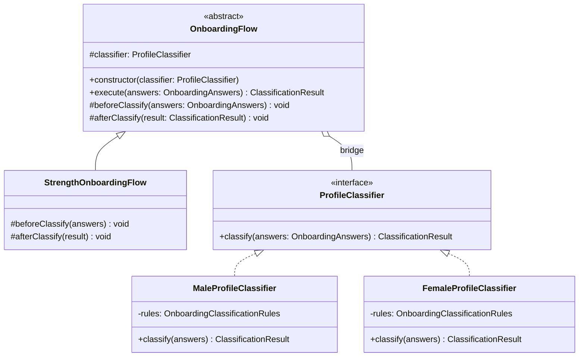
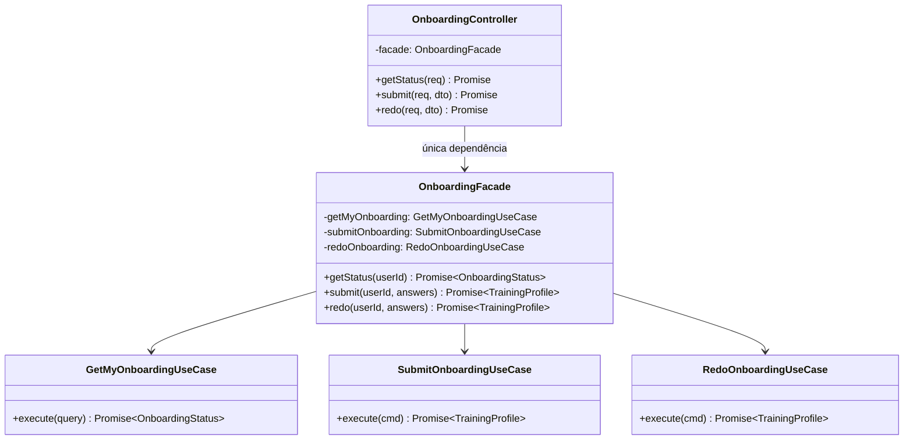
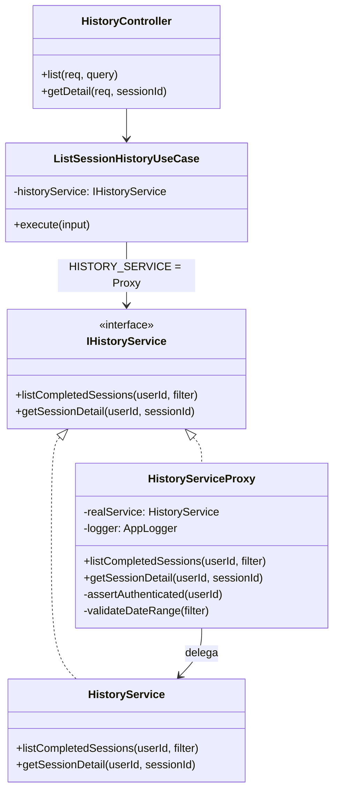
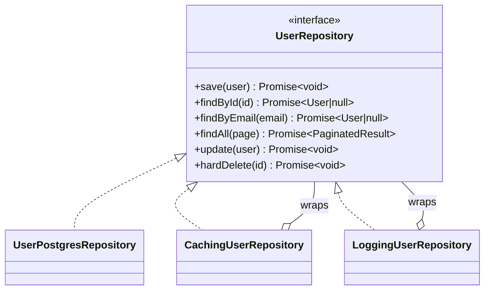
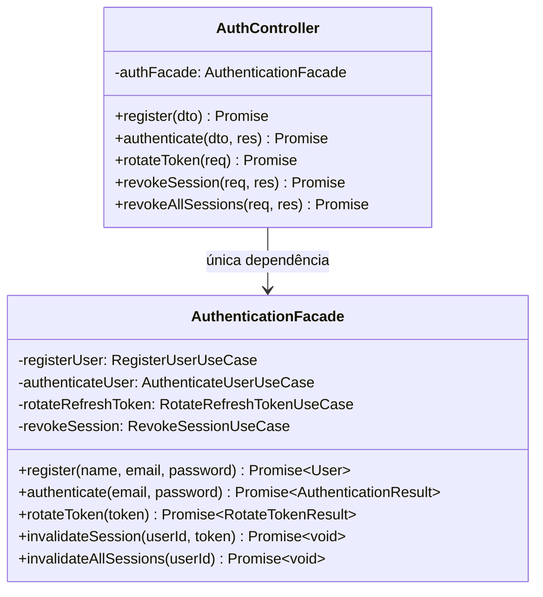
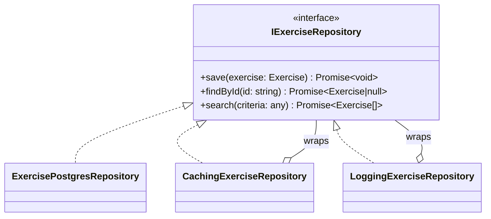
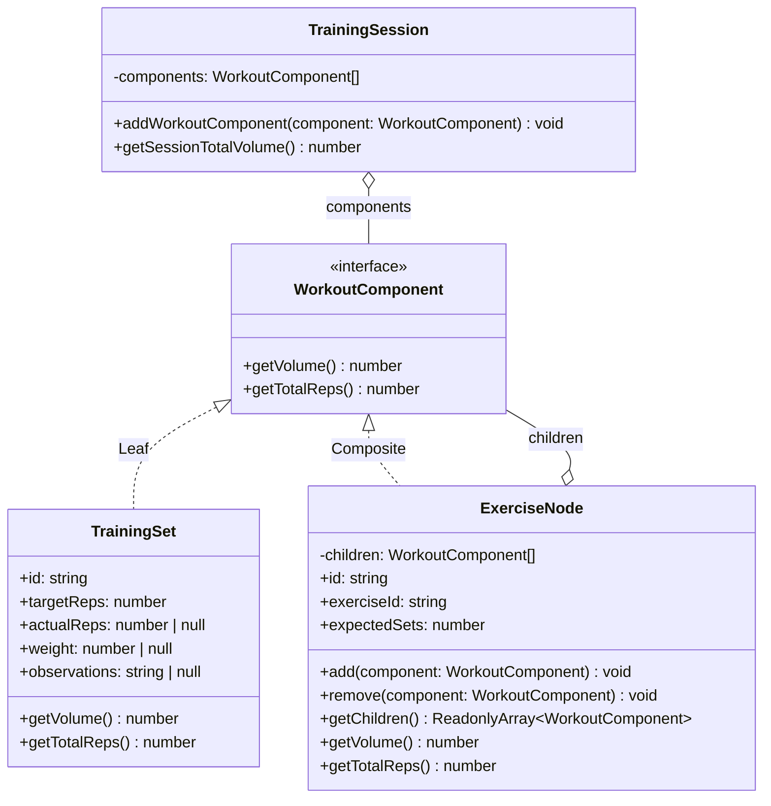
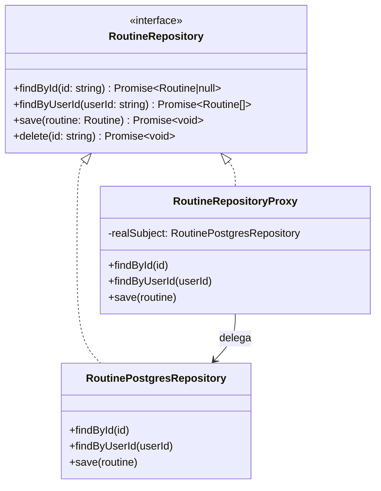

# 3.2. GoFs Estruturais

## Introdução

Os padrões estruturais tratam de como classes e objetos são compostos para formar estruturas maiores, mantendo flexibilidade e eficiência.

Este documento reúne as contribuições de **todos os módulos do projeto**. Cada seção identifica o módulo, o integrante responsável e o padrão GoF aplicado. As seções sinalizadas como **“a preencher”** aguardam a contribuição dos demais membros — siga a estrutura das seções já preenchidas como referência.

---

## Módulo de Onboarding

> **Responsável:** Lucas Antunes | **Branch:** `feat/modulo-on-boarding`
>
> Contexto: o desafio estrutural central era que **o fluxo de classificação de perfil precisa variar de acordo com o sexo biológico do usuário**, mas a lógica de orquestração do fluxo deve permanecer estável independentemente de qual classificador está em uso.

### Padrões analisados

| Padrão | Possível aplicação | Status | Justificativa |
|---|---|---|---|
| **Bridge** | Separar fluxo de classificação do classificador concreto | Selecionado | Permite variar hierarquia de fluxos e hierarquia de classificadores independentemente. |
| Decorator | Adicionar etapas ao fluxo de classificação | Avaliado | Útil para comportamentos opcionais em cadeia, mas o fluxo aqui tem estrutura fixa com hooks — Template Method via Bridge é mais claro. |
| Adapter | Adaptar classificadores externos | Não selecionado | Não há sistema legado a adaptar. |
| **Facade** | Simplificar acesso ao subsistema de onboarding | Implementado — ver seção abaixo | Único ponto de entrada da apresentação para os use cases; isola o controller do subsistema interno. |
| Composite | Compor múltiplas regras | Não selecionado | As regras são acumulativas; o Singleton de regras já as centraliza. |

### Padrão implementado — Bridge · `OnboardingFlow` + `ProfileClassifier`

#### Problema arquitetural

O requisito de negócio estabelece que **homens e mulheres passam por classificadores distintos**. Sem o Bridge, as alternativas seriam:

1. **Herança direta**: `MaleOnboardingFlow extends OnboardingFlow` e `FemaleOnboardingFlow extends OnboardingFlow`, cada um com o classificador embutido.
2. **Condicional em tempo de execução**: `if (sex === 'MALE') {... }` dentro do fluxo.

O Bridge resolve isso separando as duas hierarquias:

- **Abstração** (`OnboardingFlow`): orquestra o fluxo — `beforeClassify()`, `classify()`, `afterClassify()`.
- **Implementação** (`ProfileClassifier`): executa a classificação concreta de acordo com o perfil do usuário.

As duas hierarquias evoluem de forma independente: novos fluxos não exigem novos classificadores, e novos classificadores não exigem novos fluxos.

#### Justificativa da escolha

O Bridge foi escolhido porque o problema tem **duas dimensões de variação ortogonais**:

| Dimensão | Variações atuais | Variações futuras |
|---|---|---|
| **Fluxo** | `StrengthOnboardingFlow` | `EnduranceFlow`, `HypertrophyFlow` |
| **Classificador** | `MaleProfileClassifier`, `FemaleProfileClassifier` | Classificadores por faixa etária, por objetivo |

Qualquer combinação de fluxo × classificador funciona sem código adicional. O `SubmitOnboardingUseCase` seleciona o classificador com base no sexo e injeta no fluxo.

```typescript
const classifier =
  answers.sex === Sex.MALE
    ? new MaleProfileClassifier()
    : new FemaleProfileClassifier();

const flow = new StrengthOnboardingFlow(classifier);
return flow.execute(answers);
```

#### Modelagem



#### Implementação

| Elemento | Papel no Bridge | Caminho |
|---|---|---|
| `OnboardingFlow` | Abstração | `backend/src/domain/onboarding/bridge/onboarding-flow.abstract.ts` |
| `StrengthOnboardingFlow` | Abstração refinada | `backend/src/domain/onboarding/bridge/strength-onboarding-flow.ts` |
| `ProfileClassifier` | Interface da implementação | `backend/src/domain/onboarding/bridge/profile-classifier.interface.ts` |
| `MaleProfileClassifier` | Implementação concreta | `backend/src/domain/onboarding/bridge/male-profile-classifier.ts` |
| `FemaleProfileClassifier` | Implementação concreta | `backend/src/domain/onboarding/bridge/female-profile-classifier.ts` |
| `SubmitOnboardingUseCase` | Cliente que monta a ponte | `backend/src/application/onboarding/use-cases/submit-onboarding.use-case.ts` |
| Testes | Verificação da composição | `backend/src/domain/onboarding/bridge/classifiers.spec.ts` |

##### Trechos centrais

```typescript
// onboarding-flow.abstract.ts
export abstract class OnboardingFlow {
  constructor(protected readonly classifier: ProfileClassifier) {}

  execute(answers: OnboardingAnswers): ClassificationResult {
    this.beforeClassify(answers);
    const result = this.classifier.classify(answers);
    this.afterClassify(result);
    return result;
  }

  protected beforeClassify(_answers: OnboardingAnswers): void {}
  protected afterClassify(_result: ClassificationResult): void {}
}

// strength-onboarding-flow.ts
export class StrengthOnboardingFlow extends OnboardingFlow {
  protected override beforeClassify(answers: OnboardingAnswers): void {
    // validações específicas do fluxo de força, se houver
  }
}

// profile-classifier.interface.ts
export interface ProfileClassifier {
  classify(answers: OnboardingAnswers): ClassificationResult;
}

// male-profile-classifier.ts
export class MaleProfileClassifier implements ProfileClassifier {
  private readonly rules = OnboardingClassificationRules.getInstance();

  classify(answers: OnboardingAnswers): ClassificationResult {
    const score = this.rules.calculateScore(answers);
    return ClassificationResult.create(score);
  }
}
```

#### Evidência de execução

```text
✓ MaleProfileClassifier — score máximo (10) → ADVANCED
✓ MaleProfileClassifier — score mínimo (0) → BEGINNER
✓ FemaleProfileClassifier — score máximo (10) → ADVANCED
✓ FemaleProfileClassifier — score intermediário (6) → INTERMEDIATE
✓ StrengthOnboardingFlow com MaleProfileClassifier — execute() delega ao classificador
✓ StrengthOnboardingFlow com FemaleProfileClassifier — execute() delega ao classificador
```

Execute no container:

```bash
sudo docker compose exec api npx jest classifiers --verbose
```

#### Rastreabilidade

| Artefato | Relação |
|---|---|
| Requisito | Diferenciar homem e mulher no fluxo de classificação. |
| Módulo | `domain/onboarding/bridge` |
| Camada | Domínio |
| Padrão criacional relacionado | Singleton — classificadores usam `getInstance()`. |
| Padrão comportamental relacionado | Memento — fluxo produz `ClassificationResult` que é salvo antes do redo. |
| Use case consumidor | `application/onboarding/use-cases/submit-onboarding.use-case.ts` |

#### Senso crítico

##### Benefícios

- **Explosão de subclasses evitada**: novos fluxos e classificadores podem ser combinados sem multiplicar subclasses.
- **Testabilidade independente**: cada classificador é testável sem instanciar um fluxo; cada fluxo é testável com um mock de `ProfileClassifier`.
- **Open/Closed**: novos classificadores ou fluxos podem ser adicionados sem modificar código existente.

##### Limitações

- **Indireção extra**: para um caso com apenas dois classificadores, o Bridge pode parecer over-engineering.
- **Configuração do cliente**: quem instancia precisa conhecer as duas hierarquias para montar a combinação correta.

##### Alternativas consideradas

- **Strategy puro**: resolveria a variação de classificador, mas não encapsularia o protocolo de execução (`beforeClassify`/`afterClassify`).
- **Factory Method dentro do fluxo**: acoplaria as duas hierarquias, anulando o benefício principal do Bridge.

#### Referências

- GAMMA, E. et al. _Design Patterns: Elements of Reusable Object-Oriented Software_. Addison-Wesley, 1994. Cap. 4 — Structural Patterns, Bridge, p. 151–161.
- SHALLOWAY, A.; TROTT, J. _Design Patterns Explained_. Addison-Wesley, 2004. Cap. 11 — The Bridge Pattern.

---

### Padrão complementar — Facade · `OnboardingFacade`

#### Introdução

Além do Bridge, o módulo de onboarding implementa o padrão **Facade** na camada de apresentação. O Facade oferece uma interface simplificada para um conjunto de interfaces de um subsistema, tornando o subsistema mais fácil de usar.

Aqui ele atua como a única porta de entrada da camada de apresentação para toda a lógica de onboarding — o controller nunca chama use cases diretamente.

#### Problema arquitetural

O `OnboardingController` precisaria conhecer e instanciar três use cases distintos (`GetMyOnboardingUseCase`, `SubmitOnboardingUseCase`, `RedoOnboardingUseCase`) além de coordenar suas dependências.

Isso criaria dois problemas:

1. **Acoplamento da apresentação à aplicação**: o controller passaria a depender dos contratos internos de cada use case.
2. **Responsabilidade de orquestração no lugar errado**: a camada de apresentação não deve saber como o subsistema de onboarding é organizado internamente.

#### Justificativa da escolha

O `OnboardingFacade` concentra as três operações de onboarding em uma interface coesa de três métodos (`getStatus`, `submit`, `redo`). O controller depende exclusivamente dessa fachada — uma única dependência no lugar de três.

#### Modelagem



#### Implementação

| Elemento | Papel no Facade | Caminho |
|---|---|---|
| `OnboardingFacade` | Interface simplificada | `backend/src/presentation/facades/onboarding.facade.ts` |
| `GetMyOnboardingUseCase` | Consulta status | `backend/src/application/use-cases/onboarding/get-my-onboarding.use-case.ts` |
| `SubmitOnboardingUseCase` | Submete onboarding | `backend/src/application/use-cases/onboarding/submit-onboarding.use-case.ts` |
| `RedoOnboardingUseCase` | Refaz onboarding | `backend/src/application/use-cases/onboarding/redo-onboarding.use-case.ts` |
| `OnboardingController` | Cliente do Facade | `backend/src/presentation/controllers/onboarding.controller.ts` |

##### Trechos centrais

```typescript
// onboarding.facade.ts
export class OnboardingFacade {
  constructor(
    private readonly getMyOnboarding: GetMyOnboardingUseCase,
    private readonly submitOnboarding: SubmitOnboardingUseCase,
    private readonly redoOnboarding: RedoOnboardingUseCase,
  ) {}

  getStatus(userId: string): Promise<OnboardingStatus> {
    return this.getMyOnboarding.execute({ userId });
  }

  submit(
    userId: string,
    answers: OnboardingAnswersProps,
  ): Promise<TrainingProfile> {
    return this.submitOnboarding.execute({ userId, answers });
  }

  redo(
    userId: string,
    answers: OnboardingAnswersProps,
  ): Promise<TrainingProfile> {
    return this.redoOnboarding.execute({ userId, answers });
  }
}
```

#### Rastreabilidade

| Artefato | Relação |
|---|---|
| Módulo | `presentation/facades/` |
| Camada | Apresentação → Aplicação |
| Cliente | `presentation/controllers/onboarding.controller.ts` |
| Padrão estrutural relacionado | Bridge — acionado pelo `SubmitOnboardingUseCase` via Facade. |
| Padrão comportamental relacionado | Memento — acionado pelo `RedoOnboardingUseCase` via Facade. |

#### Senso crítico

##### Benefícios

- **Controller enxuto**: o controller possui uma única dependência injetada.
- **Isolamento de camadas**: a camada de apresentação não precisa conhecer a organização interna do subsistema.
- **Ponto único de refatoração**: se os use cases forem reorganizados, apenas o Facade é ajustado.

##### Limitações

- **Facade não valida**: a lógica de negócio permanece nos use cases.
- **Granularidade**: para subsistemas muito grandes, um único Facade pode crescer demais.

##### Alternativas consideradas

- **Injetar use cases diretamente no controller**: aumenta acoplamento.
- **Application Service**: semanticamente equivalente; a nomenclatura Facade foi mantida para alinhar com a disciplina.

#### Referências

- GAMMA, E. et al. _Design Patterns: Elements of Reusable Object-Oriented Software_. Addison-Wesley, 1994. Cap. 4 — Structural Patterns, Facade, p. 185–193.
- EVANS, E. _Domain-Driven Design_. Addison-Wesley, 2003. Cap. 4 — Isolating the Domain.

---

## Módulo de Histórico de Sessões

> **Responsável:** Giovanni Dornelas Ferreira | **Branch:** `feat/modulo-historico`
>
> Contexto: o histórico expõe operações sensíveis relacionadas aos dados de treino do usuário. O Proxy intercepta chamadas ao serviço real para **validar acesso, auditar logs e validar filtros** sem poluir a lógica de negócio.

### Padrões analisados

| Padrão | Possível aplicação | Status | Justificativa |
|---|---|---|---|
| **Proxy** | Intermediar `IHistoryService` | Selecionado | Controle transversal de acesso, logs e validação de datas transparente aos use cases. |
| Facade | Unificar listagem e detalhe | Avaliado | Controller já delega a use cases específicos; Proxy cobre o subsistema de serviço. |
| Decorator | Empilhar comportamentos no serviço | Avaliado | Proxy é mais adequado quando a interface é idêntica ao real e o objetivo é controlar acesso. |
| Adapter | Adaptar repositório legado | Não selecionado | Repositório TypeORM já segue contrato de domínio. |
| Bridge | Separar listagem de persistência | Não selecionado | Responsabilidades já estão separadas em serviço e repositório. |

### Padrão implementado — Proxy · `HistoryServiceProxy` → `HistoryService`

#### Problema arquitetural

Os use cases `ListSessionHistoryUseCase` e `GetSessionHistoryDetailUseCase` precisam de um serviço de histórico, mas **não devem** misturar:

1. **Regras de negócio**: consultar sessões concluídas, mapear DTOs e usar Multiton.
2. **Preocupações transversais**: garantir `userId` autenticado, validar intervalo de datas e registrar auditoria em log.

Sem Proxy, essas responsabilidades ficariam no `HistoryService` ou duplicadas em cada use case, violando Single Responsibility.

#### Justificativa da escolha

O Proxy implementa a mesma interface `IHistoryService` que o serviço real:

| Componente | Papel |
|---|---|
| `IHistoryService` | Contrato compartilhado |
| `HistoryService` | Serviço real — repositório, Multiton e mapeamento |
| `HistoryServiceProxy` | Intercepta chamadas, valida, registra log e delega ao real |

No NestJS, o token `HISTORY_SERVICE` resolve para o Proxy; use cases nunca injetam o serviço real diretamente.

#### Modelagem



#### Implementação

| Elemento | Papel no Proxy | Caminho |
|---|---|---|
| `IHistoryService` | Interface | `backend/src/domain/history/services/i-history.service.ts` |
| `HistoryService` | Real subject | `backend/src/application/services/history.service.ts` |
| `HistoryServiceProxy` | Proxy | `backend/src/infrastructure/services/history-service.proxy.ts` |
| Provider NestJS | Wiring | `backend/src/infrastructure/modules/history.module.ts` |
| Use cases | Clientes | `backend/src/application/use-cases/history/` |
| Controller | HTTP | `backend/src/presentation/controllers/history.controller.ts` |

##### Trechos centrais

```typescript
// history.module.ts
{
  provide: HISTORY_SERVICE,
  useFactory: (real: HistoryService, logger: AppLogger) =>
    new HistoryServiceProxy(real, logger),
  inject: [HistoryService, APP_LOGGER],
}

// history-service.proxy.ts
export class HistoryServiceProxy implements IHistoryService {
  constructor(
    private readonly realService: HistoryService,
    @Inject(APP_LOGGER) private readonly logger: AppLogger,
  ) {}

  async listCompletedSessions(
    authenticatedUserId: string,
    filter?: DateRangeFilter,
  ) {
    this.assertAuthenticated(authenticatedUserId);
    this.validateDateRange(filter);
    this.logger.log(`[HistoryProxy] Listagem — userId=${authenticatedUserId}`);
    return this.realService.listCompletedSessions(authenticatedUserId, filter);
  }
}
```

#### Evidência de execução

1. Registrar sessão e listar histórico com token válido → logs contêm `[HistoryProxy] Listagem`.
2. Chamar listagem com `startDate` posterior a `endDate` → resposta `400` com mensagem de intervalo inválido.
3. Swagger: tag **history** — `GET /v1/history/sessions` e `GET /v1/history/sessions/{sessionId}`.

```bash
curl -s -H "Authorization: Bearer TOKEN" \
  "http://localhost:3000/v1/history/sessions?startDate=2026-01-01T00:00:00.000Z&endDate=2026-12-31T23:59:59.999Z"
```

#### Rastreabilidade

| Artefato | Relação |
|---|---|
| Requisitos | RF26, RF27 |
| Módulo | `infrastructure/services/`, `application/services/` |
| Camada | Infraestrutura + Aplicação |
| Padrão criacional relacionado | Multiton — serviço real usa `HistoryManager.getInstance`. |
| Padrão comportamental relacionado | Observer — atualiza cache antes da leitura via Proxy. |
| Guard de apresentação | `BearerTokenGuard` — autenticação HTTP; Proxy valida `userId`. |

#### Senso crítico

##### Benefícios

- **Separação clara**: regras de listagem e detalhe permanecem no `HistoryService`; auditoria e validação ficam no Proxy.
- **Substituível**: pode-se adicionar cache ou rate limit no Proxy sem alterar use cases.
- **Testável**: o serviço real pode ser testado sem mocks de logger; o Proxy pode ser testado com mock do serviço real.

##### Limitações

- **Autenticação HTTP já existe**: o `BearerTokenGuard` já garante usuário logado; o Proxy reforça `userId` não vazio como defesa em profundidade.
- **Não é Proxy remoto**: trata-se de Proxy de proteção local.

##### Alternativas consideradas

- **Middleware NestJS global**: validaria HTTP, mas não encapsularia o contrato `IHistoryService`.
- **Decorator sobre `HistoryService`**: semanticamente próximo; Proxy foi escolhido por alinhar melhor ao controle de acesso ao serviço real.

#### Referências

- GAMMA, E. et al. _Design Patterns: Elements of Reusable Object-Oriented Software_. Addison-Wesley, 1994. Cap. 4 — Structural Patterns, Proxy, p. 207–213.
- FOWLER, M. _Patterns of Enterprise Application Architecture_. Addison-Wesley, 2002.

---

## Módulo de Autenticação

> **Responsável:** Samuel Nogueira Caetano | **Branch:** `main (integrada a partir da feat/modulo-autenticacao)`
>
> Contexto: o desafio estrutural central era que **o repositório de usuários precisa acumular comportamentos transversais, como cache e log, sem alterar a implementação de persistência**, e que **o controller de autenticação não deve conhecer a estrutura interna dos use cases** que compõem o fluxo de autenticação.

### Padrões analisados

| Padrão | Possível aplicação | Status | Justificativa |
|---|---|---|---|
| **Decorator** | Adicionar cache e log ao repositório de usuários sem alterar a implementação | Selecionado | Permite empilhar comportamentos transversais sobre `UserPostgresRepository` de forma independente e combinável. |
| **Facade** | Simplificar acesso ao subsistema de autenticação a partir do controller | Implementado — ver seção abaixo | Único ponto de entrada da apresentação para os use cases de auth. |
| Adapter | Adaptar a API do TypeORM à interface de domínio | Não selecionado | Os repositórios já traduzem ORM ↔ domínio internamente. |
| Proxy | Controlar acesso ou adiar carregamento do repositório | Não selecionado | O controle de acesso é feito por guards na camada de apresentação; o Decorator cobre os comportamentos transversais restantes. |
| Composite | Compor múltiplas regras de validação de token | Não selecionado | As validações são sequenciais e exclusivas. |

### Padrão implementado — Decorator · `CachingUserRepository` + `LoggingUserRepository`

#### Problema arquitetural

O `UserPostgresRepository` realiza I/O real com o banco em cada chamada. A aplicação precisava de dois comportamentos adicionais:

1. **Cache em memória** — evitar consultas repetidas ao banco para o mesmo `id` ou `email`.
2. **Log estruturado** — registrar início, conclusão e falha de cada operação, com `correlationId`, sem poluir a lógica de persistência.

Sem o Decorator, a lógica de cache e log ficaria embutida no repositório ou exigiria herança acoplada à implementação concreta de Postgres.

#### Justificativa da escolha

O Decorator foi escolhido porque os comportamentos a adicionar são **ortogonais à persistência** e **precisam ser combináveis independentemente**:

| Camada | Classe | Responsabilidade |
|---|---|---|
| Base | `UserPostgresRepository` | Persistência real com TypeORM |
| 1ª decoração | `CachingUserRepository` | Cache em memória |
| 2ª decoração | `LoggingUserRepository` | Log estruturado com correlationId |

```typescript
const base = new UserPostgresRepository(ormRepo);
const cached = new CachingUserRepository(base);
return new LoggingUserRepository(cached, logger);
```

#### Modelagem



#### Implementação

| Elemento | Papel no Decorator | Caminho |
|---|---|---|
| `UserRepository` | Interface do componente | `backend/src/domain/repositories/user.repository.ts` |
| `UserPostgresRepository` | Componente concreto | `backend/src/infrastructure/database/user.postgres-repository.ts` |
| `CachingUserRepository` | Decorator de cache | `backend/src/infrastructure/database/caching-user.repository.ts` |
| `LoggingUserRepository` | Decorator de log | `backend/src/infrastructure/database/logging-user.repository.ts` |
| `AuthModule` | Cliente que compõe a pilha | `backend/src/infrastructure/modules/auth.module.ts` |

#### Rastreabilidade

| Artefato | Relação |
|---|---|
| Requisito | Evitar consultas redundantes ao banco; manter log estruturado por operação. |
| Módulo | `infrastructure/database/` |
| Camada | Infraestrutura |
| Padrão comportamental relacionado | Observer — `DomainEventBus` consome eventos publicados após operações que passam por este repositório. |
| Padrão criacional relacionado | Factory Method — `User.reconstitute()` é chamado dentro de `toDomain()` no componente base. |
| Ponto de composição | `infrastructure/modules/auth.module.ts` |

#### Senso crítico

##### Benefícios

- **Responsabilidade única preservada**: cada classe tem um único motivo para mudar.
- **Combinação livre**: remover o cache em testes de integração exige trocar apenas a composição no módulo.
- **Transparência para os use cases**: os use cases recebem `UserRepository` e não conhecem as camadas decoradoras.

##### Limitações

- **Cache sem TTL**: o cache em memória não possui expiração.
- **Escopo por instância**: adequado para o projeto, mas exige mecanismo externo em deploy com múltiplas instâncias.

##### Alternativas consideradas

- **Herança com mixin**: criaria uma classe monolítica.
- **Proxy dinâmico com ES6 `Proxy`**: dificultaria a rastreabilidade estática em TypeScript.

#### Referências

- GAMMA, E. et al. _Design Patterns: Elements of Reusable Object-Oriented Software_. Addison-Wesley, 1994. Cap. 4 — Structural Patterns, Decorator, p. 175–184.
- MARTIN, R. C. _Agile Software Development: Principles, Patterns, and Practices_. Prentice Hall, 2002. Cap. 14 — The Open/Closed Principle.

---

### Padrão complementar — Facade · `AuthenticationFacade`

#### Introdução

Além do Decorator, o módulo de autenticação implementa o padrão **Facade** na camada de apresentação. Aqui ele atua como a única porta de entrada do `AuthController` para os use cases de autenticação — o controller nunca instancia nem referencia use cases diretamente.

#### Problema arquitetural

O `AuthController` precisaria depender de quatro use cases distintos (`RegisterUserUseCase`, `AuthenticateUserUseCase`, `RotateRefreshTokenUseCase`, `RevokeSessionUseCase`) e conhecer os tipos de entrada e saída de cada um, criando acoplamento da apresentação à aplicação.

#### Justificativa da escolha

O `AuthenticationFacade` expõe operações nomeadas de forma orientada ao negócio (`register`, `authenticate`, `rotateToken`, `invalidateSession`, `invalidateAllSessions`), traduzindo as chamadas em comandos específicos de cada use case.

#### Modelagem



#### Rastreabilidade

| Artefato | Relação |
|---|---|
| Módulo | `presentation/facades/` |
| Camada | Apresentação → Aplicação |
| Cliente | `presentation/controllers/auth.controller.ts` |
| Padrão estrutural relacionado | Decorator — o repositório consumido pelos use cases acionados pelo Facade é uma pilha de decoradores. |
| Padrão comportamental relacionado | Template Method — todos os use cases acionados pelo Facade estendem `UseCase<TInput, TOutput>`. |

#### Referências

- GAMMA, E. et al. _Design Patterns: Elements of Reusable Object-Oriented Software_. Addison-Wesley, 1994. Cap. 4 — Structural Patterns, Facade, p. 185–193.
- EVANS, E. _Domain-Driven Design_. Addison-Wesley, 2003. Cap. 4 — Isolating the Domain.

---

## Módulo de Exercícios

> **Responsável:** Daniel Teles | **Branch:** `feature/exercise_module`
>
> Contexto: melhorar observabilidade e desempenho do repositório de `Exercise` sem alterar o repositório base. O objetivo era registrar falhas e operações, além de adicionar cache em memória para leituras frequentes.

### Padrões analisados

| Padrão | Possível aplicação | Status | Justificativa |
|---|---|---|---|
| **Decorator** | Envolver `ExerciseRepository` com logging e caching | Selecionado | Permite adicionar comportamento sem modificar a implementação base. |
| Proxy | Controle de acesso ou lazy loading | Avaliado | Proxy cobre autenticação/controle; logging e cache são melhor tratados por decorators separados. |

### Padrão implementado — Decorator · `LoggingExerciseRepository` + `CachingExerciseRepository`

#### Problema arquitetural

Operações de leitura sobre `exercises` são frequentes e precisam ser auditáveis e rápidas. Modificar `ExercisePostgresRepository` diretamente para inserir logs e cache acoplaria a persistência a preocupações transversais.

#### Justificativa da escolha

O padrão Decorator permite empilhar comportamentos em camadas: a implementação base (`ExercisePostgresRepository`) permanece focada em persistência; `CachingExerciseRepository` adiciona cache; `LoggingExerciseRepository` adiciona logs e tratamento de erros com contexto.

#### Modelagem



#### Implementação

| Elemento | Papel no Decorator | Caminho |
|---|---|---|
| `IExerciseRepository` | Interface do componente | `backend/src/domain/repositories/exercise.repository.ts` |
| `ExercisePostgresRepository` | Componente concreto | `backend/src/infrastructure/database/exercise.postgres-repository.ts` |
| `CachingExerciseRepository` | Decorator de cache | `backend/src/infrastructure/database/caching-exercise.repository.ts` |
| `LoggingExerciseRepository` | Decorator de log | `backend/src/infrastructure/database/logging-exercise.repository.ts` |
| `ExerciseModule` | Cliente que compõe a pilha | `backend/src/infrastructure/modules/exercise.module.ts` |

##### Trecho central

```typescript
const base = new ExercisePostgresRepository(ormRepo);
const cached = new CachingExerciseRepository(base);
const logging = new LoggingExerciseRepository(cached, logger);
// exportado como EXERCISE_REPOSITORY → logging
```

#### Evidência de execução

Os logs aparecem no console do container indicando tempo de execução e sucesso das chamadas. O cache invalida ou usa dados em memória conforme necessário.

```bash
docker compose logs api
```

#### Rastreabilidade

| Artefato | Relação |
|---|---|
| Requisito | RF13, RF14 — performance e observabilidade em operações de exercício. |
| Módulo | `infrastructure/database/` · `infrastructure/modules/exercise.module.ts` |
| Camada | Infraestrutura |
| Padrão criacional relacionado | Builder — o agregado `Exercise` produzido pelo `ExerciseBuilder` é persistido via este repositório. |
| Ponto de composição | `infrastructure/modules/exercise.module.ts` |

#### Senso crítico

##### Benefícios

- **Responsabilidade única**: logs, cache e persistência ficam em classes separadas.
- **Open/Closed**: novos decorators podem ser adicionados sem tocar no repositório base.
- **Transparência**: use cases e controllers enxergam apenas a interface `IExerciseRepository`.

##### Limitações

- **Cadeia de chamadas empilhada**: múltiplas camadas geram indireção.
- **Complexidade de depuração**: um decorator que altere erros indevidamente pode dificultar rastreamento.

##### Alternativas consideradas

- **Interceptors NestJS / AOP**: descartados porque amarrariam cache e logging ao framework.

#### Referências

- GAMMA, E. et al. _Design Patterns: Elements of Reusable Object-Oriented Software_. Addison-Wesley, 1994. Cap. 4 — Structural Patterns, Decorator.

## Módulo de Sessão de Treino — Composite

> **Responsável:** Eduardo Waski | **Branch:** `feat/modulo-sessao-treino`
>
> Contexto: o desafio estrutural consistia em modelar e organizar a sessão de treino de forma a permitir diferentes composições de exercícios e séries (como exercícios isolados, e futuramente bi-sets, tri-sets ou circuitos) sem acoplar a classe da sessão à lógica interna de cálculo de métricas físicas como volume total e repetições acumuladas.

### Padrões analisados

| Padrão | Possível aplicação | Status | Justificativa |
|---|---|---|---|
| **Composite** | Representar a estrutura do treino (exercícios e séries) de forma unificada | Selecionado | Permite tratar exercícios (`ExerciseNode`) e suas séries individuais (`TrainingSet`) sob uma mesma interface (`WorkoutComponent`), facilitando o cálculo de métricas agregadas como volume e repetições de forma recursiva e transparente. |
| Decorator | Adicionar dinamicamente comportamentos aos exercícios ou séries | Avaliado | Não há necessidade de estender ou modificar dinamicamente o comportamento de exercícios no nível de domínio; a lógica é estritamente de composição estrutural. |
| Adapter | Adaptar objetos externos para a estrutura de sessão | Não selecionado | A tradução de dados externos para o domínio é resolvida na camada de aplicação via DTOs e mapeadores simples. |

### Padrão implementado — Composite · `WorkoutComponent` (Interface) · `ExerciseNode` (Composite) · `TrainingSet` (Leaf)

### Problema arquitetural

Uma sessão de treino possui uma estrutura inerentemente hierárquica: uma sessão contém múltiplos exercícios, e cada exercício contém uma ou mais séries executadas. Além disso, no fisiculturismo e treinamento de força, é comum agrupar exercícios em estruturas complexas, tais como superséries (executar dois exercícios alternadamente sem descanso) ou circuitos.

Se modelássemos essa estrutura de forma plana ou acoplada, surgiriam problemas críticos de design:
1. **Acoplamento a tipos específicos**: A classe principal `TrainingSession` precisaria conhecer explicitamente e gerenciar listas separadas para exercícios simples, superséries e séries individuais.
2. **Propagação manual de dados**: O cálculo do volume total da sessão (`getSessionTotalVolume()`) exigiria laços de repetição e condicionais aninhados complexos (ex.: `if (isSuperset) { ... } else if (isSingle) { ... }`) na classe da sessão, violando o Princípio de Responsabilidade Única (SRP) e o Princípio Open/Closed (OCP).

### Justificativa da escolha

O padrão **Composite** resolve essa questão ao definir a interface comum `WorkoutComponent` que unifica o comportamento de componentes folha (séries individuais) e componentes compostos (exercícios).

- **Componente (`WorkoutComponent`)**: Interface base que declara os métodos comuns de cálculo físico: `getVolume()` e `getTotalReps()`.
- **Folha (`TrainingSet`)**: Representa uma série executada. Implementa a interface base realizando o cálculo real de volume (`reps * weight`).
- **Composto (`ExerciseNode`)**: Representa um exercício (que agrupa séries/folhas). Implementa os métodos da interface delegando a execução para a sua lista interna de filhos (`children: WorkoutComponent[]`) e somando os resultados.

Isso permite que a `TrainingSession` enxergue apenas uma coleção genérica de `WorkoutComponent`s. Ao invocar `getSessionTotalVolume()`, a sessão apenas delega o cálculo a cada componente de primeiro nível, o qual propaga a chamada recursivamente caso seja um nó composto, de forma totalmente transparente para o cliente.

### Modelagem



### Implementação

| Elemento | Papel no Composite | Caminho |
|---|---|---|
| `WorkoutComponent` | Component (Interface) | `backend/src/domain/entities/workout-component.ts` |
| `TrainingSet` | Leaf | `backend/src/domain/entities/training-set.ts` |
| `ExerciseNode` | Composite | `backend/src/domain/entities/exercise-node.ts` |
| `TrainingSession` | Client | `backend/src/domain/entities/training-session.ts` |

#### Trechos centrais

```typescript
// workout-component.ts
export interface WorkoutComponent {
  getVolume(): number;
  getTotalReps(): number;
}

// training-set.ts (Leaf)
export class TrainingSet implements WorkoutComponent {
  constructor(
    public readonly id: string,
    public readonly targetReps: number,
    public readonly actualReps: number | null,
    public readonly weight: number | null,
    public readonly observations: string | null,
  ) {}

  public getVolume(): number {
    if (!this.actualReps) return 0;
    if (this.weight && this.weight > 0) {
      return this.actualReps * this.weight;
    }
    return this.actualReps; // fallback para peso corporal
  }

  public getTotalReps(): number {
    return this.actualReps || 0;
  }
}

// exercise-node.ts (Composite)
export class ExerciseNode implements WorkoutComponent {
  private readonly children: WorkoutComponent[] = [];

  constructor(
    public readonly id: string,
    public readonly exerciseId: string,
    public readonly expectedSets: number,
  ) {}

  public add(component: WorkoutComponent): void {
    this.children.push(component);
  }

  public remove(component: WorkoutComponent): void {
    const index = this.children.indexOf(component);
    if (index !== -1) this.children.splice(index, 1);
  }

  public getVolume(): number {
    return this.children.reduce((total, child) => total + child.getVolume(), 0);
  }

  public getTotalReps(): number {
    return this.children.reduce((total, child) => total + child.getTotalReps(), 0);
  }
}
```

### Evidência de execução

Os testes unitários do módulo comprovam a corretude matemática da soma recursiva de volumes e repetições:

```text
PASS  src/domain/entities/training-session.spec.ts
  Workout Session Domain Modules (Builder, Composite, Iterator)
    Composite Pattern - WorkoutComponent, ExerciseNode, TrainingSet
      ✓ should calculate volume and reps for TrainingSet (Leaf) (1 ms)
      ✓ should calculate aggregated volume and reps for ExerciseNode (Composite) (1 ms)
      ✓ should calculate total session volume via Composite traversal (1 ms)
```

Para executar localmente via container Docker:

```bash
docker compose exec api npx jest training-session --verbose
```

### Rastreabilidade

| Artefato | Relação |
|---|---|
| Requisitos | RF22 — Registrar sessão; RF23 — Consultar sessão; RF28 — Exibir resumo semanal (cálculo de constância e volume). |
| Módulo | `domain/entities/` |
| Camada | Domínio (representação das entidades e invariantes estruturais). |
| Padrão criacional relacionado | Builder — `TrainingSessionBuilder` monta a hierarquia. |
| Padrão comportamental relacionado | Iterator — percorre recursivamente o Composite para fins de indexação/listagem linear. |
| Endpoint consumidor | `POST /v1/sessions` |
| Arquivo de testes | `src/domain/entities/training-session.spec.ts` |

### Senso crítico

#### Benefícios

- **Uniformidade no tratamento**: O cliente trata folhas (séries) e compostos (exercícios) de forma idêntica via interface comum.
- **Princípio Open/Closed (OCP)**: Adicionar novos agrupamentos complexos no futuro (como superséries contendo subexercícios) exige apenas a criação de um novo `WorkoutComponent` composto, sem alterar a classe `TrainingSession`.
- **Simplicidade Aritmética**: A recursividade do padrão elimina if-else complexos para calcular volume total.

#### Limitações

- **Dificuldade em restringir operações na compilação**: O design clássico do Composite declara métodos de alteração de filhos (`add()`, `remove()`) na classe composta, o que pode forçar typecasts ou checagens em runtime (`instanceof`) se o cliente tiver apenas uma referência da interface genérica `WorkoutComponent` e precisar alterar a árvore.
- **Representação em Banco de Dados**: Mapear uma árvore composite pura para tabelas relacionais do PostgreSQL exige tabelas separadas ou tabelas com relacionamentos auto-referenciados, aumentando a complexidade das queries de infraestrutura (TypeORM).

#### Alternativas consideradas

- **Modelagem Plana (Flat Table)**: Ter apenas uma classe `TrainingSession` contendo uma lista plana de `TrainingSet`s com uma propriedade referenciando o `exerciseId`. Descartado por limitar severamente a extensibilidade para modelar estruturas de treinos compostos e por espalhar lógicas de agrupamento pela aplicação.

### Referências

- GAMMA, E. et al. _Design Patterns: Elements of Reusable Object-Oriented Software_. Addison-Wesley, 1994. Cap. 4 — Structural Patterns, Composite, p. 163–173.
- VERNON, V. _Implementing Domain-Driven Design_. Addison-Wesley, 2013. Cap. 7 — Aggregates.

---

## Módulo de Usuário — Facade

**Autor:** André Ricardo Meyer de Melo
**Funcionalidades:** RF04 (Recuperar Senha) e RF07 (Excluir Conta)

### Problema

Os fluxos de recuperação de senha e exclusão de conta orquestram múltiplos subsistemas: cadeia de responsabilidade, repositórios de token e usuário, serviço de e-mail, serviço de hash e barramento de eventos. Sem uma camada de fachada, o controller precisaria conhecer e instanciar cada um desses colaboradores, violando o princípio de responsabilidade única e acoplando a camada de apresentação à aplicação.

### Solução

`PasswordResetFacade` e `AccountDeletionFacade` expõem cada fluxo como um único método público. O controller chama apenas a facade — nunca handlers, use cases ou repositórios diretamente.

```typescript
// Controller RF04 — apenas 2 chamadas de facade
await this.passwordResetFacade.requestReset(dto.email);
await this.passwordResetFacade.confirmReset(dto.token, dto.newPassword);

// Controller RF07 — apenas 1 chamada de facade
await this.accountDeletionFacade.delete(userId, dto.password, dto.confirmation);
```

### Diagrama


### Artefatos

| Papel GoF | Classe | Arquivo |
|---|---|---|
| Facade | `PasswordResetFacade` | `presentation/facades/password-reset.facade.ts` |
| Facade | `AccountDeletionFacade` | `presentation/facades/account-deletion.facade.ts` |
| Client | `PasswordResetController` | `presentation/controllers/password-reset.controller.ts` |
| Client | `UserController` | `presentation/controllers/user.controller.ts` |

### Senso Crítico

**Benefícios:**
- Controller reduzido a roteamento e extração de DTO — sem lógica de negócio
- Subsistemas (cadeia, repositórios, e-mail) podem ser substituídos sem alterar o controller
- Segue o mesmo estilo da `AuthenticationFacade` já existente no projeto, mantendo consistência arquitetural

**Limitações:**
- A facade não valida os dados de entrada — delega isso ao Builder e aos handlers da cadeia, o que exige atenção ao rastrear onde cada validação ocorre

---

## Módulo de Rotinas

**Responsável:** José Victor Gabriel Menezes da Costa <br>
**Branch:** `feat/modulo-rotinas`

### Padrão implementado — Proxy `RoutineRepositoryProxy`

### Problema arquitetural

Acessar o banco de dados de forma crua pelos casos de uso impede a injeção limpa de regras de controle (como logging avançado, métricas ou verificações de precondições globais de I/O). Adicionar essas lógicas diretamente no `RoutinePostgresRepository` violaria o princípio de Responsabilidade Única (SRP), misturando persistência com infraestrutura acessória.

### Padrões analisados

| Padrão | Possível aplicação | Status | Justificativa |
|---|---|---|---|
| **Proxy** | Interceptar chamadas ao repositório de rotinas | Selecionado | Mantém a integridade do OCP (Open/Closed Principle) controlando o acesso e a delegação sem alterar a classe concreta. |
| Decorator | Empilhar cache e log no repositório | Avaliado | O Proxy foi preferido para o módulo de rotinas por ter um foco maior no controle e bloqueio/validação de delegação, em vez de apenas acúmulo de *features*. |
| Adapter | Traduzir DTOs do banco | Não selecionado | A lógica de reconstituição do próprio repositório já atua como mapeador, dispensando um adapter externo. |


### Justificativa da escolha

O Proxy assume a mesma interface do repositório real (`RoutineRepository`). A camada de aplicação desconhece essa troca e continua operando normalmente. O Proxy recebe a requisição, aplica as interceptações necessárias de forma transparente e então delega a persistência final ao repositório do banco de dados (o Real Subject).

### Modelagem



### Implementação (caminhos)

| Elemento | Caminho |
|---|---|
| Interface Subject | `backend/src/domain/repositories/routine.repository.ts` |
| Proxy | `backend/src/infrastructure/proxies/routine-repository.proxy.ts` |
| Real Subject | `backend/src/infrastructure/database/routine.postgres-repository.ts` |


### Trecho Central

Localizado no arquivo `backend/src/infrastructure/proxies/routine-repository.proxy.ts`.

```typescript
@Injectable()
export class RoutineRepositoryProxy implements RoutineRepository {
  constructor(
    @Inject('REAL_ROUTINE_REPOSITORY')
    private readonly realRepository: RoutineRepository,

    @Inject(TRAINING_SESSION_REPOSITORY)
    private readonly sessionRepository: ITrainingSessionRepository,
  ) {}

  async findById(id: string): Promise<Routine | null> {
    return this.realRepository.findById(id);
  }

  async findByUserId(userId: string): Promise<Routine[]> {
    return this.realRepository.findByUserId(userId);
  }

  async save(routine: Routine): Promise<void> {
    const hasHistory = await this.sessionRepository.hasCompletedSessions(
      routine.id.toString(),
    );

    if (hasHistory) {
      throw new ValidationException(
        'Proxy Protection: Esta rotina possui histórico de treinos e não pode ser editada diretamente.',
      );
    }

    await this.realRepository.save(routine);
  }

  async delete(id: string): Promise<void> {
    await this.realRepository.delete(id);
  }
}
```

### Evidência de execução

No GIF abaixo, podemos ver a clonagem funcionando na prática, e podemos ver onde os arquivos foram implementados:


### Rastreabilidade

| Artefato | Relação |
|---|---|
| Requisito | US17, US19, US20 e US21 (O Proxy intercepta de forma transversal a persistência de criação, edição, inativação e ativação de fichas). |
| Módulo | `infrastructure/proxies/` |
| Camada | Infraestrutura |
| Padrão criacional relacionado | **Prototype** — as rotinas clonadas são persistidas passando pelo Proxy. |


### Vantagens e Desvantagens

#### Vantagens

- **Princípio do Aberto/Fechado (OCP)**: a lógica transversal pode evoluir no Proxy sem que o repositório TypeORM seja tocado.
- **Transparência**: casos de uso não percebem a diferença entre o Proxy e o Repositório, pois o contrato da interface é mantido.

#### Desvantagens

- **Complexidade de Injeção**: aumenta a complexidade no arquivo de módulos (app.module.ts), pois a abstração agora resolve para o Proxy, que manualmente consome o repositório base.

#### Alternativas consideradas

- **Interceptors Nativos do NestJS**: eficazes na borda (Controllers), mas ruins para proteger invocações internas feitas entre serviços de domínio. O Proxy se mantém agnóstico a decorators HTTP.

## Histórico de versões

| Versão | Data | Descrição | Autor |
|---|---|---|---|
| 1.0 | 19/05/2026 | Documentação dos padrões Bridge e Facade do módulo de Onboarding. | Lucas Antunes |
| 1.1 | 20/05/2026 | Documentação dos padrões Decorator e Facade do módulo de Autenticação. | Samuel Nogueira Caetano |
| 1.2 | 20/05/2026 | Documentação do padrão Proxy do módulo de Histórico de Sessões. | Giovanni Dornelas Ferreira |
| 1.3 | 21/05/2026 | Documentação do padrão Decorator para o repositório de Exercícios. | Daniel Teles |
| 1.4    | 21/05/2026 | Documentação do padrão Facade do módulo de Usuário, referente aos RF04 e RF07.  | André Ricardo Meyer de Melo |
| 1.5 | 21/05/2026 | Documentação do padrão Composite do módulo de Sessão de Treino. | Eduardo Waski |
| 1.6 | 21/05/2026 | Documentação do Proxy relacionada ao módulo de Rotinas  | José Victor Gabriel Menezes da Costa |