# 3.3. GoFs Comportamentais

## Introdução

Os padrões comportamentais tratam de algoritmos e da atribuição de responsabilidades entre objetos, focando em como os objetos interagem e distribuem responsabilidade.

Este documento reúne as contribuições de **todos os módulos do projeto**. Cada seção identifica o módulo, o integrante responsável e o padrão GoF aplicado. Ao final do arquivo, a seção **"[Módulo: ____________] — A preencher"** permanece disponível para novas contribuições.

---

## Módulo de Onboarding

> **Responsável:** Lucas Antunes | **Branch:** `feat/modulo-on-boarding`
>
> Contexto: o desafio comportamental central era que **ao refazer o onboarding, o estado anterior do perfil deve ser preservado** antes de ser sobrescrito — tanto para fins de auditoria quanto para eventual reversão. Adicionalmente, o **fluxo de classificação segue uma sequência de etapas imutável** definida pelo Template Method.

### Padrões analisados

| Padrão | Possível aplicação | Status | Justificativa |
|---|---|---|---|
| **Memento** | Preservar estado do perfil antes do redo | Selecionado | Permite snapshot do estado interno da entidade sem expor seus atributos privados. |
| Command | Encapsular a operação de redo como comando reversível | Avaliado | O redo não precisa de desfazer interativo; o histórico persistido é suficiente. |
| Observer | Notificar outros módulos quando o perfil muda | Avaliado | Relevante para evoluções futuras; adiado para não criar acoplamento prematuro. |
| Chain of Responsibility | Cadeia de validações antes de classificar | Não selecionado | As validações estão no Value Object `OnboardingAnswers`, onde pertencem ao domínio. |
| Template Method | Definir esqueleto do fluxo de classificação | Implementado como complemento | Presente em `OnboardingFlow`; o Memento é ortogonal a ele. |
| Strategy | Variar algoritmo de classificação | Avaliado | Absorvido pelo Bridge, que é mais adequado para duas dimensões de variação. |

### Padrão implementado — Memento · `TrainingProfile.createMemento()` + `OnboardingMementoVO`

#### Problema arquitetural

O fluxo de "refazer onboarding" (`PUT /v1/onboarding`) precisa:

1. Recuperar o perfil atual do usuário.
2. **Preservar esse estado** antes de modificá-lo.
3. Atualizar o perfil com as novas respostas e nova classificação.

O problema é que `TrainingProfile` é uma entidade de domínio rica — seus atributos são privados, encapsulados para garantir invariantes. Se o `RedoOnboardingUseCase` tentasse ler os atributos diretamente para montar um snapshot, violaria o encapsulamento da entidade, tornando o domínio frágil.

O Memento resolve isso: a própria entidade é responsável por **criar o snapshot de si mesma** (`createMemento()`), encapsulando o "como salvar" dentro do objeto que sabe o que salvar.

#### Justificativa da escolha

O Memento é o padrão canônico para esse cenário porque:

- **Preserva o encapsulamento**: `TrainingProfile.createMemento()` cria o snapshot usando seus próprios atributos privados.
- **Separação de responsabilidades**: a entidade sabe _o que_ salvar; o repositório sabe _onde_ salvar; o use case orquestra _quando_ salvar.
- **Imutabilidade do snapshot**: `OnboardingMementoVO` é um Value Object — uma vez criado, não pode ser alterado.
- **Auditoria nativa**: cada vez que o usuário refaz o onboarding, um novo `OnboardingHistory` é inserido no banco com o snapshot anterior.

#### Modelagem

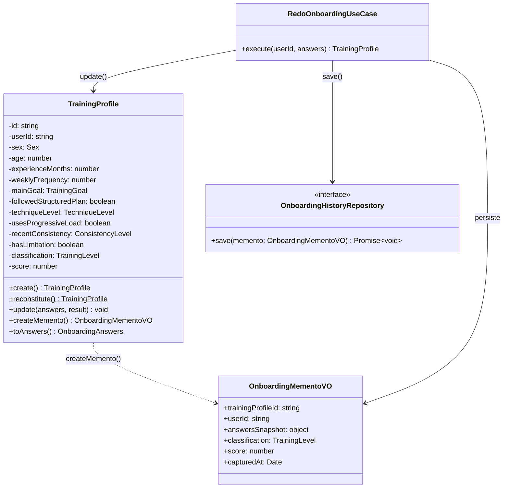

#### Implementação

| Elemento | Papel no Memento | Caminho |
|---|---|---|
| `TrainingProfile` | Originador — cria e reconstrói a partir do memento | `backend/src/domain/onboarding/entities/training-profile.entity.ts` |
| `OnboardingMementoVO` | Memento — snapshot imutável do estado | `backend/src/domain/onboarding/value-objects/onboarding-memento.vo.ts` |
| `RedoOnboardingUseCase` | Caretaker — solicita o memento e o persiste | `backend/src/application/onboarding/use-cases/redo-onboarding.use-case.ts` |
| `OnboardingHistoryRepository` | Persistência do histórico | `backend/src/domain/onboarding/repositories/onboarding-history.repository.ts` |
| `OnboardingHistoryRepositoryImpl` | Implementação TypeORM | `backend/src/infrastructure/persistence/onboarding/onboarding-history.repository.impl.ts` |
| `OnboardingHistoryOrmEntity` | Tabela `onboarding_history` | `backend/src/infrastructure/persistence/onboarding/onboarding-history.orm-entity.ts` |
| Testes | Verificação do Memento | `backend/src/domain/onboarding/entities/training-profile-memento.spec.ts` |

##### Trechos centrais

```typescript
// training-profile.entity.ts — Originador
export class TrainingProfile {
  createMemento(): OnboardingMementoVO {
    return new OnboardingMementoVO({
      trainingProfileId: this.id,
      userId: this.userId,
      answersSnapshot: {
        sex: this.sex,
        age: this.age,
        experienceMonths: this.experienceMonths,
        weeklyFrequency: this.weeklyFrequency,
        mainGoal: this.mainGoal,
        followedStructuredPlan: this.followedStructuredPlan,
        techniqueLevel: this.techniqueLevel,
        usesProgressiveLoad: this.usesProgressiveLoad,
        recentConsistency: this.recentConsistency,
        hasLimitation: this.hasLimitation,
      },
      classification: this.classification,
      score: this.score,
      capturedAt: new Date(),
    });
  }

  update(answers: OnboardingAnswers, result: ClassificationResult): void {
    this.classification = result.classification;
    this.score = result.score;
    // ...
  }
}
```

```typescript
// redo-onboarding.use-case.ts — Caretaker
export class RedoOnboardingUseCase {
  async execute(
    userId: string,
    answers: OnboardingAnswers,
  ): Promise<TrainingProfile> {
    const profile = await this.profileRepository.findByUserId(userId);
    if (!profile) throw new NotFoundException("Perfil não encontrado");

    const memento = profile.createMemento();

    await this.historyRepository.save(memento);

    const classifier =
      answers.sex === Sex.MALE
        ? new MaleProfileClassifier()
        : new FemaleProfileClassifier();

    const flow = new StrengthOnboardingFlow(classifier);
    const result = flow.execute(answers);

    profile.update(answers, result);
    await this.profileRepository.save(profile);

    return profile;
  }
}
```

#### Evidência de execução

```text
✓ createMemento() captura o estado atual do perfil
✓ o snapshot não é afetado por update() posterior
✓ update() altera classification e score do perfil original
✓ o perfil mantém o mesmo id após update()
✓ o memento contém answersSnapshot com todos os campos do questionário
```

Execute no container:

```bash
sudo docker compose exec api npx jest training-profile-memento --verbose
```

Verifique o histórico no banco após um redo:

```bash
sudo docker compose exec db psql -U monitore -d monitore_seu_treino \
  -c "SELECT id, user_id, classification, score, captured_at FROM onboarding_history ORDER BY captured_at DESC LIMIT 5;"
```

#### Rastreabilidade

| Artefato | Relação |
|---|---|
| Requisito | Preservar histórico anterior ao refazer o onboarding. |
| Módulo | `domain/onboarding/entities`, `domain/onboarding/value-objects` |
| Camada | Domínio, Aplicação e Infraestrutura |
| Padrão criacional relacionado | Singleton — regras usadas no fluxo que produz o novo `ClassificationResult`. |
| Padrão estrutural relacionado | Bridge — fluxo que recalcula a classificação após o redo. |
| Endpoint | `PUT /v1/onboarding` |
| Tabela no banco | `onboarding_history` |

#### Senso crítico

##### Benefícios

- **Encapsulamento preservado**: o use case não precisa conhecer os atributos internos de `TrainingProfile`.
- **Histórico completo e imutável**: cada redo gera um registro permanente em `onboarding_history`.
- **Auditabilidade**: é possível reconstruir a evolução do perfil por meio dos snapshots ordenados por `capturedAt`.
- **Extensibilidade**: futuramente, pode permitir reverter para uma classificação anterior.

##### Limitações

- **Sem mecanismo de restauração automática**: o escopo atual salva o histórico, mas não implementa undo automático.
- **Tamanho do histórico**: cada redo insere uma linha em `onboarding_history`.

##### Alternativas consideradas

- **Auditoria via triggers no banco**: rejeitada por acoplar a regra à infraestrutura.
- **Event Sourcing**: avaliado e adiado por complexidade operacional.
- **Soft delete + nova linha**: rejeitado por violar a identidade da entidade.

#### Referências

- GAMMA, E. et al. _Design Patterns: Elements of Reusable Object-Oriented Software_. Addison-Wesley, 1994. Cap. 5 — Behavioral Patterns, Memento, p. 283–291.
- EVANS, E. _Domain-Driven Design: Tackling Complexity in the Heart of Software_. Addison-Wesley, 2003. Cap. 5 — A Model Expressed in Software.

---

### Padrão complementar — Template Method · `OnboardingFlow.execute()`

#### Contexto

O Template Method é utilizado de forma complementar ao Bridge na camada de domínio do módulo de onboarding. Enquanto o Bridge separa a abstração (`OnboardingFlow`) da implementação (`ProfileClassifier`), o Template Method define o **esqueleto do algoritmo** de classificação dentro da própria abstração — garantindo que a sequência de etapas seja sempre respeitada.

#### Problema

O fluxo de classificação de onboarding precisa executar etapas em uma ordem fixa: preparar o contexto antes de classificar → classificar → reagir ao resultado. Sem Template Method, cada subclasse teria que reimplementar o método `execute()` inteiro, duplicando a lógica de orquestração.

#### Justificativa

O Template Method resolve isso ao:

1. Definir `execute()` como método que organiza a sequência fixa.
2. Expor dois hooks protegidos: `beforeClassify()` e `afterClassify()`.
3. Permitir que subclasses sobrescrevam apenas os hooks relevantes.

#### Diagrama

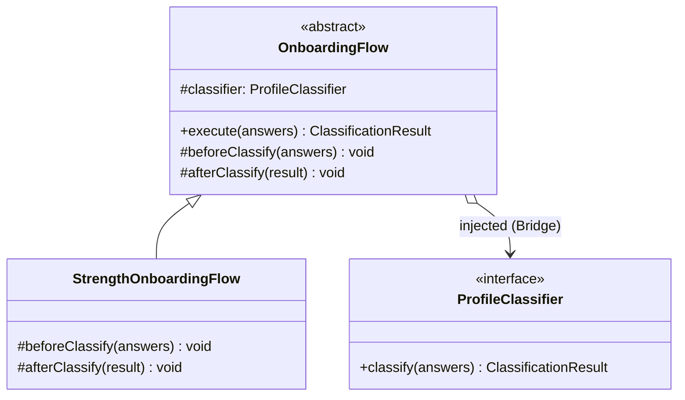

#### Implementação

| Papel GoF | Classe / Arquivo |
|---|---|
| Abstract Class | `OnboardingFlow` — `domain/onboarding/bridge/onboarding-flow.abstract.ts` |
| Template Method | `execute()` — define a sequência fixa de classificação |
| Hooks | `beforeClassify()`, `afterClassify()` |
| Concrete Class | `StrengthOnboardingFlow` — `domain/onboarding/bridge/strength-onboarding-flow.ts` |

```typescript
export abstract class OnboardingFlow {
  constructor(protected readonly classifier: ProfileClassifier) {}

  execute(answers: OnboardingAnswers): ClassificationResult {
    this.beforeClassify(answers);
    const result = this.classifier.classify(answers);
    this.afterClassify(result);
    return result;
  }

  protected beforeClassify(_answers: OnboardingAnswers): void {}
  protected afterClassify(_result: ClassificationResult): void {}
}
```

#### Rastreabilidade

| Artefato | Relação |
|---|---|
| Requisito | Classificar o perfil do usuário de forma extensível e consistente. |
| Módulo | `domain/onboarding/bridge/` |
| Camada | Domínio |
| Padrão estrutural relacionado | Bridge — `ProfileClassifier` é a implementação injetada no `OnboardingFlow`. |
| Padrão criacional relacionado | Singleton — `OnboardingClassificationRules` é usado pelos classificadores. |
| Padrão comportamental primário | Memento — resultado produzido por `execute()` é capturado como snapshot no redo. |
| Endpoint | `POST /v1/onboarding`, `PUT /v1/onboarding` |

#### Senso crítico

##### Benefícios

- **Sequência garantida**: mantém a ordem `beforeClassify → classify → afterClassify`.
- **Extensibilidade sem duplicação**: novos fluxos sobrescrevem apenas hooks.
- **Composição com Bridge**: Template Method controla _quando_ cada etapa ocorre; Bridge controla _como_ a classificação é feita.

##### Limitações

- **Hooks vazios na subclasse atual**: valor prospectivo para expansão futura.
- **Acoplamento por herança**: se a hierarquia crescer muito, pode ser substituído por composição.

##### Alternativas consideradas

- **Strategy puro sem Template Method**: rejeitado porque não garantiria a sequência fixa.
- **Listener/event hooks**: avaliado e adiado por exigir infraestrutura desnecessária.

#### Referências

- GAMMA, E. et al. _Design Patterns: Elements of Reusable Object-Oriented Software_. Addison-Wesley, 1994. Cap. 5 — Behavioral Patterns, Template Method, p. 325–330.
- MARTIN, R. C. _Agile Software Development, Principles, Patterns, and Practices_. Prentice Hall, 2002.

---

## Módulo de Autenticação

> **Responsável:** Samuel Nogueira Caetano | **Branch:** `main (integrada a partir da feat/modulo-autenticacao)`
>
> Contexto: os desafios comportamentais centrais eram que **todos os use cases precisam executar a mesma sequência de ciclo de vida** sem duplicar essa orquestração, e que **os eventos gerados pelas entidades precisam ser propagados para handlers desacoplados** sem que o emissor conheça os consumidores.

### Padrões analisados

| Padrão | Possível aplicação | Status | Justificativa |
|---|---|---|---|
| **Template Method** | Definir ciclo de vida comum a todos os use cases | Selecionado | Garante que `execute()` sempre publica eventos após `handle()`, sem que cada use case reimplemente essa orquestração. |
| **Observer** | Propagar eventos de domínio para handlers desacoplados | Implementado como complemento | Permite que `DomainEventBus` distribua eventos para N handlers sem que o emissor os conheça. |
| Strategy | Variar algoritmo de autenticação | Avaliado | Não há variação de algoritmo no escopo atual. |
| Chain of Responsibility | Encadear validações antes de autenticar | Não selecionado | As validações são invariantes de Value Objects, como `Email` e `PlainPassword`. |
| Command | Encapsular operações de autenticação como comandos reversíveis | Não selecionado | Os comandos de autenticação não precisam de desfazer. |

### Padrão implementado — Template Method · `UseCase<TInput, TOutput>.execute()`

#### Problema arquitetural

O sistema possui seis use cases de autenticação. Todos compartilham a mesma responsabilidade pós-execução: **publicar os eventos de domínio acumulados pelas entidades manipuladas**.

Sem Template Method, cada use case precisaria chamar sua lógica interna, coletar os agregados resultantes, iterar sobre os eventos e publicar cada evento no `DomainEventBus`.

#### Justificativa da escolha

O Template Method define em `UseCase<TInput, TOutput>` um método `execute()` concreto que:

1. Limpa a lista de agregados pendentes.
2. Chama `handle()`, o passo variável implementado por cada subclasse.
3. Chama `publishDomainEvents()`, o passo invariante implementado uma única vez na classe base.

O padrão também expõe `registerAggregate()` como hook protegido para use cases que precisam garantir a publicação de eventos de agregados não retornados diretamente pelo `handle()`.

#### Modelagem

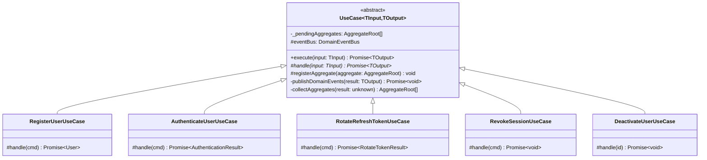

#### Implementação

| Elemento | Papel no Template Method | Caminho |
|---|---|---|
| `UseCase<TInput, TOutput>` | Classe abstrata que define o template | `backend/src/application/use-cases/base.use-case.ts` |
| `execute()` | Template Method — sequência imutável | `base.use-case.ts` |
| `handle()` | Passo variável abstrato | Implementado em cada subclasse |
| `registerAggregate()` | Hook protegido | `base.use-case.ts` |
| `publishDomainEvents()` | Passo invariante | `base.use-case.ts` |
| `RegisterUserUseCase` | Subclasse concreta | `backend/src/application/use-cases/auth/register-user.use-case.ts` |
| `RotateRefreshTokenUseCase` | Subclasse concreta com `registerAggregate()` | `backend/src/application/use-cases/auth/rotate-refresh-token.use-case.ts` |

##### Trechos centrais

```typescript
export abstract class UseCase<TInput, TOutput> {
  private _pendingAggregates: AggregateRoot[] = [];

  constructor(protected readonly eventBus: DomainEventBus) {}

  async execute(input: TInput): Promise<TOutput> {
    this._pendingAggregates = [];
    const result = await this.handle(input);
    await this.publishDomainEvents(result);
    return result;
  }

  protected abstract handle(input: TInput): Promise<TOutput>;

  protected registerAggregate(aggregate: AggregateRoot): void {
    this._pendingAggregates.push(aggregate);
  }
}
```

#### Rastreabilidade

| Artefato | Relação |
|---|---|
| Requisito | Garantir que eventos de domínio sejam publicados após qualquer operação de autenticação. |
| Módulo | `application/use-cases/` |
| Camada | Aplicação |
| Padrão comportamental relacionado | Observer — `DomainEventBus` recebe os eventos publicados pelo Template Method. |
| Padrão estrutural relacionado | Facade — `AuthenticationFacade` aciona `execute()` dos use cases. |
| Padrão criacional relacionado | Factory Method — `User.create()` e `RefreshToken.create()` geram eventos coletados pelo template. |

#### Senso crítico

##### Benefícios

- **Publicação garantida estruturalmente**: reduz o risco de um use case esquecer de publicar eventos.
- **Sem duplicação**: os use cases não repetem a lógica de ciclo de vida.
- **`registerAggregate()` como hook explícito**: permite registrar agregados não retornados diretamente pelo `handle()`.

##### Limitações

- **`execute()` não é final no TypeScript**: uma subclasse poderia sobrescrever o método e contornar o template.
- **Coleta de agregados depende de convenção**: estruturas mais profundas podem exigir `registerAggregate()`.

##### Alternativas consideradas

- **Publicação explícita em cada use case**: rejeitada por duplicar responsabilidade.
- **Decorator de use case**: avaliado e rejeitado por exigir decoração individual de cada caso de uso.

#### Referências

- GAMMA, E. et al. _Design Patterns: Elements of Reusable Object-Oriented Software_. Addison-Wesley, 1994. Cap. 5 — Behavioral Patterns, Template Method, p. 325–330.

---

### Padrão complementar — Observer · `DomainEventBus`

#### Introdução

Além do Template Method, o módulo de autenticação implementa o padrão **Observer** via `DomainEventBus`. Ele desacopla os emissores de eventos de domínio dos handlers que reagem a esses eventos.

#### Problema arquitetural

Quando um usuário é registrado, o sistema pode precisar reagir de múltiplas formas. Se `RegisterUserUseCase` chamasse cada handler diretamente, adicionar um novo comportamento pós-registro exigiria modificar o use case, violando o Open/Closed Principle.

#### Justificativa da escolha

O `DomainEventBus` implementa o Observer ao separar emissor e receptor:

- **Sujeito**: `DomainEventBus`.
- **Observadores**: handlers registrados via `subscribe()`.
- **Emissores**: entidades como `User` e `RefreshToken`, que acumulam eventos com `pushEvent()`.

#### Modelagem

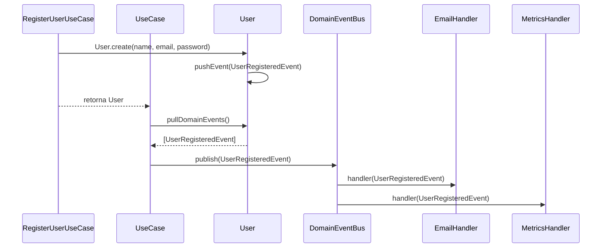

#### Implementação

| Elemento | Papel no Observer | Caminho |
|---|---|---|
| `DomainEventBus` | Sujeito — mantém handlers e notifica | `backend/src/application/events/domain-event-bus.ts` |
| `DomainEvent` | Interface do evento | `backend/src/domain/events/domain-event.ts` |
| `UserRegisteredEvent`, `SessionInvalidatedEvent` | Eventos concretos | `backend/src/domain/events/user-events.ts`, `refresh-token-events.ts` |
| `AggregateRoot` | Acumulador de eventos | `backend/src/domain/entities/aggregate-root.ts` |
| `UseCase.publishDomainEvents()` | Ponte entre Template Method e Observer | `backend/src/application/use-cases/base.use-case.ts` |

#### Rastreabilidade

| Artefato | Relação |
|---|---|
| Requisito | Reagir a eventos de domínio de forma desacoplada. |
| Módulo | `application/events/`, `domain/events/`, `domain/entities/` |
| Camada | Domínio + Aplicação |
| Padrão comportamental relacionado | Template Method — `publishDomainEvents()` aciona o Observer. |
| Padrão criacional relacionado | Factory Method — eventos são criados dentro dos métodos factory das entidades. |

#### Senso crítico

##### Benefícios

- **Desacoplamento emissor-receptor**: novos handlers não exigem alteração nas entidades nem nos use cases.
- **Resiliência**: `Promise.allSettled()` permite que a falha de um handler não impeça os demais.
- **Extensibilidade**: novos efeitos colaterais podem ser adicionados por assinatura de eventos.

##### Limitações

- **Sem handlers registrados atualmente**: o valor do padrão é prospectivo no escopo entregue.
- **Entrega em memória, sem persistência**: para garantias fortes de entrega seria necessário Outbox Pattern.

##### Alternativas consideradas

- **Chamada direta de handlers nos use cases**: rejeitada por acoplar use case aos handlers.
- **`EventEmitter` nativo do Node.js**: rejeitado por limitações em fluxos assíncronos.
- **Message broker externo**: avaliado e adiado por complexidade.

#### Referências

- GAMMA, E. et al. _Design Patterns: Elements of Reusable Object-Oriented Software_. Addison-Wesley, 1994. Cap. 5 — Behavioral Patterns, Observer, p. 293–303.
- FOWLER, M. _Patterns of Enterprise Application Architecture_. Addison-Wesley, 2002.

---

## Módulo de Histórico de Sessões

> **Responsável:** Giovanni Dornelas Ferreira | **Branch:** `feat/modulo-historico`
>
> Contexto: quando uma sessão de treino é registrada (`POST /v1/sessions`), o histórico deve ser **atualizado automaticamente** sem o use case de registro conhecer o módulo de histórico.

### Padrões analisados

| Padrão | Possível aplicação | Status | Justificativa |
|---|---|---|---|
| **Observer** | `WorkoutSessionSubject` + `HistoryObserver` | Selecionado | Notificação desacoplada após sessão concluída; extensível a novos observers. |
| Domain Event Bus | Publicar `SessionCompletedEvent` | Avaliado | Já existe no projeto para aggregates; Observer explícito atende ao requisito e à disciplina. |
| Mediator | Centralizar comunicação entre módulos | Não selecionado | Observer é mais direto para notificação 1:N. |
| Chain of Responsibility | Validar sessão antes de notificar | Não selecionado | Validação já ocorre no builder e DTOs da apresentação. |
| Command | Encapsular registro como comando reversível | Avaliado | Sem requisito de undo. |

### Padrão implementado — Observer · `WorkoutSessionSubject` + `HistoryObserver`

#### Problema arquitetural

Após `RegisterSessionUseCase` persistir uma sessão **COMPLETED**, o histórico deve refletir a nova sessão sem:

- importar `HistoryService` ou `HistoryManager` no use case de registro;
- chamar manualmente “atualizar histórico” em todo ponto que concluir sessão no futuro.

#### Justificativa da escolha

O Observer define:

- **Subject** (`WorkoutSessionSubject`): `subscribe()`, `unsubscribe()`, `notify(session)`.
- **Observer** (`HistoryObserver`): `update(session)`.

Fluxo real:

```text
RegisterSessionUseCase.save()
  → workoutSessionSubject.notify(session)
    → historyObserver.update(session)
      → HistoryManager.getInstance(userId).addSession(session)
```

#### Modelagem

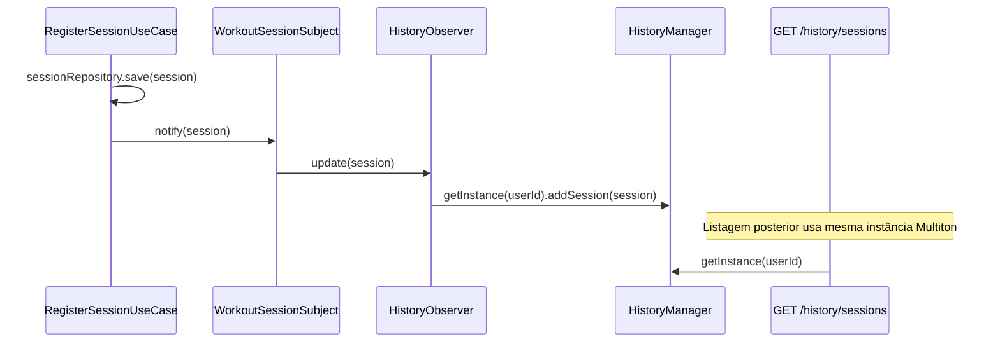

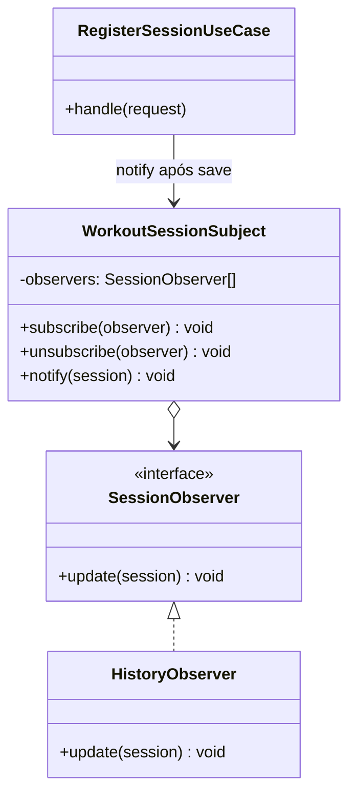

#### Implementação

| Elemento | Papel no Observer | Caminho |
|---|---|---|
| `SessionObserver` | Interface | `backend/src/domain/history/observers/session-observer.interface.ts` |
| `WorkoutSessionSubject` | Subject | `backend/src/domain/history/observers/workout-session-subject.ts` |
| `HistoryObserver` | ConcreteObserver | `backend/src/domain/history/observers/history-observer.ts` |
| `RegisterSessionUseCase` | Disparador | `backend/src/application/use-cases/session/register-session.use-case.ts` |
| Inscrição na inicialização | Wiring | `backend/src/infrastructure/modules/history.module.ts` (`onModuleInit`) |
| Export do Subject | Módulo de sessão | `backend/src/infrastructure/modules/session.module.ts` |

##### Trechos centrais

```typescript
export class WorkoutSessionSubject {
  private readonly observers: SessionObserver[] = [];

  subscribe(observer: SessionObserver): void {
    // ...
  }

  unsubscribe(observer: SessionObserver): void {
    // ...
  }

  notify(session: TrainingSession): void {
    for (const observer of this.observers) {
      observer.update(session);
    }
  }
}
```

```typescript
await this.sessionRepository.save(session);
this.workoutSessionSubject.notify(session);
```

```typescript
onModuleInit(): void {
  this.workoutSessionSubject.subscribe(this.historyObserver);
}
```

#### Evidência de execução

1. `POST /v1/sessions` com token e payload válido → `201` com `sessionId`.
2. Imediatamente `GET /v1/history/sessions` → nova sessão aparece na lista.
3. Logs do Proxy confirmam leitura subsequente.

#### Rastreabilidade

| Artefato | Relação |
|---|---|
| Requisitos | RF26 — histórico atualizado após conclusão de sessão. |
| Módulo | `domain/history/observers/` |
| Camada | Domínio + Aplicação |
| Padrão criacional relacionado | Multiton — destino do `update`. |
| Padrão estrutural relacionado | Proxy — leitura do histórico após atualização. |
| Endpoint disparador | `POST /v1/sessions` |
| Endpoint consumidor | `GET /v1/history/sessions`, `GET /v1/history/sessions/:sessionId` |

#### Senso crítico

##### Benefícios

- **Baixo acoplamento**: `RegisterSessionUseCase` só conhece o Subject, não o histórico.
- **Extensível**: novos observers podem ser adicionados via `subscribe()`.
- **Alinhado ao requisito**: atualização automática do histórico após conclusão.

##### Limitações

- **Síncrono**: `notify()` é chamada inline.
- **Sem persistência de eventos**: se o processo cair entre `save` e `notify`, o cache pode ficar desatualizado até próxima leitura do banco.

##### Alternativas consideradas

- **DomainEventBus existente**: adequado para eventos de aggregate, mas o Observer dedicado explicita o vínculo sessão → histórico.
- **Chamada direta ao HistoryService no use case**: rejeitada por acoplamento forte.

#### Referências

- GAMMA, E. et al. _Design Patterns: Elements of Reusable Object-Oriented Software_. Addison-Wesley, 1994. Cap. 5 — Behavioral Patterns, Observer, p. 293–303.
- EVANS, E. _Domain-Driven Design_. Addison-Wesley, 2003. Cap. 11 — Domain Events.

---

## Módulo de Exercícios

> **Responsável:** Daniel Teles | **Branch:** `feature/exercise_module`
>
> Contexto: a busca de exercícios aceita múltiplos filtros, como nome e grupo muscular, além de impor escopo por `userId` e excluir exercícios inativos. O objetivo era aplicar filtros na query sem criar condicionais inchadas no repositório.

### Padrões analisados

| Padrão | Possível aplicação | Status | Justificativa |
|---|---|---|---|
| **Chain of Responsibility** | Aplicar filtros encadeados na construção da query | Selecionado | Encadeamento limpo e extensível para novos filtros. |
| Specification | Compor predicados reutilizáveis | Avaliado | Útil para regras complexas, mas requer wrapping adicional para QueryBuilder; Chain é mais direto. |

### Padrão implementado — Chain of Responsibility · `ExerciseSearchChain`

#### Problema arquitetural

O repositório precisava montar uma query dinâmica com condições que variam conforme os filtros providos. Inserir `if`/`andWhere` repetidos no repositório torna o código difícil de estender; cada novo filtro aumentaria a complexidade ciclomática.

#### Justificativa da escolha

O `ExerciseSearchChain` encapsula cada etapa de filtro em um handler: escopo por `userId` + ativo, filtro por nome e filtro por grupo muscular. Handlers podem ser reordenados ou estendidos sem tocar na lógica base do repositório.

#### Modelagem

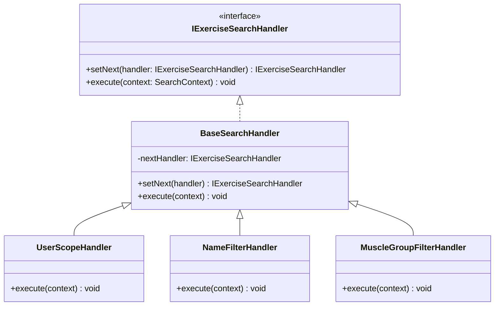

#### Implementação

| Elemento | Papel na Chain | Caminho |
|---|---|---|
| `ExerciseSearchChain` | Montagem e disparo da cadeia | `backend/src/infrastructure/database/exercise-search.chain.ts` |
| `BaseSearchHandler` | Handler abstrato com lógica de delegação | `backend/src/infrastructure/database/exercise-search.chain.ts` |
| `UserScopeHandler` | Aplica filtro de `userId` + `active=true` | `backend/src/infrastructure/database/exercise-search.chain.ts` |
| `NameFilterHandler` | Aplica filtro opcional por nome | `backend/src/infrastructure/database/exercise-search.chain.ts` |
| `MuscleGroupFilterHandler` | Aplica filtro opcional por grupo muscular | `backend/src/infrastructure/database/exercise-search.chain.ts` |
| Repositório consumidor | Instancia e executa a chain | `backend/src/infrastructure/database/exercise.postgres-repository.ts` |
| Use Case | Aciona o repositório com os critérios | `backend/src/application/use-cases/exercises/find-exercises.use-case.ts` |

##### Trecho central

```typescript
const queryBuilder = this.repository
  .createQueryBuilder("exercise")
  .orderBy("exercise.name", "ASC");

await new ExerciseSearchChain().execute({ criteria, queryBuilder });
const rows = await queryBuilder.getMany();
```

#### Evidência de execução

No vídeo abaixo é realizada a demonstração do GOF Chain of Responsability:


```bash
docker compose exec api npx jest search-chain --verbose
```

#### Rastreabilidade

| Artefato | Relação |
|---|---|
| Requisito | RF14 — consulta de exercícios por nome ou grupo muscular com ordenação e exclusão de inativos. |
| Módulo | `infrastructure/database/` · `application/use-cases/exercises/` |
| Camada | Infraestrutura |
| Padrão estrutural relacionado | Decorator — os handlers da chain operam sobre o mesmo repositório decorado com cache e log. |

#### Senso crítico

##### Benefícios

- **Menor complexidade ciclomática**: cada condição de filtro fica isolada em seu próprio handler.
- **Extensibilidade dinâmica**: novos filtros são adicionados como novos handlers sem modificar o repositório ou os handlers existentes.

##### Limitações

- **Dificuldade de depuração**: rastrear onde uma query perdeu escopo pode ser trabalhado quando muitos handlers são encadeados.

##### Alternativas consideradas

- **Specification Pattern**: descartado porque demandaria um acoplamento mais pesado ao TypeORM.

#### Referências

- GAMMA, E. et al. _Design Patterns: Elements of Reusable Object-Oriented Software_. Addison-Wesley, 1994. Cap. 5 — Behavioral Patterns, Chain of Responsibility.

---

## Módulo de Sessão de Treino — Iterator

> **Responsável:** Eduardo Waski | **Branch:** `feat/modulo-sessao-treino`
>
> Contexto: o desafio comportamental consistia em expor e percorrer a coleção de séries (`TrainingSet`) contidas na estrutura hierárquica e ramificada do `TrainingSession` (Composite) de forma linear e simplificada, sem expor a representação física interna do composite nem forçar os clientes a implementarem algoritmos de travessia recursiva para tarefas comuns como persistência ou geração de relatórios.

### Padrões analisados

| Padrão | Possível aplicação | Status | Justificativa |
|---|---|---|---|
| **Iterator** | Fornecer uma travessia linear e sequencial das séries de treino | Selecionado | Abstrai a complexidade de navegar recursivamente pela árvore do Composite, fornecendo aos clientes (como repositórios de persistência ou exportadores) uma interface simples e uniforme de iteração (`hasNext()` / `next()`). |
| Visitor | Executar operações sobre cada nó e folha da árvore de treino | Avaliado | Útil se tivéssemos muitas operações distintas variando frequentemente (como imprimir, auditar, recalcular). Porém, a necessidade se resume a listar as séries em ordem linear, tornando o Iterator mais simples e direto. |
| Command | Encapsular cada travessia como um comando | Não selecionado | Sem necessidade de enfileirar, logar ou desfazer operações de navegação. |

### Padrão implementado — Iterator · `Iterator` (Interface) · `TrainingSetIterator` (Concrete Iterator)

### Problema arquitetural

A entidade `TrainingSession` implementa a interface Composite contendo uma coleção de `WorkoutComponent`s, que podem ser `ExerciseNode`s (compostos) contendo outros componentes, ou `TrainingSet`s (folhas).

Quando precisamos salvar essa estrutura no banco de dados relacional (via repositório) ou exportar os dados executados em formato JSON linear, o cliente precisa extrair todas as séries de forma sequencial. Sem o Iterator, o cliente seria forçado a:
1. **Conhecer a estrutura de árvore**: Realizar checagens de tipo (`instanceof ExerciseNode` ou `TrainingSet`) e escrever loops recursivos para "achatar" a árvore de componentes em uma lista plana.
2. **Violar a Lei de Demeter**: O cliente precisaria acessar `session.getComponents()`, depois iterar e chamar `component.getChildren()`, alcançando níveis profundos do encapsulamento do domínio.
3. **Duplicar lógica**: Qualquer novo cliente que precisasse percorrer as séries repetiria a mesma travessia recursiva.

### Justificativa da escolha

O padrão **Iterator** resolve esse problema ao encapsular o algoritmo de travessia da árvore do composite em um objeto dedicado (`TrainingSetIterator`).

- **Encapsulamento**: O cliente não sabe como a árvore de treinos está organizada. Ele apenas solicita à sessão um iterator através do método factory `createSetIterator()`.
- **Simplificação do Cliente**: A navegação resume-se a um loop simples de `while(iterator.hasNext()) { const set = iterator.next(); }`.
- **Achatamento (Flattening) sob demanda**: O `TrainingSetIterator` encapsula a recursão de achatamento de forma transparente, processando todos os nós na inicialização e expondo uma interface estritamente linear.

### Modelagem

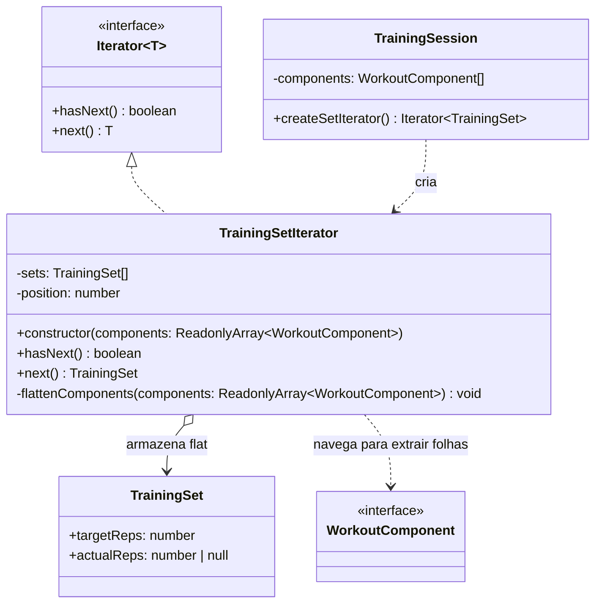

### Implementação

| Elemento | Papel no Iterator | Caminho |
|---|---|---|
| `Iterator<T>` | Iterator (Interface) | `backend/src/domain/iterators/iterator.interface.ts` |
| `TrainingSetIterator` | Concrete Iterator | `backend/src/domain/iterators/training-set.iterator.ts` |
| `TrainingSession` | Aggregate (Originador) | `backend/src/domain/entities/training-session.ts` |

#### Trechos centrais

```typescript
// iterator.interface.ts
export interface Iterator<T> {
  hasNext(): boolean;
  next(): T;
}

// training-set.iterator.ts
export class TrainingSetIterator implements Iterator<TrainingSet> {
  private sets: TrainingSet[] = [];
  private position: number = 0;

  constructor(components: ReadonlyArray<WorkoutComponent>) {
    this.flattenComponents(components);
  }

  private flattenComponents(components: ReadonlyArray<WorkoutComponent>): void {
    for (const component of components) {
      if (component instanceof TrainingSet) {
        this.sets.push(component);
      } else if (component instanceof ExerciseNode) {
        this.flattenComponents(component.getChildren());
      }
    }
  }

  public hasNext(): boolean {
    return this.position < this.sets.length;
  }

  public next(): TrainingSet {
    if (!this.hasNext()) {
      throw new Error('No more elements in iterator.');
    }
    const result = this.sets[this.position];
    this.position++;
    return result;
  }
}

// training-session.ts (uso do factory method)
export class TrainingSession extends AggregateRoot {
  private components: WorkoutComponent[] = [];
  // ...
  public createSetIterator(): Iterator<TrainingSet> {
    return new TrainingSetIterator(this.components);
  }
}
```

### Evidência de execução

Os testes unitários na especificação do domínio exercitam o funcionamento correto do Iterator:

```text
PASS  src/domain/entities/training-session.spec.ts
  Workout Session Domain Modules (Builder, Composite, Iterator)
    Iterator Pattern - TrainingSetIterator
      ✓ should iterate and flatten all training sets in order (1 ms)
      ✓ should throw an error if next is called with no more elements (1 ms)
```

Para rodar os testes:

```bash
docker compose exec api npx jest training-session --verbose
```

### Rastreabilidade

| Artefato | Relação |
|---|---|
| Requisitos | RF23 — Consultar sessão (leitura estruturada dos dados de séries); RF26 — Listar histórico de sessões. |
| Módulo | `domain/iterators/` · `domain/entities/` |
| Camada | Domínio (abstração de comportamento e travessia). |
| Padrão criacional relacionado | Builder — `TrainingSessionBuilder` monta o composite a ser iterado. |
| Padrão estrutural relacionado | Composite — O iterator navega pela estrutura hierárquica formada por `ExerciseNode` e `TrainingSet`. |
| Endpoint consumidor | `POST /v1/sessions`, `GET /v1/history/sessions` |
| Arquivo de testes | `src/domain/entities/training-session.spec.ts` |

### Senso crítico

#### Benefícios

- **Isolamento da estrutura complexa**: Os consumidores da classe `TrainingSession` (como adaptadores ORM ou geradores de relatórios) interagem apenas com uma coleção sequencial achatada de séries, sem conhecer o grafo do Composite.
- **Conformidade com a Lei de Demeter**: Evita encadear chamadas de navegação no cliente.
- **Simplificação de loops**: Transforma travessias recursivas intrincadas em loops simples lineares.

#### Limitações

- **Estrutura estática em memória**: O iterator atual achata (`flatten`) toda a árvore no momento da sua construção. Se o composite fosse dinamicamente alterado durante a iteração (o que não ocorre no fluxo atual), o iterator não refletiria essas mudanças em tempo real.
- **Consumo de memória temporária**: O achatamento inicial copia as referências de todos os `TrainingSet`s para um array temporário (`sets`). Para sessões gigantescas com milhares de nós, isso poderia consumir memória extra, embora em sessões de treino reais o número de séries raramente ultrapasse 50.

#### Alternativas consideradas

- **Travessia sob demanda (Lazy Iterator)**: Manter uma pilha (`Stack`) no iterator para percorrer os nós da árvore apenas à medida que `next()` é chamado. Rejeitado por adicionar complexidade desnecessária, já que o tamanho de uma sessão de treino em memória é sempre pequeno.

### Referências

- GAMMA, E. et al. _Design Patterns: Elements of Reusable Object-Oriented Software_. Addison-Wesley, 1994. Cap. 5 — Behavioral Patterns, Iterator, p. 257–271.

---

## Módulo de Usuário — Chain of Responsibility

**Autor:** André Ricardo Meyer de Melo
**Funcionalidades:** RF04 (Recuperar Senha) e RF07 (Excluir Conta)

### Problema

Ambos os fluxos possuem etapas sequenciais onde cada passo depende do anterior e qualquer etapa pode interromper a execução ao lançar uma exceção de domínio. Sem o padrão, toda essa lógica ficaria concentrada em um único método de use case, tornando difícil adicionar, remover ou reordenar etapas.

### Solução

Duas cadeias independentes, cada uma com sua classe `Handler` abstrata definida localmente. Cada handler concreto processa sua etapa e chama `next()` para avançar, ou lança uma exceção para interromper.

**Cadeia RF04 — Recuperar Senha:**

```
ValidateEmailFormatHandler → CheckUserExistsHandler (aborta silenciosamente se email não existe — segurança) → GenerateTokenHandler (crypto.randomBytes(32), SHA-256, TTL 15 min) → SendEmailHandler (swallows SMTP errors — endpoint sempre retorna 200)
```

**Cadeia RF07 — Excluir Conta:**

```
ValidatePasswordHandler (busca usuário + verifica bcrypt) → ValidateConfirmationPhraseHandler (exige exatamente "CONFIRMAR", case-sensitive) → RevokeSessionsHandler (hard-delete de todos os refresh tokens) → DeleteAccountHandler (hard-delete de tokens de reset + hard-delete do usuário)
```

### Diagrama

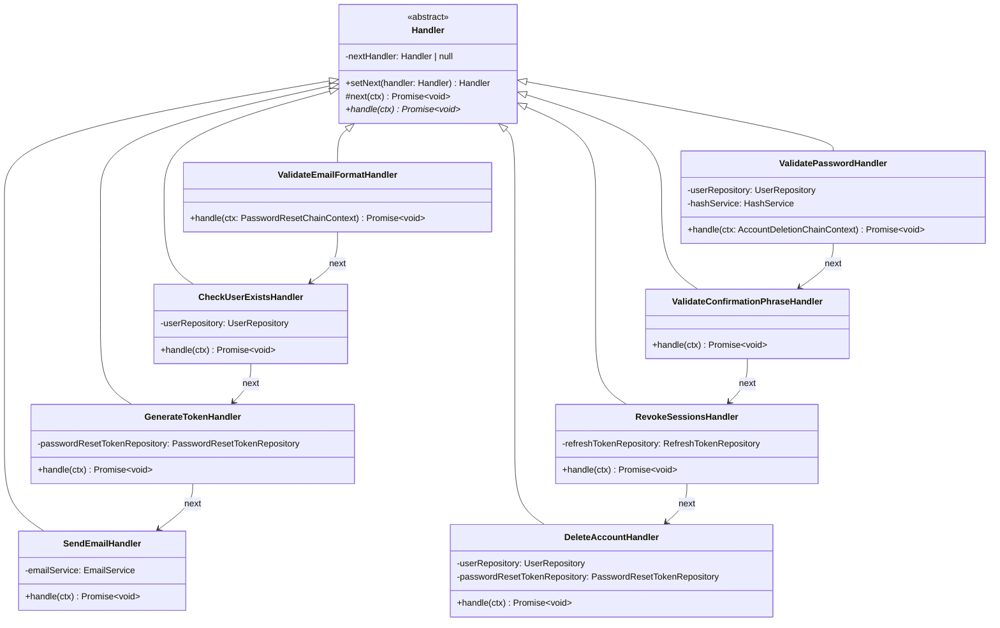

### Decisão de segurança: abort silencioso no RF04

O `CheckUserExistsHandler` não lança exceção quando o e-mail não existe — simplesmente retorna sem chamar `next()`. Isso garante que o endpoint `POST /v1/auth/password-reset/request` sempre responda `200 OK`, impedindo que atacantes descubram quais e-mails estão cadastrados por enumeração de resposta.

### Decisão de segurança: swallow de erros SMTP

O `SendEmailHandler` captura exceções do serviço de e-mail sem propagá-las. O token já foi persistido no banco — se o SMTP falhar, o endpoint ainda retorna `200`, evitando tanto a exposição de infraestrutura quanto a revelação de que o usuário existe.

### Artefatos

| Papel GoF | Classe | Arquivo |
|---|---|---|
| Handler (abstrato) | `Handler` (RF04) | `application/chains/password-reset.chain.ts` |
| Handler (abstrato) | `Handler` (RF07) | `application/chains/account-deletion.chain.ts` |
| ConcreteHandler | `ValidateEmailFormatHandler` | `application/chains/password-reset.chain.ts` |
| ConcreteHandler | `CheckUserExistsHandler` | `application/chains/password-reset.chain.ts` |
| ConcreteHandler | `GenerateTokenHandler` | `application/chains/password-reset.chain.ts` |
| ConcreteHandler | `SendEmailHandler` | `application/chains/password-reset.chain.ts` |
| ConcreteHandler | `ValidatePasswordHandler` | `application/chains/account-deletion.chain.ts` |
| ConcreteHandler | `ValidateConfirmationPhraseHandler` | `application/chains/account-deletion.chain.ts` |
| ConcreteHandler | `RevokeSessionsHandler` | `application/chains/account-deletion.chain.ts` |
| ConcreteHandler | `DeleteAccountHandler` | `application/chains/account-deletion.chain.ts` |

### Validação manual (Swagger)

```
RF04
POST /v1/auth/password-reset/request → body: { "email": "..." } → 200
POST /v1/auth/password-reset/confirm → body: { "token": "...", "newPassword": "..." } → 200

RF07 (requer Bearer token)
DELETE /v1/users/me → body: { "password": "...", "confirmation": "CONFIRMAR" } → 204
```

### Senso Crítico

**Benefícios:**
- Cada etapa é uma classe isolada, testável independentemente
- Adicionar ou reordenar etapas não exige alteração das existentes (OCP)
- Decisões de segurança ficam encapsuladas no handler responsável, não espalhadas na facade

**Limitações:**
- Dois `Handler` abstratos separados (um por cadeia) em vez de uma classe base compartilhada — escolha deliberada para evitar acoplamento entre contextos distintos, mas gera alguma duplicação estrutural
- A cadeia é montada a cada requisição (sem reuso de instâncias) — aceitável dado o volume esperado

## Módulo de Rotinas

**Responsável:** José Victor Gabriel Menezes da Costa <br>
**Branch:** `feat/modulo-rotinas`

### Padrão implementado — Mediator · `DomainEventBus` + `DeactivateOtherRoutinesHandler`

### Problema arquitetural

O `ActivateRoutineUseCase` possui a responsabilidade estrita de carregar a entidade e promover a sua ativação. Embutir uma pesquisa por *todas as rotinas ativas* do usuário para proceder com as inativações tornaria a classe uma "God Class" acoplada.

### Padrões analisados

| Padrão | Possível aplicação | Status | Justificativa |
|---|---|---|---|
| **Mediator** | Orquestrar o evento de ativação para desativar as demais rotinas | Selecionado | Desacopla a ação principal da reação secundária de inativação através do Event Bus. |
| Observer | Escutar ativação de rotina | Estrutural | O Mediator foi viabilizado através do mecanismo de publicação/assinatura (Observer) do Event Bus. |
| Chain of Responsibility | Corrente de processamento de rotinas | Não selecionado | A inativação não é um filtro restritivo, mas sim uma consequência (efeito colateral) da ativação. |


### Justificativa da escolha

O Mediator atua eliminando a comunicação direta entre o caso de uso e a lógica secundária. O `ActivateRoutineUseCase` apenas informa o `DomainEventBus` (o Mediador) de que uma rotina foi ativada. O barramento, por sua vez, aciona o colega `DeactivateOtherRoutinesHandler`, que busca as demais rotinas, executa a regra de reconstituição para instâncias de domínio plenas e as desativa individualmente.

### Modelagem

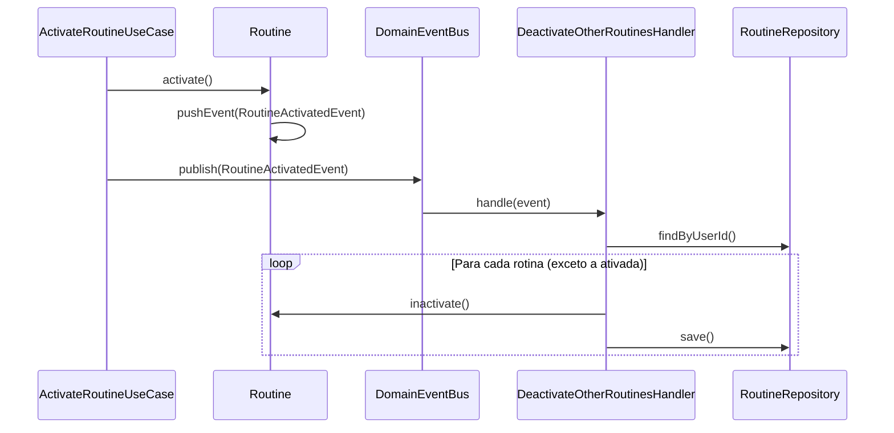

### Implementação (caminhos)

| Elemento | Caminho |
|---|---|
| Originador | `backend/src/application/use-cases/routines/activate-routine.use-case.ts` |
| Mediador | `backend/src/application/events/domain-event-bus.ts` |
| Receptor | `backend/src/application/events/handlers/deactivate-other-routines.handler.ts` |


### Trecho Central

Localizado no arquivo `backend/src/application/events/domain-event-bus.ts`.

```typescript
@EventsHandler(RoutineActivatedEvent)
@Injectable()
export class DeactivateOtherRoutinesHandler implements IEventHandler<RoutineActivatedEvent> {
  constructor(
    @Inject(ROUTINE_REPOSITORY_TOKEN) private readonly repo: RoutineRepository,
  ) {}

  async handle(event: RoutineActivatedEvent) {
    const { userId, routineId } = event;

    const activeRoutines = await this.repo.findByUserId(userId);
    const others = activeRoutines.filter((r) => r.id.toString() !== routineId);

    for (const routine of others) {
      routine.inactivate();
      await this.repo.save(routine);
    }
  }
}

```

### Evidência de execução

No GIF abaixo, podemos ver a ativação e desativação ocorrendo na prática, onde atua o Mediator.
Ao ativar 1 ficha, ele é responsável por desativar todas as outras.

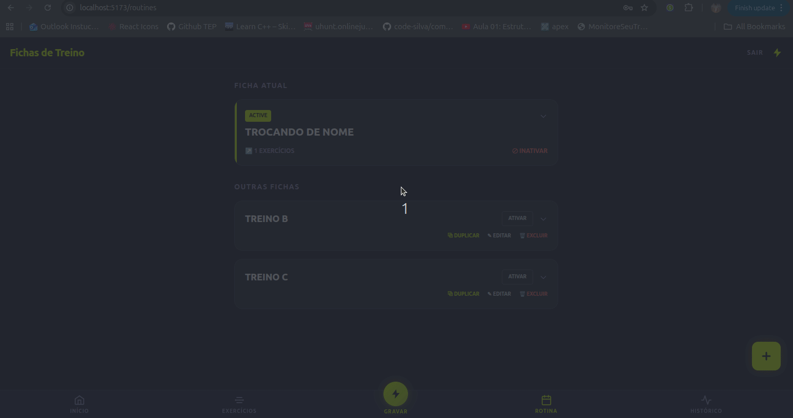

### Rastreabilidade

| Artefato | Relação |
|---|---|
| Requisito | O padrão interliga a US21 — Definir rotina como ativa com a US20 — Inativar rotina não utilizada, garantindo o acionamento de uma pela outra. |
| Módulo | `application/events/handlers/` |
| Camada | Aplicação |
| Padrão criacional relacionado | **Observer** — A base de implementação técnica do barramento de eventos. |
| EndPoint | `PATCH /v1/routines/:id/activate` |


### Vantagens e Desvantagens

#### Vantagens

- **Alta Coesão**: a lógica de ativação não sabe e nem precisa saber da existência de uma política de "inativar as antigas".

- **Resiliência**: o barramento (DomainEventBus) foi adaptado para engolir erros de handlers (Promise.allSettled), o que impede que falhas na inativação quebrem o request HTTP final do usuário (Erro 500).

#### Desvantagens

- **Depuração complexa**: o encadeamento indireto dificulta o tracing. Erros comuns, como a falha do método inactivate caso o repositório devolva "objetos anêmicos", explodem silenciosamente no barramento ao invés de alertarem o desenvolvedor na hora.

---

## Histórico de versões

| Versão | Data | Descrição | Autor |
|---|---|---|---|
| 1.0 | 19/05/2026 | Documentação dos padrões Memento e Template Method do módulo de Onboarding. | Lucas Antunes |
| 1.1 | 20/05/2026 | Documentação dos padrões Template Method e Observer do módulo de Autenticação. | Samuel Nogueira Caetano |
| 1.2 | 20/05/2026 | Documentação do padrão Observer do módulo de Histórico de Sessões. | Giovanni Dornelas Ferreira |
| 1.3 | 20/05/2026 | Documentação do padrão Chain of Responsibility para busca de Exercícios. | Daniel Teles |
| 1.4    | 21/05/2026 | Documentação do padrão Chain of Responsibility do módulo de Usuário, referente aos RF04 e RF07.   | André Ricardo Meyer de Melo |
| 1.5 | 21/05/2026 | Documentação do padrão Iterator do módulo de Sessão de Treino. | Eduardo Waski |
| 1.6 | 21/05/2026 | Documentação do padrão Mediator do módulo de Rotinas | José Victor Gabriel Menezes da Costa |
| 1.7 | 21/05/2026 | Adiciona gif de execução do GOF Chain of Responsability | Daniel Teles |