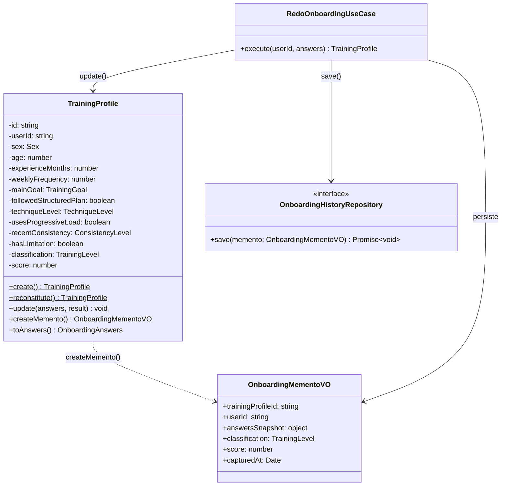
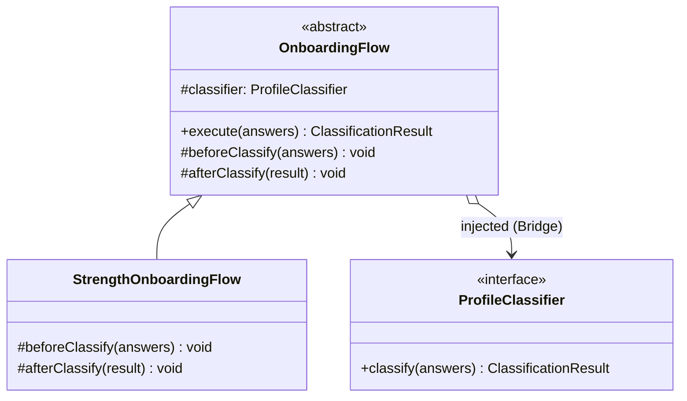
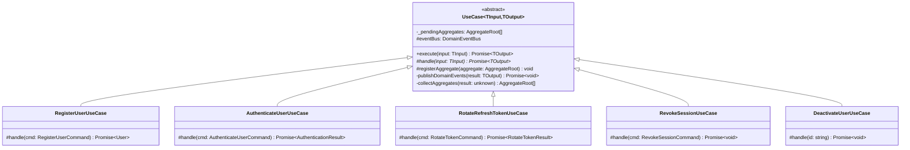
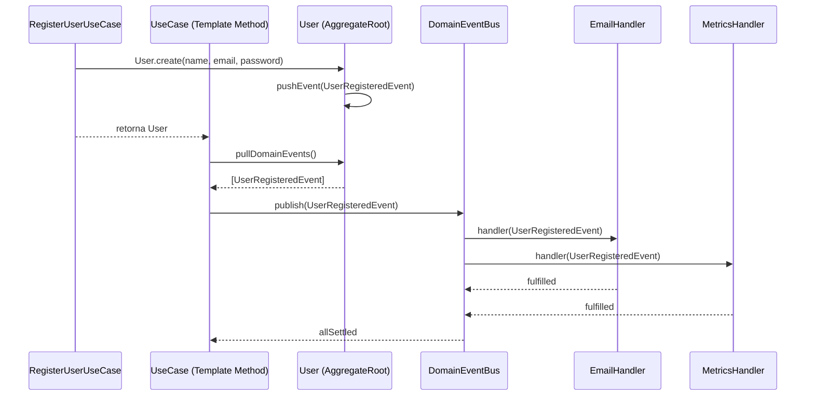

# 3.3. GoFs Comportamentais

## Introdução

Os padrões comportamentais tratam de algoritmos e da atribuição de responsabilidades entre objetos, focando em como os objetos interagem e distribuem responsabilidade.

Este documento reúne as contribuições de **todos os módulos do projeto**. Cada seção identifica o módulo, o integrante responsável e o padrão GoF aplicado. As seções sinalizadas como **“a preencher”** aguardam a contribuição dos demais membros — siga a estrutura da seção de Onboarding como referência.

---

## Módulo de Onboarding

> **Responsável:** Lucas Antunes | **Branch:** `feat/modulo-on-boarding`
>
> Contexto: o desafio comportamental central era que **ao refazer o onboarding, o estado anterior do perfil deve ser preservado** antes de ser sobrescrito — tanto para fins de auditoria quanto para eventual reversão. Adicionalmente, o **fluxo de classificação segue uma sequência de etapas imutável** definida pelo Template Method.

### Padrões analisados

| Padrão                  | Possível aplicação                                    | Status                        | Justificativa                                                                                    |
| ----------------------- | ----------------------------------------------------- | ----------------------------- | ------------------------------------------------------------------------------------------------ |
| **Memento**             | Preservar estado do perfil antes do redo              | Selecionado                   | Permite snapshot do estado interno da entidade sem expor seus atributos privados                 |
| Command                 | Encapsular a operação de redo como comando reversível | Avaliado                      | O redo não precisa de desfazer interativo (undo em runtime); o histórico persistido é suficiente |
| Observer                | Notificar outros módulos quando o perfil muda         | Avaliado                      | Relevante para evoluções futuras; adiado para não criar acoplamento prematuro                    |
| Chain of Responsibility | Cadeia de validações antes de classificar             | Não selecionado               | As validações estão no Value Object `OnboardingAnswers`, onde pertencem ao domínio               |
| Template Method         | Definir esqueleto do fluxo de classificação           | Implementado como complemento | Presente em `OnboardingFlow` (parte do Bridge); o Memento é ortogonal a ele                      |
| Strategy                | Variar algoritmo de classificação                     | Avaliado                      | Absorvido pelo Bridge, que é mais adequado para duas dimensões de variação                       |

### Padrão implementado — Memento · `TrainingProfile.createMemento()` + `OnboardingMementoVO`

#### Problema arquitetural

O fluxo de “refazer onboarding” (`PUT /v1/onboarding`) precisa:

1. Recuperar o perfil atual do usuário.
2. **Preservar esse estado** antes de modificá-lo (histórico).
3. Atualizar o perfil com as novas respostas e nova classificação.

O problema é que `TrainingProfile` é uma entidade de domínio rica — seus atributos são privados, encapsulados para garantir invariantes. Se o `RedoOnboardingUseCase` tentasse ler os atributos diretamente para montar um snapshot, ele violaria o encapsulamento da entidade, tornando o domínio frágil.

O Memento resolve isso: a própria entidade é responsável por **criar o snapshot de si mesma** (`createMemento()`), encapsulando o “como salvar” dentro do objeto que sabe o que salvar.

#### Justificativa da escolha

O Memento é o padrão canônico para esse cenário porque:

- **Preserva o encapsulamento**: `TrainingProfile.createMemento()` cria o snapshot usando seus próprios atributos privados. O use case recebe um `OnboardingMementoVO` opaco e o persiste — sem precisar saber quais campos existem.
- **Separação de responsabilidades**: a entidade sabe _o que_ salvar; o repositório sabe _onde_ salvar; o use case orquestra _quando_ salvar.
- **Imutabilidade do snapshot**: `OnboardingMementoVO` é um Value Object — uma vez criado, não pode ser alterado. O histórico é auditável e confiável.
- **Auditoria nativa**: cada vez que o usuário refaz o onboarding, um novo `OnboardingHistory` é inserido no banco com o snapshot anterior. Nenhum dado histórico é perdido.

#### Modelagem



#### Implementação

| Elemento                          | Papel no Memento                                   | Caminho                                                                                   |
| --------------------------------- | -------------------------------------------------- | ----------------------------------------------------------------------------------------- |
| `TrainingProfile`                 | Originador — cria e reconstrói a partir do memento | `backend/src/domain/onboarding/entities/training-profile.entity.ts`                       |
| `OnboardingMementoVO`             | Memento — snapshot imutável do estado              | `backend/src/domain/onboarding/value-objects/onboarding-memento.vo.ts`                    |
| `RedoOnboardingUseCase`           | Caretaker — solicita o memento e o persiste        | `backend/src/application/onboarding/use-cases/redo-onboarding.use-case.ts`                |
| `OnboardingHistoryRepository`     | Persistência do histórico                          | `backend/src/domain/onboarding/repositories/onboarding-history.repository.ts`             |
| `OnboardingHistoryRepositoryImpl` | Implementação TypeORM                              | `backend/src/infrastructure/persistence/onboarding/onboarding-history.repository.impl.ts` |
| `OnboardingHistoryOrmEntity`      | Tabela `onboarding_history`                        | `backend/src/infrastructure/persistence/onboarding/onboarding-history.orm-entity.ts`      |
| Testes                            | Verificação do Memento                             | `backend/src/domain/onboarding/entities/training-profile-memento.spec.ts`                 |

##### Trechos centrais

```typescript
// training-profile.entity.ts — Originador
export class TrainingProfile {
  // atributos privados omitidos por brevidade

  createMemento(): OnboardingMementoVO {
    return new OnboardingMementoVO({
      trainingProfileId: this.id,
      userId: this.userId,
      answersSnapshot: {
        sex: this.sex,
        age: this.age,
        experienceMonths: this.experienceMonths,
        weeklyFrequency: this.weeklyFrequency,
        mainGoal: this.mainGoal,
        followedStructuredPlan: this.followedStructuredPlan,
        techniqueLevel: this.techniqueLevel,
        usesProgressiveLoad: this.usesProgressiveLoad,
        recentConsistency: this.recentConsistency,
        hasLimitation: this.hasLimitation,
      },
      classification: this.classification,
      score: this.score,
      capturedAt: new Date(),
    });
  }

  update(answers: OnboardingAnswers, result: ClassificationResult): void {
    // atualiza os atributos com os novos valores
    this.classification = result.classification;
    this.score = result.score;
    // ...
  }
}

// redo-onboarding.use-case.ts — Caretaker
export class RedoOnboardingUseCase {
  async execute(
    userId: string,
    answers: OnboardingAnswers,
  ): Promise<TrainingProfile> {
    const profile = await this.profileRepository.findByUserId(userId);
    if (!profile) throw new NotFoundException("Perfil não encontrado");

    // ① captura o estado atual antes de modificar
    const memento = profile.createMemento();

    // ② persiste o snapshot no histórico
    await this.historyRepository.save(memento);

    // ③ atualiza o perfil com os novos dados
    const classifier =
      answers.sex === Sex.MALE
        ? new MaleProfileClassifier()
        : new FemaleProfileClassifier();
    const flow = new StrengthOnboardingFlow(classifier);
    const result = flow.execute(answers);

    profile.update(answers, result);
    await this.profileRepository.save(profile);

    return profile;
  }
}
```

#### Evidência de execução

Os testes verificam o contrato do Memento:

```
✓ createMemento() captura o estado atual do perfil
✓ o snapshot não é afetado por update() posterior
✓ update() altera classification e score do perfil original
✓ o perfil mantém o mesmo id após update()
✓ o memento contém answersSnapshot com todos os campos do questionário
```

Execute no container:

```bash
sudo docker compose exec api npx jest training-profile-memento --verbose
```

Verifique o histórico no banco após um redo:

```bash
sudo docker compose exec db psql -U monitore -d monitore_seu_treino \
  -c "SELECT id, user_id, classification, score, captured_at FROM onboarding_history ORDER BY captured_at DESC LIMIT 5;"
```

#### Rastreabilidade

| Artefato                      | Relação                                                                              |
| ----------------------------- | ------------------------------------------------------------------------------------ |
| Requisito                     | Preservar histórico anterior ao refazer o onboarding                                 |
| Módulo                        | `domain/onboarding/entities`, `domain/onboarding/value-objects`                      |
| Camada                        | Domínio (originador + memento), Aplicação (caretaker), Infraestrutura (persistência) |
| Padrão criacional relacionado | Singleton (regras usadas no fluxo que produz o novo `ClassificationResult`)          |
| Padrão estrutural relacionado | Bridge (fluxo que recalcula a classificação após o redo)                             |
| Endpoint                      | `PUT /v1/onboarding`                                                                 |
| Tabela no banco               | `onboarding_history`                                                                 |

#### Senso crítico

##### Benefícios

- **Encapsulamento preservado**: o use case não precisa conhecer os atributos internos de `TrainingProfile` para criar o histórico. Apenas chama `createMemento()`.
- **Histórico completo e imutável**: cada redo gera um registro permanente em `onboarding_history`. O dado nunca é sobrescrito — apenas inserido.
- **Auditabilidade**: é possível reconstruir toda a evolução do perfil de um usuário consultando os snapshots ordenados por `capturedAt`.
- **Extensibilidade**: se futuramente for necessário implementar “reverter para classificação anterior”, o dado já está lá — basta um endpoint de restauração.

##### Limitações

- **Sem mecanismo de restauração automática (undo)**: o Memento completo incluiria um `restore(memento)` no originador. No escopo atual, apenas o histórico é salvo; a restauração é manual (via suporte ou futuro endpoint). Isso é intencional — não há caso de uso de undo automático hoje.
- **Tamanho do histórico**: cada redo insere uma linha em `onboarding_history`. Para usuários que refazem o onboarding com frequência, a tabela pode crescer. Uma política de retenção pode ser adicionada futuramente.

##### Alternativas consideradas

- **Auditoria via triggers no banco**: o banco poderia capturar automaticamente a linha antes do UPDATE. Problema: acoplamento à infraestrutura de banco; a regra de “preservar antes de modificar” ficaria invisível no domínio. Rejeitado.
- **Event Sourcing**: reconstruir o estado a partir de eventos seria a alternativa mais completa, mas introduz complexidade operacional desproporcional ao escopo. Avaliado e adiado.
- **Soft delete + nova linha**: criar um novo `TrainingProfile` a cada redo e marcar o anterior como inativo. Problema: viola a identidade da entidade (o usuário tem um perfil, não vários). Rejeitado.

#### Referências (Memento)

- GAMMA, E. et al. _Design Patterns: Elements of Reusable Object-Oriented Software_. Addison-Wesley, 1994. Cap. 5 — Behavioral Patterns, Memento, p. 283–291.
- EVANS, E. _Domain-Driven Design: Tackling Complexity in the Heart of Software_. Addison-Wesley, 2003. Cap. 5 — A Model Expressed in Software (Value Objects).

---

### Padrão complementar — Template Method · `OnboardingFlow.execute()`

#### Contexto

O Template Method é utilizado de forma complementar ao Bridge na camada de domínio do módulo de onboarding. Enquanto o Bridge separa a abstração (`OnboardingFlow`) da implementação (`ProfileClassifier`), o Template Method define o **esqueleto do algoritmo** de classificação dentro da própria abstração — garantindo que a sequência de etapas seja sempre respeitada, independentemente da subclasse concreta.

#### Problema

O fluxo de classificação de onboarding precisa executar etapas em uma ordem fixa: preparar o contexto antes de classificar → classificar → reagir ao resultado. Diferentes fluxos (ex.: treino de força, hipertrofia, reabilitação) podem precisar de comportamentos específicos antes ou após a classificação, mas a **sequência geral nunca deve variar**.

Sem Template Method, cada subclasse teria que reimplementar o método `execute()` inteiro, duplicando a lógica de orquestração e abrindo espaço para inconsistências (ex.: esquecer de chamar `afterClassify`).

#### Justificativa

O Template Method resolve isso ao:

1. Tornar `execute()` um método **final** (não sobrescrito) que define a sequência imutável.
2. Expor dois **hooks** protegidos — `beforeClassify()` e `afterClassify()` — com implementação padrão vazia.
3. Permitir que subclasses sobrescrevam apenas os hooks relevantes para seu contexto.

Isso garante o **Princípio Aberto/Fechado**: o algoritmo está fechado para modificação, mas aberto para extensão via hooks.

#### Diagrama



> `execute()` é o template method. `beforeClassify()` e `afterClassify()` são os hooks. `ProfileClassifier` é a implementação injetada pelo Bridge.

#### Implementação

| Papel GoF       | Classe / Arquivo                                                                  |
| --------------- | --------------------------------------------------------------------------------- |
| Abstract Class  | `OnboardingFlow` — `domain/onboarding/bridge/onboarding-flow.abstract.ts`         |
| Template Method | `execute()` — define a sequência fixa de classificação                            |
| Hooks           | `beforeClassify()`, `afterClassify()` — extensíveis por subclasses                |
| Concrete Class  | `StrengthOnboardingFlow` — `domain/onboarding/bridge/strength-onboarding-flow.ts` |

##### Classe abstrata com o template method

```typescript
// domain/onboarding/bridge/onboarding-flow.abstract.ts
export abstract class OnboardingFlow {
  constructor(protected readonly classifier: ProfileClassifier) {}

  // Template method: sequência imutável
  execute(answers: OnboardingAnswers): ClassificationResult {
    this.beforeClassify(answers);
    const result = this.classifier.classify(answers); // delegado ao Bridge
    this.afterClassify(result);
    return result;
  }

  // Hooks com implementação padrão vazia — subclasses sobrescrevem se necessário
  protected beforeClassify(_answers: OnboardingAnswers): void {}
  protected afterClassify(_result: ClassificationResult): void {}
}
```

##### Subclasse concreta

```typescript
// domain/onboarding/bridge/strength-onboarding-flow.ts
export class StrengthOnboardingFlow extends OnboardingFlow {
  constructor(classifier: ProfileClassifier) {
    super(classifier);
  }

  // Hooks disponíveis para extensão futura (ex.: validações específicas de força)
  protected override beforeClassify(_answers: OnboardingAnswers): void {}
  protected override afterClassify(_result: ClassificationResult): void {}
}
```

##### Interação com Bridge e use case

```typescript
// application/use-cases/onboarding/submit-onboarding.use-case.ts
const classifier = new RuleBasedProfileClassifier();
const flow = new StrengthOnboardingFlow(classifier); // Bridge: classifer injetado
const result = flow.execute(answers); // Template Method: sequência garantida
```

#### Rastreabilidade

| Artefato                       | Relação                                                                               |
| ------------------------------ | ------------------------------------------------------------------------------------- |
| Requisito                      | Classificar o perfil do usuário de forma extensível e consistente                     |
| Módulo                         | `domain/onboarding/bridge/`                                                           |
| Camada                         | Domínio                                                                               |
| Padrão estrutural relacionado  | Bridge — `ProfileClassifier` é a implementação injetada no `OnboardingFlow`           |
| Padrão criacional relacionado  | Singleton — `OnboardingClassificationRules` é usado pelo `RuleBasedProfileClassifier` |
| Padrão comportamental primário | Memento — o resultado produzido por `execute()` é capturado como snapshot no redo     |
| Endpoint                       | `POST /v1/onboarding`, `PUT /v1/onboarding`                                           |

#### Senso crítico

##### Benefícios

- **Sequência garantida**: nenhuma subclasse pode alterar a ordem `beforeClassify → classify → afterClassify`. A invariante do algoritmo é protegida pela classe abstrata.
- **Extensibilidade sem duplicação**: adicionar um novo fluxo (ex.: `HypertrophyOnboardingFlow`) requer apenas sobrescrever os hooks relevantes — o template não é copiado.
- **Composição com Bridge**: a separação de responsabilidades é clara — o Template Method controla _quando_ cada etapa ocorre; o Bridge controla _como_ a classificação é feita. Os dois padrões se complementam sem se sobrepor.

##### Limitações

- **Hooks vazios na subclasse atual**: `StrengthOnboardingFlow` sobrescreve os hooks mas os mantém vazios. O valor do padrão é prospectivo — a estrutura está pronta para extensão, mas ainda não há lógica específica por tipo de treino. Isso é intencional no escopo atual.
- **Acoplamento por herança**: Template Method usa herança, o que cria acoplamento vertical. Se a hierarquia crescer muito, pode ser substituído por composição com estratégias. No escopo atual, a hierarquia é rasa (uma subclasse), então o custo é baixo.

##### Alternativas consideradas

- **Strategy puro sem Template Method**: delegar toda a lógica de fluxo ao `ProfileClassifier` via Strategy. Problema: a sequência `before/classify/after` deixaria de ser garantida — cada implementação de `ProfileClassifier` teria que reimplementá-la. Rejeitado.
- **Listener/event hooks**: emitir eventos `onBeforeClassify` e `onAfterClassify` em vez de chamar métodos. Mais flexível, mas introduz infraestrutura de eventos desnecessária para o escopo. Avaliado e adiado.

#### Referências (Template Method)

- GAMMA, E. et al. _Design Patterns: Elements of Reusable Object-Oriented Software_. Addison-Wesley, 1994. Cap. 5 — Behavioral Patterns, Template Method, p. 325–330.
- MARTIN, R. C. _Agile Software Development, Principles, Patterns, and Practices_. Prentice Hall, 2002. Cap. 14 — Template Method and Strategy Patterns.

---

## Módulo de Autenticação

> **Responsável:** Samuel Nogueira Caetano | **Branch:** ``
>
> Contexto: os desafios comportamentais centrais eram que **todos os use cases precisam executar a mesma sequência de ciclo de vida** (executar lógica → publicar eventos de domínio) sem duplicar essa orquestração, e que **os eventos gerados pelas entidades precisam ser propagados para handlers desacoplados** sem que o emissor conheça os consumidores.

### Padrões analisados

| Padrão                  | Possível aplicação                                             | Status                        | Justificativa                                                                                                                                                                   |
| ----------------------- | -------------------------------------------------------------- | ----------------------------- | ------------------------------------------------------------------------------------------------------------------------------------------------------------------------------- |
| **Template Method**     | Definir ciclo de vida comum a todos os use cases               | Selecionado                   | Garante que `execute()` sempre publica eventos após `handle()`, sem que cada use case reimplemente essa orquestração                                                            |
| **Observer**            | Propagar eventos de domínio para handlers desacoplados         | Implementado como complemento | Permite que `DomainEventBus` distribua eventos para N handlers sem que o emissor os conheça                                                                                     |
| Strategy                | Variar algoritmo de autenticação (ex.: OAuth vs. Senha)        | Avaliado                      | Não há variação de algoritmo no escopo atual; um único fluxo de autenticação por credenciais é suficiente                                                                       |
| Chain of Responsibility | Encadear validações antes de autenticar                        | Não selecionado               | As validações são invariantes de Value Objects (`Email`, `PlainPassword`) — pertencem ao domínio, não ao fluxo do use case                                                      |
| Command                 | Encapsular operações de autenticação como comandos reversíveis | Não selecionado               | Os comandos de autenticação não precisam de desfazer; os tipos `AuthenticateUserCommand`, `RevokeSessionCommand` já servem como DTOs de entrada sem precisar do padrão completo |

---

### Padrão implementado — Template Method · `UseCase<TInput, TOutput>.execute()`

#### Problema arquitetural

O sistema possui seis use cases de autenticação (`RegisterUserUseCase`, `AuthenticateUserUseCase`, `RotateRefreshTokenUseCase`, `RevokeSessionUseCase`, `UpdateUserUseCase`, `DeactivateUserUseCase`). Todos compartilham a mesma responsabilidade pós-execução: **publicar os eventos de domínio acumulados pelas entidades manipuladas**.

Sem Template Method, cada use case precisaria:

1. Chamar sua lógica interna.
2. Coletar os agregados resultantes.
3. Iterar sobre os eventos de cada agregado.
4. Publicar cada evento no `DomainEventBus`.

Isso significa que qualquer alteração na política de publicação de eventos (ex.: adicionar logging, ordenar eventos, adicionar timeout) exigiria modificar os seis use cases. Além disso, um use case que esquecesse de publicar os eventos passaria despercebido em code review — não haveria nenhuma garantia estrutural de que a publicação ocorre.

#### Justificativa da escolha

O Template Method resolve isso ao definir em `UseCase<TInput, TOutput>` um método `execute()` concreto que:

1. Limpa a lista de agregados pendentes.
2. Chama `handle()` — o passo variável, implementado por cada subclasse.
3. Chama `publishDomainEvents()` — o passo invariante, implementado uma única vez na classe base.

Cada use case concreto implementa apenas `handle()`, que contém a lógica de negócio. A publicação de eventos é garantida estruturalmente — não é possível criar um use case que esqueça de publicar.

O padrão também expõe `registerAggregate()` como hook protegido: use cases que precisam garantir a publicação de eventos de agregados não retornados diretamente pelo `handle()` (ex.: `RefreshToken` invalidado dentro de `RotateRefreshTokenUseCase`) registram o agregado explicitamente, e a classe base cuida da publicação.

#### Modelagem



#### Implementação

| Elemento                    | Papel no Template Method                               | Caminho                                                                   |
| --------------------------- | ------------------------------------------------------ | ------------------------------------------------------------------------- |
| `UseCase<TInput, TOutput>`  | Classe abstrata — define o template                    | `backend/src/application/use-cases/base.use-case.ts`                      |
| `execute()`                 | Template method — sequência imutável                   | `base.use-case.ts`                                                        |
| `handle()`                  | Passo variável abstrato — lógica de negócio            | Implementado em cada subclasse                                            |
| `registerAggregate()`       | Hook protegido — registra agregados sem retorno direto | `base.use-case.ts`                                                        |
| `publishDomainEvents()`     | Passo invariante — coleta e publica eventos            | `base.use-case.ts`                                                        |
| `RegisterUserUseCase`       | Subclasse concreta                                     | `backend/src/application/use-cases/auth/register-user.use-case.ts`        |
| `RotateRefreshTokenUseCase` | Subclasse concreta com `registerAggregate()`           | `backend/src/application/use-cases/auth/rotate-refresh-token.use-case.ts` |

##### Trechos centrais

```typescript
// base.use-case.ts — Classe abstrata com o template method
export abstract class UseCase<TInput, TOutput> {
  private _pendingAggregates: AggregateRoot[] = [];

  constructor(protected readonly eventBus: DomainEventBus) {}

  // Template method: sequência imutável — nenhuma subclasse pode alterar esta ordem
  async execute(input: TInput): Promise<TOutput> {
    this._pendingAggregates = []; // ① limpa estado de execução anterior
    const result = await this.handle(input); // ② delega ao passo variável
    await this.publishDomainEvents(result); // ③ passo invariante — sempre executado
    return result;
  }

  // Passo variável: cada subclasse implementa sua lógica de negócio aqui
  protected abstract handle(input: TInput): Promise<TOutput>;

  // Hook protegido: registra agregados cujos eventos devem ser publicados
  // mas que não são retornados diretamente pelo handle()
  protected registerAggregate(aggregate: AggregateRoot): void {
    this._pendingAggregates.push(aggregate);
  }

  // Passo invariante: coleta eventos de _pendingAggregates + agregados no resultado
  private async publishDomainEvents(result: TOutput): Promise<void> {
    const fromResult = this.collectAggregates(result);
    const allAggregates = [...this._pendingAggregates, ...fromResult];

    for (const aggregate of allAggregates) {
      for (const event of aggregate.pullDomainEvents()) {
        await this.eventBus.publish(event);
      }
    }
  }

  // Inspeciona o resultado recursivamente para encontrar AggregateRoots
  // — cobre retorno direto, arrays e objetos com propriedades agregadas
  private collectAggregates(result: unknown): AggregateRoot[] {
    if (result instanceof AggregateRoot) return [result];
    if (Array.isArray(result))
      return result.filter(
        (v): v is AggregateRoot => v instanceof AggregateRoot,
      );
    if (result !== null && typeof result === "object") {
      return Object.values(result).flatMap((value) => {
        if (value instanceof AggregateRoot) return [value];
        if (Array.isArray(value))
          return value.filter(
            (v): v is AggregateRoot => v instanceof AggregateRoot,
          );
        return [];
      });
    }
    return [];
  }
}

// register-user.use-case.ts — Subclasse que só implementa handle()
// A publicação de UserRegisteredEvent é garantida pela classe base,
// sem nenhuma linha adicional aqui.
export class RegisterUserUseCase extends UseCase<RegisterUserCommand, User> {
  protected async handle(cmd: RegisterUserCommand): Promise<User> {
    const email = Email.create(cmd.email);
    const existing = await this.userRepository.findByEmail(email.toString());
    if (existing) throw new ConflictException("Email already in use");

    const user = User.create(
      PersonName.create(cmd.name),
      email,
      HashedPassword.fromHash(await this.hashService.hash(cmd.password)),
    );
    // User.create() internamente chama pushEvent(new UserRegisteredEvent(...))
    // A classe base coletará esse evento via collectAggregates(result)
    // pois User é AggregateRoot e é retornado diretamente pelo handle()
    await this.userRepository.save(user);
    return user;
  }
}

// rotate-refresh-token.use-case.ts — Subclasse que usa registerAggregate()
// O token invalidado e o novo token não são retornados pelo handle(),
// então seus eventos precisam ser registrados explicitamente via hook.
export class RotateRefreshTokenUseCase extends UseCase<
  RotateTokenCommand,
  RotateTokenResult
> {
  protected async handle(cmd: RotateTokenCommand): Promise<RotateTokenResult> {
    // ...validações omitidas por brevidade...
    const invalidated = existingToken.invalidate(); // gera SessionInvalidatedEvent
    this.registerAggregate(invalidated); // hook: garante publicação do evento
    await this.refreshTokenRepository.update(invalidated);

    const newRefreshToken = RefreshToken.create(
      user.id,
      newTokenHash,
      expiresAt,
    );
    this.registerAggregate(newRefreshToken); // hook: garante publicação de eventual evento futuro
    await this.refreshTokenRepository.insert(newRefreshToken);

    return { accessToken, refreshToken: newOpaqueToken };
    // RotateTokenResult não é AggregateRoot — collectAggregates() não encontraria nada
    // sem o registerAggregate() acima
  }
}
```

#### Rastreabilidade

| Artefato                          | Relação                                                                                                                                 |
| --------------------------------- | --------------------------------------------------------------------------------------------------------------------------------------- |
| Requisito                         | Garantir que eventos de domínio sejam publicados após qualquer operação de autenticação                                                 |
| Módulo                            | `application/use-cases/`                                                                                                                |
| Camada                            | Aplicação                                                                                                                               |
| Padrão comportamental relacionado | Observer — `DomainEventBus` é o mecanismo que recebe os eventos publicados pelo template method                                         |
| Padrão estrutural relacionado     | Facade — `AuthenticationFacade` aciona `execute()` dos use cases; o template é transparente para ela                                    |
| Padrão criacional relacionado     | Factory Method — `User.create()` e `RefreshToken.create()` são chamados dentro de `handle()` e geram os eventos coletados pelo template |

#### Senso crítico

##### Benefícios

- **Publicação garantida estruturalmente**: não é possível implementar um use case que esqueça de publicar eventos. A garantia é dada pela classe base, não por disciplina de code review.
- **Sem duplicação**: os seis use cases não repetem nenhuma linha de lógica de ciclo de vida. Alterar a política de publicação (ex.: adicionar retry, timeout, logging de eventos) requer modificar apenas `base.use-case.ts`.
- **`collectAggregates()` como heurística inteligente**: a inspeção recursiva do resultado — cobrindo retorno direto, arrays e objetos compostos — permite que `AuthenticationResult` (que contém `user: User`) tenha seus eventos coletados automaticamente, sem que `AuthenticateUserUseCase` precise chamar `registerAggregate()`.

##### Limitações

- **`handle()` não é final no TypeScript**: diferentemente de Java, TypeScript não tem modificador `final` para métodos. Tecnicamente, uma subclasse poderia sobrescrever `execute()` e contornar o template. A proteção é por convenção — `execute()` não é `abstract` nem `protected`, o que sinaliza que não deve ser sobrescrito.
- **`collectAggregates()` por reflexão de objeto**: a inspeção de `Object.values(result)` é genérica e não tem conhecimento do tipo de retorno em tempo de execução. Se um resultado contiver AggregateRoots em estruturas mais profundas (ex.: objeto aninhado dois níveis), eles não serão coletados automaticamente — `registerAggregate()` seria necessário. Isso é um trade-off explícito de simplicidade vs. Completude.

##### Alternativas consideradas

- **Publicação explícita em cada use case**: cada use case chamaria `eventBus.publish()` manualmente após `handle()`. Funciona, mas duplica a responsabilidade e remove a garantia estrutural. Qualquer use case que omita a chamada passa despercebido. Rejeitado.
- **Decorator de use case** (ex.: `EventPublishingUseCase<T>` wrapping qualquer use case): separaria a publicação de eventos em uma camada decoradora sem herança. Mais flexível, mas exigiria que cada use case fosse decorado individualmente na composição do módulo, adicionando verbosidade sem benefício real no escopo atual. Avaliado e rejeitado.

##### Referências (Template Method)

- GAMMA, E. et al. _Design Patterns: Elements of Reusable Object-Oriented Software_. Addison-Wesley, 1994. Cap. 5 — Behavioral Patterns, Template Method, p. 325–330.
- MARTIN, R. C. _Agile Software Development, Principles, Patterns, and Practices_. Prentice Hall, 2002. Cap. 14 — Template Method and Strategy Patterns.

---

### Padrão complementar — Observer · `DomainEventBus`

#### Introdução

Além do Template Method, o módulo de autenticação implementa o padrão **Observer** via `DomainEventBus`. O Observer define uma dependência de um-para-muitos entre objetos, de modo que quando um objeto muda de estado, todos os seus dependentes são notificados automaticamente. Aqui ele desacopla os emissores de eventos de domínio (entidades) dos handlers que reagem a esses eventos.

#### Problema arquitetural

Quando um usuário é registrado, o sistema pode precisar reagir de múltiplas formas: enviar e-mail de boas-vindas, registrar métricas, notificar outro serviço. Se `RegisterUserUseCase` chamasse cada um desses handlers diretamente, dois problemas surgiriam:

1. **Acoplamento ao crescimento**: adicionar um novo comportamento pós-registro exigiria modificar `RegisterUserUseCase` — violando o Open/Closed Principle.
2. **Responsabilidade misturada**: o use case de registro passaria a conhecer detalhes de notificação, métricas e integrações externas — responsabilidades que pertencem a outras camadas.

#### Justificativa da escolha

O `DomainEventBus` implementa o Observer ao separar completamente o emissor do receptor:

- **Sujeito** (`DomainEventBus`): mantém o registro de handlers por nome de evento e notifica todos quando um evento é publicado.
- **Observadores** (handlers registrados via `subscribe()`): reagem ao evento sem que o emissor os conheça.
- **Emissores** (entidades como `User`, `RefreshToken`): apenas acumulam eventos com `pushEvent()`; não conhecem o bus.

O uso de `Promise.allSettled()` na publicação garante que a falha de um handler não impede a execução dos demais — cada observador é isolado.

#### Modelagem



#### Implementação

| Elemento                                               | Papel no Observer                                            | Caminho                                                               |
| ------------------------------------------------------ | ------------------------------------------------------------ | --------------------------------------------------------------------- |
| `DomainEventBus`                                       | Sujeito — mantém handlers e notifica                         | `backend/src/application/events/domain-event-bus.ts`                  |
| `DomainEvent`                                          | Interface do evento                                          | `backend/src/domain/events/domain-event.ts`                           |
| `UserRegisteredEvent`, `SessionInvalidatedEvent`, etc. | Eventos concretos                                            | `backend/src/domain/events/user-events.ts`, `refresh-token-events.ts` |
| `AggregateRoot`                                        | Acumulador de eventos — `pushEvent()` / `pullDomainEvents()` | `backend/src/domain/entities/aggregate-root.ts`                       |
| `UseCase.publishDomainEvents()`                        | Ponte entre Template Method e Observer                       | `backend/src/application/use-cases/base.use-case.ts`                  |

##### Trechos centrais

```typescript
// domain-event-bus.ts — Sujeito
export class DomainEventBus {
  // Mapa de nome do evento → lista de handlers registrados
  private readonly handlers = new Map<string, EventHandler[]>();

  // Registra um observador para um tipo específico de evento
  subscribe(eventName: string, handler: EventHandler): void {
    const existing = this.handlers.get(eventName) ?? [];
    this.handlers.set(eventName, [...existing, handler]);
  }

  async publish(event: DomainEvent): Promise<void> {
    const eventName = event.constructor.name; // ex.: 'UserRegisteredEvent'
    const handlers = this.handlers.get(eventName) ?? [];

    // allSettled: falha em um handler não cancela os demais observadores
    const results = await Promise.allSettled(
      handlers.map((handler) => handler(event)),
    );

    // Handlers que falharam são logados sem relançar a exceção
    results
      .filter((r): r is PromiseRejectedResult => r.status === "rejected")
      .forEach((r) =>
        this.logger.error("Event handler failed", {
          context: "DomainEventBus",
          eventName,
          reason: r.reason instanceof Error ? r.reason.message : r.reason,
        }),
      );
  }
}

// aggregate-root.ts — Acumulador de eventos nas entidades
// As entidades não conhecem o bus; apenas acumulam eventos internamente
export abstract class AggregateRoot {
  private _domainEvents: DomainEvent[] = [];

  protected pushEvent(event: DomainEvent): void {
    this._domainEvents.push(event);
  }

  // Chamado pelo Template Method para drenar os eventos acumulados
  pullDomainEvents(): DomainEvent[] {
    const events = [...this._domainEvents];
    this._domainEvents = []; // limpa após coleta — cada evento é publicado uma única vez
    return events;
  }

  // Permite transferir eventos de um agregado filho para o pai
  // após operações imutáveis que retornam nova instância
  protected mergeEventsFrom(source: AggregateRoot): void {
    for (const event of source.pullDomainEvents()) {
      this.pushEvent(event);
    }
  }
}

// user-events.ts — Eventos concretos como Value Objects simples
export class UserRegisteredEvent implements DomainEvent {
  constructor(
    public readonly userId: string,
    public readonly email: string,
    public readonly occurredAt: Date,
  ) {}
}

// Exemplo de registro de handler (ponto de extensão)
// Um handler de e-mail seria registrado no módulo, não no use case:
eventBus.subscribe("UserRegisteredEvent", async (event: DomainEvent) => {
  const e = event as UserRegisteredEvent;
  await emailService.sendWelcome(e.email);
});
```

#### Rastreabilidade

| Artefato                          | Relação                                                                                                                                       |
| --------------------------------- | --------------------------------------------------------------------------------------------------------------------------------------------- |
| Requisito                         | Reagir a eventos de domínio (registro, revogação de sessão, desativação) de forma desacoplada                                                 |
| Módulo                            | `application/events/`, `domain/events/`, `domain/entities/`                                                                                   |
| Camada                            | Domínio (eventos + AggregateRoot), Aplicação (DomainEventBus)                                                                                 |
| Padrão comportamental relacionado | Template Method — `publishDomainEvents()` na classe base é o ponto onde o Observer é acionado                                                 |
| Padrão criacional relacionado     | Factory Method — os eventos são criados dentro dos métodos factory das entidades (`User.create()`, `RefreshToken.invalidate()`)               |
| Padrão estrutural relacionado     | Decorator — `LoggingUserRepository` poderia observar eventos via bus em vez de logar diretamente; o bus é o mecanismo alternativo de extensão |

#### Senso crítico

##### Benefícios

- **Desacoplamento total emissor-receptor**: `User.Create ()` publica `UserRegisteredEvent` sem saber quem vai consumi-lo. Adicionar um novo handler (ex.: auditoria, webhook) não requer modificar nenhuma entidade nem use case.
- **Resiliência por isolamento**: `Promise.AllSettled ()` garante que um handler de e-mail com falha não impede o handler de métricas de executar. Cada observador é independente.
- **`mergeEventsFrom ()` preserva eventos em cadeias imutáveis**: como as entidades são imutáveis (mutações retornam nova instância), `mergeEventsFrom ()` transfere eventos acumulados na instância anterior para a nova — garantindo que nenhum evento seja perdido na cadeia `changeProfile ()` → `changePassword ()`.

##### Limitações

- **Sem handlers registrados atualmente**: o `DomainEventBus` está plenamente implementado, mas nenhum handler é registrado no `AuthModule` atual. Os eventos são publicados e descartados silenciosamente. A infraestrutura está pronta, mas o valor do padrão é prospectivo no escopo entregue.
- **Entrega em memória, sem persistência**: se o processo cair após `handle ()` mas antes de `publishDomainEvents ()`, os eventos são perdidos. Para garantias de entrega (at-least-once), seria necessário um Outbox Pattern — fora do escopo atual.
- **Ordem de publicação sequencial**: os handlers de um mesmo evento são chamados em sequência dentro de `Promise.AllSettled ()`. Para alto volume de eventos, uma fila assíncrona seria mais adequada.

##### Alternativas consideradas

- **Chamada direta de handlers nos use cases**: `RegisterUserUseCase` chamaria `emailService.SendWelcome ()` diretamente. Mais simples no curto prazo, mas acopla o use case a cada handler e viola o Open/Closed Principle ao crescer. Rejeitado.
- **Event emitter nativo do Node. Js (`EventEmitter`)**: mais simples que uma implementação própria, mas síncrono por padrão e sem suporte nativo a `async/await` sem adaptação. O `DomainEventBus` personalizado oferece controle total sobre o comportamento assíncrono e de erro. Avaliado e rejeitado.
- **Message broker externo (RabbitMQ, Kafka)**: entrega garantida e desacoplamento entre serviços. Desproporcional para um monólito modular no escopo atual; pode ser adotado quando houver necessidade de comunicação entre serviços distintos. Avaliado e adiado.

##### Referências (Observer)

- GAMMA, E. et al. _Design Patterns: Elements of Reusable Object-Oriented Software_. Addison-Wesley, 1994. Cap. 5 — Behavioral Patterns, Observer, p. 293–303.
- FOWLER, M. _Patterns of Enterprise Application Architecture_. Addison-Wesley, 2002. Domain Event, p. —; disponível em: [https://martinfowler.com/eaaDev/DomainEvent.html](https://martinfowler.com/eaaDev/DomainEvent.html).

## [Módulo: ____________] — A preencher

> **Responsável:** [Nome do membro] | **Branch:** [nome da branch]

!!! warning “Seção pendente”

    Esta seção aguarda a contribuição do responsável pelo módulo.

    Siga a estrutura da seção **Módulo de Onboarding** acima como referência:

    1. **Padrões analisados** — tabela com os padrões GoF avaliados e justificativa da escolha
    2. **Padrão implementado** — nome e identificador central (ex.: classe ou interface principal)
    3. **Problema arquitetural** — o problema concreto que motivou o uso do padrão
    4. **Justificativa da escolha** — por que este padrão e não as alternativas avaliadas
    5. **Modelagem** — diagrama Mermaid (`classDiagram` ou `sequenceDiagram`)
    6. **Implementação** — tabela de arquivos + trechos de código comentados
    7. **Rastreabilidade** — elos com requisitos, camadas e outros padrões GoF do projeto
    8. **Senso crítico** — benefícios, limitações e alternativas consideradas
    9. **Referências** — bibliográficas (ABNT ou formato GoF)

---

## Histórico de versões

| Versão | Data       | Descrição                                                                     | Autor                   |
| ------ | ---------- | ----------------------------------------------------------------------------- | ----------------------- |
| 1.0    | 19/05/2026 | Documentação dos padrões Memento e Template Method do módulo de onboarding    | Lucas Antunes           |
| 1.1    | 20/05/2026 | Documentação dos padrões Template Method e Observer do módulo de autenticação | Samuel Nogueira Caetano |
