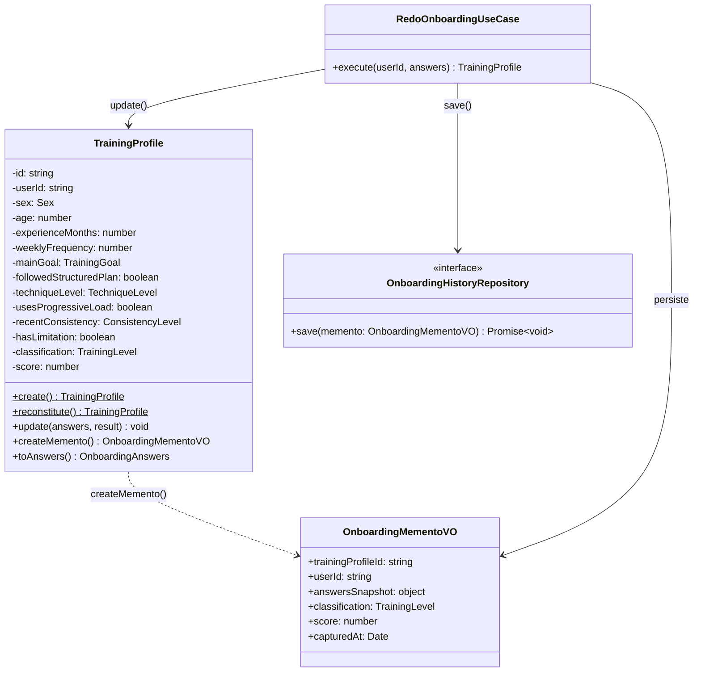
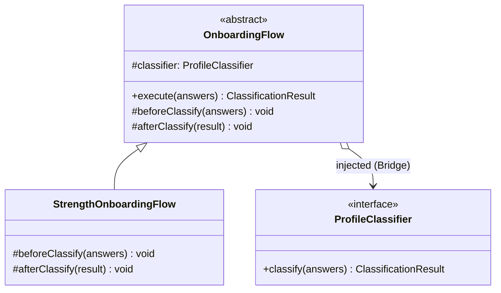
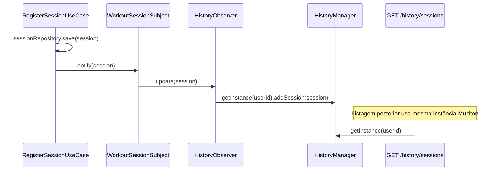
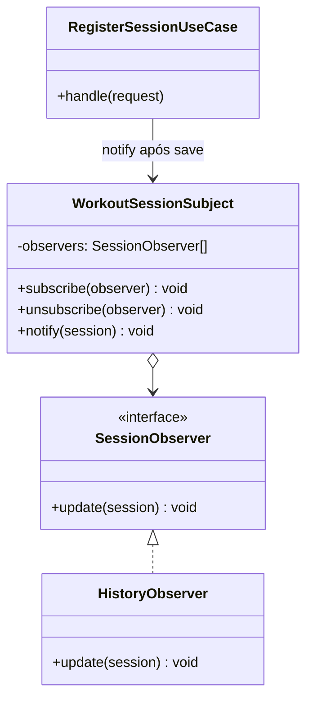
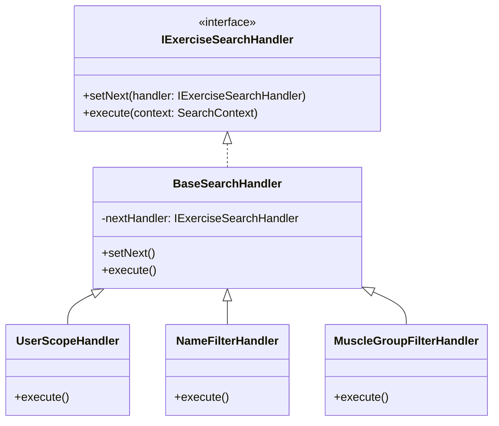

# 3.3. GoFs Comportamentais

## Introdução

Os padrões comportamentais tratam de algoritmos e da atribuição de responsabilidades entre objetos, focando em como os objetos interagem e distribuem responsabilidade.

Este documento reúne as contribuições de **todos os módulos do projeto**. Cada seção identifica o módulo, o integrante responsável e o padrão GoF aplicado. Ao final do arquivo, a seção **"[Módulo: ____________] — A preencher"** permanece disponível para novas contribuições — siga a estrutura das seções de Onboarding ou Histórico de Sessões como referência.

---

## Módulo de Onboarding

> **Responsável:** Lucas Antunes | **Branch:** `feat/modulo-on-boarding`
>
> Contexto: o desafio comportamental central era que **ao refazer o onboarding, o estado anterior do perfil deve ser preservado** antes de ser sobrescrito — tanto para fins de auditoria quanto para eventual reversão. Adicionalmente, o **fluxo de classificação segue uma sequência de etapas imutável** definida pelo Template Method.

### Padrões analisados

| Padrão                  | Possível aplicação                                    | Status                        | Justificativa                                                                                    |
|-------------------------|-------------------------------------------------------|-------------------------------|--------------------------------------------------------------------------------------------------|
| **Memento**             | Preservar estado do perfil antes do redo              | Selecionado                   | Permite snapshot do estado interno da entidade sem expor seus atributos privados                 |
| Command                 | Encapsular a operação de redo como comando reversível | Avaliado                      | O redo não precisa de desfazer interativo (undo em runtime); o histórico persistido é suficiente |
| Observer                | Notificar outros módulos quando o perfil muda         | Avaliado                      | Relevante para evoluções futuras; adiado para não criar acoplamento prematuro                    |
| Chain of Responsibility | Cadeia de validações antes de classificar             | Não selecionado               | As validações estão no Value Object `OnboardingAnswers`, onde pertencem ao domínio               |
| Template Method         | Definir esqueleto do fluxo de classificação           | Implementado como complemento | Presente em `OnboardingFlow` (parte do Bridge); o Memento é ortogonal a ele                      |
| Strategy                | Variar algoritmo de classificação                     | Avaliado                      | Absorvido pelo Bridge, que é mais adequado para duas dimensões de variação                       |

### Padrão implementado — Memento · `TrainingProfile.createMemento()` + `OnboardingMementoVO`

## Problema arquitetural

O fluxo de "refazer onboarding" (`PUT /v1/onboarding`) precisa:

1. Recuperar o perfil atual do usuário.
2. **Preservar esse estado** antes de modificá-lo (histórico).
3. Atualizar o perfil com as novas respostas e nova classificação.

O problema é que `TrainingProfile` é uma entidade de domínio rica — seus atributos são privados, encapsulados para garantir invariantes. Se o `RedoOnboardingUseCase` tentasse ler os atributos diretamente para montar um snapshot, ele violaria o encapsulamento da entidade, tornando o domínio frágil.

O Memento resolve isso: a própria entidade é responsável por **criar o snapshot de si mesma** (`createMemento()`), encapsulando o "como salvar" dentro do objeto que sabe o que salvar.

## Justificativa da escolha

O Memento é o padrão canônico para esse cenário porque:

- **Preserva o encapsulamento**: `TrainingProfile.createMemento()` cria o snapshot usando seus próprios atributos privados. O use case recebe um `OnboardingMementoVO` opaco e o persiste — sem precisar saber quais campos existem.
- **Separação de responsabilidades**: a entidade sabe *o que* salvar; o repositório sabe *onde* salvar; o use case orquestra *quando* salvar.
- **Imutabilidade do snapshot**: `OnboardingMementoVO` é um Value Object — uma vez criado, não pode ser alterado. O histórico é auditável e confiável.
- **Auditoria nativa**: cada vez que o usuário refaz o onboarding, um novo `OnboardingHistory` é inserido no banco com o snapshot anterior. Nenhum dado histórico é perdido.

## Modelagem



## Implementação

| Elemento                          | Papel no Memento                                   | Caminho                                                                                   |
|-----------------------------------|----------------------------------------------------|-------------------------------------------------------------------------------------------|
| `TrainingProfile`                 | Originador — cria e reconstrói a partir do memento | `backend/src/domain/onboarding/entities/training-profile.entity.ts`                       |
| `OnboardingMementoVO`             | Memento — snapshot imutável do estado              | `backend/src/domain/onboarding/value-objects/onboarding-memento.vo.ts`                    |
| `RedoOnboardingUseCase`           | Caretaker — solicita o memento e o persiste        | `backend/src/application/onboarding/use-cases/redo-onboarding.use-case.ts`                |
| `OnboardingHistoryRepository`     | Persistência do histórico                          | `backend/src/domain/onboarding/repositories/onboarding-history.repository.ts`             |
| `OnboardingHistoryRepositoryImpl` | Implementação TypeORM                              | `backend/src/infrastructure/persistence/onboarding/onboarding-history.repository.impl.ts` |
| `OnboardingHistoryOrmEntity`      | Tabela `onboarding_history`                        | `backend/src/infrastructure/persistence/onboarding/onboarding-history.orm-entity.ts`      |
| Testes                            | Verificação do Memento                             | `backend/src/domain/onboarding/entities/training-profile-memento.spec.ts`                 |

### Trechos centrais

```typescript
// training-profile.entity.ts — Originador
export class TrainingProfile {
  // atributos privados omitidos por brevidade

  createMemento(): OnboardingMementoVO {
    return new OnboardingMementoVO({
      trainingProfileId: this.id,
      userId: this.userId,
      answersSnapshot: {
        sex: this.sex,
        age: this.age,
        experienceMonths: this.experienceMonths,
        weeklyFrequency: this.weeklyFrequency,
        mainGoal: this.mainGoal,
        followedStructuredPlan: this.followedStructuredPlan,
        techniqueLevel: this.techniqueLevel,
        usesProgressiveLoad: this.usesProgressiveLoad,
        recentConsistency: this.recentConsistency,
        hasLimitation: this.hasLimitation,
      },
      classification: this.classification,
      score: this.score,
      capturedAt: new Date(),
    });
  }

  update(answers: OnboardingAnswers, result: ClassificationResult): void {
    // atualiza os atributos com os novos valores
    this.classification = result.classification;
    this.score = result.score;
    // ...
  }
}

// redo-onboarding.use-case.ts — Caretaker
export class RedoOnboardingUseCase {
  async execute(userId: string, answers: OnboardingAnswers): Promise<TrainingProfile> {
    const profile = await this.profileRepository.findByUserId(userId);
    if (!profile) throw new NotFoundException('Perfil não encontrado');

    // ① captura o estado atual antes de modificar
    const memento = profile.createMemento();

    // ② persiste o snapshot no histórico
    await this.historyRepository.save(memento);

    // ③ atualiza o perfil com os novos dados
    const classifier = answers.sex === Sex.MALE
      ? new MaleProfileClassifier()
      : new FemaleProfileClassifier();
    const flow = new StrengthOnboardingFlow(classifier);
    const result = flow.execute(answers);

    profile.update(answers, result);
    await this.profileRepository.save(profile);

    return profile;
  }
}
```

## Evidência de execução

Os testes verificam o contrato do Memento:

```
✓ createMemento() captura o estado atual do perfil
✓ o snapshot não é afetado por update() posterior
✓ update() altera classification e score do perfil original
✓ o perfil mantém o mesmo id após update()
✓ o memento contém answersSnapshot com todos os campos do questionário
```

Execute no container:

```bash
sudo docker compose exec api npx jest training-profile-memento --verbose
```

Verifique o histórico no banco após um redo:

```bash
sudo docker compose exec db psql -U monitore -d monitore_seu_treino \
  -c "SELECT id, user_id, classification, score, captured_at FROM onboarding_history ORDER BY captured_at DESC LIMIT 5;"
```

## Rastreabilidade

| Artefato                      | Relação                                                                              |
|-------------------------------|--------------------------------------------------------------------------------------|
| Requisito                     | Preservar histórico anterior ao refazer o onboarding                                 |
| Módulo                        | `domain/onboarding/entities`, `domain/onboarding/value-objects`                      |
| Camada                        | Domínio (originador + memento), Aplicação (caretaker), Infraestrutura (persistência) |
| Padrão criacional relacionado | Singleton (regras usadas no fluxo que produz o novo `ClassificationResult`)          |
| Padrão estrutural relacionado | Bridge (fluxo que recalcula a classificação após o redo)                             |
| Endpoint                      | `PUT /v1/onboarding`                                                                 |
| Tabela no banco               | `onboarding_history`                                                                 |

## Senso crítico

### Benefícios

- **Encapsulamento preservado**: o use case não precisa conhecer os atributos internos de `TrainingProfile` para criar o histórico. Apenas chama `createMemento()`.
- **Histórico completo e imutável**: cada redo gera um registro permanente em `onboarding_history`. O dado nunca é sobrescrito — apenas inserido.
- **Auditabilidade**: é possível reconstruir toda a evolução do perfil de um usuário consultando os snapshots ordenados por `capturedAt`.
- **Extensibilidade**: se futuramente for necessário implementar "reverter para classificação anterior", o dado já está lá — basta um endpoint de restauração.

### Limitações

- **Sem mecanismo de restauração automática (undo)**: o Memento completo incluiria um `restore(memento)` no originador. No escopo atual, apenas o histórico é salvo; a restauração é manual (via suporte ou futuro endpoint). Isso é intencional — não há caso de uso de undo automático hoje.
- **Tamanho do histórico**: cada redo insere uma linha em `onboarding_history`. Para usuários que refazem o onboarding com frequência, a tabela pode crescer. Uma política de retenção pode ser adicionada futuramente.

### Alternativas consideradas

- **Auditoria via triggers no banco**: o banco poderia capturar automaticamente a linha antes do UPDATE. Problema: acoplamento à infraestrutura de banco; a regra de "preservar antes de modificar" ficaria invisível no domínio. Rejeitado.
- **Event Sourcing**: reconstruir o estado a partir de eventos seria a alternativa mais completa, mas introduz complexidade operacional desproporcional ao escopo. Avaliado e adiado.
- **Soft delete + nova linha**: criar um novo `TrainingProfile` a cada redo e marcar o anterior como inativo. Problema: viola a identidade da entidade (o usuário tem um perfil, não vários). Rejeitado.

### Referências (Memento)

- GAMMA, E. et al. *Design Patterns: Elements of Reusable Object-Oriented Software*. Addison-Wesley, 1994. Cap. 5 — Behavioral Patterns, Memento, p. 283–291.
- EVANS, E. *Domain-Driven Design: Tackling Complexity in the Heart of Software*. Addison-Wesley, 2003. Cap. 5 — A Model Expressed in Software (Value Objects).

---

### Padrão complementar — Template Method · `OnboardingFlow.execute()`

#### Contexto

O Template Method é utilizado de forma complementar ao Bridge na camada de domínio do módulo de onboarding. Enquanto o Bridge separa a abstração (`OnboardingFlow`) da implementação (`ProfileClassifier`), o Template Method define o **esqueleto do algoritmo** de classificação dentro da própria abstração — garantindo que a sequência de etapas seja sempre respeitada, independentemente da subclasse concreta.

#### Problema

O fluxo de classificação de onboarding precisa executar etapas em uma ordem fixa: preparar o contexto antes de classificar → classificar → reagir ao resultado. Diferentes fluxos (ex.: treino de força, hipertrofia, reabilitação) podem precisar de comportamentos específicos antes ou após a classificação, mas a **sequência geral nunca deve variar**.

Sem Template Method, cada subclasse teria que reimplementar o método `execute()` inteiro, duplicando a lógica de orquestração e abrindo espaço para inconsistências (ex.: esquecer de chamar `afterClassify`).

#### Justificativa

O Template Method resolve isso ao:

1. Tornar `execute()` um método **final** (não sobrescrito) que define a sequência imutável.
2. Expor dois **hooks** protegidos — `beforeClassify()` e `afterClassify()` — com implementação padrão vazia.
3. Permitir que subclasses sobrescrevam apenas os hooks relevantes para seu contexto.

Isso garante o **Princípio Aberto/Fechado**: o algoritmo está fechado para modificação, mas aberto para extensão via hooks.

#### Diagrama



> `execute()` é o template method. `beforeClassify()` e `afterClassify()` são os hooks. `ProfileClassifier` é a implementação injetada pelo Bridge.

#### Implementação

| Papel GoF       | Classe / Arquivo                                                                  |
|-----------------|-----------------------------------------------------------------------------------|
| Abstract Class  | `OnboardingFlow` — `domain/onboarding/bridge/onboarding-flow.abstract.ts`         |
| Template Method | `execute()` — define a sequência fixa de classificação                            |
| Hooks           | `beforeClassify()`, `afterClassify()` — extensíveis por subclasses                |
| Concrete Class  | `StrengthOnboardingFlow` — `domain/onboarding/bridge/strength-onboarding-flow.ts` |

### Classe abstrata com o template method

```typescript
// domain/onboarding/bridge/onboarding-flow.abstract.ts
export abstract class OnboardingFlow {
  constructor(protected readonly classifier: ProfileClassifier) {}

  // Template method: sequência imutável
  execute(answers: OnboardingAnswers): ClassificationResult {
    this.beforeClassify(answers);
    const result = this.classifier.classify(answers);  // delegado ao Bridge
    this.afterClassify(result);
    return result;
  }

  // Hooks com implementação padrão vazia — subclasses sobrescrevem se necessário
  protected beforeClassify(_answers: OnboardingAnswers): void {}
  protected afterClassify(_result: ClassificationResult): void {}
}
```

### Subclasse concreta

```typescript
// domain/onboarding/bridge/strength-onboarding-flow.ts
export class StrengthOnboardingFlow extends OnboardingFlow {
  constructor(classifier: ProfileClassifier) {
    super(classifier);
  }

  // Hooks disponíveis para extensão futura (ex.: validações específicas de força)
  protected override beforeClassify(_answers: OnboardingAnswers): void {}
  protected override afterClassify(_result: ClassificationResult): void {}
}
```

### Interação com Bridge e use case

```typescript
// application/use-cases/onboarding/submit-onboarding.use-case.ts
const classifier = new RuleBasedProfileClassifier();
const flow = new StrengthOnboardingFlow(classifier); // Bridge: classifer injetado
const result = flow.execute(answers);               // Template Method: sequência garantida
```

#### Rastreabilidade

| Artefato                       | Relação                                                                               |
|--------------------------------|---------------------------------------------------------------------------------------|
| Requisito                      | Classificar o perfil do usuário de forma extensível e consistente                     |
| Módulo                         | `domain/onboarding/bridge/`                                                           |
| Camada                         | Domínio                                                                               |
| Padrão estrutural relacionado  | Bridge — `ProfileClassifier` é a implementação injetada no `OnboardingFlow`           |
| Padrão criacional relacionado  | Singleton — `OnboardingClassificationRules` é usado pelo `RuleBasedProfileClassifier` |
| Padrão comportamental primário | Memento — o resultado produzido por `execute()` é capturado como snapshot no redo     |
| Endpoint                       | `POST /v1/onboarding`, `PUT /v1/onboarding`                                           |

#### Senso crítico

##### Benefícios

- **Sequência garantida**: nenhuma subclasse pode alterar a ordem `beforeClassify → classify → afterClassify`. A invariante do algoritmo é protegida pela classe abstrata.
- **Extensibilidade sem duplicação**: adicionar um novo fluxo (ex.: `HypertrophyOnboardingFlow`) requer apenas sobrescrever os hooks relevantes — o template não é copiado.
- **Composição com Bridge**: a separação de responsabilidades é clara — o Template Method controla *quando* cada etapa ocorre; o Bridge controla *como* a classificação é feita. Os dois padrões se complementam sem se sobrepor.

##### Limitações

- **Hooks vazios na subclasse atual**: `StrengthOnboardingFlow` sobrescreve os hooks mas os mantém vazios. O valor do padrão é prospectivo — a estrutura está pronta para extensão, mas ainda não há lógica específica por tipo de treino. Isso é intencional no escopo atual.
- **Acoplamento por herança**: Template Method usa herança, o que cria acoplamento vertical. Se a hierarquia crescer muito, pode ser substituído por composição com estratégias. No escopo atual, a hierarquia é rasa (uma subclasse), então o custo é baixo.

##### Alternativas consideradas

- **Strategy puro sem Template Method**: delegar toda a lógica de fluxo ao `ProfileClassifier` via Strategy. Problema: a sequência `before/classify/after` deixaria de ser garantida — cada implementação de `ProfileClassifier` teria que reimplementá-la. Rejeitado.
- **Listener/event hooks**: emitir eventos `onBeforeClassify` e `onAfterClassify` em vez de chamar métodos. Mais flexível, mas introduz infraestrutura de eventos desnecessária para o escopo. Avaliado e adiado.

#### Referências (Template Method)

- GAMMA, E. et al. *Design Patterns: Elements of Reusable Object-Oriented Software*. Addison-Wesley, 1994. Cap. 5 — Behavioral Patterns, Template Method, p. 325–330.
- MARTIN, R. C. *Agile Software Development, Principles, Patterns, and Practices*. Prentice Hall, 2002. Cap. 14 — Template Method and Strategy Patterns.

---

## Módulo de Histórico de Sessões

> **Responsável:** Giovanni Dornelas Ferreira | **Branch:** `feat/modulo-historico`
>
> Contexto: quando uma sessão de treino é registrada (`POST /v1/sessions`), o histórico deve ser **atualizado automaticamente** sem o use case de registro conhecer o módulo de histórico — baixo acoplamento via Observer.

### Padrões analisados

| Padrão                  | Possível aplicação                              | Status          | Justificativa                                                              |
|-------------------------|-------------------------------------------------|-----------------|----------------------------------------------------------------------------|
| **Observer**            | `WorkoutSessionSubject` + `HistoryObserver`     | Selecionado     | Notificação desacoplada após sessão concluída; extensível a novos observers |
| Domain Event Bus        | Publicar `SessionCompletedEvent`                | Avaliado        | Já existe no projeto para aggregates; Observer explícito atende RF e disciplina |
| Mediator                | Centralizar comunicação entre módulos           | Não selecionado | Observer é mais direto para 1:N notificação pontual                        |
| Chain of Responsibility | Validar sessão antes de notificar               | Não selecionado | Validação já ocorre no builder e DTOs da apresentação                      |
| Command                 | Encapsular registro como comando reversível     | Avaliado        | Sem requisito de undo; Observer + persistência são suficientes             |

### Padrão implementado — Observer · `WorkoutSessionSubject` + `HistoryObserver`

## Problema arquitetural

Após `RegisterSessionUseCase` persistir uma sessão **COMPLETED**, o histórico (RF26) deve refletir a nova sessão **sem**:

- Importar `HistoryService` ou `HistoryManager` no use case de registro.
- Chamar manualmente “atualizar histórico” em todo ponto que concluir sessão no futuro.

O acoplamento direto criaria dependência circular conceitual: **Sessões → Histórico** em compile-time, dificultando evolução (ex.: módulo de notificações, analytics).

## Justificativa da escolha

O Observer define:

- **Subject** (`WorkoutSessionSubject`): `subscribe()`, `unsubscribe()`, `notify(session)`.
- **Observer** (`HistoryObserver`): `update(session)` — adiciona ao Multiton se `session.isCompleted()`.

Fluxo real:

```
RegisterSessionUseCase.save()
  → workoutSessionSubject.notify(session)
    → historyObserver.update(session)
      → HistoryManager.getInstance(userId).addSession(session)
```

O `HistoryModule.onModuleInit()` inscreve o observer — configuração em um único lugar.

## Modelagem





## Implementação

| Elemento                    | Papel no Observer | Caminho                                                              |
|-----------------------------|-------------------|----------------------------------------------------------------------|
| `SessionObserver`           | Interface         | `backend/src/domain/history/observers/session-observer.interface.ts` |
| `WorkoutSessionSubject`     | Subject           | `backend/src/domain/history/observers/workout-session-subject.ts`  |
| `HistoryObserver`           | ConcreteObserver  | `backend/src/domain/history/observers/history-observer.ts`         |
| `RegisterSessionUseCase`    | Disparador        | `backend/src/application/use-cases/session/register-session.use-case.ts` |
| Inscrição na inicialização  | Wiring            | `backend/src/infrastructure/modules/history.module.ts` (`onModuleInit`) |
| Export do Subject           | Módulo de sessão  | `backend/src/infrastructure/modules/session.module.ts`             |

### Trechos centrais

```typescript
// workout-session-subject.ts
export class WorkoutSessionSubject {
  private readonly observers: SessionObserver[] = [];

  subscribe(observer: SessionObserver): void { /* ... */ }
  unsubscribe(observer: SessionObserver): void { /* ... */ }

  notify(session: TrainingSession): void {
    for (const observer of this.observers) {
      observer.update(session);
    }
  }
}

// register-session.use-case.ts — após persistir
await this.sessionRepository.save(session);
this.workoutSessionSubject.notify(session);

// history.module.ts
onModuleInit(): void {
  this.workoutSessionSubject.subscribe(this.historyObserver);
}
```

## Evidência de execução

1. `POST /v1/sessions` com token e payload válido → `201` com `sessionId`.
2. Imediatamente `GET /v1/history/sessions` → nova sessão aparece na lista (sem reiniciar API).
3. Logs do Proxy confirmam leitura subsequente.

Ordem sugerida no Swagger ou REST Client: login → registrar sessão → listar histórico → filtrar por datas.

## Rastreabilidade

| Artefato                      | Relação                                                                 |
|-------------------------------|-------------------------------------------------------------------------|
| Requisitos                    | RF26 (histórico atualizado após conclusão de sessão)                    |
| Módulo                        | `domain/history/observers/`                                             |
| Camada                        | Domínio (Subject/Observer) + Aplicação (notify no use case)             |
| Padrão criacional relacionado | Multiton (destino do `update`)                                          |
| Padrão estrutural relacionado | Proxy (leitura do histórico após atualização)                             |
| Endpoint disparador           | `POST /v1/sessions`                                                     |
| Endpoint consumidor           | `GET /v1/history/sessions`, `GET /v1/history/sessions/:sessionId`       |

## Senso crítico

### Benefícios

- **Baixo acoplamento**: `RegisterSessionUseCase` só conhece o Subject, não o histórico.
- **Extensível**: novos observers (métricas, push notification) via `subscribe()` sem alterar registro.
- **Alinhado ao requisito**: atualização automática do histórico após conclusão.

### Limitações

- **Síncrono**: `notify()` é chamada inline; observer lento impactaria latência do POST (hoje `update` só altera Map em memória).
- **Sem persistência de eventos**: se o processo cair entre `save` e `notify`, o cache Multiton pode ficar desatualizado até próxima leitura do banco — mitigado porque `HistoryService` consulta o repositório quando necessário.

### Alternativas consideradas

- **DomainEventBus existente**: adequado para eventos de aggregate; o Observer dedicado deixa explícito o vínculo sessão→histórico para a disciplina e RF26.
- **Chamada direta ao HistoryService no use case**: mais simples, porém acoplamento forte. Rejeitado.

## Referências

- GAMMA, E. et al. *Design Patterns*. Addison-Wesley, 1994. Cap. 5 — Behavioral Patterns, Observer, p. 293–303.
- EVANS, E. *Domain-Driven Design*. Addison-Wesley, 2003. Cap. 11 — Domain Events (comparação conceitual com Observer).

---

## [Módulo: ____________] — A preencher

> **Responsável:** [Nome do membro] | **Branch:** [nome da branch]

!!! warning "Seção pendente"
    Esta seção aguarda a contribuição do responsável pelo módulo.
    Siga a estrutura da seção **Módulo de Onboarding** ou **Módulo de Histórico de Sessões** acima como referência:

    1. **Padrões analisados** — tabela com os padrões GoF avaliados e justificativa da escolha
    2. **Padrão implementado** — nome e identificador central (ex.: classe ou interface principal)
    3. **Problema arquitetural** — o problema concreto que motivou o uso do padrão
    4. **Justificativa da escolha** — por que este padrão e não as alternativas avaliadas
    5. **Modelagem** — diagrama Mermaid (`classDiagram` ou `sequenceDiagram`)
    6. **Implementação** — tabela de arquivos + trechos de código comentados
    7. **Rastreabilidade** — elos com requisitos, camadas e outros padrões GoF do projeto
    8. **Senso crítico** — benefícios, limitações e alternativas consideradas
    9. **Referências** — bibliográficas (ABNT ou formato GoF)

---

## Módulo de Exercicios — Chain of Responsibility

> **Responsável:** Daniel | **Branch:** `feature/exercise_module`
>
Contexto: a busca de exercícios aceita múltiplos filtros (nome, grupo muscular) além de impor escopo por `userId` e excluir exercícios inativos. Queríamos uma forma extensível de aplicar filtros na query sem criar condicionais inchadas no repositório.

### Padrões analisados

| Padrão                          | Possível aplicação                                | Status      | Justificativa |
|---------------------------------|---------------------------------------------------|-------------|---------------|
| Chain of Responsibility         | Aplicar filtros encadeados na construção da query | Selecionado | Encadeamento limpo e extensível para novos filtros |
| Specification                   | Compor predicados reusáveis                       | Avaliado    | Útil para regras complexas, mas requer wrapping adicional para QueryBuilder |

### Padrão implementado — Chain of Responsibility · `ExerciseSearchChain`

## Problema arquitetural

O repositório precisava montar uma query dinâmica com condições que variam conforme os filtros providos. Inserir `if`/`andWhere` repetidos no repositório torna o código difícil de estender; cada novo filtro aumentaria a complexidade.

### Justificativa da escolha

O `ExerciseSearchChain` encapsula cada etapa de filtro em um handler: escopo por `userId` + ativo, filtro por nome, filtro por grupo muscular. Handlers podem ser reordenados ou estendidos sem tocar na lógica base do repositório — alinhado ao princípio Open/Closed.

## Implementação

| Elemento            | Caminho |
|---------------------|---------|
| Chain               | `backend/src/infrastructure/database/exercise-search.chain.ts` |
| Repositório consumidor | `backend/src/infrastructure/database/exercise.postgres-repository.ts` |
| Use Case            | `backend/src/application/use-cases/exercises/find-exercises.use-case.ts` |

### Trecho central

```typescript
const queryBuilder = this.repository.createQueryBuilder('exercise').orderBy('exercise.name','ASC');
await new ExerciseSearchChain().execute({ criteria, queryBuilder });
const rows = await queryBuilder.getMany();
```

## Rastreabilidade
## Modelagem



## Evidência de execução

As buscas filtradas executam com sucesso.
Podemos validar em:
```bash
docker compose exec api npx jest search-chain
```

## Senso crítico

### Benefícios

- **Menor concorrência de `if-else`:** Reduz complexidade ciclomática.
- **Possibilidade de Extensão Dinâmica:** Novos parsers e filtros no futuro.

### Limitações

- **Dificuldade de depuração:** Pode ser chatinho rastrear onde uma query perdeu escopo se muitos filtros forem sobrepostos.

### Alternativas consideradas

- **Pattern Specification:** Criar query objects. Foi rejeitado porque demandaria acoplar mais pesado o TypeORM. O chain manipula o Context (QueryBuilder) livremente.

## Referências

- GAMMA, E. et al. *Design Patterns: Elements of Reusable Object-Oriented Software*. Addison-Wesley, 1994. Cap. 5 — Behavioral Patterns, Chain of Responsibility.

| Artefato | Relação |
|---------|--------|
| Requisito | RF14 — consulta de exercícios por nome ou grupo muscular com ordenação e exclusão de inativos |
| Módulo  | `infrastructure/database` e `application/use-cases/exercises` |


---

## Módulo de Usuário — Chain of Responsibility

**Autor:** André Ricardo Meyer de Melo  
**Funcionalidades:** RF04 (Recuperar Senha) e RF07 (Excluir Conta)

### Problema

Ambos os fluxos possuem etapas sequenciais onde cada passo depende do anterior e qualquer etapa pode interromper a execução ao lançar uma exceção de domínio. Sem o padrão, toda essa lógica ficaria concentrada em um único método de use case, tornando difícil adicionar, remover ou reordenar etapas.

### Solução

Duas cadeias independentes, cada uma com sua classe `Handler` abstrata definida localmente. Cada handler concreto processa sua etapa e chama `next()` para avançar, ou lança uma exceção para interromper.

**Cadeia RF04 — Recuperar Senha:**

```
ValidateEmailFormatHandler → CheckUserExistsHandler (aborta silenciosamente se email não existe — segurança) → GenerateTokenHandler (crypto.randomBytes(32), SHA-256, TTL 15 min) → SendEmailHandler (swallows SMTP errors — endpoint sempre retorna 200)
```

**Cadeia RF07 — Excluir Conta:**

```
ValidatePasswordHandler (busca usuário + verifica bcrypt) → ValidateConfirmationPhraseHandler (exige exatamente "CONFIRMAR", case-sensitive) → RevokeSessionsHandler (hard-delete de todos os refresh tokens) → DeleteAccountHandler (hard-delete de tokens de reset + hard-delete do usuário)
```

### Diagrama


### Decisão de segurança: abort silencioso no RF04

O `CheckUserExistsHandler` não lança exceção quando o e-mail não existe — simplesmente retorna sem chamar `next()`. Isso garante que o endpoint `POST /v1/auth/password-reset/request` sempre responda `200 OK`, impedindo que atacantes descubram quais e-mails estão cadastrados por enumeração de resposta.

### Decisão de segurança: swallow de erros SMTP

O `SendEmailHandler` captura exceções do serviço de e-mail sem propagá-las. O token já foi persistido no banco — se o SMTP falhar, o endpoint ainda retorna `200`, evitando tanto a exposição de infraestrutura quanto a revelação de que o usuário existe.

### Artefatos

| Papel GoF | Classe | Arquivo |
|---|---|---|
| Handler (abstrato) | `Handler` (RF04) | `application/chains/password-reset.chain.ts` |
| Handler (abstrato) | `Handler` (RF07) | `application/chains/account-deletion.chain.ts` |
| ConcreteHandler | `ValidateEmailFormatHandler` | `application/chains/password-reset.chain.ts` |
| ConcreteHandler | `CheckUserExistsHandler` | `application/chains/password-reset.chain.ts` |
| ConcreteHandler | `GenerateTokenHandler` | `application/chains/password-reset.chain.ts` |
| ConcreteHandler | `SendEmailHandler` | `application/chains/password-reset.chain.ts` |
| ConcreteHandler | `ValidatePasswordHandler` | `application/chains/account-deletion.chain.ts` |
| ConcreteHandler | `ValidateConfirmationPhraseHandler` | `application/chains/account-deletion.chain.ts` |
| ConcreteHandler | `RevokeSessionsHandler` | `application/chains/account-deletion.chain.ts` |
| ConcreteHandler | `DeleteAccountHandler` | `application/chains/account-deletion.chain.ts` |

### Validação manual (Swagger)

```
RF04
POST /v1/auth/password-reset/request → body: { "email": "..." } → 200
POST /v1/auth/password-reset/confirm → body: { "token": "...", "newPassword": "..." } → 200

RF07 (requer Bearer token)
DELETE /v1/users/me → body: { "password": "...", "confirmation": "CONFIRMAR" } → 204
```

### Senso Crítico

**Benefícios:**
- Cada etapa é uma classe isolada, testável independentemente
- Adicionar ou reordenar etapas não exige alteração das existentes (OCP)
- Decisões de segurança ficam encapsuladas no handler responsável, não espalhadas na facade

**Limitações:**
- Dois `Handler` abstratos separados (um por cadeia) em vez de uma classe base compartilhada — escolha deliberada para evitar acoplamento entre contextos distintos, mas gera alguma duplicação estrutural
- A cadeia é montada a cada requisição (sem reuso de instâncias) — aceitável dado o volume esperado

---

## Histórico de versões

| Versão | Data       | Descrição                                                                              | Autor                      |
|--------|------------|----------------------------------------------------------------------------------------|----------------------------|
| 1.0    | 19/05/2026 | Documentação dos padrões Memento e Template Method do módulo de onboarding             | Lucas Antunes              |
| 1.1    | 20/05/2026 | Documentação do padrão Chain of Responsibility para busca de exercícios               | Daniel Teles               |
| 1.2    | 20/05/2026 | Documentação do padrão Observer do módulo de histórico de sessões                      | Giovanni Dornelas Ferreira |
| 1.3    | 21/05/2026 | Adição do Módulo de Usuário: Chain of Responsibility (RF04 e RF07)                     | André Ricardo Meyer de Melo |

