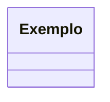

# 3.3. Módulo Padrões de Projeto GoFs Comportamentais

**Entrega Mínima:** 1 Padrão GoF Comportamental, com nível de modelagem e nível de implementação evidenciados (código rodando e hospedado no repositório do projeto).

**Apresentação** (via vídeo enviado por e-mail) explicando o GoF Comportamental, com: (i) rastro claro aos membros participantes (MOSTRAR QUADRO DE PARTICIPAÇÕES & COMMITS); (ii) justificativas & senso crítico sobre o padrão GoF comportamental; e (iii) comentários gerais sobre o trabalho em equipe. Tempo: +/- 5min.

---

## Introdução

[Apresentar brevemente a categoria do padrão.]

## Padrões analisados

| Padrão | Possível aplicação | Status | Justificativa |
|---|---|---|---|
| [Nome] | [Aplicação] | [Selecionado/Avaliado/Não selecionado] | [Justificativa] |

## Padrão selecionado

### [Nome do padrão]

## Problema arquitetural

[Descrever o problema que motivou o uso do padrão.]

## Justificativa da escolha

[Explicar por que o padrão foi escolhido.]

## Modelagem

[Inserir diagrama ou link para diagrama.]

## Implementação

| Elemento | Caminho |
|---|---|
| [Elemento] | `[caminho/do/arquivo]` |

## Evidência de execução

[Adicionar print, vídeo, comando, teste ou link demonstrando o padrão funcionando.]

## Rastreabilidade

| Artefato | Relação |
|---|---|
| Requisito | [Nome] |
| Módulo | [Nome] |
| Camada | [Nome] |
| Padrão | [Nome] |
| Commit/PR | [Link] |

## Senso crítico

### Benefícios

[Descrever benefícios.]

### Limitações

[Descrever limitações.]

### Alternativas consideradas

[Descrever alternativas.]

## Referências

* [Referência 1]
* [Referência 2]

## Histórico de versões

| Versão | Data | Descrição | Autor |
|---|---|---|---|
| 1.0 | DD/MM/AAAA | Criação do documento | Nome |
